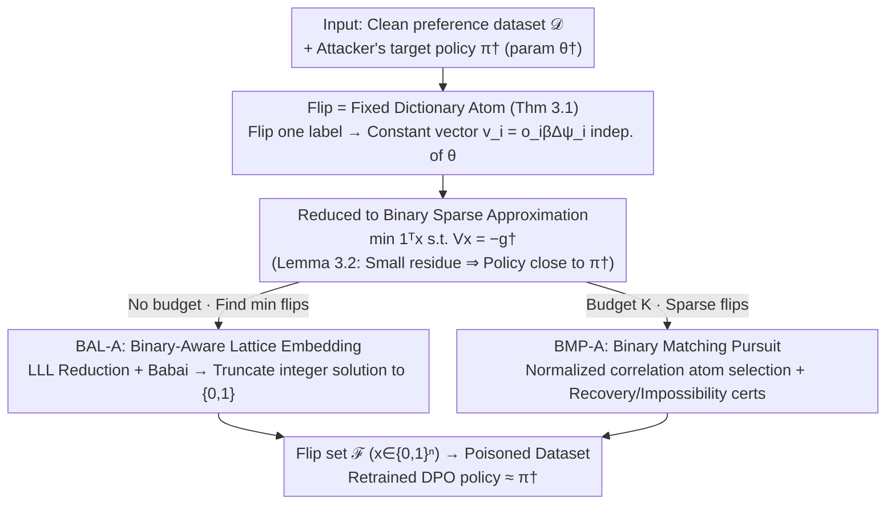

# Efficient Preference Poisoning Attack on Offline RLHF

**Conference**: ICML 2026  
**arXiv**: [2605.02495](https://arxiv.org/abs/2605.02495)  
**Code**: None  
**Area**: LLM Security / Preference Poisoning / RLHF Alignment  
**Keywords**: Preference Poisoning, DPO, Label Flipping, Sparse Recovery, Lattice Basis Reduction

## TL;DR
The study presents a key observation for log-linear DPO: "flipping one preference label equals adding a fixed vector to the loss gradient, independent of policy parameters." This reduces the targeted poisoning attack to a binary sparse approximation problem. The authors propose two algorithms: BAL-A, based on LLL lattice basis reduction, and BMP-A, based on matching pursuit, along with provable recovery and impossibility conditions.

## Background & Motivation

**Background**: Offline RLHF has become the mainstream path for aligning Large Language Models (LLMs). DPO (Direct Preference Optimization) trains directly on pre-collected pairwise preference datasets, bypassing the need for an explicit reward model. Existing security research around DPO focuses on two typical attack models: label flipping and data injection.

**Limitations of Prior Work**: While data injection attacks (Nika et al., 2025) have a comprehensive theoretical characterization, they are relatively expensive—the number of injected samples must grow linearly with the original dataset size to succeed. Label flipping is more "economical" and realistic (attackers typically modify existing annotations rather than creating sample pairs), but it currently relies on empirical observations and **lacks a theoretical characterization of "how many and which" labels to flip** to push the policy in a specific direction.

**Key Challenge**: An attacker performing label flipping faces two fundamental difficulties. First, the manipulable set is restricted—one can only flip a subset $\mathcal{F}$ of the $n$ existing comparisons. Second, the impact of a single label flip on the final learned policy $\hat\theta$ is parameter-dependent in general non-linear models and cannot be accurately predicted beforehand, making the identification of "the most effective label" a combinatorial search problem.

**Goal**: Within the log-linear policy class, provide for DPO: (i) a first-order characterization of what a label flip actually modifies; (ii) a formalization of targeted poisoning as a solvable optimization problem; (iii) two provable algorithms with recovery and impossibility guarantees.

**Key Insight**: The authors observe that in log-linear DPO, the gradient increment $\Delta g_i$ caused by flipping a label $o_i\to-o_i$ in the per-sample loss $\ell_i(\theta)$ is **completely independent of the current $\theta$**. It is simply a constant vector $o_i\beta(\psi(s_i,a_i)-\psi(s_i,a_i'))$. This transforms an apparently policy-dependent attack into a "binary sparse approximation problem on a fixed dictionary $V$."

**Core Idea**: Rewrite "finding the minimum number of label flips to make the post-training policy close to $\pi^\dagger$" as $\min_{x\in\{0,1\}^n}\|x\|_0$ s.t. $Vx=-g^\dagger$, where each column of dictionary $V$ is the flip gradient atom of a single sample, and the target $g^\dagger$ is the gradient of the clean DPO loss evaluated at $\theta^\dagger$.

## Method

### Overall Architecture
This paper addresses the question: "For a preference dataset used in DPO training, how many and which labels must be flipped to precisely drive the learned policy toward a specified target direction $\pi^\dagger$?" The entire pipeline is supported by one observation: under a log-linear policy, the effect of flipping a label is a constant vector independent of the current parameters $\theta$. Consequently, the attack is reduced to a sparse approximation problem: $\min\mathbf{1}^\top x$ s.t. $\|Vx+g^\dagger\|_2\le\varepsilon$, searching for a binary combination $x\in\{0,1\}^n$ on a fixed dictionary $V=[v_1,\dots,v_n]\in\mathbb{R}^{d\times n}$ (where $v_i=o_i\beta\Delta\psi_i$) to approximate $-g^\dagger$. Lemma 3.2 bridges the residue to policy distance—under $m$-strong convexity, $\|Vx+g^\dagger\|_2\le\varepsilon$ implies $\|\hat\theta-\theta^\dagger\|_2\le\varepsilon/m$, thus bounding the $\ell_1$ policy distance. As long as the residue is minimized, the post-training policy is guaranteed to approach the target. As this sparse problem is NP-hard, the authors provide two solvers: BAL-A for minimum flips without a budget, and BMP-A for sparse flips with a budget $K$, each accompanied by recovery/impossibility conditions.

### Key Designs

**1. Flip = Fixed Dictionary Atom (Theorem 3.1): Downscaling poisoning from a bi-level problem to sparse recovery**

The most difficult aspect of label flipping attacks is that the influence of a single flip on the final policy $\hat\theta$ is parameter-dependent in general models—one must "retrain on the attacked data to observe the policy change," a bi-level combinatorial search that cannot be predicted. This paper hinges on the discovery that the loss structure of log-linear DPO causes this dependency to vanish: for $\pi_\theta(a\mid s)\propto\exp(\psi(s,a)^\top\theta)$, the derivative of the single-sample loss $\ell_i(\theta)$ yields $o_i\bigl(1-\sigma(o_i\beta\Delta\psi_i^\top\theta)\bigr)\beta\Delta\psi_i$, where the sigmoid term is symmetric with respect to the preference label $o_i$. Subtracting the original gradient from the gradient with $o_i$ flipped to $-o_i$ causes the $\theta$-dependent sigmoid parts to cancel out, leaving only the constant vector $\Delta g_i=o_i\beta\Delta\psi_i$. This cancellation converts "observing policy changes after retraining" into "finding a binary linear combination from a fixed vector set $\{v_i\}$ to approximate $-g^\dagger$."

**2. Binary-Aware Lattice Embedding BAL-A (§4): Solving for the minimum flip integer solution using LLL**

In scenarios without a budget, the goal is to find the minimum flips such that $Vx+g^\dagger=0$. Direct integer relaxation of $\min_x\|Vx+g^\dagger\|^2$ degrades into the Closest Vector Problem (CVP), but CVP solutions may not fall in $\{0,1\}$ or directly minimize the number of flipped items. The authors construct a $(d+n)\times(n+1)$ embedding basis:

$$B_{\mathrm{bin}}=\begin{pmatrix}V&-g^\dagger\\ MI_n&0\end{pmatrix},$$

ensuring that the squared length of any lattice point corresponding to integer coefficients $z$ decomposes into $\|y(z)\|^2=\|Vz+g^\dagger\|^2+M^2\|z\|^2$. This penalizes both the residue and coefficient magnitude. For $\{0,1\}$ solutions, $\|x\|_2^2=\mathbf{1}^\top x$, so the $\ell_2$ penalty automatically represents the number of flipped items. The algorithm then runs LLL ($\delta=0.75$) + Babai’s nearest-plane to find the integer $z$, which is truncated to $\{0,1\}$. The scalar $M$ is critical: a sufficiently large $M$ (Lemma 4.1 gives $M_0\approx (B\sqrt{K^\star}+\sqrt{B^2K^\star+6BR+3B^2})/3$) forces coefficients into $\{-1,0,1\}$, and further into $\{0,1\}$ if $z\ge0$. Theorem 4.3’s separation condition $\rho_k^2>M^2(K^\star-k)$ ensures that the global minimum is indeed the $K^\star$-flip feasible solution.

**3. Binary Matching Pursuit BMP-A (§5): Greedy solver under budget constraints + Impossibility certificates**

Since the LLL preprocessing in BAL-A becomes computationally expensive when $n$ exceeds several hundred, a lighter approach is used for budget-$K$ scenarios: adapting Orthogonal Matching Pursuit (OMP/BMP) to the non-normalized dictionary $V$. Each step selects an atom using the normalized correlation score $|\langle v_i,r\rangle|/\|v_i\|_2$, but the residue is updated using the original column $r\leftarrow r-v_{i_t}$. The process stops after $K$ steps or if $\|r\|_2\le\varepsilon$. Its guarantee is based on the dictionary geometry: defined by mutual coherence $\mu(V)=\max_{i\ne j}|\langle v_i,v_j\rangle|/(\|v_i\|\|v_j\|)$, Theorem 5.3 guarantees correct support selection at each step and exact recovery in $K^\star$ steps if $\mu(V)<b/((2K^\star-1)B)$. Conversely, Theorem 5.4 provides two algorithm-independent impossibility conditions: $\|g^\dagger\|_2-\varepsilon>\sqrt{K}\|V\|_2$ or $(\|g^\dagger\|_2-\varepsilon)^2>B^2(K+\mu(V)K(K-1))$.

### Loss & Training
The attacker does not train new models but solves the aforementioned sparse problems: BAL-A has only one hyperparameter $M$, and BMP-A has $K$ and $\varepsilon$. Downstream DPO training follows the standard recipe for log-linear models with $\ell_2$ regularization: $L_{\mathrm{DPO}}(\theta;\mathcal{D})+\tfrac{\lambda}{2}\|\theta-\theta_\mu\|^2$.

## Key Experimental Results

### Main Results

| Dataset | Method | Setting | TPR | Residue/Distance |
|---------|--------|---------|-----|------------------|
| Synthetic Gaussian ($d=64,n=20,K^\star=5$) | BAL-A | $M<M_{\text{all sep}}\approx0.68$ | ≈1.0 | 0 |
| Synthetic Gaussian ($d=64,n=20,K^\star=5$) | BAL-A | $M>M_{\text{all sep}}$ | Rapid Drop | Large |
| Synthetic low-coherence ($\mu\approx0.197,n=200$) | BMP-A | $K^\star\le K_{\text{coh}}=3$ | 1.0 | 0 |
| Synthetic low-coherence ($\mu\approx0.197,n=200$) | BMP-A | $K^\star>K_{\text{coh}}$ | Still High | Small |
| SHP Real Data ($n=50,K^\star=7$, common feasible) | BAL-A | TP/FP/FN = 7/0/0 | 1.0 | $\|\pi_{\theta^\dagger}-\pi_{\hat\theta}\|_1\approx0.012$ |
| SHP Real Data ($n=50,K^\star=7$, common feasible) | BMP-A | TP/FP/FN = 7/0/0 | 1.0 | Same as above |

The clean-vs-attacked distance is $\|\pi_{\mathrm{clean}}-\pi_{\hat\theta}\|_1\approx 0.224$, which is approximately 19 times larger than the attack-vs-groundtruth distance (0.012). This indicates that the recovered flip patterns not only replicate the constructed attack but **actually push the policy far from the clean baseline**.

### Ablation Study

| Configuration | Key Metric | Description |
|---------------|------------|-------------|
| BAL-A, $M\to0$ | TPR≈1 | Smaller $M$ is closer to pure residue minimization but loses binary enforcement. |
| BAL-A, $M=M_0\approx1.69$ | TPR drops significantly | The theoretical binary sufficiency bound $M_0$ from Lemma 4.1 is too conservative. |
| BMP-A on low-coherence subset | TPR↑ | The more divergent the dictionary geometry, the more accurate the matching pursuit. |
| BMP-A on random subset | TPR↓ | High coherence causes the greedy algorithm to select wrong atoms. |
| BAL-A runtime (SHP, $n=50$) | 0.6865 s | Primarily spent on LLL preprocessing. |
| BMP-A runtime (SHP, $n=50$) | $1.37\times10^{-4}$ s | Approx. $5\times10^3$ times faster than BAL-A. |

### Key Findings
- The success of BAL-A **changes abruptly at the separation threshold** $M_{\text{all sep}}$. The theoretical sufficiency bound $M_0$ is usually too conservative; in practice, smaller $M$ can be used while still ensuring binary solutions.
- The mutual coherence sufficiency condition $K_{\text{coh}}$ for BMP-A is also conservative—TPR degrades slowly rather than abruptly when exceeding $K_{\text{coh}}$.
- Dictionary geometry (especially mutual coherence $\mu(V)$) is almost the sole determinant of attack success. On SHP, BMP-A performed significantly better on the low-coherence subset than on the random subset.
- The impossibility certificates (Theorem 5.4) are algorithm-independent—if $\|g^\dagger\|_2-\varepsilon>\sqrt{K}\|V\|_2$, **no** algorithm can complete the attack within $K$ flips.

## Highlights & Insights
- **"Parameter-independent gradient increment" is the pivotal observation for reducing poisoning from a bi-level problem to sparse recovery.** This depends on the symmetry of log-linear DPO with sigmoid loss and should be viewed as an intrinsic vulnerability of this combination.
- **Adapting LLL + Babai to machine learning poisoning is clever.** The binary-aware embedding $\begin{pmatrix}V&-g^\dagger\\MI_n&0\end{pmatrix}$ encodes both residue and coefficient minimization. Tuning a single scalar $M$ to manage NP-hard binary constraints is a paradigm that could be transferred to various sparse selection problems beyond DPO.
- **The impossibility conditions provide a geometric characterization of DPO robustness.** The roles of $\sqrt{K}\|V\|_2$ and $\mu(V)$ suggest that real defense lies in **actively designing preference datasets such that the columns of $V$ are both small and divergent** (e.g., via diversity sampling), providing direct guidance for dataset construction.
- The attack's "economy"—on SHP, flipping only 7 out of 50 labels can push the policy $\ell_1$ distance to 0.224—represents a substantial efficiency gain over data injection methods.

## Limitations & Future Work
- Strong assumptions: The study only covers **log-linear policies + DPO**. In general neural network policies, the gradient increment is $\theta$-dependent, requiring approximations.
- White-box: The attacker must know the feature map $\psi$, the reference policy $\mu$, and the target $\theta^\dagger$. Black-box versions are not discussed.
- The target policy $\pi^\dagger$ is assumed to be feasible (Assumption 3.3)—it does not address "how to select a target policy that is both dangerous and reachable."
- LLL preprocessing in BAL-A struggles as $n$ reaches the hundreds; BMP-A is fast but requires the feasible subset to be low-coherence to avoid greedy errors.
- Experiments are limited to the SHP dataset and small-scale synthetic data; they do not cover major RLHF benchmarks like Anthropic-HH.
- The defense side remains open; the authors only provided impossibility certificates as "robustness conditions" without proposing proactive defense algorithms.

## Related Work & Insights
- **vs Nika et al. 2025 (Data Injection)**: Also analyzes log-linear DPO but focuses on unconstrained sample addition, concluding that injection volume is linear in $n$. Ours is "selecting a subset to flip within $n$," where feasibility is constrained by $V$'s geometry, and efficiency is much higher.
- **vs Wen & Li 2021 (Binary Matching Pursuit)**: Directly borrows the BMP support recovery framework, with the main technical contribution being the integration of non-normalized columns and norm ratios into the coherence bound.
- **vs Lenstra et al. 1982 / Babai 1986 (LLL & CVP)**: First use of lattice basis reduction from number theory/cryptography as a "binary sparse selection" solver in ML poisoning.
- Insights: (i) "Flip = constant atom" suggests similar reductions may exist for other symmetric losses (e.g., contrastive); (ii) The impossibility certificate paradigm can be used to design robust data collection; (iii) Applying LLL to other ML problems like sparse feature selection or integer NN quantization holds potential.

## Rating
- Novelty: ⭐⭐⭐⭐⭐ The "parameter-independent gradient increment," LLL adaptation, and impossibility certificates are all firsts in DPO poisoning research.
- Experimental Thoroughness: ⭐⭐⭐ Synthetic + SHP dataset, but restricted to small scale ($n\le 401$) and lacking mainstream RLHF benchmarks.
- Writing Quality: ⭐⭐⭐⭐ Rigorous theoretical derivations and comprehensive appendices. The motivation for "why LLL" in BAL-A is slightly academic.
- Value: ⭐⭐⭐⭐ Directly relevant to understanding the security of RLHF annotation pipelines and designing robust preference datasets.

<!-- RELATED:START -->

## Related Papers

- [\[AAAI 2026\] On the Exponential Convergence for Offline RLHF with Pairwise Comparisons](../../AAAI2026/llm_alignment/on_the_exponential_convergence_for_offline_rlhf_with_pairwise_comparisons.md)
- [\[ACL 2026\] Alignment Data Map for Efficient Preference Data Selection and Diagnosis](../../ACL2026/llm_alignment/alignment_data_map_for_efficient_preference_data_selection_and_diagnosis.md)
- [\[ICML 2026\] Implicit Preference Alignment for Human Image Animation](implicit_preference_alignment_for_human_image_animation.md)
- [\[NeurIPS 2025\] Greedy Sampling Is Provably Efficient for RLHF](../../NeurIPS2025/llm_alignment/greedy_sampling_is_provably_efficient_for_rlhf.md)
- [\[ICML 2026\] SPARD: Defending Harmful Fine-Tuning Attack via Safety Projection with Relevance-Diversity Data Selection](spard_defending_harmful_fine-tuning_attack_via_safety_projection_with_relevance-.md)

<!-- RELATED:END -->
