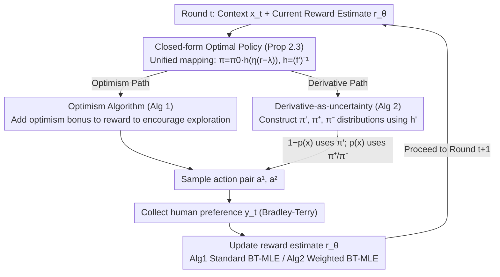

# $f$-Divergence Regularized RLHF: Two Tales of Sampling and Unified Analyses

**Conference**: ICML 2026  
**arXiv**: [2605.06977](https://arxiv.org/abs/2605.06977)  
**Code**: None (Theoretical paper)  
**Area**: RLHF Alignment / Online Learning / Theory  
**Keywords**: $f$-divergence, optimism, derivative-as-uncertainty, regret bound, contextual bandit

## TL;DR
This paper establishes the first $O(\log T)$ regret and $O(1/T)$ suboptimality gap upper bounds for online RLHF under **general $f$-divergence regularization**. It proposes two sampling strategies: (1) optimism in the face of uncertainty using bonus terms; and (2) a novel **"derivative-as-uncertainty"** perspective, where $f'$ serves as an uncertainty signal to design derivative-based sampling without explicitly estimating confidence bounds in each round.

## Background & Motivation

**Background**: RLHF has become standard for LLM post-training (e.g., InstructGPT, Llama2, Claude). The most common form is KL-regularized contextual bandit: $J_{\text{KL}}(\pi)=\mathbb{E}[r^*(x,a)-\eta^{-1}D_{\text{KL}}(\pi,\pi_0)]$. Zhao et al. 2025a proved that online KL-RLHF achieves $O(\log T)$ regret, and offline methods under single-policy coverage achieve $O(\varepsilon^{-1})$ sample complexity.

**Limitations of Prior Work**: KL is not a universal regularizer. Huang et al. 2025 showed that mixed chi-squared better mitigates reward over-optimization; Shan et al. 2024 noted that forward KL is more stable for diffusion model alignment; $\alpha$-divergence provides a more flexible trade-off between exploration and exploitation. However, **current theoretical analyses are performed case-by-case for specific $f$**, lacking a unified framework. While Zhao et al. 2025b provided a general $f$-divergence analysis, it was restricted to the offline setting. Unified online theory remains a gap.

**Key Challenge**: Each $f$-divergence has its own closed-form optimal policy solution $\pi_f^*(a|x)=\pi_0(a|x)f'^{-1}(\eta(r^*(x,a)-\lambda_f^*(x)))$, where the shape of $f'^{-1}$ (denoted as $h$) varies significantly—KL is exponential, chi-squared is linear, and JS lies in between. **The regret of any online algorithm is dominated by the curvature of $h$**, making it difficult to design a bonus that works for all $f$.

**Goal**: (1) Extend optimism-based RLHF (Xiong 2023, Ye 2024, Zhao 2025a) from KL to general $f$; (2) Provide an alternative algorithm that **does not require explicit confidence balls**, as these are difficult to implement for LLMs due to the optimization problems required at each round; (3) Prove regret/suboptimality guarantees for both algorithms unified under $f$.

**Key Insight**: The authors made a crucial observation: **the derivative $h'$ of $h=(f')^{-1}$ itself indicates how much reward estimation error is amplified**. Specifically, $\pi_\theta-\pi_{\theta'}\approx \pi_0\cdot h'(\eta(r_\theta-\lambda))\cdot\eta\cdot\Delta r$. Thus, areas where $h'$ is large correspond to regions where $\pi$ is highly sensitive to reward estimation, necessitating more exploration. This perspective translates the "geometric properties of $f$-divergence" directly into an "exploration signal."

**Core Idea**: Use the derivative of $f'$ as an uncertainty measure to design $\pi'_\theta(a|x)\propto \pi_0(a|x)\cdot h'(\eta(r_\theta-\lambda))$ as a sampling strategy. This is combined with two complementary distributions $\pi_\theta^\pm$ to handle cases where $h'$ approaches 0, achieving $O(\log T)$/$O(1/T)$ guarantees for unified $f$.

## Method

### Overall Architecture
The paper models online RLHF as a Bradley-Terry preference-driven contextual bandit, replacing the KL-specific objective with general $f$-divergence regularization $J_f(\pi)=\mathbb{E}[r^*(x,a)-\eta^{-1}D_f(\pi,\pi_0|x)]$. Each round $t$ follows the same skeleton: sample two actions $a_t^1,a_t^2$, receive human preference $y_t$, update reward estimate $r_{\theta_t}$ via MLE, and construct the next policy $\pi_{t+1}$. The "reward-to-policy mapping" uses the unified closed-form optimal policy (Proposition 2.3), while the two algorithms differ in "how to sample / inject exploration"—one follows classic optimism, and the other uses the proposed derivative-as-uncertainty.

### Key Designs

**1. Closed-form Optimal Policy + Unified Invertibility: Mapping all $f$ to one template (Proposition 2.3)**

Both algorithms must derive policies from reward estimates each round. A unified analysis is only possible if specific derivations for each $f$ are avoided. The authors prove that as long as $\pi_0(a|x)>0$, $f'$ is invertible, and $0\notin\text{dom}(f')$, the optimal solution has a unified form: $\pi_f^*(a|x)=\pi_0(a|x)\cdot f'^{-1}(\eta(r^*(x,a)-\lambda_f^*(x)))$, where $\lambda_f^*(x)$ is the normalizing Lagrange multiplier. Letting $h=(f')^{-1}$, the reverse KL case $h(z)=\exp(z-1)$ recovers the familiar softmax. This unified form allows regret to be expressed as a quadratic form of reward error, where $\partial J_f/\partial r$ can be directly analyzed. This excludes Total Variation or pure chi-squared but covers reverse/forward KL, JS, and chi-squared-KL.

**2. Optimism Algorithm: Extending $O(\log T)$ regret to general $f$ (Algorithm 1)**

To achieve logarithmic regret for general $f$, the authors adapt the classic optimism framework. Each round begins with MLE to obtain $\theta_t$, followed by adding an optimistic bonus $\hat r_t=r_{\theta_t}+\mathbb{E}_{a\sim\pi_t}b_t$ to the reward, where $b_t(x,a^1,a^2)=\min\{1,\beta_T\,U(\xi,x,a^1,a^2;\mathcal{R}_t,\mathcal{D}_t)\}$. $U$ is an uncertainty measure based on Eluder dimension. Compared to KL-only work, the regret bound includes an additional term $\mathcal{C}(f,\mathcal{R}_\Theta,\eta)=\max h'/h$. This term quantifies the price of general $f$, showing that "flatter $h$ leads to tighter regret," providing the first regret bound for any $f$ satisfying the conditions.

**3. Derivative-as-uncertainty Algorithm: Using $h'$ geometry as an exploration signal (Algorithm 2)**

Optimism algorithms require solving $\sup_{R_1,R_2}$ to compute $U$, which is computationally prohibitive for high-dimensional LLMs. The core observation is that $h'=((f')^{-1})'$ encodes uncertainty: since $\pi_\theta-\pi_{\theta'}\approx\pi_0\cdot h'(\eta(r_\theta-\lambda))\cdot\eta\cdot\Delta r$, regions where $h'$ is large signify high sensitivity to reward errors. The sampling distribution is set to $\pi'_\theta(a|x)\propto\pi_0(a|x)\cdot h'(\eta(r_\theta(x,a)-\lambda_\theta(x)))$. To prevent exploration stall when reward estimates are severely wrong (making $h'$ approach 0), two complementary distributions $\pi_\theta^+\propto\pi'_\theta\exp(r_\theta)$ and $\pi_\theta^-\propto\pi'_\theta\exp(-r_\theta)$ cover overvalued and undervalued regions. Actions are sampled from $\pi'_\theta$ with probability $1-p(x)$ and from the $(\pi^+,\pi^-)$ pair with probability $p(x) = \frac{Z^+Z^-}{1+Z^+Z^-}$. This method requires only MLE and weighted sampling, avoiding complex optimization while maintaining an $O(1/T)$ suboptimality gap.

### Loss & Training
Algorithm 1 uses standard BT-MLE: $\theta_t=\arg\max_\theta\sum_i\big(y_i\log\sigma(r_\theta(x,a_i^1)-r_\theta(x,a_i^2))+(1-y_i)\log\sigma(r_\theta(x,a_i^2)-r_\theta(x,a_i^1))\big)$. Algorithm 2 uses weighted BT-MLE to correct for mixed sampling bias: $\mathcal{L}(\theta)=-\frac{1}{t}\sum_i\omega(x_i)\log\sigma(r_\theta(x_i,a_i^\omega)-r_\theta(x_i,a_i^l))$, where importance weights are $\omega(x)=(\overline T_\theta(x)+Z^+Z^-\overline T_\theta(x))/\overline Z_\theta$ and $\overline T_\theta(x)=\sum_a\pi_0(a|x)h'(\eta(r_\theta-\lambda_\theta))$.

## Key Experimental Results

The paper primarily focuses on theoretical bounds, supplemented by a small-scale verification on **synthetic linear contextual bandits** (BT dimension 25, 10 fixed actions, 5 repetitions). **No real LLM experiments are included.**

### Main Results (Theoretical Bounds)

| Algorithm | Setting | Regret / SubOpt | Applicable $f$ | Notes |
|------|------|-----------------|----------|------|
| Algorithm 1 (optimism) | online RLHF | $O(\eta\,\mathcal{C}(f,\mathcal{R},\eta)\log(N_\mathcal{R}T/\delta)\,d(\mathcal{R},\xi,T))$ | $f'$ invertible, $0\notin\text{dom}(f')$ | $d$ is Eluder dim; $O(\log T)$ for linear reward |
| Algorithm 2 (derivative) | online RLHF | $\text{SubOpt}=O(1/T)$ | Same as above | No confidence ball required |
| Zhao 2025a (KL only) | online KL-RLHF | $O(\log T)$ | Reverse KL only | Recovered by this work |
| Zhao 2025b | offline general $f$ | $O(\varepsilon^{-1})$ | General $f$ | Offline only |

### Comparison of Key Constants

$\mathcal{C}(f,\mathcal{R},\eta)=\max_{r,x,a}\frac{h'(\eta(r-\lambda))}{h(\eta(r-\lambda))}$:

| $f$ | $h(z)=(f')^{-1}(z)$ | Leading Term of $\mathcal{C}$ | Explanation |
|------|-----|-------|------|
| reverse KL | $\exp(z-1)$ | $\mathcal{C}=1$ | Most concise, matches Zhao 2025a |
| forward KL | $-1/z$ (restricted) | Depends on $r$ range | OOD Robust |
| JS | $\log(2x/(1+x))^{-1}$ | Moderate | Softens KL |
| chi-squared-KL | $z+2(x-1)$ | Relates to $\eta$ | Mitigates reward over-opt |

## Key Findings
- **General $f$ does not increase regret magnitude**: All suitable $f$ achieve $O(\log T)$, with differences only in the constant $\mathcal{C}(f)$. This suggests researchers can choose $f$ based on empirical need without fear of theoretical regret explosion.
- **Derivative-as-uncertainty as a new perspective**: Prior RLHF theory treated reward estimation error and policy uncertainty separately. This paper proves $h'$ can bridge the two, which may inspire future algorithm designs for DPO or IPO.
- **Sophisticated three-distribution sampling**: $\pi'$ follows the derivative signal while $\pi^\pm$ handle reward extremes. This covers both "high sensitivity but known reward" and "low sensitivity but unknown reward" regions, allowing the weighted MLE estimation error to close at $O(1/T)$.
- **Synthetic experiments support theory**: On linear bandits, Algorithm 2 (derivative) converges faster than Algorithm 1 (optimism) and greedy approaches. Suboptimality gaps for chi-squared-mixed KL and $f=x\log x-\log x$ were smaller than standard KL, consistent with their smaller $\mathcal{C}(f)$ constants.

## Highlights & Insights
- The intuition that **"$f'$ acts as an uncertainty signal"** is the central highlight. It directly links the curvature of the divergence to exploration necessity, translating geometric properties into a simple algorithm.
- **Algorithm 2 has significant engineering value**: Optimism-based methods are nearly impossible for large models due to the cost of local optimizations. The derivative method only requires computing $h'$ and weighted sampling, making it a viable candidate for practical RLHF training tricks.
- **Clarity of the unified framework**: By using Proposition 2.3, Lemma C.6 (regret as quadratic reward error), and Eluder dimensions, the authors compress the complexity of "general $f$" into a single constant $\mathcal{C}(f,\mathcal{R},\eta)$.

## Limitations & Future Work
- The invertibility assumption for $f'$ **excludes Total Variation and pure chi-squared**, which are often cited in papers regarding over-optimization.
- The work is confined to the contextual bandit framework, **leaving multi-turn RL or CoT settings (e.g., o1, DeepSeek-R1) unaddressed**.
- **Lack of real LLM experiments**: While synthetic results show faster convergence for the derivative algorithm, its transferability to large-scale models remains unproven, potentially limiting its immediate impact on practitioners.
- Specific numerical comparisons of $\mathcal{C}(f,\mathcal{R},\eta)$ for different $f$ are not provided, offering little direct guidance on which $f$ is optimal for specific tasks.

## Related Work & Insights
- **vs Zhao 2025a (KL-only online RLHF)**: This work is a strict generalization; KL is the special case where $\mathcal{C}=1$.
- **vs Zhao 2025b (offline general $f$)**: These are complementary—Zhao 2025b handles the offline case, while this paper closes the loop for the online setting.
- **vs Huang 2025 (chi-squared regularization)**: While Huang provided empirical evidence for chi-squared, this paper provides the first theoretical guarantee.
- **vs Wang 2023 / Sun 2024 ($f$-DPO empirical papers)**: These papers modified DPO's divergence without theory. Although this work focuses on RLHF, the analysis framework (especially Prop 2.3) could likely be adapted to DPO settings.

## Rating
- Novelty: ⭐⭐⭐⭐ (Derivative-as-uncertainty is a genuinely new perspective)
- Experimental Thoroughness: ⭐⭐ (Synthetic linear bandit only; no real LLM results)
- Writing Quality: ⭐⭐⭐⭐ (Clear theorem structure and detailed proof sketches)
- Value: ⭐⭐⭐⭐ (Provides the first online theoretical guarantee for $f$-RLHF with engineering-friendly potential)

<!-- RELATED:START -->

## Related Papers

- [\[NeurIPS 2025\] Greedy Sampling Is Provably Efficient for RLHF](../../NeurIPS2025/llm_alignment/greedy_sampling_is_provably_efficient_for_rlhf.md)
- [\[ICML 2026\] UDM-GRPO: Stable and Efficient GRPO for Unified Discrete Diffusion Models](udm-grpo_stable_and_efficient_group_relative_policy_optimization_for_uniform_dis.md)
- [\[ICML 2026\] Efficient Preference Poisoning Attack on Offline RLHF](efficient_preference_poisoning_attack_on_offline_rlhf.md)
- [\[ICLR 2026\] Enhancing Trustworthiness of Fine-Tuned LLMs via Regularized Subset Selection](../../ICLR2026/llm_alignment/enhancing_trustworthiness_of_fine-tuned_llms_via_regularized_subset_selection.md)
- [\[NeurIPS 2025\] LLM Safety Alignment is Divergence Estimation in Disguise](../../NeurIPS2025/llm_alignment/llm_safety_alignment_is_divergence_estimation_in_disguise.md)

<!-- RELATED:END -->
