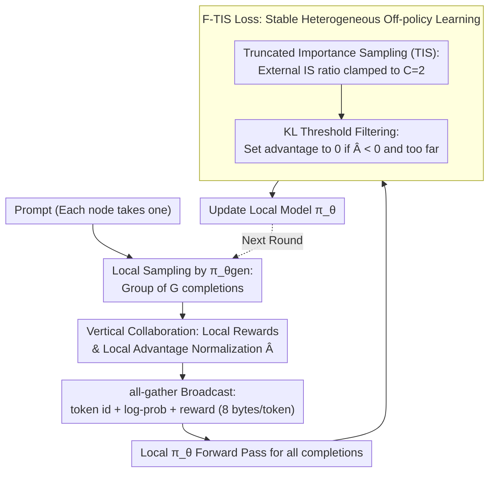

# F-TIS: Harnessing Diverse Models in Collaborative GRPO

**Conference**: ICML 2026  
**arXiv**: [2605.22537](https://arxiv.org/abs/2605.22537)  
**Code**: None  
**Area**: Reinforcement Learning / LLM Post-training / Decentralized Training  
**Keywords**: GRPO, Decentralized RL, Heterogeneous Model Collaboration, Importance Sampling, Truncation + Filtering

## TL;DR
F-TIS combines "Truncated Importance Sampling (TIS)" with "filtering negative advantage off-policy samples based on KL thresholds" into a single GRPO loss. This allows multiple LLMs—varying in size, expertise, or trainable parameter subsets—to exchange samples during a single decentralized GRPO training session. The approach achieves convergence comparable to pure on-policy training and delivers up to a +12% performance gain on OOD math tasks.

## Background & Motivation

**Background**: GRPO has become the de facto standard for LLM post-training, particularly for reasoning enhancement. It samples a group of $G$ completions for each prompt and replaces the PPO value model with group-normalized advantages $\hat{A}_i = (r_i - \mu_r)/\sigma_r$, thereby saving memory and compute. However, the bottleneck of GRPO lies in autoregressive generation rather than backpropagation—producing 8 or more completions per prompt is too demanding for a single GPU. The industry standard is to distribute the "generation" step across multiple nodes in parallel.

**Limitations of Prior Work**: Existing distributed GRPO frameworks (LlamaRL, Intellect2, GenRL) typically assume all nodes run the same model to keep the generator and trainer distributions as close as possible (on-policy). This assumption fails in "decentralized training" scenarios where users with different compute resources and model preferences aim to collaborate on the same task. In such cases, differences in model size, expertise, or parameter subsets lead to policy drift. Even when starting from the same checkpoint, exchanging completions introduces destructive noise due to floating-point non-associativity, causing the "seemingly on-policy but actually off-policy" samples to collapse the policy.

**Key Challenge**: GRPO is inherently an on-policy algorithm. While clipped Importance Sampling (IS) can tolerate "slight staleness," it fails when faced with truly heterogeneous off-policy samples (the paper validates this by showing that joint training of Qwen2.5-1.5B and 3B on GSM8K performs worse than training them individually). To enable decentralization, GRPO must be able to **process off-policy samples without collapsing** while keeping communication overhead minimal.

**Goal**: Enable multiple heterogeneous models (varying in size, expertise, and trainable parameters) to collaboratively feed samples to one another in a single GRPO training run, achieving pure on-policy convergence levels with communication overhead limited to 8 bytes per token (log-prob + token ID).

**Key Insight**: The authors bridge two independent research lines: (1) TIS proposed by `yao2025efficient_rl_offpolicy`, which pulls the IS ratio out of the token-level loss and clamps it to a constant $C$; (2) the practice in DeepSeek-v3 and the HTTT series of filtering out off-policy samples where $\hat{A}_i < 0$ based on a KL threshold. The former ensures low-bias gradients, while the latter prunes "negative advantage + distant policy" samples—which are the primary culprits for generating gibberish. The remaining $\hat{A}_i > 0$ samples provide meaningful directional signals even if they are off-policy.

**Core Idea**: F-TIS = Low-bias gradients from TIS + Stability from filtering negative advantage distant samples, serving as a unified loss for decentralized heterogeneous GRPO.

## Method

### Overall Architecture
F-TIS utilizes "vertical decentralized RL": each node takes a prompt, generates a full group of $G$ completions locally using its own model, and broadcasts the `(token_ids, per-token log-prob, reward)` via all-gather. After receiving completions from the entire network, each node treats them as training samples for its local policy $\pi_\theta$, updating the model using a modified GRPO loss. During training, all completions undergo a forward pass by the local $\pi_\theta$ to obtain $\pi_\theta(a_{i,t}|\cdot)$, which is used alongside the received $\pi_{\theta_{gen}}(a_{i,t}|\cdot)$ to compute gradients. Communication involves only $8 \times |p|$ bytes/token (4-byte token ID + 4-byte log-prob), making it light enough for wide-area networks. Group advantages $\hat{A}_i$ are always normalized locally according to the "node-specific GRPO perspective." The challenge is that foreign completions are off-policy noise for the local model; the following three designs prevent this data flow from causing collapse.

### Key Designs

**1. Truncated Importance Sampling (TIS) as the Backbone**

Heterogeneous samples suffer from distribution mismatch: a token generated by another model might have a very low probability under the local model. The standard GRPO token-level form $\min[r_{i,t}\hat{A}_i, \text{clip}(r_{i,t}\hat{A}_i, 1\pm\epsilon)]$ (where $r_{i,t}=\pi_\theta/\pi_{\theta_{gen}}$) can be destabilized by high-variance ratios. TIS pulls the IS ratio out of the token loss for overall capping: $\min\big(\pi_\theta/\pi_{\theta_{gen}}, C\big) \cdot \min\big(\mathcal{R}_{i,\theta}\hat{A}_i, \text{clip}(\mathcal{R}_{i,\theta}\hat{A}_i, 1-\epsilon, 1+\epsilon)\big)$, where $\mathcal{R}_{i,\theta}=\pi_\theta/\pi_{\theta_{detach}}$ uses stop-gradients to prevent second-order backpropagation, and the outer ratio is clamped to $C=2$. Moving the IS ratio outside and capping it sets a ceiling on how "off-policy" a sequence can be, proving more stable than token-wise multiplication. Figure 2 shows that NoIS (treating heterogeneous samples as on-policy) causes both 1.5B and 3B models to degrade, while VIS (token-level IS) is acceptable for 1.5B but causes significant regression for 3B. TIS significantly outperforms VIS on the 3B model, indicating that token-level IS variance is more harmful as model size increases.

**2. KL-Threshold-Based Negative Advantage Filtering**

Not all off-policy samples are equally harmful. Samples with $\hat{A}_i > 0$ suggest a "correct path" and are useful even if off-policy. The danger lies in samples with $\hat{A}_i < 0$ that are distant from the current policy—they penalize tokens the current model would not generate, pushing probability mass toward other low-probability tokens and causing "gibberish" collapse. F-TIS sets the advantage to zero for samples where $\hat{A}_i < 0$ and $\mathcal{D}_{KL}(\pi_\theta\Vert\pi_{\theta_{gen}}) > g$. These zeroed tokens do not contribute to gradients but are still included in mean/variance statistics for group advantages. The threshold $g$ (default 50) acts as a knob for "trustworthiness." Figure 3 demonstrates that this component alone (F-NoIS) can recover most of the performance lost in NoIS, making it the primary contributor to stability. Section 4.5 further shows that $g$ correlates with model capacity: small models benefit from a smaller $g$ early on (stricter filtering), while larger models benefit from a larger $g$ later in training for exploration.

**3. Vertical Collaboration: Localized Advantage Normalization**

In heterogeneous settings, how work is divided determines the accuracy of the advantage. F-TIS chooses vertical collaboration—each node is responsible for a "complete group of completions for a single prompt," rather than horizontal collaboration where nodes contribute partial completions to a group. The difference lies in the normalization baseline: in vertical collaboration, the group advantage is always calculated using the local model's $G$ rewards, reflecting which completion is better *for that specific model*. Horizontal collaboration would use the swarm-average reward for normalization, mixing strong and weak models and introducing systemic cross-model bias (effectively acting as implicit reward shaping). Section 4.7 shows that horizontal F-TIS causes significant regression for the 3B model.

### Loss & Training
The final F-TIS loss is:
$$\mathcal{L}_{F\text{-}TIS} = \frac{1}{G}\sum_i \frac{1}{|a_i|}\sum_t \min\big(\pi_\theta/\pi_{\theta_{gen}},\;C\big)\cdot \min\big(\mathcal{R}_{i,\theta}\hat{A}_{t,i},\;\text{clip}(\mathcal{R}_{i,\theta}\hat{A}_{t,i},\;1-\epsilon,\;1+\epsilon)\big)$$
where $\hat{A}_{t,i}$ is defined by the filtering rules in Design 2. Following DR-GRPO, the **KL term is omitted** to save memory and stability. Hyperparameters: Learning rate $1\times 10^{-6}$, group size 12, batch size 16/24, $\epsilon=0.2$, $C=2$, $g=50$, binary reward (1 for correct format and answer); Training data: GSM8K, 50 iterations, validated via pass@1 greedy decoding.

## Key Experimental Results

### Main Results
All experiments were conducted using vertical decentralized RL, with two models collaboratively training on GSM8K and OOD evaluation on MATH-500.

| Setting | Model | Alone (MATH-500) | F-TIS (MATH-500) | Gain |
|------|------|------------------|-----------------------|------|
| Size: 1.5B + 3B Base | 1.5B Base | 0.406 | 0.470 | **+6.4%** |
|  | 3B Base | 0.575 | 0.540 | −3.5% |
| Size: 1.5B + 3B Coder | 1.5B Coder | 0.410 | 0.470 | **+6.0%** |
|  | 3B Coder | 0.478 | 0.590 | **+11.2%** |
| Expertise: 1.5B Base + 1.5B Coder | 1.5B Base | 0.406 | 0.403 | −0.3% |
|  | 1.5B Coder | 0.410 | 0.410 | 0 |
| Expertise: 3B Base + 3B Coder | 3B Base | 0.575 | 0.520 | −5.5% |
|  | 3B Coder | 0.478 | 0.530 | **+5.2%** |
| Trainable: 1.5B + 1.5B PEFT | 1.5B Base | 0.406 | 0.430 | +2.4% |
|  | 1.5B PEFT | 0.412 | 0.430 | +1.8% |
| Trainable: 3B + 3B PEFT | 3B Base | 0.575 | 0.513 | −6.2% |
|  | 3B PEFT | 0.500 | 0.560 | **+6.0%** |

> On the in-distribution GSM8K, the F-TIS validation curves eventually match the standalone benchmarks (Figures 4–9), though initial convergence is slower due to the filtering of high-variance early samples.

### Ablation Study

| Config | Key Phenomenon | Explanation |
|------|---------|------|
| NoIS | 1.5B + 3B both collapse | Heterogeneous off-policy noise breaks GRPO |
| VIS | 1.5B is fine; 3B is significantly worse than TIS | Token-level IS variance hurts larger models |
| TIS (No Filter) | More stable than NoIS/VIS but below baseline | Sequence-level IS is helpful but insufficient |
| F-NoIS (Filter only) | Approaches baseline | Filtering is the primary driver of stability |
| **F-TIS (Full)** | Matches baseline, better OOD | TIS and Filtering are complementary |
| F-VIS (Filter + VIS) | Faster early on, regresses later | Validates TIS as a better foundation than VIS |
| Horizontal F-TIS | 3B degrades significantly | Group advantages biased by swarm averaging |
| $g\in\{5,10,50,100\}$ | 1.5B favors small $g$; 3B favors large $g$ | Capacity determines ability to learn from distal samples |

### Key Findings
- **Unexpected OOD Gains**: F-TIS improved OOD math performance in several pairings (e.g., 3B Coder + 1.5B Coder yielded +12% on MATH-500 for the 3B model). The authors suggest the Coder model avoids overfitting to coding styles by incorporating more general reasoning samples.
- Filtering ($g$) is the primary stabilizer, while the IS form (VIS vs TIS) determines the performance ceiling. Both are required.
- Vertical collaboration is a prerequisite for heterogeneous RL; horizontal collaboration fails due to cross-model normalization.
- Communication efficiency (8 bytes/token) makes wide-area decentralized RL feasible.

## Highlights & Insights
- **Minimum Viable Patch**: Combining TIS and filtering is a "minimum viable patch" that requires no changes to generation, rewards, or architecture—only a clamp and a mask in the loss function.
- **Capacity-Dependent Filtering**: The KL threshold $g$ is a capacity-linked hyperparameter, suggesting that $g$ could be dynamically scheduled based on training steps or reward variance.
- **Passive Regularization in OOD**: Heterogeneous joint training is almost always beneficial for the "weaker" model and serves as an anti-overfitting regularizer for the "stronger" model on OOD tasks. This is particularly effective in PEFT scenarios.
- **Vertical vs. Horizontal**: The explanation for why horizontal collaboration introduces systemic bias via reward shaping is a clear and important distinction for distributed RL.

## Limitations & Future Work
- Experiments are limited to the Qwen2.5 series, two datasets (GSM8K/MATH-500), and 50 iterations. Generalizability to other model families or tasks (agents, dialogue) is unproven.
- The "weak-gain, strong-loss" trade-off lacks theoretical characterization. Nodes running "stronger" models may lack incentive to join a decentralized network if their in-distribution performance suffers.
- The threshold $g$ is fixed at 50, whereas ablation suggests it should be adaptive.
- Wall-clock comparisons between standalone on-policy training and F-TIS multi-node training are missing.

## Related Work & Insights
- **vs. TIS (`yao2025efficient_rl_offpolicy`)**: While the original TIS addressed small numerical drift, this work extends it to large-scale heterogeneous off-policy scenarios.
- **vs. DeepSeek-v3 Filtering**: While DeepSeek uses filtering for single-node stability, this work identifies it as the key stabilizer for cross-model collaboration.
- **vs. Distributed GRPO (LlamaRL, etc.)**: Unlike previous works assuming homogeneity, this is the first to systematically handle differences in size, expertise, and parameter subsets.
- **PEFT Training**: The finding that mixing full-parameter off-policy samples into PEFT training improves results (+6% for 3B PEFT) is a significant standalone contribution.

## Rating
- Novelty: ⭐⭐⭐⭐ Systematic solution to heterogeneous GRPO collapse using a minimalist combination.
- Experimental Thoroughness: ⭐⭐⭐ Covers three heterogeneous scenarios but lacks wall-clock and diverse model families.
- Writing Quality: ⭐⭐⭐⭐ Clear logical progression and well-defined loss formulations.
- Value: ⭐⭐⭐⭐ A practical recipe for decentralized/federated LLM post-training.

<!-- RELATED:START -->

## Related Papers

- [\[ICML 2026\] UDM-GRPO: 统一离散扩散模型的稳定高效 GRPO](udm-grpo_stable_and_efficient_group_relative_policy_optimization_for_uniform_dis.md)
- [\[ACL 2026\] Mitigating Selection Bias in Large Language Models via Permutation-Aware GRPO](../../ACL2026/llm_alignment/mitigating_selection_bias_in_large_language_models_via_permutation-aware_grpo.md)
- [\[AAAI 2026\] LaF-GRPO: In-Situ Navigation Instruction Generation for the Visually Impaired via GRPO with LLM-as-Follower Reward](../../AAAI2026/llm_alignment/laf-grpo_in-situ_navigation_instruction_generation_for_the_visually_impaired_via.md)
- [\[ICML 2026\] Towards Context-Invariant Safety Alignment for Large Language Models](towards_context-invariant_safety_alignment_for_large_language_models.md)
- [\[ACL 2026\] Taming Extreme Tokens: Covariance-Aware GRPO with Gaussian-Kernel Advantage Reweighting](../../ACL2026/llm_alignment/taming_extreme_tokens_covariance-aware_grpo_with_gaussian-kernel_advantage_rewei.md)

<!-- RELATED:END -->
