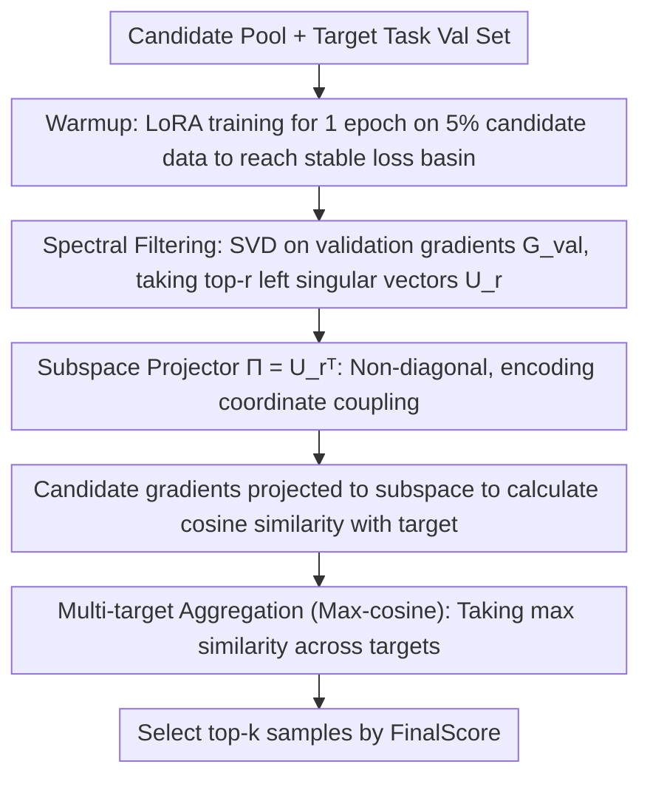

# GIST: Targeted Data Selection for Instruction Tuning with Gradient Subspace Projection

**Conference**: ICML 2026  
**arXiv**: [2602.18584](https://arxiv.org/abs/2602.18584)  
**Code**: https://github.com/GuanghuiMin/GIST  
**Area**: Data Selection / LLM Instruction Tuning / Optimization Geometry  
**Keywords**: targeted data selection, instruction tuning, LoRA, gradient subspace, SVD

## TL;DR
GIST frames "selecting instruction tuning data for a target task" as gradient subspace alignment. It demonstrates that methods like LESS, which use Adam states as a diagonal preconditioner, fail on LoRA due to cross-parameter coupling and low-rank task subspaces. Instead, GIST extracts a task-specific low-rank subspace via SVD of validation gradients and uses cosine similarity for sample selection. It matches or exceeds LESS on MMLU/TydiQA/BBH while requiring only 0.29% of the storage and 25% of the computation time.

## Background & Motivation

**Background**: Instruction tuning is a mainstream approach for LLM alignment. However, studies like LIMA and AlpaGasus show that data quality is more important than quantity, stimulating research into automated data selection. Targeted instruction tuning further aims to select data that maximizes performance on a specific target task under a limited budget. Existing methods are categorized into hard example mining (via loss/PPL), similarity-based (embedding retrieval), and optimizer-based (using Adam states as a diagonal preconditioner, e.g., LESS).

**Limitations of Prior Work**: Using Adam's diagonal preconditioner as a surrogate for update geometry (like LESS) is a scalable choice for the LLM era but structurally fails under PEFT (specifically LoRA). (1) The bilinear nature of LoRA $W = W_0 + BA$ introduces cross-block curvature (coupling between $A$ and $B$), which diagonal preconditioners cannot represent. (2) Validation gradients in LLMs exhibit a low-rank structure (150 ranks capture 95% variance), which axis-aligned diagonals completely ignore. Together, these factors lead to diagonal approximations being not only poor but systematically biased.

**Key Challenge**: Sample efficiency requires PEFT; PEFT introduces coupling; diagonals cannot express coupling; and expressing coupling requires a full Hessian, which is intractable. A non-diagonal but tractable surrogate is needed.

**Goal**: Build a data scoring framework that is (a) non-diagonal, (b) robust to cross-parameter coupling in LoRA, and (c) computationally feasible at LLM scales.

**Key Insight**: Observing that task-specific update directions are concentrated in a low-dimensional subspace, a full Hessian is unnecessary. By extracting a task-relevant subspace projector $\boldsymbol{\Pi}$ from the SVD of validation gradients and using cosine alignment for scoring, coupling is captured scalably.

**Core Idea**: (1) Perform SVD on the validation gradient matrix $\mathbf{G}_{\text{val}}$ to obtain top-$r$ left singular vectors $\mathbf{U}_r$; (2) Use the projector $\boldsymbol{\Pi} = \mathbf{U}_r^\top$ to project candidate gradients into the task subspace; (3) Use cosine similarity in the subspace for scoring, taking the max over multiple target examples; (4) Select top-$k$ samples. This achieves 0.29% storage and 25% computation compared to LESS.

## Method

### Overall Architecture

GIST selects the most useful instruction tuning data for a target task by reformulating "data selection" as "gradient subspace alignment." The pipeline consists of three steps: first, a warmup phase where LoRA is trained for 1 epoch on 5% of candidate data to reach a stable loss basin; second, gradients of validation samples are computed at this checkpoint, and a low-rank task subspace projector $\boldsymbol{\Pi}$ is extracted via SVD; third, each candidate sample gradient is projected into this subspace, and its cosine similarity with target gradients is used for scoring. The difficulty lies not in alignment itself, but in the metric used—arguing that diagonal preconditioners fail systematically in LoRA and providing SVD subspace as a non-diagonal, tractable alternative.

### Key Designs

**1. Unified Theoretical Framework: Reducing three types of selection to Hessian-preconditioned alignment**
Previous methods (hard example mining, similarity-based, optimizer-based) had distinct motivations. This paper uses first-order Taylor expansion and Hessian preconditioning to describe a candidate's impact on validation loss as $\Delta \mathcal{L}_{\text{val}}(\boldsymbol{z}) \approx -\eta \nabla_{\boldsymbol{\theta}} \mathcal{L}(\mathcal{D}_{\text{val}})^\top \mathbf{H}_{\text{val}}^\dagger \nabla_{\boldsymbol{\theta}} \ell(\boldsymbol{z})$. The selection objective is unified as $\max_{S} \nabla \mathcal{L}_{\text{val}}^\top \mathbf{H}_{\text{val}}^\dagger \nabla \mathcal{L}(S)$ (Theorem 3.1). Within this framework, different methods use different surrogates for $\mathbf{H}_{\text{val}}^\dagger$: hard mining assumes a constant cosine angle; similarity-based uses representation kernels; LESS uses diagonal Adam states (assuming coordinate independence). This turns the "diagonal vs. non-diagonal" debate into an analytical algebraic problem.

**2. LoRA Cross-block Curvature Theorem: Proving diagonal preconditioner failure**
LoRA's $W = W_0 + BA$ creates bilinear parameterization where $A$ and $B$ are coupled. Theorem 3.2 formalizes this: the mixed second derivative $\frac{\partial^2 \mathcal{L}}{\partial B_{ik'} \partial A_{kj}} = \langle \mathbf{H}_W [B_{:k} e_j^\top], e_i A_{k':} \rangle_F + \delta_{kk'} (\mathbf{G}_W)_{ij}$ contains explicit cross-block terms. Even if the original weight Hessian $\mathbf{H}_W$ is diagonal, the projection into LoRA space generates off-diagonal terms. The lower bound $\|\mathbf{H} - \mathbf{D}\|_F^2 \ge 2\rho^2$ (where $\rho$ is off-diagonal strength) proves that any diagonal preconditioner $\mathbf{D}$ has an irreducible error floor relative to the true Hessian.

**3. Spectral Filtering: Replacing full Hessian with SVD of validation gradients**
Since diagonals are insufficient and the full Hessian is intractable, a middle ground is needed. A gradient covariance proxy $\widehat{\mathbf{F}}_{\text{val}} = \mathbf{G}_{\text{val}} \mathbf{G}_{\text{val}}^\top$ is defined—it is PSD, non-diagonal, and encodes coordinate coupling. Theorem 3.3 proves that under NLL objectives (Gauss-Newton decomposition), the principal angle between the top-$r$ eigenspaces of $\widehat{\mathbf{F}}$ and the true Hessian is $\le C \varepsilon_t$. The warmup phase ensures $\varepsilon_t$ is small, making the subspace approximation tight. By the Eckart-Young-Mirsky theorem, the projector $\boldsymbol{\Pi} = \mathbf{U}_r^\top$ is the optimal rank-$r$ reconstruction, explicitly capturing rotated coupled directions missed by diagonals.

**4. Multi-Task Aggregation: Using max-cosine to preserve specialist samples**
In multi-target scenarios $\{\boldsymbol{z}_{\text{val}}^{(1)}, \dots, \boldsymbol{z}_{\text{val}}^{(M)}\}$, averaging similarities can dilute "specialists" (e.g., a math sample useful for one specific coding target). GIST uses the maximum: $\text{FinalScore}(\boldsymbol{z}_i) = \max_j \text{Sim}_t(\boldsymbol{z}_i, \boldsymbol{z}_{\text{val}}^{(j)})$. Retaining candidates strongly related to at least one target is crucial for multi-task instruction tuning.

## Key Experimental Results

### Main Results: MMLU/TydiQA/BBH (k=5%, Llama2-7B)

GIST performs comparably or better than LESS with significant efficiency gains:

| Metric | LESS | **GIST** |
|--------|------|----------|
| Storage | baseline | **0.29% of LESS** |
| Compute Time | baseline | **25% of LESS** |
| Performance | baseline | Match or better |

### Spectral Analysis
SVD of validation gradient matrix for Llama2-7B on MMLU:
- Rank 150 captures 95% of explained variance (rapid spectral decay).
- Most variance is concentrated in a low-dim subspace, validating the "task gradient is intrinsically low-rank" assumption.

### Key Findings

- **0.29% Storage + 25% Compute**: GIST only stores a low-rank projector and cosine scores, whereas LESS stores full gradient features. This is an order-of-magnitude saving for large candidate pools (e.g., 270K).
- **Diagonal Failure in PEFT**: Theorem 3.2 proves an irreducible error $\|\mathbf{H} - \mathbf{D}\|_F^2 \ge 2\rho^2$ for diagonal methods in LoRA; GIST corrects this with a rotation-capable projector.
- **Efficient Warmup**: A 1-epoch LoRA warmup on 5% of data is sufficient to reach a stable loss basin for meaningful SVD subspace extraction.
- **Max Aggregation**: Using max-cosine prevents specialist candidates from being discarded in multi-task settings.

## Highlights & Insights

- **Unified Methodological View**: Frames hard mining, similarity-based, and optimizer-based methods as variants of Hessian surrogates.
- **Algebraic Proof of LoRA Coupling**: Theorem 3.2 provides a theoretical refutation of diagonal-only methods for PEFT.
- **Empirical Task Low-rankness**: Solidifies the use of SVD by showing task gradients are concentrated in very low dimensions.
- **Engineering Feasibility**: The 99.7% reduction in storage compared to LESS makes automated data selection viable for large-scale production pipelines.

## Limitations & Future Work

- **Rank $r$ Selection**: Current $r$ is chosen heuristically (95% variance); an automated selection mechanism is missing.
- **Warmup Cost**: Training on 5% of a 270K pool for 1 epoch still requires 13.5K steps.
- **NLL Assumption**: Theoretical bounds are tightest for NLL; analysis for contrastive or RL losses is needed.
- **Static Projector**: The projector is fixed after warmup; dynamic updates along the trajectory might improve performance but increase cost.
- **LLM Scale**: Validation is primarily on Llama2-7B; performance on 70B+ or other architectures is yet to be explored.

## Related Work & Insights

- **vs. LESS (Xia et al. 2024)**: Directly addresses the failure of LESS's diagonal preconditioner in LoRA contexts while reducing overhead.
- **vs. RDS/RDS+**: Similarity methods use representation kernels; GIST uses parameter-space metrics which are more aligned with training dynamics.
- **vs. Influence Functions**: GIST makes influence-style scoring practical for LLMs via low-rank SVD.
- **Insight**: Any project using diagonal Hessian preconditioning for LLMs/PEFT should revisit the validity of the independence assumption.

## Rating

- Novelty: ⭐⭐⭐⭐⭐ (Unified view + LoRA curvature proof + SVD projector).
- Experimental Thoroughness: ⭐⭐⭐⭐ (Solid across benchmarks; lacks extreme-scale model validation).
- Writing Quality: ⭐⭐⭐⭐⭐ (Mathematically rigorous yet intuitive).
- Value: ⭐⭐⭐⭐⭐ (100x storage saving makes data selection practical for large workloads).

<!-- RELATED:START -->

<!-- RELATED:END -->

## Related Papers

- [\[ACL 2025\] JsonTuning: Towards Generalizable, Robust, and Controllable Instruction Tuning](../../ACL2025/llm_alignment/jsontuning_towards_generalizable_robust_and_controllable_instruction_tuning.md)
- [\[ACL 2025\] Rethinking Table Instruction Tuning](../../ACL2025/llm_alignment/rethinking_table_instruction_tuning.md)
- [\[ACL 2026\] SFTMix: Elevating Language Model Instruction Tuning with Mixup Recipe](../../ACL2026/llm_alignment/sftmix_elevating_language_model_instruction_tuning_with_mixup_recipe.md)
- [\[AAAI 2026\] Importance-Aware Data Selection for Efficient LLM Instruction Tuning](../../AAAI2026/llm_alignment/importance-aware_data_selection_for_efficient_llm_instruction_tuning.md)
- [\[ICML 2026\] SPARD: Defending Harmful Fine-Tuning Attack via Safety Projection with Relevance-Diversity Data Selection](spard_defending_harmful_fine-tuning_attack_via_safety_projection_with_relevance-.md)

<!-- RELATED:END -->
