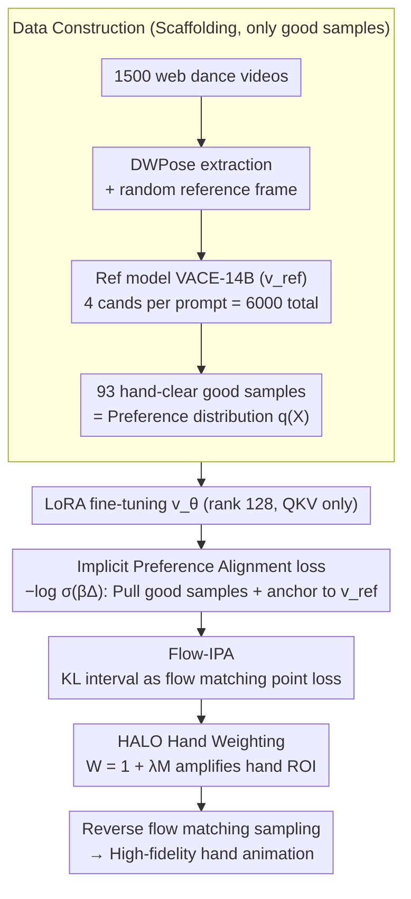

# Implicit Preference Alignment for Human Image Animation

**Conference**: ICML 2026  
**arXiv**: [2605.07545](https://arxiv.org/abs/2605.07545)  
**Code**: https://github.com/mdswyz/IPA (Available)  
**Area**: Alignment RLHF / Video Generation / Human Image Animation  
**Keywords**: Preference Alignment, DPO, Flow Matching, Human Animation, Hand Generation

## TL;DR
The authors propose Implicit Preference Alignment (IPA): a post-training method that requires only "good samples" without the need for positive/negative pairs. By maximizing the KL interval relative to a pre-trained reference model, it equivalently maximizes an implicit reward. Combined with a HALO module that spatially weights the hand mask into the loss, it significantly improves the hand fidelity of large-scale video DiTs using only 93 curated samples.

## Background & Motivation

**Background**: Human image animation has transitioned from GAN-based paradigms to diffusion-based ones (Animate Anyone, MimicMotion) and further toward DiT large models (VACE, Wan-Animate). Subject appearance and temporal consistency have reached high levels of performance.

**Limitations of Prior Work**: Hand digits possess high degrees of freedom and complex motion, leading to common "hand collapse" issues such as blurring, missing fingers, or deformities. While using RLHF/DPO to align hand preferences is a natural approach, DPO requires "strict winner-loser pairs." However, hand states are unstable across frames; most sampled video pairs are either both acceptable (Case 1), both failed (Case 2), or of mixed quality (Case 3). Samples satisfying the DPO requirement of Case 4 (one good, one bad, frame-aligned) are extremely rare.

**Key Challenge**: The labeling cost of strict positive/negative pairs is nearly prohibitive for hand-related tasks, yet abandoning RLHF makes it difficult to solve fine-grained structural issues through SFT alone.

**Goal**: (i) Design an objective function that achieves preference alignment using only "good samples"; (ii) enable the alignment process to explicitly focus on the hand ROI; (iii) preserve the large-scale prior knowledge of the pre-trained DiT to avoid collapse.

**Key Insight**: It is difficult to construct strict pairs, but relatively cheap to isolate individual good samples—93 curated good samples vs. 6000 candidates, where only ~7.5% could form DPO pairs. If optimization can simultaneously "move closer to the good sample distribution" and "not deviate from the pre-trained prior," the bottleneck of loser samples can be bypassed.

**Core Idea**: The condition that "the model distribution is closer to the preference distribution $q(X)$ than the reference distribution" is formulated as a KL interval $\Delta(p_{\text{ref}}, p_\theta) = D_{\text{KL}}(q\|p_{\text{ref}}) - D_{\text{KL}}(q\|p_\theta) > 0$. Using $-\log\sigma(\beta\Delta)$ as the loss is theoretically proven to be equivalent to reward maximization with KL constraints (i.e., implicit reward), thus achieving preference alignment using only good samples.

## Method

### Overall Architecture
The pipeline seeks to improve the hand quality of large video DiTs using a small set of curated good samples without strict pairs. First, the pre-trained reference model VACE-14B is used as $v_{\text{ref}}$. 1,500 dance videos are collected from the web, poses are extracted via DWPose, and a random frame is used as the reference image. VACE generates 4 candidates per prompt (6,000 videos total), from which 93 videos with "clear hands" are manually selected as the preference distribution $q(X)$. In training, LoRA (rank 128, QKV projection) is applied to obtain $v_\theta$. The loss maps the KL interval onto flow matching and adds a hand mask-weighted objective. Inference utilizes $v_\theta$ for reverse flow matching sampling.

### Key Designs

**1. Implicit Preference Alignment (IPA loss): Replacing "Pushing Losers" with "Anchoring to Reference"**

The contrastive term in DPO essentially "pulls the winner and pushes the loser," but losers are difficult to pair in hand tasks—only 7.5% of 6,000 candidates form qualified pairs. IPA avoids losers entirely: it requires the model distribution $p_\theta$ to be closer to the preference distribution $q$ than the reference distribution $p_{\text{ref}}$. This is written as $D_{\text{KL}}(q\|p_\theta) < D_{\text{KL}}(q\|p_{\text{ref}})$, or equivalently, the KL interval $\Delta(p_{\text{ref}}, p_\theta) = D_{\text{KL}}(q\|p_{\text{ref}}) - D_{\text{KL}}(q\|p_\theta) > 0$. Applying log-sigmoid yields the loss $\mathcal{L} = -\log\sigma(\beta\Delta(p_{\text{ref}}, p_\theta))$. This objective is valid because it proves to be equivalent to reward maximization with KL regularization: $\max \mathbb{E}_q[r] - \beta D_{\text{KL}}(p_\theta\|p_{\text{ref}})$. The optimal solution satisfies $p_\theta \propto p_{\text{ref}}\exp(r/\beta)$, and substituting this back gives $\mathbb{E}_q[r] = \beta\Delta + C$. Thus, minimizing IPA loss implicitly maximizes an unspecified reward $r$. The reference model’s KL constraint acts as a "soft negative signal," bypassing loser labeling while preventing mode collapse.

**2. Flow-IPA: Mapping Abstract KL Intervals to Flow Matching**

Directly integrating $\Delta(p_{\text{ref}}, p_\theta)$ over probability paths is intractable. Leveraging the "linear interpolation + constant velocity field" structure of Rectification Flow, the KL increment over time is expressed analytically as $\frac{d}{dt}D_{\text{KL}} = \frac{1}{2}(1-t)^2 \mathbb{E}\|v - v_\phi(Z_t;t,I,\mathcal{P})\|^2$—the KL derivative can be estimated via a single forward pass at any timestamp. Integrating over $t\in[0,1]$, the interval simplifies to $\Delta = \mathbb{E}_{t,v}[\frac{1}{2}(1-t)^2(\|v - v_{\text{ref}}\|^2 - \|v - v_\theta\|^2)]$. Substituting this back into log-sigmoid yields the final trainable loss. This step compresses "alignment of the entire probability trajectory" into a "single-point mini-batch loss at time $t$," making abstract distribution distances optimizable via gradient descent on DiTs.

**3. Hand-Aware Local Optimization (HALO): Biasing Alignment toward Hand Pixels**

In good samples, hands occupy only a small fraction of the frame. Standard MSE would "spend" the loss on large areas like the body and background, ignoring the hands. HALO uses binary hand masks $\mathbf{M}$ from DWPose to construct spatial weights $\mathbf{W} = \mathbf{1} + \lambda\mathbf{M}$. The velocity field deviation $\|v - v_\phi\|^2$ in the loss is replaced with the weighted form $\|\sqrt{\mathbf{W}}\odot(v - v_\phi)\|^2$, amplifying learning signals at hand locations. $\lambda=10$ is found to be optimal. This accentuates the ROI signals from the limited 93 good samples, ensuring gradients are pushed back to the hands rather than being submerged by the easily learned torso regions.

### Loss & Training
The final loss (Eq. 29) combines all components: $\mathcal{L} = \mathbb{E}_{t,v}[-\log\sigma(\frac{\beta}{2}(1-t)^2(\|\sqrt{\mathbf{W}}\odot(v - v_{\text{ref}})\|^2 - \|\sqrt{\mathbf{W}}\odot(v - v_\theta)\|^2))]$. LoRA is used for fine-tuning (rank 128, QKV only), running for 1000 steps with a batch size of 8 on 8×H20. $\beta=600$ controls the constraint strength (serving as both the KL penalty coefficient and sigmoid slope), and $\lambda=10$ controls the hand weight.

## Key Experimental Results

### Main Results

| Dataset | Metric | IPA (Ours) | Prev. SOTA (Wan-Animate) | Gain |
|--------|------|-----|---------------------|------|
| TikTok | FID-VID ↓ | 5.9 | 8.6 | −31% |
| TikTok | FVD ↓ | 255 | 316 | −19% |
| TikTok | SSIM ↑ | 0.841 | 0.799 | +5.3% |
| TikTok | PSNR ↑ | 23.8 | 20.5 | +3.3dB |
| Hand bench | FID-VID ↓ | 6.3 | 10.6 (UniAnimate-DiT) | −41% |
| Hand bench | SSIM-Hand ↑ | 0.606 | 0.544 | +0.06 |
| Hand bench | PSNR-Hand ↑ | 18.9 | 15.3 (VACE) | +3.6dB |

### Ablation Study

| Dataset | IPA | HALO | FID-VID ↓ | FVD ↓ | SSIM ↑ | PSNR ↑ |
|--------|-----|------|-----------|-------|--------|--------|
| TikTok | ✓ | ✓ | 5.9 | 255 | 0.841 | 23.8 |
| TikTok | ✓ | × | 7.9 | 288 | 0.819 | 22.7 |
| TikTok | × | × | 13.4 | 427 | 0.777 | 20.2 |

### Key Findings
- IPA alone reduces FID from 13.4 to 7.9 (−41%), making it the primary contributor; HALO further improves it to 5.9, demonstrating complementarity between "global alignment" and "local weighting."
- $\beta$ has a clear sweet spot: at $\beta=200$, constraints are too weak, leading to overfitting on 93 samples; at $\beta=1000$, constraints are too strong to learn; $\beta=600$ is optimal.
- $\lambda$ shows a similar peak: performance improves from 0.1 to 10 but degrades global quality at 100.
- Data Efficiency: Only 7 pairs (7.5%) could be matched for DPO from the 93 good samples. DPO is neither fair nor feasible under these costs; IPA’s value lies in lowering the threshold for data construction.

## Highlights & Insights
- **Theoretical Rigor**: The derivation from KL intervals to log-sigmoid loss, and the proof of its equivalence to implicit reward maximization, fills the theoretical gap of "why RLHF is valid without losers."
- **Paradigm Shift in Data**: Relaxing "strict preference pairs (winner, loser)" to "winner + soft prior constraint" is valuable for tasks where ROIs are concentrated and losers are hard to define (e.g., medical imaging, handwriting, fine textures).
- **HALO Portability**: Mask weighting can be extended from hands to faces, eyes, or text. It is an engineering upgrade with zero additional training cost.
- The dual interpretation of $\beta$ as both KL intensity and sigmoid slope provides a useful perspective on training dynamics.

## Limitations & Future Work
- The 93 good samples are sourced only from internet dance videos, resulting in a narrow distribution; generalization to sports, sign language, or complex 3D manipulation is unverified.
- Dependency on DWPose for masks means mask quality limits HALO; failures in pose estimation during extreme occlusion may be detrimental.
- $\beta=600$ and $\lambda=10$ are empirical; new models or resolutions would require a new hyperparameter search.
- Only QKV utilizes LoRA; comparisons with LoRA on full attention/MLP or full fine-tuning are absent.

## Related Work & Insights
- **vs. Diffusion-DPO / Flow-DPO**: Shares structural forms but differs in derivation. DPO uses Bradley-Terry on winner-loser pairs, whereas IPA contrasts the winner against a reference, allowing the removal of losers. 
- **vs. MimicMotion Hand Enhancement**: MimicMotion uses loss reweighting during training, whereas IPA integrates mask weighting into the post-training preference alignment phase at much lower cost.
- **vs. Animate Anyone / VACE**: This work does not redesign architectures but repurposes VACE-14B as $v_{\text{ref}}$, representing a typical high-return-on-investment post-training effort.

## Rating
- Novelty: ⭐⭐⭐⭐ (Same structure as Flow-DPO but independent derivation; first systematic analysis of pair infeasibility in hand tasks).
- Experimental Thoroughness: ⭐⭐⭐⭐ (Multiple baselines, dual benchmarks, specialized hand metrics, and parameter sweeps; though lacking a direct head-to-head with DPO on the 7-pair subset).
- Writing Quality: ⭐⭐⭐⭐ (Clear theoretical derivation; use of four cases makes motivation intuitive).
- Value: ⭐⭐⭐⭐ (Provides a "no-loser alignment" paradigm for post-training communities; high transfer potential).

<!-- RELATED:START -->

## Related Papers

- [\[ICML 2026\] Implicit Safety Alignment from Crowd Preferences](implicit_safety_alignment_from_crowd_preferences.md)
- [\[ICML 2026\] Alignment-Aware Decoding](alignment-aware_decoding.md)
- [\[ICML 2026\] Curriculum Learning for Safety Alignment](curriculum_learning_for_safety_alignment.md)
- [\[ICML 2026\] Efficient Preference Poisoning Attack on Offline RLHF](efficient_preference_poisoning_attack_on_offline_rlhf.md)
- [\[ACL 2025\] PKU-SafeRLHF: Towards Multi-Level Safety Alignment for LLMs with Human Preference](../../ACL2025/llm_alignment/pku-saferlhf_towards_multi-level_safety_alignment_for_llms_with_human_preference.md)

<!-- RELATED:END -->
