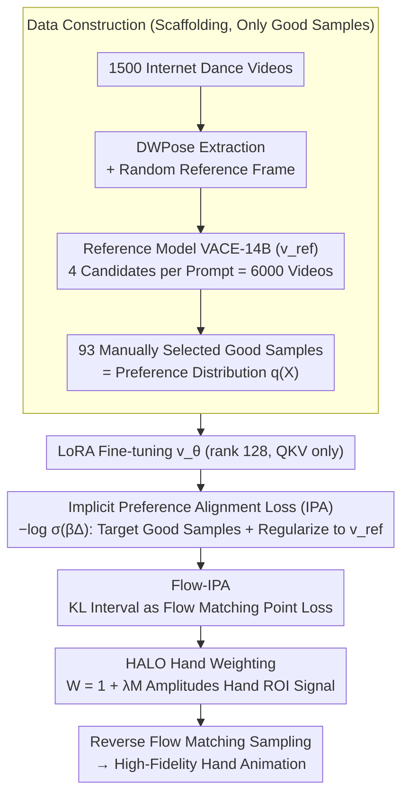

# Implicit Preference Alignment for Human Image Animation

**Conference**: ICML 2026  
**arXiv**: [2605.07545](https://arxiv.org/abs/2605.07545)  
**Code**: https://github.com/mdswyz/IPA (Available)  
**Area**: Alignment RLHF / Video Generation / Human Animation  
**Keywords**: Preference Alignment, DPO, Flow Matching, Human Animation, Hand Generation

## TL;DR
The authors propose Implicit Preference Alignment (IPA): a post-training method that requires only "good samples" without constructing positive/negative pairs. By maximizing the KL interval relative to a pre-trained reference model, the method equivalently maximizes implicit rewards. Combined with a HALO module that integrates hand-mask weighting into the loss, it enables a large-scale video DiT to significantly improve hand fidelity in human animation using only 93 selected samples.

## Background & Motivation

**Background**: Human image animation has shifted from the GAN paradigm to the diffusion paradigm (Animate Anyone, MimicMotion) and further toward large-scale DiT models (VACE, Wan-Animate). Both visual appearance of subjects and temporal consistency have reached high levels.

**Limitations of Prior Work**: Fingers possess the highest degrees of freedom and movement complexity, leading to common "hand collapse" issues like blurring, broken fingers, and deformities. While using RLHF or DPO for hand preference alignment is intuitive, DPO requires "strict winner-loser pairs." However, hand states are unstable across frames; most sampled video pairs are either both acceptable (Case 1), both collapsed (Case 2), or of mixed quality (Case 3). Samples satisfying the Case 4 requirement for DPO (one good and one bad, consistently per frame) are extremely rare.

**Key Challenge**: The annotation cost for strict good/bad pairings is nearly prohibitive for hand-related tasks, yet abandoning RLHF makes it difficult to resolve fine structural issues via SFT alone.

**Goal**: (i) Design an objective function that achieves preference alignment using only "good samples"; (ii) Explicitly focus the alignment process on hand ROIs; (iii) Retain the massive prior knowledge of pre-trained DiTs to avoid collapse.

**Key Insight**: The authors observe that while strict pairs are difficult to construct, isolating good samples is relatively inexpensive—93 curated good samples were selected from 6,000 candidates, where only about 7.5% could form DPO pairs. If the optimization can jointly target "closeness to the good sample distribution" and "adherence to the pre-trained prior," the bottleneck of loser samples can be bypassed.

**Core Idea**: By defining the condition "the model distribution is closer to the preference distribution $q(X)$ than the reference distribution" as a KL interval $\Delta(p_{\text{ref}}, p_\theta) = D_{\text{KL}}(q\|p_{\text{ref}}) - D_{\text{KL}}(q\|p_\theta) > 0$, the loss is formulated as $-\log\sigma(\beta\Delta)$. Theoretically, this is proven equivalent to reward maximization under KL constraints (implicit reward), enabling preference alignment with good samples only.

## Method

### Overall Architecture
The pipeline aims to improve the hand quality of large video DiTs using a small number of selected good samples without strict "good-bad" pairings. The pre-trained VACE-14B is used as the reference model $v_{\text{ref}}$. 1,500 dance videos were collected, poses were extracted via DWPose, and random frames were used as reference images. VACE generated 4 candidates per prompt (6,000 videos total), from which 93 videos with clear hands were strictly selected to represent the preference distribution $q(X)$. Training employs LoRA (rank 128 on QKV projections) for $v_\theta$. The loss maps the KL interval onto flow matching and adds a hand-mask weighting target. Inference uses $v_\theta$ for reverse flow-matching sampling.

### Key Designs

**1. Implicit Preference Alignment (IPA) Loss: Replacing "Pushing Bad Samples" with "Staying Close to Reference"**

The contrastive term in DPO essentially "pulls good samples and pushes bad samples," but bad samples for hand tasks are difficult to curate—only 7.5% of 6,000 candidates form valid pairs. IPA discards loser samples entirely. It only requires the model distribution $p_\theta$ to be closer to the preference distribution $q$ than the reference distribution $p_{\text{ref}}$, expressed as $D_{\text{KL}}(q\|p_\theta) < D_{\text{KL}}(q\|p_{\text{ref}})$. This is reformulated as a KL interval $\Delta(p_{\text{ref}}, p_\theta) = D_{\text{KL}}(q\|p_{\text{ref}}) - D_{\text{KL}}(q\|p_\theta) > 0$, and optimized via the log-sigmoid loss $\mathcal{L} = -\log\sigma(\beta\Delta(p_{\text{ref}}, p_\theta))$. This objective is proven equivalent to KL-regularized reward maximization $\max \mathbb{E}_q[r] - \beta D_{\text{KL}}(p_\theta\|p_{\text{ref}})$, where the optimal solution satisfies $p_\theta \propto p_{\text{ref}}\exp(r/\beta)$. Substituting this back yields $\mathbb{E}_q[r] = \beta\Delta + C$, meaning minimizing the IPA loss implicitly maximizes an unspecified reward $r$. The KL constraint of the reference model acts as a "soft negative signal," bypassing loser annotations and preventing mode collapse.

**2. Flow-IPA: Mapping the KL Interval to Flow Matching**

Directly integrating the probability path for $\Delta(p_{\text{ref}}, p_\theta)$ is intractable. Using the "linear interpolation + constant velocity field" structure of Rectified Flow, the authors express the KL increment over time as an analytical form $\frac{d}{dt}D_{\text{KL}} = \frac{1}{2}(1-t)^2 \mathbb{E}\|v - v_\phi(Z_t;t,I,\mathcal{P})\|^2$. The KL derivative can thus be estimated with a single forward pass at each time step. After integrating over $t\in[0,1]$, the interval simplifies to $\Delta = \mathbb{E}_{t,v}[\frac{1}{2}(1-t)^2(\|v - v_{\text{ref}}\|^2 - \|v - v_\theta\|^2)]$. Substituting this into log-sigmoid yields the final trainable loss. This step compresses the alignment of the entire probability trajectory into a single-point mini-batch loss at a random time $t$.

**3. Hand-Aware Local Optimization (HALO): Biasing Alignment Budget to Hand Pixels**

Hands occupy only a small portion of a frame. Standard global MSE causes the model to "spend" the loss on large body and background areas, ignoring hands. HALO derives a binary hand mask $\mathbf{M}$ from DWPose keypoints and constructs a spatial weight $\mathbf{W} = \mathbf{1} + \lambda\mathbf{M}$. The velocity field deviation $\|v - v_\phi\|^2$ in the loss is replaced with a weighted version $\|\sqrt{\mathbf{W}}\odot(v - v_\phi)\|^2$, amplifying the learning signal at hand locations. With $\lambda=10$, it enhances critical ROI signals from the 93 samples, ensuring gradients are pushed back to the hands rather than drowning in the easier-to-learn torso regions.

### Loss & Training
The total loss combines the components: $\mathcal{L} = \mathbb{E}_{t,v}[-\log\sigma(\frac{\beta}{2}(1-t)^2(\|\sqrt{\mathbf{W}}\odot(v - v_{\text{ref}})\|^2 - \|\sqrt{\mathbf{W}}\odot(v - v_\theta)\|^2))]$. LoRA (rank 128 on QKV only) is used for fine-tuning over 1,000 steps with batch size 8 on 8×H20. $\beta=600$ controls the constraint strength (as both the KL penalty coefficient and sigmoid slope), while $\lambda=10$ controls the hand weight.

## Key Experimental Results

### Main Results

| Dataset | Metric | IPA (Ours) | Runner-up (Wan-Animate) | Gain |
|--------|------|-----|---------------------|------|
| TikTok | FID-VID ↓ | 5.9 | 8.6 | −31% |
| TikTok | FVD ↓ | 255 | 316 | −19% |
| TikTok | SSIM ↑ | 0.841 | 0.799 | +5.3% |
| TikTok | PSNR ↑ | 23.8 | 20.5 | +3.3dB |
| Hand Bench | FID-VID ↓ | 6.3 | 10.6 (UniAnimate-DiT) | −41% |
| Hand Bench | SSIM-Hand ↑ | 0.606 | 0.544 | +0.06 |
| Hand Bench | PSNR-Hand ↑ | 18.9 | 15.3 (VACE) | +3.6dB |

### Ablation Study

| Dataset | IPA | HALO | FID-VID ↓ | FVD ↓ | SSIM ↑ | PSNR ↑ |
|--------|-----|------|-----------|-------|--------|--------|
| TikTok | ✓ | ✓ | 5.9 | 255 | 0.841 | 23.8 |
| TikTok | ✓ | × | 7.9 | 288 | 0.819 | 22.7 |
| TikTok | × | × | 13.4 | 427 | 0.777 | 20.2 |
| Hand Bench | ✓ | ✓ | 6.3 | 224 | 0.757 | 21.5 |
| Hand Bench | × | × | 12.5 | 327 | 0.668 | 18.2 |

### Key Findings
- IPA alone reduces FID from 13.4 to 7.9 (−41%), making it the primary contributor; HALO further reduces it to 5.9, demonstrating the complementarity of "global alignment + local weighting."
- $\beta$ has an optimal "sweet spot": $\beta=200$ is too weak (overfitting to 93 samples), while $\beta=1000$ is too strong (inhibits learning). $\beta=600$ is optimal.
- $\lambda$ shows a similar peak: performance improves monotonically from 0.1 to 10 but degrades global quality at 100.
- Data Efficiency: Only 7 pairs (7.5%) could be formed from the 93 good samples for DPO, making DPO impractical at this scale. The primary value of IPA is lowering the data construction threshold.

## Highlights & Insights
- **Theoretical Rigor**: Deriving a log-sigmoid loss from the KL interval and proving its equivalence to implicit reward maximization fills the theoretical gap of "why RLHF is valid without loser samples." It shares a structural form with Flow-DPO but stems from a different premise.
- **Data Paradigm Shift**: Relaxing "strict preference pairs (winner, loser)" to "winner + soft prior constraint" is valuable for tasks with concentrated ROIs or ill-defined losers (e.g., medical imaging, handwriting, fine textures).
- **HALO Reusability**: Mask weighting can be extended from hands to faces, eyes, text, or any "small-area, high-difficulty ROI" with almost zero cost.
- The dual interpretation of $\beta$ as both KL strength and sigmoid slope provides a useful perspective on training dynamics.

## Limitations & Future Work
- The 93 good samples are limited to internet dance videos, resulting in a narrow distribution; generalization to sports, sign language, or 3D object grasping remains unverified.
- Reliance on DWPose for masks means mask quality dictates the HALO ceiling; extreme occlusion leading to pose estimation failure may negatively impact results.
- $\beta=600$ and $\lambda=10$ are empirical; new models or resolutions would require a new search.
- Only QKV LoRA was used; a comparison with full attention/MLP LoRA or full fine-tuning was not conducted.

## Related Work & Insights
- **vs Diffusion-DPO / Flow-DPO**: Shares a structural form but while DPO derives from the Bradley-Terry model to contrast winner-loser, IPA derives from the KL interval to contrast winner-reference, enabling the exclusion of losers.
- **vs MimicMotion hand region enhancement**: MimicMotion uses loss reweighting during training; IPA integrates mask weighting into the preference alignment phase (post-training), which is significantly cheaper.
- **vs Animate Anyone / VACE / Wan-Animate**: This work does not redesign the architecture but reuses VACE-14B as $v_{\text{ref}}$, representing a high-ROI post-training effort.

## Rating
- Novelty: ⭐⭐⭐⭐ Identical structure to Flow-DPO but independent derivation and the first systematic analysis of pair-based DPO's infeasibility for hand tasks.
- Experimental Thoroughness: ⭐⭐⭐⭐ Multiple baselines, twin benchmarks, specialized hand metrics, and two-parameter sweeps. The only limitation is the lack of a head-to-head DPO comparison on the 7 available pairs (though justified by the authors).
- Writing Quality: ⭐⭐⭐⭐ Clear theoretical derivation; the four cases effectively illustrate the motivation.
- Value: ⭐⭐⭐⭐ Provides the RLHF community with a "loser-free alignment" paradigm that is plug-and-play with high migration potential.

<!-- RELATED:START -->

## Related Papers

- [\[ICML 2026\] Implicit Safety Alignment from Crowd Preferences](implicit_safety_alignment_from_crowd_preferences.md)
- [\[CVPR 2026\] Bridging Human Evaluation to Infrared and Visible Image Fusion](../../CVPR2026/llm_alignment/bridging_human_evaluation_to_infrared_and_visible_image_fusion.md)
- [\[ICML 2026\] Alignment-Aware Decoding](alignment-aware_decoding.md)
- [\[ICML 2026\] Efficient Preference Poisoning Attack on Offline RLHF](efficient_preference_poisoning_attack_on_offline_rlhf.md)
- [\[ICLR 2026\] When Weak LLMs Speak with Confidence, Preference Alignment Gets Stronger](../../ICLR2026/llm_alignment/when_weak_llms_speak_with_confidence_preference_alignment_gets_stronger.md)

<!-- RELATED:END -->
