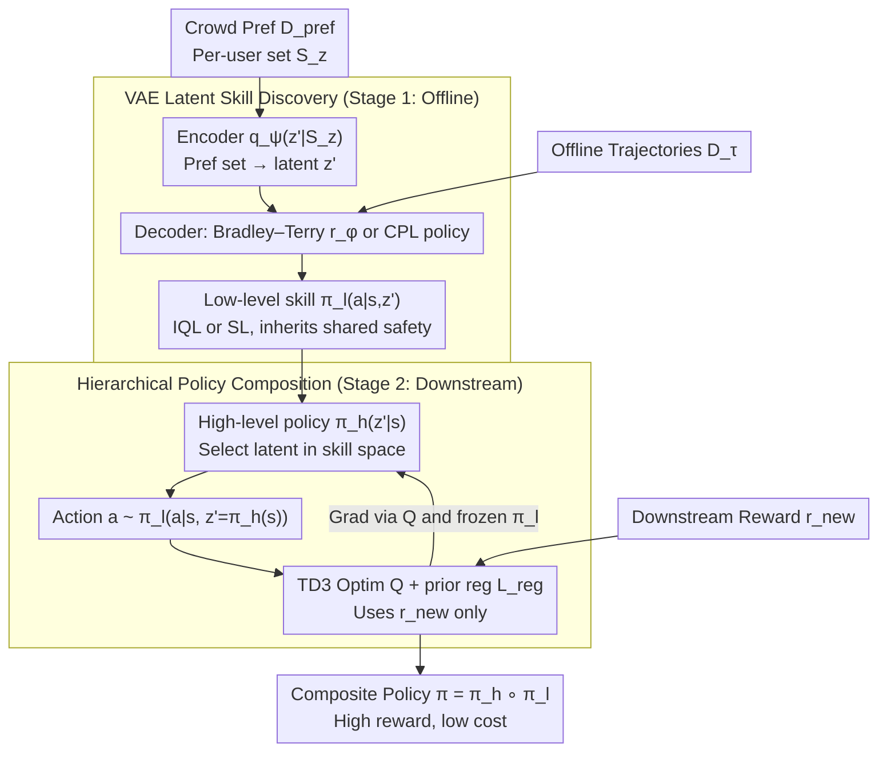

# Implicit Safety Alignment from Crowd Preferences

**Conference**: ICML 2026  
**arXiv**: [2605.21822](https://arxiv.org/abs/2605.21822)  
**Code**: Paper not public  
**Area**: Alignment RLHF / Safe RL / Preference Learning  
**Keywords**: Crowd preferences, implicit safety alignment, skill discovery, VAE, hierarchical reinforcement learning

## TL;DR
Addressing the structure of "diverse user goals but shared safety guidelines" in crowd preference data, the authors demonstrate that traditional reward combination is polluted by majority preferences and sensitive to weights. They propose Safe Crowd Preference-based RL: using a VAE to encode crowd preferences into latent-conditioned low-level skills, then training a high-level policy to compose these in skill space. This achieves downstream costs near Oracle levels without explicit safety rewards, while maintaining task performance.

## Background & Motivation

**Background**: RLHF has expanded from single-annotator settings to crowd preference scenarios. Most works (VPL, MaxMin-RLHF, Personalized Soups) focus on respecting user **differences**—learning distinct rewards or policies for different users. Safe RLHF treats safety as a separate category of additional preference labels.

**Limitations of Prior Work**: In reality, preference data often contains **both individual differences and common principles** ("I might not like this trajectory, but nobody wants to crash"), and annotators do not separate these signals. Directly applying vanilla RLHF to learn a global reward $\hat{r}(s,a)$ for weighting with downstream task rewards $r_{\text{new}}$ ($r' = (1-\omega)r_{\text{new}} + \omega \hat{r}$) causes two issues: (i) $\hat{r}$ mixes shared safety guidelines with majority personal preferences; (ii) the weight $\omega$ is extremely sensitive and difficult to tune due to different reward scales.

**Key Challenge**: Shared safety guidelines and user-specific goals are coupled at the reward level in crowd preferences, lack natural decoupling signals. Downstream tasks often only care about their own $r_{\text{new}}$ and should not be "hijacked" by majority user preferences.

**Goal**: (1) Formalize the structure of "shared safety guidelines in crowd preferences" and characterize the failure modes of vanilla RLHF in this setting; (2) Transfer shared safety signals to arbitrary downstream tasks without explicit safety rewards, oracle labels $z$, or balanced preference data.

**Key Insight**: Rather than combining at the **reward** level, composition should happen at the **policy** level. If each user's preference can be encoded into a latent-conditioned skill, and each skill naturally inherits safety guidelines by being "on the distribution of preferences," then training a high-level policy in skill space will naturally fall within the "universally safe" behavior manifold. Any downstream $r_{\text{new}}$ can then be optimized without boundary violations.

**Core Idea**: Replace *reward combination* with *policy composition*—using a VAE to extract latent skills from crowd preferences, where the high-level policy only makes decisions over skill indices. Safety is inherent in the skill space structure rather than being tuned via reward weighting.

## Method

### Overall Architecture

This paper transfers "universally shared" safety guidelines from crowd preferences to arbitrary downstream tasks without explicit safety rewards or oracle user labels. It decomposes the crowd preference reward as $r(s,a,z) = r_{\text{user}}(s,a,z) + r_{\text{share}}(s,a)$ (where $z$ is the unobservable user context, and $r_{\text{share}}$ is the shared safety penalty—$-K$ for $X_{\text{unsafe}}$, else 0). A two-stage pipeline embeds safety into the policy space. Stage 1 (Offline Skill Discovery): Map each user's preference set $S_z$ to a latent $z'$ using a VAE encoder $q_\psi(z'|S_z)$; the decoder provides latent-conditioned rewards $r_\phi(s,a,z')$ or policies $\pi_\theta(a|s,z')$ to obtain *preference-aligned* low-level skills $\pi_l(a|s,z')$. Stage 2 (Downstream Training): Freeze all low-level skills and train a high-level policy $\pi_h(z'|s)$. Actions are generated via $a \sim \pi_l(a|s, z'=\pi_h(s))$. The high-level optimizes Q-values using only downstream $r_{\text{new}}$.

### Key Designs

**1. Theoretical justification against vanilla RLHF reward combination**

The baseline approach learns a global reward $\hat{r}$ and weights it: $r' = (1-\omega)r_{\text{new}} + \omega\hat{r}$. Theorem 4.2 shows that with a sufficiently large safety penalty ($K > 2L\max|r_{\text{user}}|$), $\hat{r}$ can indeed learn safety preferences from consistent pairs. However, Theorem 4.3 characterizes the failure in imbalanced scenarios: if any user $z_k$ exceeds a threshold $p(z_k) > \frac{|\mathcal T|-1}{\min N + |\mathcal T|}$, the learned ranking on inconsistent pairs becomes **identical** to $u(\cdot, z_k)$. This means $\hat{r}$ injects majority preferences into downstream optimization, causing a mismatch with $r_{\text{new}}$.

**2. VAE-based latent skill discovery: Explicitly decoupling "user differences"**

Since true $z$ labels are unavailable, latent $z'$ acts as a proxy. The encoder $q_\psi(z'|S_z)$ maps a **user's entire preference set** $S_z$ (not just a single pair) to a latent. The decoder uses the Bradley–Terry model on $z'$ to predict preferences $P(y=1|\tau^1,\tau^2,z') = \frac{\exp \hat u(\tau^1,z')}{\exp \hat u(\tau^1,z') + \exp \hat u(\tau^2,z')}$, trained with KL regularization $D_{KL}(q_\psi \| p(z'))$. A **Safe-CPL** variant is introduced using regret-based CPL to learn policies directly from preference probabilities $P(y=1|\tau^1,\tau^2,z') = \frac{\exp f(\tau^1|z')}{\exp f(\tau^1|z') + \exp \lambda f(\tau^2|z')}$, avoiding RL optimization instability.

**3. Hierarchical policy composition + prior regularization**

Downstream optimization avoids reward mixing by searching within the "preference-aligned" skill space. High-level policy $\pi_h$ switches skills at each step, trained via TD3 with loss $L_{\pi_h} = -\mathbb E_{a \sim \pi_h \cdot \pi_l}[Q(s,a) + \beta_{\text{reg}} L_{\text{reg}}]$. The prior regularization $L_{\text{reg}} = \log p(z' = \pi_h(s))$ pulls $z'$ toward training latents to prevent OOD skill selection. This design ensures safety is an inherent property of the search space, eliminating the need for the $\omega$ trade-off knob found in reward combination.

### Loss & Training

VAE ELBO for Skill Discovery (Eq. 7):
$$\mathbb E_{S_z \sim \mathcal D_{\text{pref}}}\big[\mathbb E_{z' \sim q_\psi(z'|S_z)}[\sum_{(\tau^1,\tau^2,y) \in S_z} \log P(y|\tau^1,\tau^2,z')] - D_{KL}(q_\psi(z'|S_z) \| p(z'))\big]$$

Downstream Offline Training (Eq. 12):
$$L_{\pi_h}^{\text{offline}} = -\mathbb E[Q(s_D,a) + \beta_{\text{reg}} L_{\text{reg}} + \beta_{\text{BC}} L_{\text{BC}}]$$
Low-level RL uses IQL (VPL) or supervised learning (CPL variants), while downstream uses TD3+BC (offline) or TD3 (online).

## Key Experimental Results

### Main Results

6 safe-RL environments (Bullet-Safety-Gym + Safety-Gymnasium) with mixed crowd preferences:

| Env | Metric | Oracle | Task-Only | SOPL | RC($\omega$=0.5) | Safe-VPL | Safe-CPL |
|------|------|--------|-----------|------|------------------|----------|----------|
| Reach | Rew / Cost | 1.00 / .038 | 1.04 / 1.000 | 0.98 / .024 | 0.83 / .101 | 0.98 / .166 | 0.98 / .069 |
| Run | Rew / Cost | 1.00 / 0 | 1.00 / 1.000 | 0.99 / 0 | 1.00 / 0 | 0.95 / 0 | 0.97 / 0 |
| HalfCheetah-vel | Rew / Cost | 1.00 / 0 | 1.85 / 1.000 | 0.93 / .014 | 0.44 / .107 | 0.96 / .004 | 0.92 / .018 |
| **Average** | Rew / Cost | 1.00 / .01 | **1.46 / 1.00** | 1.04 / .01 | 0.82 / .05 | **0.93 / .03** | **0.92 / .02** |

Task-Only averages 1.46 reward but with a cost of 1.00. Safe-VPL/CPL reduces cost to 0.02-0.03 (near Oracle's 0.01) while maintaining rewards at 0.92-0.93.

### Ablation Study

| Configuration | Key Phenomenon |
|------|---------|
| Varying $\beta_{\text{reg}}$ | Reward remains stable, cost improves monotonically with $\beta_{\text{reg}}$. Easier to tune than RC's $\omega$. |
| Preference noise | Task reward remains stable; safety cost degrades as signals are corrupted. |
| Crowd size | Moderate degradation, but remains significantly better than Task-only. |
| Balanced vs Imbalanced | Ours: Rew/Cost degradation < 0.02; RC: Degradation $\ge$ 0.10. Validates Theorem 4.3. |

### Key Findings
- The Pareto frontier for Reward Combination (RC) shifts toward "high cost / low reward" in imbalanced settings, whereas the proposed method remains near Oracle.
- Larger $\beta_{\text{reg}}$ results in safer, more conservative skill selection.
- Preference noise primarily harms safety but not the task, indicating that while shared guidelines are corrupted, the diversity of skills remains available.
- Per-task analysis shows RC can only serve one type of task at a time (majority-aligned), while the proposed method is simultaneously safe and high-performing across all tasks.

## Highlights & Insights
- **Safety as Spatial Structure**: Unlike reward combination which treats safety as an additive term requiring constant tuning, policy composition treats safety as an intrinsic property of the skill space.
- **Safe-CPL Variant**: Extends VPL to regret-based CPL, making skill discovery a reward-free supervised learning task that bypasses RL instability.
- **Theoretical Grounding**: Theorem 4.3 provides a closed-form upper bound on the imbalance threshold, mathematically proving why the reward combination baseline fails.
- **Prior Regularization**: Using VAE prior log-likelihood to constrain policy search—a concept similar to skill priors like SPiRL, but applied to the latent structure of crowd preferences.

## Limitations & Future Work
- Assumes noise-free, consistent shared safety guidelines; experiments show cost degradation with noise.
- LLM validation is limited to a small 3-class bandit toy; evidence for large-scale dialogue scenarios is thin.
- Cost upper bounds depend on low-level skill optimality, which is not quantified.
- Skills must be learned on the same distribution as $\mathcal D_\tau$; cross-domain transfer is not discussed.

## Related Work & Insights
- **vs VPL**: While both use VAEs, VPL focuses on identifying individual preferences for diversity, whereas this work composes behaviors to inherit safety.
- **vs Safe RLHF**: Safe RLHF assumes explicit task vs. safety labels; this work assumes they are coupled.
- **vs CPL**: Extends CPL to multi-user scenarios via the VPL latent framework.
- **vs Skill Priors**: Traditional priors are extracted from demonstrations; this work extracts them from preferences.

## Rating
- Novelty: ⭐⭐⭐⭐
- Experimental Thoroughness: ⭐⭐⭐
- Writing Quality: ⭐⭐⭐⭐
- Value: ⭐⭐⭐⭐

<!-- RELATED:START -->

- Poddar et al., "VPL: Variable Preference Learning," 2024.
- Hejna et al., "Contrastive Preference Learning," 2024.
- Dai et al., "Safe RLHF," 2024.

<!-- RELATED:END -->

## Related Papers

- [\[ICML 2026\] Implicit Preference Alignment for Human Image Animation](implicit_preference_alignment_for_human_image_animation.md)
- [\[ICML 2026\] Curriculum Learning for Safety Alignment](curriculum_learning_for_safety_alignment.md)
- [\[ICML 2026\] MESA: Improving MoE Safety Alignment via Decentralized Expertise](mesa_improving_moe_safety_alignment_via_decentralized_expertise.md)
- [\[ICML 2026\] Towards Context-Invariant Safety Alignment for Large Language Models](towards_context-invariant_safety_alignment_for_large_language_models.md)
- [\[ICML 2026\] Quantifying the Salience of Geo-Cultural Values for Pluralistic Safety Alignment](quantifying_the_salience_of_geo-cultural_values_for_pluralistic_safety_alignment.md)

<!-- RELATED:END -->
