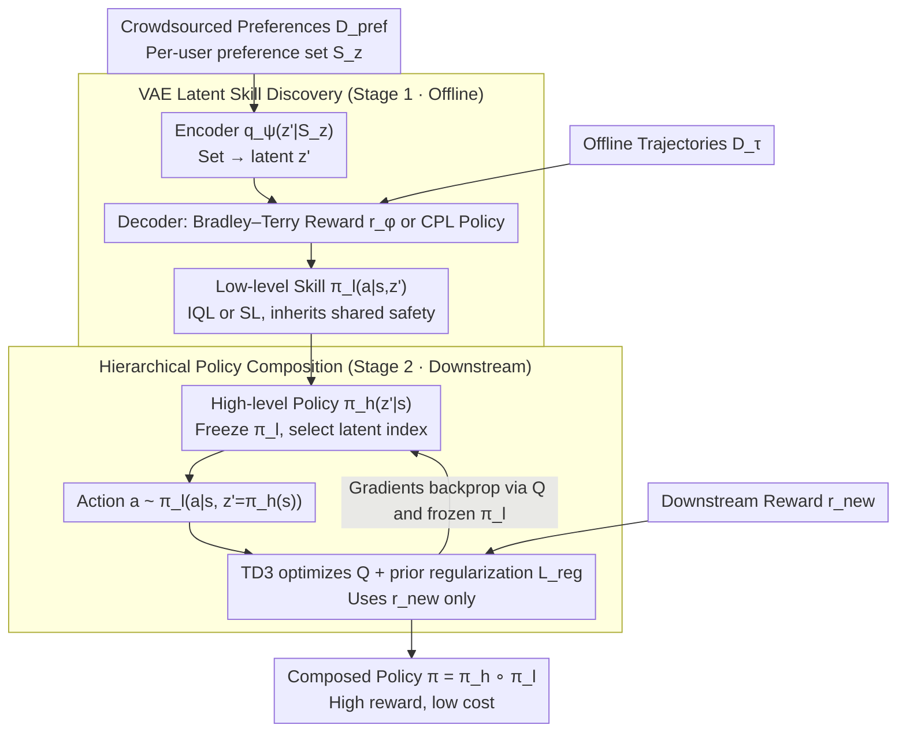

# Implicit Safety Alignment from Crowd Preferences

**Conference**: ICML 2026  
**arXiv**: [2605.21822](https://arxiv.org/abs/2605.21822)  
**Code**: Not publicly available  
**Area**: Alignment RLHF / Safe RL / Preference Learning  
**Keywords**: Crowdsourced Preferences, Implicit Safety Alignment, Skill Discovery, VAE, Hierarchical Reinforcement Learning

## TL;DR
Addressing the "diverse user goals but shared safety criteria" structure in crowdsourced preference data, the authors prove that traditional reward combination is polluted by majority preferences and sensitive to weights. Instead, they propose Safe Crowd Preference-based RL: using a VAE to encode crowdsourced preferences into latent-conditioned low-level skills, then training a high-level policy to compose these in skill space. This suppresses downstream costs to near-Oracle levels without explicit safety rewards or significant task return degradation.

## Background & Motivation

**Background**: RLHF has expanded from single annotators to crowdsourced preference scenarios. Most works (VPL, MaxMin-RLHF, Personalized Soups) focus on respecting user **differences**—learning distinct rewards or policies for different users. Safe RLHF treats safety separately as an additional class of preference labels.

**Limitations of Prior Work**: A more common real-world scenario is that a single preference dataset contains both **individual differences and shared principles** ("I might not like this trajectory, but nobody wants a crash"), where these signals are not labeled separately. Directly applying vanilla RLHF to learn a global reward $\hat r(s,a)$ and then weighting it with a downstream task reward $r_{\text{new}}$ ($r' = (1-\omega)r_{\text{new}} + \omega \hat r$) causes two issues: (i) $\hat r$ is contaminated by both shared safety and majority personal preferences; (ii) the weight $\omega$ is extremely sensitive and difficult to tune due to scale differences.

**Key Challenge**: Shared safety criteria and user-specific goals are coupled at the reward level in crowdsourced preferences, with no natural decoupling signal. Meanwhile, downstream tasks focus on their own $r_{\text{new}}$ and should not be "hijacked" by majority user preferences.

**Goal**: (1) Formalize the structure of "shared safety in crowdsourced preferences" and characterize the failure modes of vanilla RLHF in this setting; (2) Transfer shared safety signals to arbitrary downstream tasks without explicit safety rewards, oracle $z$ labels, and under potentially severe preference imbalance.

**Key Insight**: Rather than combining at the **reward** level, composition should occur at the **policy** level. If each user's preference can be encoded into a latent-conditioned skill, and each skill naturally inherits safety criteria by being "on the preference distribution," then a high-level policy trained in skill space will stay within the "universally safe" behavioral manifold regardless of the $r_{\text{new}}$ being optimized.

**Core Idea**: Replace *reward combination* with *policy composition*—use a VAE to extract latent skills from crowdsourced preferences, where the high-level policy makes decisions only over skill indices. Safety is an emergent property of the skill space structure rather than a result of reward weighting.

## Method

### Overall Architecture

The paper aims to transfer shared safety principles to downstream tasks without explicit safety rewards or oracle user labels. It decomposes crowdsourced preference rewards as $r(s,a,z) = r_{\text{user}}(s,a,z) + r_{\text{share}}(s,a)$ (where $z$ is unobserved user context and $r_{\text{share}}$ is a shared safety penalty: $-K$ if falling into $X_{\text{unsafe}}$, else 0). A two-stage pipeline embeds safety into the policy space. Stage 1: Offline skill discovery—mapping each user's preference set $\mathcal D_{\text{pref}} = \{S_z\}$ to a latent $z'$ via a VAE encoder $q_\psi(z'|S_z)$, with a decoder providing latent-conditioned rewards $r_\phi(s,a,z')$ or policies $\pi_\theta(a|s,z')$, resulting in *preference-aligned* low-level skills $\pi_l(a|s,z')$. Stage 2: Downstream training—freezing low-level skills and training a high-level policy $\pi_h(z'|s)$ to optimize $r_{\text{new}}$ in skill space.

### Key Designs

**1. Theoretical failure of reward combination in vanilla RLHF**

Theorem 4.2 shows that when the safety penalty is sufficiently large ($K > 2L\max|r_{\text{user}}|$), all "safe vs. unsafe" pairs are consistent, meaning $\hat r$ can theoretically learn safety preferences. However, Theorem 4.3 characterizes the imbalance scenario: if a user $z_k$'s proportion exceeds the threshold $p(z_k) > \frac{|\mathcal T|-1}{\min_{(\tau,\tau') \in X_{\text{ics}}} N(\tau,\tau',z_k) + |\mathcal T|}$, the learned $\hat u$ ranking on inconsistent pairs becomes **identical** to $u(\cdot, z_k)$. Thus, $\hat r$ injects majority personal preferences into downstream optimization, causing a mismatch with $r_{\text{new}}$.

**2. VAE-based latent skill discovery**

Using latent $z'$ as a proxy for the unknown $z$, the encoder $q_\psi(z'|S_z)$ maps a **user's entire preference set** $S_z$ to a latent. The decoder uses the Bradley–Terry model to predict preferences $P(y=1|\tau^1,\tau^2,z') = \frac{\exp \hat u(\tau^1,z')}{\exp \hat u(\tau^1,z') + \exp \hat u(\tau^2,z')}$ with KL regularization $D_{KL}(q_\psi \| p(z'))$. Low-level skills $\pi_l(a|s,z')$ are trained via offline RL (IQL) on $\mathcal D_\tau$. A **Safe-CPL** variant is proposed, using CPL preference probabilities $P(y=1|\tau^1,\tau^2,z') = \frac{\exp f(\tau^1|z')}{\exp f(\tau^1|z') + \exp \lambda f(\tau^2|z')}$ to learn policies directly, bypassing unstable RL optimization.

**3. Hierarchical policy composition + prior regularization**

The high-level policy searches only within the "preference-aligned" skill space: $a \sim \pi_l(a|s, z'=\pi_h(s))$. Training uses TD3 with loss $L_{\pi_h} = -\mathbb E_{a \sim \pi_h \cdot \pi_l}[Q(s,a) + \beta_{\text{reg}} L_{\text{reg}}]$. The prior regularization $L_{\text{reg}} = \log p(z' = \pi_h(s))$ pulls $z'$ toward the latent regions seen during training, preventing OOD skills. Safety is inherent to the skill space (Cor. A.6); downstream optimization of $r_{\text{new}}$ does not require reward weighting knobs.

### Loss & Training

Skill discovery VAE ELBO (Eq. 7):
$$\mathbb E_{S_z \sim \mathcal D_{\text{pref}}}\big[\mathbb E_{z' \sim q_\psi(z'|S_z)}[\sum_{(\tau^1,\tau^2,y) \in S_z} \log P(y|\tau^1,\tau^2,z')] - D_{KL}(q_\psi(z'|S_z) \| p(z'))\big]$$

Downstream offline training (Eq. 12):
$$L_{\pi_h}^{\text{offline}} = -\mathbb E[Q(s_D,a) + \beta_{\text{reg}} L_{\text{reg}} + \beta_{\text{BC}} L_{\text{BC}}]$$
Low-level uses IQL (VPL) or SL (CPL variant). Downstream uses TD3+BC (offline) or TD3 (online).

## Key Experimental Results

### Main Results

6 safe-RL environments (Bullet-Safety-Gym + Safety-Gymnasium):

| Env | Metric | Oracle | Task-Only | SOPL | RC($\omega$=0.5) | Safe-VPL | Safe-CPL |
|------|------|--------|-----------|------|------------------|----------|----------|
| Reach | Rew / Cost | 1.00 / .038 | 1.04 / 1.000 | 0.98 / .024 | 0.83 / .101 | 0.98 / .166 | 0.98 / .069 |
| Run | Rew / Cost | 1.00 / 0 | 1.00 / 1.000 | 0.99 / 0 | 1.00 / 0 | 0.95 / 0 | 0.97 / 0 |
| HalfCheetah-vel | Rew / Cost | 1.00 / 0 | 1.85 / 1.000 | 0.93 / .014 | 0.44 / .107 | 0.96 / .004 | 0.92 / .018 |
| **Average** | Rew / Cost | 1.00 / .01 | **1.46 / 1.00** | 1.04 / .01 | 0.82 / .05 | **0.93 / .03** | **0.92 / .02** |

Ours (Safe-VPL/CPL) suppresses cost to 0.02-0.03 (near Oracle's 0.01) while maintaining task returns at 0.92-0.93.

### Ablation Study

| Configuration | Key Observation | Explanation |
|------|---------|------|
| $\beta_{\text{reg}}$ levels | Reward stable, cost improves monotonically | Easier to tune than RC weight $\omega$ |
| Preference noise | Reward stable, safety cost degrades | Safety signals are fragile, but skill diversity persists |
| Crowd size | Moderate degradation | Latent capacity covers user growth |
| Imbalance (10:1) | Average Rew/Cost drop < 0.02 | Robust to preference bias predicted by Thm 4.3 |

### Key Findings
- The Pareto frontier of reward combination (RC) shifts toward "high cost / low reward" under imbalance, while Ours stays close to Oracle.
- $\beta_{\text{reg}}$ acts as a "safety knob": higher values lead to more conservative skill selection.
- Per-task view (Fig. 3): RC can only serve one type of task at a time (majority preference), whereas Ours is safe and high-performing across all tasks simultaneously.

## Highlights & Insights
- **Safety as a spatial structure**: By moving safety from a reward term to a property of the skill space, the downstream task can optimize $r_{\text{new}}$ freely without "boundary" violations.
- **Safe-CPL variant**: Generalizes VPL to regret-based models, making skill discovery a reward-free supervised learning task.
- **Theoretical rigor**: Using Theorem 4.3 to establish closed-form imbalance thresholds provides a much stronger justification than purely empirical observation.
- **Role of prior regularization**: Log-likelihood on the VAE prior restricts the high-level policy to the manifold of preference-aligned behaviors.

## Limitations & Future Work
- Assumes crowdsourced preferences contain a consistent safety principle; adversarial users can degrade safety performance.
- LLM verification is currently limited to a 3-class bandit toy, requiring validation on real dialogue datasets (e.g., BeaverTails).
- Cost upper bound (Thm A.7) depends on low-level skill optimality, which is difficult to guarantee in offline settings.

## Related Work & Insights
- **vs VPL**: Shares the VAE framework but shifts from "identifying individual preferences for diversity" to "composing behavior for safe downstream transfer."
- **vs Safe RLHF**: Assumes coupled preferences instead of separate task/safety reward labels.
- **vs SPiRL / Skill Priors**: Extracts priors from preference data rather than expert demonstrations.

## Rating
- Novelty: ⭐⭐⭐⭐ (Policy composition for safety alignment is a fresh perspective)
- Experimental Thoroughness: ⭐⭐⭐ (Solid RL benchmarks, but LLM part is a toy experiment)
- Writing Quality: ⭐⭐⭐⭐ (Strong link between theoretical failure and proposed solution)
- Value: ⭐⭐⭐⭐ (Methodology is applicable to beyond safety, e.g., style or values)

<!-- RELATED:START -->

## Related Papers

- [\[ICML 2026\] Implicit Preference Alignment for Human Image Animation](implicit_preference_alignment_for_human_image_animation.md)
- [\[ICLR 2026\] Aligning Deep Implicit Preferences by Learning to Reason Defensively](../../ICLR2026/llm_alignment/aligning_deep_implicit_preferences_by_learning_to_reason_defensively.md)
- [\[ICML 2026\] Curriculum Learning for Safety Alignment](curriculum_learning_for_safety_alignment.md)
- [\[ICML 2026\] MESA: Improving MoE Safety Alignment via Decentralized Expertise](mesa_improving_moe_safety_alignment_via_decentralized_expertise.md)
- [\[ICML 2026\] Towards Context-Invariant Safety Alignment for Large Language Models](towards_context-invariant_safety_alignment_for_large_language_models.md)

<!-- RELATED:END -->
## Related Papers

- [\[ICML 2026\] Implicit Preference Alignment for Human Image Animation](implicit_preference_alignment_for_human_image_animation.md)
- [\[ICLR 2026\] Aligning Deep Implicit Preferences by Learning to Reason Defensively](../../ICLR2026/llm_alignment/aligning_deep_implicit_preferences_by_learning_to_reason_defensively.md)
- [\[ICML 2026\] Curriculum Learning for Safety Alignment](curriculum_learning_for_safety_alignment.md)
- [\[ICML 2026\] MESA: Improving MoE Safety Alignment via Decentralized Expertise](mesa_improving_moe_safety_alignment_via_decentralized_expertise.md)
- [\[ICML 2026\] Towards Context-Invariant Safety Alignment for Large Language Models](towards_context-invariant_safety_alignment_for_large_language_models.md)

<!-- RELATED:END -->
