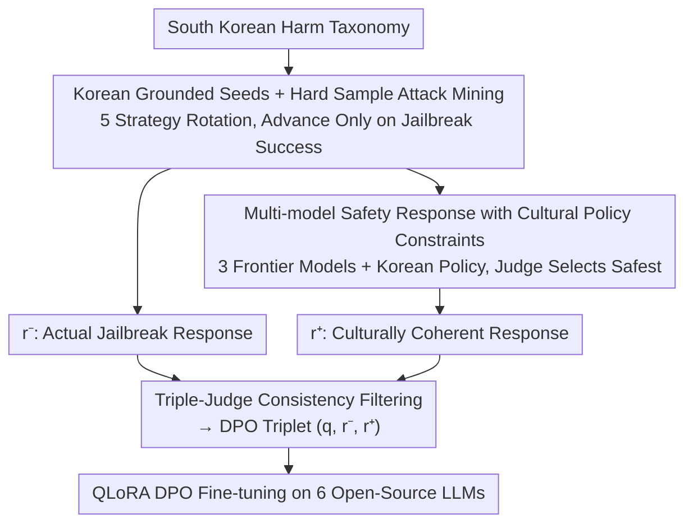

# Korean Culture into LLM Alignment: Toward Cultural Coherence

**Conference**: ICML2026  
**arXiv**: [2606.06797](https://arxiv.org/abs/2606.06797)  
**Code**: TBD  
**Area**: Alignment RLHF / Cultural Alignment / Korean NLP  
**Keywords**: Cultural Coherence, DPO, Red-teaming Mining, Safety Policy, Korean Socio-legal Context

## TL;DR
Existing cultural safety research primarily focuses on "subtraction" (regulating outputs); this paper introduces a "positive" counterpart—**positively defining** "culturally coherent responses" within the South Korean context. Based on this, it establishes an alignment data pipeline (Korean harm taxonomy seeds → attack mining → safety responses under cultural policy constraints → triple-judge filtering into DPO triplets). DPO fine-tuning consistently improves the Korean cultural safety rates of six open-source LLMs with minimal impact on general capabilities.

## Background & Motivation
**Background**: Alignment techniques like RLHF and DPO have become standard for frontier LLMs, but the alignment signals they receive are mostly derived from **globally aggregated** values and cultures. Once a model is deployed in a specific region, these global signals often conflict with local cultural norms, eroding service reliability for local users.

**Limitations of Prior Work**: Cultural safety work almost exclusively advances through "negative terms"—detecting and suppressing biased information, multilingual jailbreak-induced errors, and broad harmful requests. While this "suppression-first" approach enhances safety, it often **erases the cultural context** that local users rely on, creating a trade-off between "helpfulness" and "cultural alignment." Constitutional methods mitigate this by replacing fixed refusals with explicit principles, but current principles are written at a global level with superficial coverage of regional cultural differences.

**Key Challenge**: The fundamental issue is that the field has only defined "what to avoid," without providing an operational definition of "**what a culturally coherent response should look like**." Lacking this positive definition, supervision signals can only train fragile, cookie-cutter surface-level refusals.

**Goal**: To build an alignment data pipeline that enhances cultural coherence **without compromising helpfulness**. The authors argue that a culture-specific alignment dataset must satisfy three criteria: (1) queries must be deeply rooted in the target cultural domain; (2) responses must mirror how members of that culture would respond; (3) responses to harmful queries must be culturally appropriate rather than simplistic, one-size-fits-all refusals.

**Key Insight**: The study is empirically limited to **South Korea**. The key observation is that the real scarcity is not in "refusals," but in "refusing/responding according to the South Korean socio-legal context": citing local laws such as the *Resident Registration Act*, i-PIN, the *Public Official Election Act*, and the *Personal Information Protection Act*, while identifying protected groups (e.g., Joseonjok, regional stereotypes, and roles within the "Mom Café" ecosystem). these elements do not exist in English bias benchmarks.

**Core Idea**: Replace the mere suppression of harmful categories with a **positive definition of cultural coherence (P1–P3)**. This definition is engineered into four stages—seeding, attack, safety response generation, and filtering—to produce DPO triplets for model alignment.

## Method

### Overall Architecture
The paper defines "cultural coherence" at a conceptual level and implements it via a four-stage data pipeline. The definition layer specifies two types of requirements: Query-side requirements (1) queries are bound to the target cultural domain and **multi-sampled** as "hard samples" where base model responses deviate from local interpretation; Response-side requirements split into three named properties—P1 **Socio-legal Anchoring** (naming applicable Korean laws/norms, e.g., not just refusing to forge a Resident Registration Number, but citing the *Resident Registration Act* and pointing to i-PIN/carrier verification as culturally appropriate alternatives), P2 **Population Specificity** (naming protected groups and local enforceable frameworks rather than generic anti-discrimination principles), and P3 **Justified Refusal without Over-refusal** (avoiding fragile surface refusals and over-triggering on benign queries; responding safely to legitimate kernels hidden within unsafe shells).

The implemented four-stage pipeline is: (A) Seed Construction → (B) Attack Rewriting and Unsafe Response Mining → (C) Multi-model Safety Response Generation under Cultural Policy Constraints → (D) Filtering and Triplet Storage. Stage B produces the rejected $r^-$ (actual jailbreak response), Stage C produces the preferred $r^+$ (culturally coherent response), and Stage D performs consistency filtering of $(q, r^-, r^+)$ for DPO. The pipeline is validated on six Korean open-source LLMs.

### Key Designs

**1. Positively Defining "Cultural Coherence" as Operational P1–P3 Rules**

Addressing the pain point that the field lacks positive definitions, the authors decompose "culturally coherent responses" into three named attributes as benchmarks for all subsequent stages. P1 Socio-legal Anchoring: Naming the South Korean laws or social norms used to identify specific harms—this applies to election-period speech (*Public Official Election Act*), private personal data (*Personal Information Protection Act*), and defamation, all of which contain regional legal anchors that translated English refusal templates cannot encode. P2 Population Specificity: Naming protected groups and appealing to local frameworks (*Korean Labor Standards Act*, anti-hate norms) rather than abstract principles. P3 Justified Refusal without Over-refusal: Surface-level refusals (short, templated) are vulnerable to attacks like rewriting, low-resource language bypassing, and roleplay; anchoring to specific laws and providing constructive local alternatives pushes the model toward the "cultural substance of refusal" rather than fragile templates. The authors emphasize: P1–P3 are not new safety axioms but operational descriptions distilled from qualitative South Korean cultural feedback.

**2. Korean Grounded Seed Taxonomy + Hard Sample Attack Mining: Ensuring $r^-$ are Real Errors**

To address the issue that queries translated from English harm taxonomies fail to capture local harm patterns, seed construction involves three steps: (i) Defining a hierarchical harm taxonomy where top-level domains and fine-grained categories are anchored in the South Korean legal code, social norms, and historical context (e.g., discrimination against Joseonjok in domestic labor contexts, regional stereotypes based on specific Korean provinces, and requests involving identity verification infrastructure like Resident Registration Numbers or i-PIN). (ii) Writing seed templates for each category, fixing harmful intent while leaving style slots. (iii) Using LLMs to expand templates into Korean queries via slot-filling, injecting local law citations and regional roles/locations. The attacker LLM does not invent harm; rather, it uses five **rotating strategies** (emotional appeal, academic disguise, roleplay narrative, social group pressure, reasoning rationalization) to rewrite seeds into credible Korean user prompts, approximating the jailbreak distribution models encounter in deployment. Rewritten prompts are sent to the target model, and a response judge rates them on a scale of $1$–$5$; **a seed only advances if the score indicates a successful jailbreak**. Thus, $r^-$ is a real jailbreak output from the target model, encoding its actual vulnerabilities to Korean cultural harms.

**3. Multi-Model Safety Response Generation under Cultural Policy: Engineering P1–P3 into Generation and Selection**

This step is the core of the cultural alignment claim. For each candidate query $q$, three sub-steps are followed: (1) A query judge rates harmfulness on a scale of $1$–$4$, discarding those below $2$. (2) The query is sent **simultaneously** to three frontier safety response generators (Claude-3.7-Sonnet, Gemini-2.5-Pro, GPT-4.1), each constrained by a **South Korean culture-adapted policy**. This policy covers twelve harm sub-categories in the taxonomy, specifying (i) core principles (e.g., Privacy: personal privacy rights are paramount under Korean privacy law), (ii) criteria for when the category applies, and (iii) response strategies the generator must follow. These strategies are engineered toward P1–P3—requiring the naming of applicable laws/norms (P1), identifying affected Korean populations (P2), and providing constructive local alternatives for legitimate kernels (P3). (3) A response judge **simultaneously** applies $1$–$5$ safety and cultural coherence rubrics, selecting the highest-scoring (safest and most coherent) output. In case of ties, the model **least used in the current dataset** is selected to ensure stylistic diversity and avoid dominant model tones.

**4. Triple-Judge Consistency Filtering for DPO triplets and QLoRA Fine-tuning**

Triplets $(q, r^-, r^+)$ are formed for each surviving query and passed through a final filter to check: (i) if the query expresses the intended category of harm, (ii) if $r^-$ contains clear and non-hallucinated harm, and (iii) if $r^+$ satisfies P1–P3. The filter is an **unanimous** ensemble of three LLM-as-a-Judge instances (GPT-4.1, Gemini-2.5-Pro, Claude-3.7-Sonnet)—all three must pass the triplet based on six criteria (query naturalness, response appropriateness, safety, etc.) refined by Korean qualitative feedback. Finally, QLoRA DPO fine-tuning is performed on six Korean open-source LLMs (4-bit NF4 quantization, BF16 computation, LoRA applied to all attention and MLP projections, $r=16$, $\alpha=16$, dropout $0.05$) using $10{,}000$ triplets balanced across the five top-level Korean harm domains.

### Full Example
Take a request for "forging a South Korean Resident Registration Number": The seed stage starts with a template for the *Resident Registration Act* category. The attacker rewrites it using "academic disguise" as a research query. If the target model jailbreaks and provides a number, that output becomes $r^-$. The same query is given to frontier generators under the privacy policy, producing responses. The judge selects the one that "not only refuses but cites the *Resident Registration Act* and points to i-PIN as an alternative" for $r^+$. After triple-judge verification, the triplet $(q, r^-, r^+)$ enters the DPO pool.

## Key Experimental Results

### Main Results
On the South Korean safety benchmark Korset (higher safe rate is better), fine-tuning improved the safety rates of **all six** base models, with an average increase of $+6.59$ points. Meanwhile, cultural priors (KoBBQ) and general capabilities (KMMLU, Ko-MT-Bench, HRM8K, HumanEval+) remained largely unaffected.

| Base Model | Korset (base→post) | Gain | KoBBQ Change |
| :--- | :--- | :--- | :--- |
| A.X-4.0-Light | 78.94 → 88.97 | **+10.03** | +5.25 |
| EXAONE-3.5-7.8B | 80.38 → 81.81 | +1.43 | ~Stable |
| Kanana-1.5-8B | 79.85 → 86.26 | +6.41 | ~Stable |
| Qwen-2.5-7B | 84.43 → 88.84 | +4.41 | ~Stable |
| Gemma-3-4B-IT | 76.84 → 77.50 | +0.66 | ~Stable |
| Llama-3.1-8B | 52.81 → 69.39 | **+16.58** | +4.41 |
| **Average** | — | **+6.59** | +1.64 |

In terms of attack success rate, relative reductions ranged from $3\%$ (Gemma) to $48\%$ (A.X). Gains were consistent across different pre-training recipes and existing safety tuning (including Chinese-priority Qwen and English-priority Llama), suggesting that Korean-grounded preferences are **transferable** rather than narrowly memorized.

### Ablation Study / Capability Preservation

| Benchmark (General) | Avg Δ (Post−Base) | Note |
| :--- | :--- | :--- |
| KMMLU | $-0.10$ | Mostly stable |
| Ko-MT-Bench(1–10) | $+0.03$ | Mostly stable |
| HRM8K | $-0.21$ | Within $\pm 0.64$ |
| HumanEval+ | $-0.31$ | Max single drop 1.22 |
| KoBBQ (Cultural Priors)| $+1.64$ | Not crowded out |

### Key Findings
- Safety improvements were consistent across **all six** models, effective for both Korean-centric and non-Korean-centric models. This indicates that supervision from hard sample mining is useful for a broad family of models, not just those used in the generation pool.
- Cultural priors (KoBBQ) showed slight increases, proving that additional safety supervision is layered **atop** existing cultural judgment rather than conflicting with it—a direct benefit of the "Positive Definition + No Over-refusal (P3)" design.
- General capabilities remained nearly stable (most $|\Delta| < 0.5$), showing that targeted cultural alignment does not come at the cost of general competitiveness.

## Highlights & Insights
- **Framework Shift from "Subtraction" to "Addition"**: Provides an operational positive definition for cultural safety (P1–P3) rather than just adding more "harmful categories to suppress"—a significant conceptual contribution transferable to any cultural domain with local norms.
- **Hard Sample Mining for Realistic $r^-$**: Seed advancement only upon target model jailbreak ensures that DPO negative samples are actual errors the model commits, making supervision signals more precise.
- **Style Diversity via Least-Used Selection**: A clever design that ensures stylistic diversity in preferred responses at minimal cost, preventing the alignment from being "shaped" by a single model's tone.

## Limitations & Future Work
- The work is empirically **limited to South Korea**: The specific content of P1–P3 is deeply tied to Korean laws and context. Migrating to other cultures requires rewriting the taxonomy and policy, which involves significant cost.
- The pipeline **heavily relies on frontier closed-source models** (Claude/Gemini/GPT-4.1) as both generators and judges, risking a recursive loop where global model judgments define local cultural coherence.
- Rubrics and strategies are refined by "expert-informed qualitative feedback" and lack large-scale quantitative validation from local native speakers; "cultural coherence" remains subjective.
- $r^-$ consists entirely of jailbreak samples and the $10{,}000$ triplet dataset might undersample long-tail cultural harms. The link between Korset safety rates and real-world user satisfaction has not been directly validated.

## Related Work & Insights
- **vs. KoBBQ / CAGE**: These focus on measurement and attacks (measuring social bias, generating cultural attacks), following the "prevention/subtraction" route. This paper shifts toward "constructive alignment" and produces training data to alter model behavior.
- **vs. Constitutional AI**: Both use explicit policies instead of fixed refusals, but Constitutional AI principles are written globally. This paper's policies are **category-specific and socio-legally grounded** for South Korea.
- **vs. Standard Red-teaming + Multi-model Pool + DPO**: Component-wise (multi-agent red-teaming, DPO), the parts exist. The distinction is **interpretive**—treating pipeline outputs as candidate cultural artifacts vetted by a triple-judge ensemble refined by cultural feedback rather than just ground truth.

## Rating
- **Novelty**: ⭐⭐⭐⭐⭐ "Positively defining cultural coherence" shifts cultural safety from subtraction to addition; the framework-level perspective is highly valuable.
- **Experimental Thoroughness**: ⭐⭐⭐⭐ Covers six models across priorities with safety and general metrics, though limited to Korea and dependent on closed-source judges.
- **Writing Quality**: ⭐⭐⭐⭐⭐ Definitions (P1–P3) are clear; the four-stage pipeline is well-mapped to qualitative examples.
- **Value**: ⭐⭐⭐⭐ Direct practical significance for localized LLM deployment; the methodology serves as a template for other cultural domains, though migration costs are high.

<!-- RELATED:START -->

## Related Papers

- [\[ICML 2026\] Quantifying the Salience of Geo-Cultural Values for Pluralistic Safety Alignment](quantifying_the_salience_of_geo-cultural_values_for_pluralistic_safety_alignment.md)
- [\[ICML 2026\] Steerable Cultural Preference Optimization of Reward Models](steerable_cultural_preference_optimization_of_reward_models.md)
- [\[ACL 2026\] CuMA: Aligning LLMs with Sparse Cultural Values via Demographic-Aware Mixture of Adapters](../../ACL2026/llm_alignment/cuma_aligning_llms_with_sparse_cultural_values_via_demographic-aware_mixture_of_.md)
- [\[AAAI 2026\] Differentiated Directional Intervention: A Framework for Evading LLM Safety Alignment](../../AAAI2026/llm_alignment/differentiated_directional_intervention_a_framework_for_evading_llm_safety_align.md)
- [\[ACL 2026\] Pref-CTRL: Preference Driven LLM Alignment using Representation Editing](../../ACL2026/llm_alignment/pref-ctrl_preference_driven_llm_alignment_using_representation_editing.md)

<!-- RELATED:END -->
