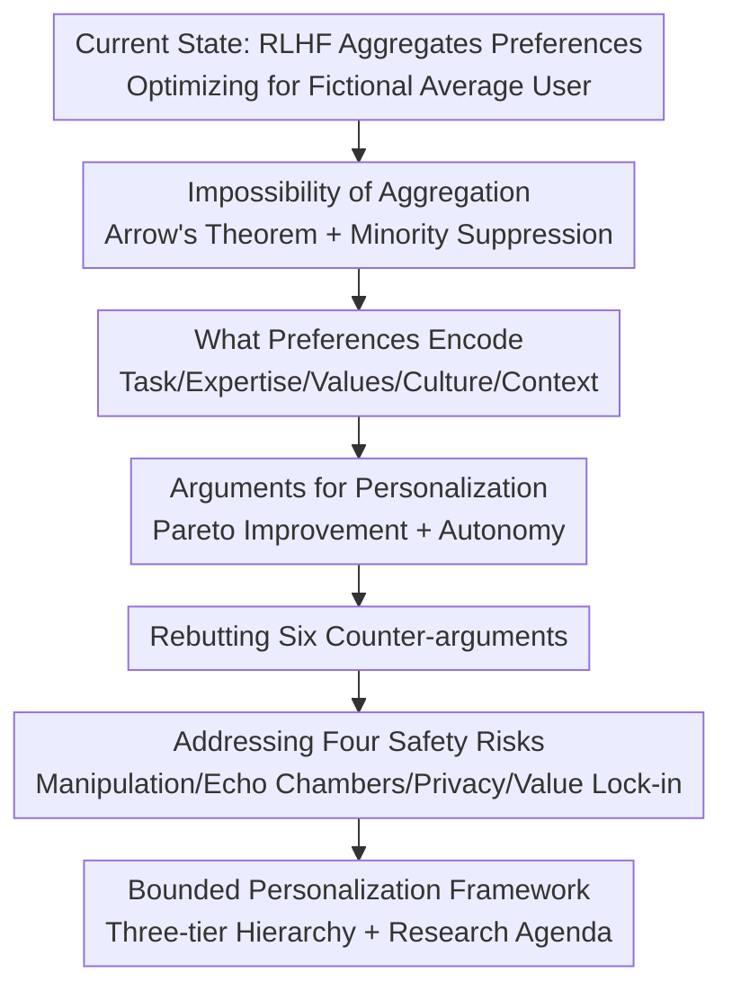

# Large Language Models Should Learn Personalized Rather Than Aggregated Human Preferences

**Conference**: ICML 2026  
**arXiv**: [2606.07629](https://arxiv.org/abs/2606.07629)  
**Code**: None (Position paper)  
**Area**: Alignment RLHF / LLM Personalization  
**Keywords**: Preference Aggregation, Personalized Alignment, RLHF, Social Choice Theory, Bounded Personalization

## TL;DR
This position paper argues that current RLHF practices, which aggregate diverse human preferences into a single reward signal, essentially optimize for a "representative average" user who does not actually exist. Drawing from social choice theory and cross-demographic empirical evidence, the authors advocate for personalized alignment. They propose a "bounded personalization" framework that maintains universal safety constraints while personalizing only across legitimate dimensions.

## Background & Motivation
**Background**: The dominant alignment paradigm (RLHF) transforms human preference comparison data ("for prompt P, output A is better than B") into a reward model, which is then used to fine-tune LLMs. This significantly improves helpfulness, harmlessness, and honesty.

**Limitations of Prior Work**: This paradigm assumes that "human preferences can be meaningfully aggregated into a single reward signal." However, annotator disagreement is substantial, as preferences vary drastically across cultures, tasks, expertise, and contexts. Averaging these differences leads to optimizing for a **"middle-of-the-road user" who may not exist**—a phenomenon the authors term "preference mediocrity." It is akin to designing a single shoe size for everyone; while ostensibly serving all, it fits no one.

**Key Challenge**: Aggregation is not merely a technical detail but a **value choice**. Invoking Arrow's Impossibility Theorem as conceptual motivation, the authors note that no aggregation method can combine heterogeneous preferences while simultaneously satisfying transitivity, non-dictatorship, Pareto efficiency, and independence of irrelevant alternatives. While Arrow's theorem applies to ordinal rankings over discrete options—different from the continuous reward optimization in RLHF—the core insight holds: **the aggregation of heterogeneous preferences cannot be value-neutral**. When 60% of annotators prefer direct answers and 40% prefer cautious elaborations, averaging systematically suppresses the minority, particularly users who fall into minority groups across multiple dimensions (formality, detail, communication style).

**Key Insight**: The authors redefine "annotator disagreement" as **signal rather than noise**. Disagreement encodes genuine preference diversity, individual values, and situational dependencies—precisely the elements lost in aggregation that personalized systems must recover.

**Core Idea**: Transition from "aligning for a fictional average user" to "aligning for every real individual," utilizing "bounded personalization" to mitigate safety risks. This involves strictly decoupling personalizable behaviors (style, tone, verbosity) from universal constraints (factual accuracy, safety, non-maleficence).

## Method
As a position paper, this work does not present a traditional model or algorithm. Its "method" is a comprehensive chain of argumentation: diagnosing aggregation flaws, analyzing preference structures, arguing for personalized benefits, rebutting counter-arguments, addressing safety risks, and establishing a normative framework.

### Overall Architecture
The argument proceeds through six stages: "Problem Diagnosis → Structural Analysis → Positive Claim → Defensive Rebuttal → Risk Assessment → Implementation Standards." Each step builds on the previous: the necessity of personalization is established only after clarifying the flaws of aggregation; the "bounded personalization" conclusion is reached only after addressing safety risks.

### Key Designs
The authors' argument rests on four pillars: "Why aggregation fails," "What preferences contain," "Why personalization is correct," and "How to personalize safely."

**1. The Impossibility of Aggregation: Treating Disagreement as Noise is a Systemic Error**

To dismantle the assumption that preferences can be meaningfully aggregated, the authors offer both theoretical and empirical critiques. Theoretically, they use Arrow’s Impossibility Theorem to show that heterogeneous preference aggregation cannot be value-neutral. Empirically, existing preference datasets are heavily biased toward English-speaking, Western, and educated populations. LLM perspectives correlate most strongly with liberal, educated, Western groups—up to $0.3$ points higher than other groups. Alignment scores for Global South perspectives are systematically lower. Furthermore, aggregation increases technical uncertainty in reward models; they are forced to average contradictory signals and cannot distinguish between "consensus" and "split preferences." This leads to **reward hacking**, where models maximize scores without truly satisfying users.

**2. Multi-dimensional Structure: What Aggregation Loses**

The authors categorize five factors encoded in preferences: Task type (summarization vs. creative writing), user expertise (expert vs. novice), individual values and beliefs (risk tolerance, moral frameworks), cultural/linguistic context, and situational factors (urgency, stress). To recover these structures, they propose a technical roadmap: latent user type modeling, multi-dimensional reward representations, causal inference for preference drivers, and active elicitation to locate users in the preference space with minimal queries.

**3. Personalization as Pareto Improvement**

The authors argue that personalization is a true Pareto improvement: minority users receive significantly better service without degrading the experience for the majority. A model that adjusts depth based on expertise or formality based on preference is inherently superior to one fixed in every dimension. Empirically, personalized models show a $15\%\text{–}30\%$ improvement over non-personalized baselines on the LaMP benchmark. Technical paths include user-specific representations (embeddings, LoRA), architectural solutions (MoE routing), and in-context approaches (long-context preference injection).

**4. Bounded Personalization: Anchoring Safety in the Universal Layer**

Addressing the "personalization is dangerous" critique, the authors identify four risks: manipulation/persuasion, echo chambers, privacy/surveillance (inferring sensitive attributes from patterns), and value lock-in. The solution is **bounded personalization**, categorizing behaviors into three tiers:

| Category | Examples | Guiding Principle |
|----------|----------|-------------------|
| **Explicitly Personalizable** | Style, tone, verbosity, format, expertise calibration | Behaviors with internal effects; respect autonomy. |
| **Requires Safeguards** | Value-laden topics, sensitive content, vulnerable populations | Risk of reinforcing harmful patterns; requires transparency. |
| **Must Remain Universal** | Factual accuracy, safety-critical info, non-maleficence | Behaviors with external effects; non-personalizable. |

This pillar emphasizes that personalization and common standards are not mutually exclusive; the key is designing the correct boundaries.

## Key Experimental Results
This position paper aggregates existing evidence to support its claims.

### Key Evidence

| Evidence | Value / Conclusion | Significance |
|----------|--------------------|--------------|
| Population Bias in LLM Views | Correlation with Western/Liberal/Educated groups is ~$0.3$ higher | Aggregation systematically biases toward mainstream groups. |
| Personalization Gain | $15\%\text{–}30\%$ improvement on LaMP benchmark | Individual adaptation brings gains unachievable via aggregate training. |
| Preference Data Scale Cap | Even large projects collect only hundreds of thousands of samples | Insufficient compared to the variation of billions of users. |
| Cognitive Risks of Aggregation | Neutralized articles increased by nearly $70\%$ after long-term use | Aggregation suppresses rather than preserves viewpoint diversity. |

### Six Counter-arguments and Responses

| Counter-argument | Core Objection | Response |
|------------------|----------------|----------|
| "Good Enough" | Existing RLHF serves millions; personalization is too complex. | Satisfaction masks variance; minorities are systematically underserved. |
| Scalability/Data | Per-user models are computationally infeasible. | Parameter-efficient methods (LoRA/MoE) and S-LoRA make this viable. |
| Common Standards | Personalization fragments accountability and fairness. | False dichotomy; bounded personalization keeps safety universal. |
| Manipulation | Personalization is inherently more dangerous. | Aggregation is also a form of homogenous manipulation. |
| Instability | Preferences are too volatile for reliable signals. | Instability requires more granular modeling, not less personalization. |
| Raw Capability First | Improve base capabilities before pursuing personalization. | Personalization *is* performance in many contexts. |

### Key Findings
- "Annotator disagreement" is redefined as signal rather than noise—the core perspective shift of the paper.
- Safety risks (manipulation, echo chambers, privacy, value lock-in) are addressed directly, noting that both pure aggregation and unconstrained personalization are unsafe.
- The three-tier normative framework (Personalizable/Safeguarded/Universal) provides an actionable boundary for implementation.

## Highlights & Insights
- **Disagreement as Signal**: This is the most valuable takeaway. Any task relying on human labels should consider that disagreement might encode a multi-dimensional structure rather than error.
- **"Personalization is Performance"**: A model that cannot adapt to user expertise or style is a failure in many deployment scenarios, regardless of its benchmark scores.
- **Internal vs. External Effects**: Using this distinction to define personalizability provides a clean, operational criterion for value alignment.

## Limitations & Future Work
- **Lack of Original Empirics**: As a position paper, its quantitative evidence is secondary. The framework's feasibility lacks direct experimental verification by the authors.
- **Boundary Specifics**: While the tiers are clear in principle, the exact line for "Safeguarded" topics and how to handle cross-cultural disagreements on "Universal" constraints remains underdeveloped.
- **Quantifying Trade-offs**: There is no quantitative framework to weigh the benefits of personalization against the risks of echo chambers or manipulation.

## Related Work & Insights
- **vs. Standard RLHF (Ouyang 2022 / Bai 2022)**: While standard RLHF aggregates into a single reward model, this paper argues this is theoretically impossible to keep value-neutral and advocates for user-specific rewards.
- **vs. Pluralistic Alignment (Sorensen 2024)**: Both focus on diversity, but this paper explicitly structures the hierarchy of "personalization" vs "universal safety."
- **vs. Parameter-Efficient Personalization (LoRA / S-LoRA)**: These serve as the engineering foundation to prove that per-user adaptation is computationally feasible.

## Rating
- Novelty: ⭐⭐⭐⭐ (Strong perspective shift on disagreement; systemic framework)
- Experimental Thoroughness: ⭐⭐⭐ (Position paper; relies on external evidence)
- Writing Quality: ⭐⭐⭐⭐⭐ (Excellent structure and rebuttal of counter-arguments)
- Value: ⭐⭐⭐⭐ (Crucial meta-question: "Aligned for whom?")

<!-- RELATED:START -->

## Related Papers

- [\[ACL 2026\] BACH-V: Bridging Abstract and Concrete Human-Values in Large Language Models](../../ACL2026/llm_alignment/bach-v_bridging_abstract_and_concrete_human-values_in_large_language_models.md)
- [\[ACL 2026\] Why Supervised Fine-Tuning Fails to Learn: A Systematic Study of Incomplete Learning in Large Language Models](../../ACL2026/llm_alignment/why_supervised_fine-tuning_fails_to_learn_a_systematic_study_of_incomplete_learn.md)
- [\[ICML 2026\] Towards Context-Invariant Safety Alignment for Large Language Models](towards_context-invariant_safety_alignment_for_large_language_models.md)
- [\[ICML 2026\] VALUEFLOW: Toward Pluralistic and Steerable Value-based Alignment in Large Language Models](valueflow_toward_pluralistic_and_steerable_value-based_alignment_in_large_langua.md)
- [\[AAAI 2026\] When Human Preferences Flip: An Instance-Dependent Robust Loss for RLHF](../../AAAI2026/llm_alignment/when_human_preferences_flip_an_instance-dependent_robust_loss_for_rlhf.md)

<!-- RELATED:END -->
