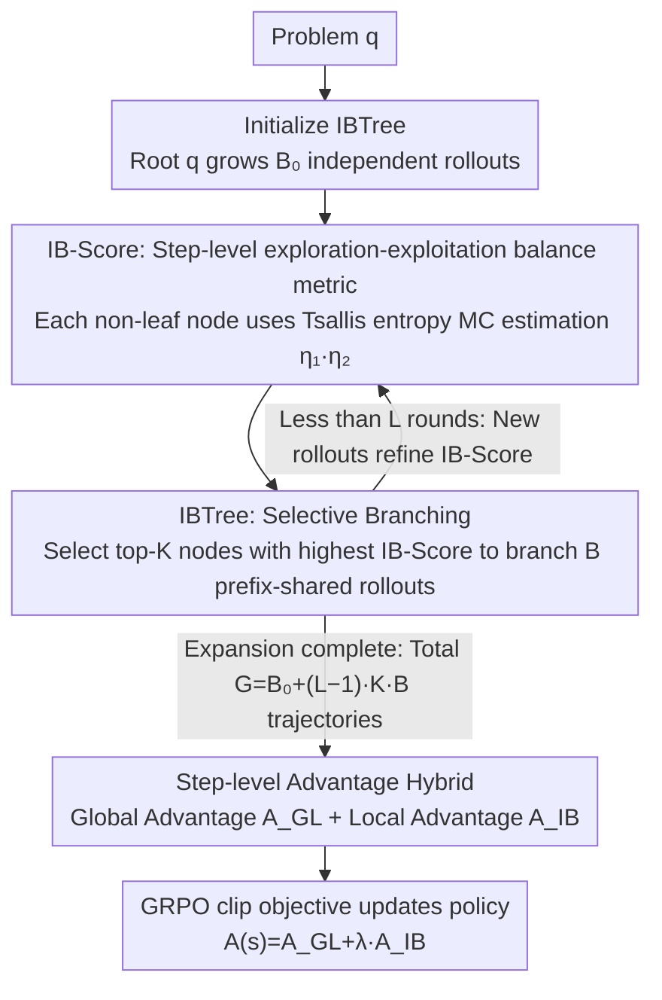

# Long Live The Balance: Information Bottleneck Driven Tree-based Policy Optimization

**Conference**: ICML 2026  
**arXiv**: [2605.28109](https://arxiv.org/abs/2605.28109)  
**Code**: https://github.com/ (The paper claims it is open-sourced, but the repository URL is not provided in the text)  
**Area**: Alignment RLHF / LLM Reasoning / Online Reinforcement Learning  
**Keywords**: Information Bottleneck, GRPO, Tree Search, Exploration-Exploitation Balance, Step-level Advantage

## TL;DR
This paper utilizes Information Bottleneck (IB) theory to propose IB-Score, a step-level metric for quantifying the "exploration-exploitation balance." Based on this, it designs IB-guided tree sampling (IBTree) combined with step-level local/global advantages. On Qwen3-1.7B/8B, it achieves an average improvement of 2.9–3.6% over GRPO while sampling 50% more trajectories under the same token budget.

## Background & Motivation

**Background**: Current mainstream post-training for LLM reasoning is online RL, exemplified by GRPO—which independently samples G trajectories for the same problem, uses outcome rewards for group-relative advantage normalization, and performs policy gradient updates with clipping.

**Limitations of Prior Work**: Replicating GRPO with Qwen3-8B-Base revealed two coupled failure modes: ① **Over-exploitation** — After a few training steps, policy entropy plummets, and the model converges prematurely to a high-certainty local optimum. Trajectories within the same group G become homogeneous, leading to a continuous decline in the Effective Rate (Eff-Rate, the proportion of groups with non-zero reward variance), which results in sparse learning signals. ② **Over-exploration** — Forcing entropy up via clip-higher or entropy regularization maintains entropy, but the Eff-Rate continues to drop. In severe cases, "entropy explosion" occurs, causing training collapse. Neither regularization method outperformed vanilla GRPO in Table 1.

**Key Challenge**: There is a lack of an objective metric that can both **quantify the "exploration-exploitation balance" and be applied at the step-level** rather than the token-level or sequence-level. Token-level entropy scales the influence of irrelevant tokens, while sequence-level IB regularization (like IBRO) is too coarse-grained to capture intermediate reasoning steps.

**Goal**: (1) Provide a step-level, online-estimable balance metric; (2) Integrate it into GRPO as an optimization objective; (3) Resolve the implementation bottleneck of the high cost associated with step-wise IB estimation.

**Key Insight**: Applying the IB objective $\min I(X;Z) - \beta I(Z;Y)$ to LLM reasoning—treating the reasoning step sequence $\tau=\{s_i\}$ as the bottleneck representation $Z$, problem $q$ as the input $X$, and correct answer $a^*$ as the output $Y$. Consequently, the **exploration term** naturally becomes $H(s_i|q,s_{<i})$ (step-level generation entropy), and the **exploitation term** becomes $H(s_i|a^*,q,s_{<i})$ (uncertainty of the step given the correct answer; lower values indicate higher "answer-relevance"). Balancing these two with $\beta$ provides a clean measure of stability.

**Core Idea**: Use **IB-Score** to simultaneously score whether a step is "sufficiently diverse" and "sufficiently oriented towards the correct answer." Implement an **IBTree** search that branches only at nodes with the highest IB-Score, achieving both step-level IB estimation and efficient online sampling.

## Method

### Overall Architecture
For each problem $q$, IB-TPO runs an IBTree: starting with only the root $q$, it grows an initial tree with $B_0$ independent rollouts. It then performs $L-1$ rounds of expansion, selecting the top-$K$ nodes with the highest IB-Scores from all non-leaf nodes in each round to branch out $B$ new trajectories (sharing prefixes and reusing vLLM prefix cache). The total number of trajectories is $G = B_0 + (L-1)\cdot K\cdot B$. After the tree is constructed, each node is assigned both a **global advantage** $A_{GL}$ (reward density from the node to the answer minus the root) and a **local advantage** $A_{IB}$ (step-level signal from IB-Score). These are weighted and fed into the standard GRPO clip objective to update the policy.

### Key Designs

1. **IB-Score: Step-level exploration-exploitation balance metric**:
    - **Function**: Scores any non-leaf node $s_i$ in the reasoning tree. A high score indicates that the position has "both exploratory diversity and information gain," making it suitable as a branching point and a direction for optimization gradients.
    - **Mechanism**: Derived from the IB objective $J_{IB}(\tau)=(\beta+1)H(\tau|q)-\beta H(\tau|a^*,q)$, decomposed into a sum of step-level terms. Since direct distribution computation is infeasible, the authors sample $B$ candidate sub-steps $\{s_i^b\}$ under the shared prefix $(q, s_{<i})$ as Monte Carlo samples. They use Tsallis entropy with $\alpha=2$ instead of Shannon entropy for better numerical stability under sparse samples, deriving $J_{IB}(s_i)\approx \tfrac{1+\beta}{B}\sum_b \eta_1(s_i^b)\cdot \eta_2(s_i^b)$, where $\eta_1(s_i^b)=\hat p(a^*|s_i^b)/\hat p(a^*|s_{i-1})-(1+1/\beta)$ represents the "information gain" from environment feedback, and $\eta_2(s_i^b)=\pi_\theta(s_i^b)$ is the model "confidence" in that branch. Key Insight: $J_{IB}$ essentially depends on $\mathrm{Cov}(\eta_1,\eta_2)$—balance is not merely about increasing entropy but about strategically allocating confidence to branches with the most informative feedback.
    - **Design Motivation**: IB-Score serves to diagnose GRPO failure cases—after several training steps, $\mathrm{Cov}(\eta_1,\eta_2)$ rapidly collapses from positive to zero, indicating that the confidence distribution has become uniform and completely decoupled from "which path actually leads to the correct answer." This provides a unified explanation for over-exploitation and over-exploration. Steps are segmented by `\n\n`, which is training-agnostic and natural; ablation (Table 5) proves robustness to segmentation noise.

2. **IBTree: IB-guided Selective Branching Tree Search**:
    - **Function**: Acts as both a sampler and an IB-Score MC estimator within a fixed token budget, sampling 50% more trajectories than independent sampling.
    - **Mechanism**: Instead of branching at every step (which would cause exponential explosion) or based on token entropy (as in TreeRL, which is susceptible to irrelevant token noise), the top-$K$ nodes ranked by IB-Score are selected in each round to branch $B$ new rollouts with shared prefixes. In experiments, parameters $(B_0,L,K,B)=(4,9,1,1)$ produced a "thin and tall" 12-trajectory tree with token consumption comparable to 8 independent trajectories. As new rollouts provide more sub-samples for upper-level nodes, IBTree doubles as a Monte Carlo estimator for IB-Score, with estimation accuracy updating during expansion, creating a positive feedback loop: "IB-Score guided branching ↔ branching refines IB-Score."
    - **Design Motivation**: Table 3 compares independent / random / fixed-width / entropy-guided / IB-guided branching. IB-guided branching with $\beta=5$ achieved the highest Eff-Rate (60.2%) and Avg-Rate (23.2%), while consuming 37% fewer tokens than 12 independent samples. This indicates that the *location* of branching is far more important than the branching strategy itself, and IB-Score Aligns more closely with the model's true decision points than token entropy.

3. **Hybridization of IB Local and Global Advantages**:
    - **Function**: Converts IB-Score signals into step-level advantages compatible with the GRPO clip objective, bypassing the sparsity issues of sharing a single outcome reward across an entire trajectory.
    - **Mechanism**: Rewrites $\tilde J_{IB}(s)=\eta_1(s)\cdot \eta_2(s)$ into a standard policy gradient form $A_{IB}(s)\cdot w(s)$, where the importance weight is $w(s)=\pi_\theta(s)/\pi_{ref}(s)$. The **local advantage** $A_{IB}(s)=\big(\hat p(a^*|s)/\hat p(a^*|s_p)-(1+1/\beta)\big)\cdot \pi_{ref}(s)$ measures whether the probability of reaching the correct answer increases after moving from parent $s_p$ to $s$. The **global advantage** $A_{GL}(s)=(\hat p(a^*|s)-\hat p(a^*|q))/\mathrm{std}(\{R(\tau)\})$ measures the node's overall improvement relative to the root. Final advantage $A(s)=A_{GL}(s)+\lambda\cdot A_{IB}(s)$ (best at $\lambda=0.1$); policy updates follow the GRPO clip objective in Eq (1).
    - **Design Motivation**: Each node in the tree structure naturally possesses multiple child rollouts, allowing for the calculation of "local value" like $\hat p(a^*|s)$. Table 2 shows that using IBTree alone already provides a +4.4% gain over vanilla GRPO on AMC 24. Adding IBTPO local advantage yields another +2.2%. However, replacing IBTree with random/EPTree significantly degrades IBTPO Adv performance, suggesting that the tree structure and IB advantages must be used in tandem.

### Loss & Training
The base objective follows GRPO's token-level clip + KL regularization (Eq 1), substituting $A_{i,t}$ with step-level $A(s)=A_{GL}+\lambda A_{IB}$. Training used DAPO-Math-17K (17K math problems with outcome rewards), Qwen3-1.7B/8B-Base, lr=$10^{-6}$, KL weight 0.001, single epoch, 8×A100. Sampling temp 0.7, top-p 0.95, max trajectory 2K tokens, tree parameters $(B_0,L,K,B)=(4,9,1,1)$, IB weight $\beta=5$, $\lambda=0.1$.

## Key Experimental Results

### Main Results
Benchmarks included MATH-500 / AIME 24,25 / AMC 23,24 (in-domain math) plus GPQA Diamond and IFEval (out-of-domain), reported as avg@32:

| Model | Method | MATH-500 | AIME 25 | AMC 24 | GPQA | IFEval | Average |
|------|------|----------|---------|--------|------|--------|------|
| Qwen3-1.7B | Vanilla GRPO | 66.8 | 4.5 | 19.7 | 26.5 | 24.0 | 26.3 |
| Qwen3-1.7B | TreeRL (Prev. SOTA) | 67.2 | 4.6 | 20.6 | 26.8 | 23.5 | 26.8 |
| Qwen3-1.7B | **IBTPO** | **70.1** | **6.7** | **23.4** | **29.0** | **26.9** | **29.2** |
| Qwen3-8B | Vanilla GRPO | 81.5 | 13.6 | 39.4 | 38.1 | 42.0 | 40.7 |
| Qwen3-8B | TreeRL | 82.5 | 14.9 | 40.5 | 39.8 | 42.5 | 42.0 |
| Qwen3-8B | **IBTPO** | **83.3** | **15.3** | **46.0** | **41.7** | **46.2** | **44.3** |

Average gains of +2.9% and +3.6% were achieved across both scales compared to GRPO, also outperforming IBRO (sequence-level IB regularization) and tree-based baselines TreeRL / TreePO.

### Ablation Study

| Configuration | AIME 25 | AMC 24 | GPQA | Description |
|------|---------|--------|------|------|
| Vanilla GRPO | 13.6 | 39.4 | 38.1 | Baseline |
| + IBTree (Replace independent sampling) | 15.0 | 43.8 | 40.8 | Significant gain from sampler alone |
| + IBTPO Adv (Eq 16) | 14.2 | 42.5 | 41.2 | Gain from advantage function alone |
| + RandTree & IBTPO Adv | 14.5 | 39.8 | 37.3 | IB advantage with random tree drops on AMC/GPQA |
| + EPTree & IBTPO Adv | 15.0 | 42.3 | 40.9 | Entropy-guided tree still lags behind IB-guided |
| **+ IBTree & IBTPO Adv** | **15.3** | **46.0** | **41.7** | **Full Version** |

Comparison of branching strategies (Qwen3-8B, 1024 problem subset):

| Branching Strategy | G | Eff-Rate | Avg-Rate | Tokens |
|----------|---|----------|----------|--------|
| Independent | 8 | 54.7% | 19.6% | 7,469 |
| Independent | 12 | 59.8% | 20.1% | 12,035 |
| Random | 12 | 48.4% | 20.0% | 7,579 |
| Entropy-guided (TreeRL) | 12 | 57.8% | 21.6% | 7,784 |
| **IB-guided ($\beta=5$)** | 12 | **60.2%** | **23.2%** | 7,592 |

Under the same token budget, IB-guided sampling provides 50% more trajectories while achieving the highest Eff-Rate and Avg-Rate.

### Key Findings
- Both IBTree and IBTPO Adv contribute individually, but **they must be used together**. Replacing IBTree with RandTree causes IBTPO Adv to drop by 0.8% on GPQA compared to GRPO, indicating that IB advantages depend on high-quality branching positions provided by IB-guided trees.
- $\beta$ controls the weight of exploration/exploitation; $\beta=5$ maximizes both Eff-Rate and Avg-Rate. $\lambda$ controls local advantage weight; $\lambda=0.1$ is optimal, while 0.5 causes collapse as local signals overwhelm outcome rewards.
- Training dynamics (Fig 3, 5) show that the collapse of GRPO's $\mathrm{Cov}(\eta_1,\eta_2)$ from positive to zero is the root cause of performance stagnation. IBTPO is the only method that maintains IB-Score and Cov at positive levels throughout training.
- Using `\n\n` for step segmentation with 10% random perturbation (simulating over/under-segmentation) shows negligible performance impact, eliminating the need for a separate step segmenter.

## Highlights & Insights
- **The key is "step-level + online" IB implementation**: Previous work like IBRO formulated IB as sequence-level advantage-weighted entropy regularization, which essentially collapses the tree into a line, wasting the step-wise structure of LLM reasoning. This work uses Tsallis entropy and Monte Carlo estimation to make "per-step IB" online, differentiable, and integrable into the GRPO clip objective, providing much denser signals.
- **The $\mathrm{Cov}(\eta_1,\eta_2)$ perspective explains why simply increasing entropy fails**: High entropy $\neq$ balance; what matters is whether high confidence is assigned to branches with high information gain. This insight can explain failures in other areas (RL exploration rewards, active learning sampling) where adding an entropy bonus does not improve performance.
- **The dual role of IBTree as "sampler + estimator"**: A single tree provides both guidance on where to branch and MC samples for valuing that branch. This bypasses a separate IB estimation process and is the first IB method to utilize step-level signals without increasing wall-clock costs (the authors claim it is faster than independent sampling when using prefix caching).
- The use of `\n\n` as a zero-cost heuristic for step segmentation is robust and a lightweight trick worth adopting in other step-level RL/PRM research.

## Limitations & Future Work
- The authors acknowledge that multi-round tree expansion introduces serial sampling latency. Even with parallelization, IBTree is "slightly slower" than independent sampling under the same token budget (Appendix C.3 provides wall-clock comparisons).
- Training was limited to the DAPO-Math-17K dataset. Out-of-domain testing was limited to GPQA and IFEval. Its effectiveness on tasks with different structural characteristics, such as code generation or multimodal reasoning, remains to be verified.
- IB-Score estimation relies heavily on $B$ sibling samples. While experiments used $B=1$ (one branch per node per round), the MC variance is likely high. The fact that training succeeded suggests that multi-round expansion implicitly compensates for sample size—meaning the method might not work for "single-round shallow trees."
- $\beta=5$ is an empirical value; no adaptive scheduling strategy based on task difficulty or model scale was provided. Further experiments are needed to determine if $\beta$ should be larger for extremely sparse reward tasks like AIME.

## Related Work & Insights
- **vs IBRO (Lei et al., 2025)**: Both use IB theory to guide RL, but IBRO uses sequence-level advantage-weighted entropy regularization, which is too coarse to prevent early Eff-Rate collapse. This work operates at the step-level and turns IB signals into optimized advantage terms rather than auxiliary regularization.
- **vs TreeRL (Hou et al., 2025)**: Both use tree search for online RL, but TreeRL selects branching points via token entropy, which is prone to irrelevant token noise. This work uses IB-Score to consider both model confidence and environmental feedback. Table 2 shows EPTree+IBTPO Adv cannot beat IBTree+IBTPO Adv, confirming the importance of the branching criterion.
- **vs TreePO (Li et al., 2025)**: TreePO limits sampling cost via fixed-width branching, but Table 3 shows fixed-width Avg-Rates are inferior to entropy-guided ones. This work uses IB-Score for selective branching, balancing token control and performance.
- **vs GRPO + Clip-higher / Entropy Reg**: Simple regularizations failed to stabilize Eff-Rate, with the latter potentially triggering entropy explosion. This work explains why via $\mathrm{Cov}(\eta_1,\eta_2)$—increasing entropy does not ensure confidence is placed on correct paths.

## Rating
- Novelty: ⭐⭐⭐⭐ Advancing IB from sequence/token-level regularization to step-level integration with tree search is a rare "diagnosis + solution" closed-loop in the GRPO line. However, using IB for RL exploration is not entirely new.
- Experimental Thoroughness: ⭐⭐⭐⭐ Two model scales, 7 benchmarks, 5 branching strategies, and full $\beta,\lambda$ ablations, plus training dynamics and Cov analysis. Weakness: limited to the mathematics domain.
- Writing Quality: ⭐⭐⭐⭐ IB derivations and Algorithm 1 are clear; the $\eta_1\cdot \eta_2$ decomposition is intuitive. Concept and dynamics figures are well-coordinated.
- Value: ⭐⭐⭐⭐ The Eff-Rate and Cov diagnostic metrics are valuable for other GRPO improvements. The IBTree implementation via ms-swift has a low engineering barrier and is likely to be adopted by the RLHF community.

<!-- RELATED:START -->

## Related Papers

- [\[ICLR 2026\] Hierarchy-of-Groups Policy Optimization for Long-Horizon Agentic Tasks](../../ICLR2026/llm_alignment/hierarchy-of-groups_policy_optimization_for_long-horizon_agentic_tasks.md)
- [\[CVPR 2026\] SafeGRPO: Self-Rewarded Multimodal Safety Alignment via Rule-Governed Policy Optimization](../../CVPR2026/llm_alignment/safegrpo_self-rewarded_multimodal_safety_alignment_via_rule-governed_policy_opti.md)
- [\[ACL 2026\] MDP-GRPO: Stabilized Group Relative Policy Optimization for Multi-Constraint Instruction Following](../../ACL2026/llm_alignment/mdp-grpo_stabilized_group_relative_policy_optimization_for_multi-constraint_inst.md)
- [\[CVPR 2026\] MorphSeek: Fine-grained Latent Representation-Level Policy Optimization for Deformable Image Registration](../../CVPR2026/llm_alignment/morphseek_fine-grained_latent_representation-level_policy_optimization_for_defor.md)
- [\[ICLR 2026\] Learning More with Less: A Dynamic Dual-Level Down-Sampling Framework for Efficient Policy Optimization](../../ICLR2026/llm_alignment/learning_more_with_less_a_dynamic_dual-level_down-sampling_framework_for_efficie.md)

<!-- RELATED:END -->
