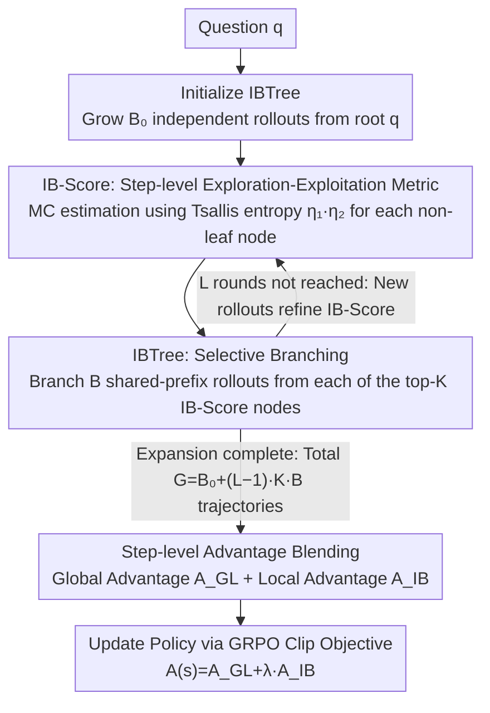

# Long Live The Balance: Information Bottleneck Driven Tree-based Policy Optimization

**Conference**: ICML 2026  
**arXiv**: [2605.28109](https://arxiv.org/abs/2605.28109)  
**Code**: https://github.com/ (The paper claims it is open-sourced, but the repository address is not provided in the main text)  
**Area**: RLHF Alignment / LLM Reasoning / Online Reinforcement Learning  
**Keywords**: Information Bottleneck, GRPO, Tree Search, Exploration-Exploitation Balance, Step-level Advantage

## TL;DR
This paper proposes IB-Score, a step-level metric derived from Information Bottleneck (IB) theory to quantify the "exploration-exploitation balance." It further designs IB-guided Tree sampling (IBTree) combined with step-level local/global advantages. On Qwen3-1.7B/8B, it achieves an average improvement of 2.9–3.6% over GRPO while sampling 50% more trajectories under the same token budget.

## Background & Motivation

**Background**: Current post-training for LLM reasoning primarily relies on online RL, represented by GRPO—sampling $G$ trajectories independently for the same prompt, using outcome rewards for group-relative advantage normalization, and performing clipped policy gradient updates.

**Limitations of Prior Work**: After reproducing GRPO with Qwen3-8B-Base, the authors identified two coupled failure modes: ① **Over-exploitation** — After a few training steps, the policy entropy drops sharply, and the model converges prematurely to a deterministic local optimum. Trajectories within the same group become identical, and the Effective Rate (Eff-Rate, the proportion of groups with non-zero reward variance) continues to decline, leading to sparse learning signals. ② **Over-exploration** — Forcing higher entropy via `clip-higher` or entropy regularization maintains entropy, but the Eff-Rate still drops; in severe cases, "entropy explosion" occurs, leading to training collapse. Neither regularization outperformed vanilla GRPO in Table 1.

**Key Challenge**: The lack of an objective metric that can **quantify the "exploration-exploitation balance" at the step-level rather than at the token or sequence level**. Token-level entropy is inflated by irrelevant tokens, while sequence-level IB regularization (e.g., IBRO) is too coarse to perceive intermediate reasoning steps.

**Goal**: (1) Provide a step-level, online-estimable balance metric; (2) Integrate it into the GRPO optimization objective; (3) Resolve the implementation bottleneck of the high cost associated with estimating IB at every step.

**Key Insight**: Applying the IB objective $\min I(X;Z) - \beta I(Z;Y)$ to LLM reasoning—treating the sequence of reasoning steps $\tau=\{s_i\}$ as the bottleneck representation $Z$, the question $q$ as the input $X$, and the correct answer $a^*$ as the output $Y$. Consequently, the **exploration term** naturally becomes $H(s_i|q,s_{<i})$ (step-level generation entropy), and the **exploitation term** becomes $H(s_i|a^*,q,s_{<i})$ (the uncertainty of the step given the correct answer; lower values indicate higher "answer-relevance"). A clean measure of balance is achieved by trading these off with $\beta$.

**Core Idea**: Use **IB-Score** to simultaneously score "whether the step is diverse enough" and "whether the step points towards the correct answer." Then, employ a search tree that **only branches at nodes with the highest IB-Score**, achieving both step-level IB estimation and efficient online sampling.

## Method

### Overall Architecture
For each question $q$, IB-TPO executes an IBTree: starting from a root $q$, it grows an initial tree with $B_0$ independent rollouts, followed by $L-1$ rounds of expansion. In each round, the top-$K$ non-leaf nodes with the highest IB-Scores are selected to branch into $B$ new trajectories (sharing prefixes and reusing vLLM prefix cache). The total number of trajectories is $G = B_0 + (L-1)\cdot K\cdot B$. Once the tree is constructed, for each node, the **Global Advantage** $A_{GL}$ (reward density from the node to the answer minus the root) and **Local Advantage** $A_{IB}$ (step-level signal from IB-Score) are calculated. These are weighted and fed into the standard GRPO clipped objective for policy updates.

### Key Designs

1. **IB-Score: Step-level Exploration-Exploitation Metric**:
    - **Function**: Scores any non-leaf node $s_i$ in the reasoning tree. A high score indicates that the position has both "exploratory diversity and information gain," making it suitable as a branching point and a direction for optimization gradients.
    - **Mechanism**: Derived from the IB objective $J_{IB}(\tau)=(\beta+1)H(\tau|q)-\beta H(\tau|a^*,q)$, decomposed into a sum of step-level terms. Since direct distribution computation is infeasible, the authors sample $B$ candidate sub-steps $\{s_i^b\}$ under the shared prefix $(q, s_{<i})$ as Monte Carlo samples. They replace Shannon entropy with Tsallis entropy ($\alpha=2$) for numerical stability under sparse samples, yielding $J_{IB}(s_i)\approx \tfrac{1+\beta}{B}\sum_b \eta_1(s_i^b)\cdot \eta_2(s_i^b)$, where $\eta_1(s_i^b)=\hat p(a^*|s_i^b)/\hat p(a^*|s_{i-1})-(1+1/\beta)$ represents the "information gain" from environment feedback, and $\eta_2(s_i^b)=\pi_\theta(s_i^b)$ represents the "confidence" of the model in that branch. Key Insight: $J_{IB}$ essentially depends on $\mathrm{Cov}(\eta_1,\eta_2)$—balance is not just about raising entropy, but strategically allocating confidence to the most informative feedback branches.
    - **Design Motivation**: IB-Score simultaneously diagnoses GRPO failure modes—after a few training steps, $\mathrm{Cov}(\eta_1,\eta_2)$ collapses from positive to zero, indicating the confidence distribution has become uniform and decoupled from "which path actually leads to the correct answer." This provides a unified explanation for over-exploitation/over-exploration. Steps are segmented by `\n\n`, which is training-agnostic and natural; ablation (Table 5) proves robustness to segmentation noise.

2. **IBTree: IB-guided Selective Branching Tree Search**:
    - **Function**: Functions as both a sampler and an MC estimator for IB-Score under a fixed token budget, sampling 50% more trajectories than independent sampling.
    - **Mechanism**: The tree does not branch at every step (to avoid exponential explosion) or based on token entropy (as in TreeRL, which is susceptible to irrelevant token noise). Instead, it selects top-$K$ nodes based on IB-Score ranking each round to branch into $B$ new rollouts with shared prefixes. In experiments, $(B_0,L,K,B)=(4,9,1,1)$ produced a "tall and thin" tree of 12 trajectories, with token consumption equivalent to 8 independent trajectories. As new rollouts provide more sub-samples for upper nodes, IBTree serves as an MC estimator for IB-Score, with accuracy refined through expansion, creating a positive feedback loop: "IB-Score guides branching ↔ Branching refines IB-Score."
    - **Design Motivation**: Table 3 compares independent, random, fixed-width, entropy-guided, and IB-guided branching. IB-guided branching with $\beta=5$ achieved the highest Eff-Rate (60.2%) and Avg-Rate (23.2%), while consuming 37% fewer tokens than 12 independent samples. This suggests the choice of branching location is far more important than the branching strategy itself, and IB-Score is better aligned with the model's actual decision points than token entropy.

3. **Hybridization of Local and Global IB Advantages**:
    - **Function**: Converts the IB-Score signal into step-level advantages that can be integrated into the GRPO clipped objective, bypassing the sparsity of whole-trajectory outcome rewards.
    - **Mechanism**: Rewrites $\tilde J_{IB}(s)=\eta_1(s)\cdot \eta_2(s)$ into a standard policy gradient form $A_{IB}(s)\cdot w(s)$, where $w(s)=\pi_\theta(s)/\pi_{ref}(s)$. The **Local Advantage** $A_{IB}(s)=\big(\hat p(a^*|s)/\hat p(a^*|s_p)-(1+1/\beta)\big)\cdot \pi_{ref}(s)$ measures whether the probability of reaching the correct answer increases after moving from parent $s_p$ to $s$. The **Global Advantage** $A_{GL}(s)=(\hat p(a^*|s)-\hat p(a^*|q))/\mathrm{std}(\{R(\tau)\})$ measures overall improvement relative to the root. The final advantage is $A(s)=A_{GL}(s)+\lambda\cdot A_{IB}(s)$, with $\lambda=0.1$ being optimal. Policy updates then follow the standard GRPO clipped objective.
    - **Design Motivation**: Since every node in the tree structure has multiple child rollouts, "local value" like $\hat p(a^*|s)$ can be naturally estimated. Table 2 shows that using IBTree alone (replacing independent sampling in GRPO) improves AMC 24 performance by +4.4%, and adding IBTPO local advantages adds another +2.2%. However, replacing IBTree with random/EPTree significantly degrades IBTPO Adv performance, indicating that the tree structure and IB advantages must be paired.

### Loss & Training
The base objective follows GRPO’s token-level clipping + KL regularization, replacing $A_{i,t}$ with step-level $A(s)=A_{GL}+\lambda A_{IB}$. Training utilized DAPO-Math-17K (17K math problems with outcome rewards), Qwen3-1.7B/8B-Base, lr=$10^{-6}$, KL weight 0.001, single epoch, and 8×A100. Sampling parameters: temperature 0.7, top-p 0.95, max length 2K tokens per trajectory. Tree parameters: $(B_0,L,K,B)=(4,9,1,1)$, IB weight $\beta=5$, $\lambda=0.1$.

## Key Experimental Results

### Main Results
Benchmarks included MATH-500 / AIME 24, 25 / AMC 23, 24 (in-domain math) plus GPQA Diamond and IFEval (out-of-domain), all reported as avg@32:

| Model | Method | MATH-500 | AIME 25 | AMC 24 | GPQA | IFEval | Avg |
|------|------|----------|---------|--------|------|--------|------|
| Qwen3-1.7B | Vanilla GRPO | 66.8 | 4.5 | 19.7 | 26.5 | 24.0 | 26.3 |
| Qwen3-1.7B | TreeRL (Prev. SOTA) | 67.2 | 4.6 | 20.6 | 26.8 | 23.5 | 26.8 |
| Qwen3-1.7B | **IBTPO** | **70.1** | **6.7** | **23.4** | **29.0** | **26.9** | **29.2** |
| Qwen3-8B | Vanilla GRPO | 81.5 | 13.6 | 39.4 | 38.1 | 42.0 | 40.7 |
| Qwen3-8B | TreeRL | 82.5 | 14.9 | 40.5 | 39.8 | 42.5 | 42.0 |
| Qwen3-8B | **IBTPO** | **83.3** | **15.3** | **46.0** | **41.7** | **46.2** | **44.3** |

Across both scales, average gains were +2.9% / +3.6% over GRPO, also outperforming IBRO (sequence-level IB reg) and tree-based baselines TreeRL/TreePO.

### Ablation Study

| Configuration | AIME 25 | AMC 24 | GPQA | Description |
|------|---------|--------|------|------|
| Vanilla GRPO | 13.6 | 39.4 | 38.1 | Baseline |
| + IBTree (Sample Replace) | 15.0 | 43.8 | 40.8 | Significant gain by changing sampler alone |
| + IBTPO Adv (Eq 16) | 14.2 | 42.5 | 41.2 | Gain by changing advantage function alone |
| + RandTree & IBTPO Adv | 14.5 | 39.8 | 37.3 | IB advantage with random tree; AMC/GPQA drop |
| + EPTree & IBTPO Adv | 15.0 | 42.3 | 40.9 | Entropy-guided tree remains inferior to IB-guided |
| **+ IBTree & IBTPO Adv** | **15.3** | **46.0** | **41.7** | **Full Version** |

Branching Strategy Comparison (Qwen3-8B, 1024-problem subset):

| Strategy | G | Eff-Rate | Avg-Rate | Tokens |
|----------|---|----------|----------|--------|
| Independent | 8 | 54.7% | 19.6% | 7,469 |
| Independent | 12 | 59.8% | 20.1% | 12,035 |
| Random | 12 | 48.4% | 20.0% | 7,579 |
| Entropy (TreeRL) | 12 | 57.8% | 21.6% | 7,784 |
| **IB-Guided ($\beta=5$)** | 12 | **60.2%** | **23.2%** | 7,592 |

Under the same token budget, IB-guided branching yields 50% more trajectories while achieving the highest Eff-Rate and Avg-Rate.

### Key Findings
- Both IBTree and IBTPO Adv individually provide gains, but **they must be used together**. Pairing IBTPO Adv with RandTree resulted in a 0.8% drop on GPQA compared to GRPO, suggesting IB advantages depend on high-quality branching points provided by the IB-guided tree.
- $\beta$ controls the exploration/exploitation weight, with $\beta=5$ yielding the best Eff-Rate/Avg-Rate. $\lambda$ controls local advantage weight, with $\lambda=0.1$ being optimal; $\lambda=0.5$ causes collapse as local signals overwhelm outcome rewards.
- Training dynamics (Fig 3, 5) show that the collapse of $\mathrm{Cov}(\eta_1,\eta_2)$ from a positive value to zero early in training is the root cause of performance stagnation in GRPO. IBTPO is the only method that maintains IB-Score and Cov at positive levels throughout training.
- Step segmentation using `\n\n` with 10% random noise (simulating over/under-segmentation) showed negligible performance impact, eliminating the need for a separate step segmenter.

## Highlights & Insights
- **Step-level + Online implementation of IB is crucial**: Previous work like IBRO treated IB as a sequence-level advantage-weighted entropy regularization, effectively squashing the tree into a line and wasting the step-wise structure of LLM reasoning. This work uses Tsallis entropy + MC estimation to make "step-wise IB" online, differentiable, and compatible with the GRPO clip objective, providing much denser signals.
- **The $\mathrm{Cov}(\eta_1,\eta_2)$ perspective explains why simple entropy increases fail**: High entropy $\neq$ balance. What matters is whether "high confidence is strategically allocated to branches with high information gain." This insight can explain failures in other areas like RL exploration rewards or active learning sampling where entropy bonuses do not improve performance.
- **The dual role of IBTree as "Sampler = Estimator"**: A tree structure provides both "where to branch" guidance and the MC samples to compute "how much that branch is worth." This avoids a separate, expensive IB estimation process. It is the first IB-based method that uses step-level signals without increasing wall-clock cost (the authors claim it is faster than independent sampling due to shared prefixes and prefix cache).
- The use of `\n\n` as a zero-cost heuristic for step segmentation is robust and a lightweight trick worth adopting in all step-level RL/PRM work.

## Limitations & Future Work
- The authors admit that multi-round tree expansion introduces serial sampling latency; even with parallelization, IBTree is "slightly slower" than independent sampling under the same token budget (Appendix C.3 provides wall-clock comparisons).
- Training was restricted to the DAPO-Math-17K dataset. Out-of-domain tests were limited to GPQA and IFEval. Its effectiveness on tasks with significantly different structures, such as code generation or multimodal reasoning, remains to be verified.
- IB-Score estimation relies heavily on $B$ sibling samples. While $B=1$ was used in experiments, the implicit sample size from multi-round expansion likely compensated for MC variance. This suggests the method might be less effective in "single-round shallow tree" scenarios.
- $\beta=5$ is an empirical value; no adaptive scheduling strategy based on task difficulty or model scale was provided. Further experiments are needed to determine if $\beta$ should be even higher for extremely sparse reward tasks like AIME.

## Related Work & Insights
- **vs IBRO (Lei et al., 2025)**: Both use IB theory for RL, but IBRO defines IB as a "sequence-level advantage weighted entropy regularization," which is too coarse to prevent early Eff-Rate collapse. This paper implements step-level IB and transforms the IB signal into an optimizable advantage term rather than an auxiliary regularizer.
- **vs TreeRL (Hou et al., 2025)**: Both use tree search for online RL, but TreeRL selects branching points via token entropy, which is prone to noise. This paper uses IB-Score to consider both model confidence and environmental feedback. Table 2 confirms that EPTree+IBTPO Adv cannot match IBTree+IBTPO Adv, proving the branching criterion is superior.
- **vs TreePO (Li et al., 2025)**: TreePO controls sampling costs by fixing tree width, but Table 3 shows fixed-width Avg-Rates are inferior to entropy-guided ones. This paper uses IB-Score for "branch only when necessary," balancing token control and performance.
- **vs GRPO + Clip-higher / Entropy Reg**: Naive regularizations fail to stabilize Eff-Rate, with the latter potentially triggering entropy explosion. This paper explains this via $\mathrm{Cov}(\eta_1,\eta_2)$—increasing entropy does not guarantee confidence falls on the correct path.

## Rating
- **Novelty**: ⭐⭐⭐⭐ Pushing IB from sequence/token regularization to a step-level signal deeply coupled with tree search is a rare "diagnostic + solution" loop in the GRPO lineage. However, IB for RL exploration is not entirely new (e.g., IBRO).
- **Experimental Thoroughness**: ⭐⭐⭐⭐ Two model scales + 7 benchmarks + 5 branching strategies + full $\beta, \lambda$ ablations, plus training dynamics and Cov analysis. Weakness is the math-only domain coverage.
- **Writing Quality**: ⭐⭐⭐⭐ IB derivations and Algorithm 1 are clear; the $\eta_1\cdot \eta_2$ decomposition is intuitive. The conceptual diagram in Fig 1 and dynamics in Fig 3, 5 complement the text well.
- **Value**: ⭐⭐⭐⭐ The Eff-Rate and Cov diagnostic metrics are valuable for any GRPO improvement work. The IBTree implementation via `ms-swift` has a low engineering barrier and is likely to be adopted by the RLHF community quickly.

<!-- RELATED:START -->

## Related Papers

- [\[ICLR 2026\] Hierarchy-of-Groups Policy Optimization for Long-Horizon Agentic Tasks](../../ICLR2026/llm_alignment/hierarchy-of-groups_policy_optimization_for_long-horizon_agentic_tasks.md)
- [\[CVPR 2026\] SafeGRPO: Self-Rewarded Multimodal Safety Alignment via Rule-Governed Policy Optimization](../../CVPR2026/llm_alignment/safegrpo_self-rewarded_multimodal_safety_alignment_via_rule-governed_policy_opti.md)
- [\[ACL 2026\] MDP-GRPO: Stabilized Group Relative Policy Optimization for Multi-Constraint Instruction Following](../../ACL2026/llm_alignment/mdp-grpo_stabilized_group_relative_policy_optimization_for_multi-constraint_inst.md)
- [\[ICLR 2026\] Learning More with Less: A Dynamic Dual-Level Down-Sampling Framework for Efficient Policy Optimization](../../ICLR2026/llm_alignment/learning_more_with_less_a_dynamic_dual-level_down-sampling_framework_for_efficie.md)
- [\[AAAI 2026\] Align to Structure: Aligning Large Language Models with Structural Information](../../AAAI2026/llm_alignment/align_to_structure_aligning_large_language_models_with_struc.md)

<!-- RELATED:END -->
