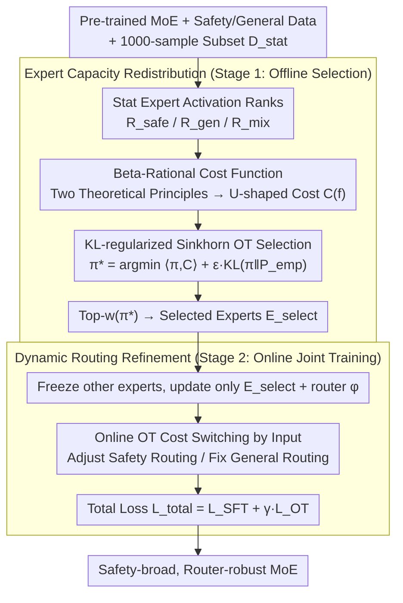

# MESA: Improving MoE Safety Alignment via Decentralized Expertise

**Conference**: ICML 2026  
**arXiv**: [2606.00651](https://arxiv.org/abs/2606.00651)  
**Code**: https://github.com/lorraine021/MESA (Available)  
**Area**: Alignment RLHF / LLM Safety / MoE  
**Keywords**: MoE Safety, Safety Sparsity, Optimal Transport, Routing Alignment, Expert Selection

## TL;DR
MESA reformulates MoE safety alignment as a resource allocation problem of "distributing safety responsibilities across experts." It utilizes KL-regularized Sinkhorn Optimal Transport (OT) to select the lowest-cost subset of experts from the "shoulder region" for SFT. Simultaneously, an OT-constrained routing loss directs safety tokens to these experts, boosting Strata safety scores to 95+% on DeepSeek-V2-Lite / Qwen3-30B-A3B while maintaining reasoning performance (e.g., GSM8K) near baseline levels.

## Background & Motivation

**Background**: Mixture-of-Experts (MoE) has become the mainstream architecture for scaling LLM capacity (DeepSeek-V2, Qwen3-30B-A3B, Gemini series). It utilizes a router to select Top-k experts per token to reduce computation, which naturally leads to functional specialization of experts (language, knowledge, tasks).

**Limitations of Prior Work**: This functional specialization causes a unique vulnerability—**Safety Sparsity**: safety capabilities are highly concentrated in a very few "safety experts." If an attacker constructs adversarial prompts to redirect the router to other experts (e.g., F-SOUR, PAIR, PAP), the safety guardrails are bypassed. Furthermore, directly applying full-parameter alignment methods designed for dense models (like SFT/GRPO/DPO) to MoE leads to a dilemma: (1) Full micro-tuning erases expert specialized knowledge, causing reasoning tasks like GSM8K to drop from 56% to 15% (as seen in Stair-DPO); (2) Routing distributions are forced to change, damaging load balancing and potentially creating new unaligned pathways.

**Key Challenge**: There is a structural trade-off in MoE between **safety** (requiring broad coverage of safety capabilities) and **general capabilities** (requiring stability of expert specialization)—the former requires dispersion, while the latter requires preservation.

**Goal**: (1) Identify the subset of experts most suitable for carrying safety responsibilities without damaging existing specialization; (2) Train a router to stably direct safety traffic toward these newly aligned experts without perturbing the original routing patterns for general traffic.

**Key Insight**: Empirical and theoretical analyses reveal an asymmetric distribution of experts across "safety affinity" (routing inertia) and "general sensitivity" (Hessian fragility). Pure safety "head" experts are saturated; pure general "tail" experts have exploding curvature and should not be moved. The experts truly suitable for safety adaptation are in the **shoulder region**, situated between the saturated head and fragile tail.

**Core Idea**: Use KL-regularized Optimal Transport to **redistribute** "safety responsibility" from original safety experts to these shoulder experts. Online OT is used during training to constrain router behavior, achieving collaborative alignment of "which experts to select" and "how the router uses them."

## Method

### Overall Architecture
MESA reformulates "safety alignment for MoE" from a fine-tuning problem into a resource allocation problem. It first identifies "neither saturated nor fragile" shoulder experts offline to carry safety responsibilities, then trains the router online to direct safety traffic toward them while keeping general traffic on original paths. The input is a pre-trained MoE (DeepSeek-V2-Lite or Qwen3-30B-A3B), a safety dataset $\mathcal{D}_{safe}$ (SafeRLHF, 15k), a general dataset $\mathcal{D}_{gen}$ (UltraFeedback, 15k), and a 1000-sample statistical subset $\mathcal{D}_{stat}$ (500 safety/500 general) to estimate expert activation frequencies.

Stage 1 (Offline Expert Selection) performs forward passes on $\mathcal{D}_{stat}$ to calculate activation ranks $R_{safe}, R_{gen}, R_{mix}$. An adaptation cost function is defined based on $R_{mix}$ rankings, and a global transport plan $\pi^*$ is solved via KL-regularized Sinkhorn OT. The top-$w$ experts from $\pi^*$ form $\mathcal{E}_{select}$. Stage 2 (Online Joint Training) freezes all other experts, updating only the parameters $\theta_{\mathcal{E}_{select}}$ and router parameters $\phi$. Using $\mathcal{L}_{total} = \mathcal{L}_{SFT} + \gamma \mathcal{L}_{OT}$, safety knowledge is injected into selected experts while the router is aligned.

### Key Designs

**1. Beta-Rational Cost Function: Mapping "Which Experts are Worth Moving" to a Closed-form Curve**

Selecting experts based solely on $R_{safe}$ or $R_{gen}$ ranks is problematic—head safety experts are saturated, and tail experts trigger general capability collapse. MESA converts this intuition into computable costs via two principles. Principle 1 (Safety Affinity) states head safety experts are saturated, while activating dormant tail experts requires significant router changes; theoretically, parameter perturbation has a lower bound $\|\Delta \phi\|_2 \geq \Omega(p_i^{-1/2})$ (Theorem 3.1, derived from local curvature of the statistical manifold; lower activation probability $p_i$ implies higher cost). Principle 2 (General Stability) states the loss landscape of general head experts is flat, but general tail experts reside in sharp minima where the Hessian spectral norm $\Lambda_i \sim \bar{p}_i^{-\gamma}$ ($\gamma > 1$) explodes as frequency decreases. Small updates lead to catastrophic general performance drops—Theorem 3.2 bounds the risk $\mathbb{E}_x[\Delta \mathcal{L}_g] \leq \frac{1}{2}\|\Delta \theta_i\|_2^2 \cdot \bar{p}_i \Lambda_i$.

These principles block both ends, concluding that optimal experts reside in the "shoulder" region of $R_{mix}$, forming an asymmetric U-shaped preference curve. Using a maximum entropy Beta distribution with $\alpha=2, \beta=3$, the capability potential is defined as $\Phi(f) \propto (f+\alpha_{shift})(100-f)^2$. The cost is the reciprocal $C(f) = 1/[(f+\alpha_{shift})(100-f)^2]$, where $\alpha_{shift}$ softens the head's $C(0) \to \infty$ into a manageable constraint. This closed-form curve encodes theoretical principles directly into the OT cost matrix.

**2. KL-regularized Sinkhorn OT Selection: Finding the Most Efficient Expert Subset without Breaking Routing Topology**

Having the cost matrix $\mathbf{C}$ is insufficient for a greedy selection, as greedily minimizing local risk ignores global routing topology and may cause mode collapse. MESA instead solves a KL-regularized Optimal Transport:

$$\pi^* = \arg\min_{\pi \in \mathcal{U}(\mathbf{r},\mathbf{c})} \big(\langle \pi, \mathbf{C} \rangle + \epsilon\, D_{KL}(\pi \,\|\, \mathbf{P}_{emp})\big)$$

where $\mathbf{P}_{emp}$ is the empirical activation distribution. The KL term anchors the solution $\pi$ near the original distribution. This strictly convex problem has a closed-form solution solvable via Sinkhorn-Knopp iterations with the Gibbs kernel $\mathbf{K} = \mathbf{P}_{emp} \odot \exp(-\mathbf{C}/\epsilon)$. Finally, $\mathcal{E}_{select} = \text{Top}_w(\pi^*)$. This reformulates "selecting experts" as "optimal transport under manifold constraints," identifying the lowest-cost carriers without perturbing routing topology.

**3. Dynamic Routing Refinement: Aligning the Router to "Change where Needed, Preserve where Not"**

Selecting experts is not enough—ablation shows that using OT for selection without moving the router ($E_{OT}$ row) only reaches 76% on WildJB. MESA makes the OT process online: for each input $x$, it solves $\pi^*(x) = \arg\min_{\pi} (\langle \pi, \mathbf{C}(x) \rangle + \epsilon D_{KL}(\pi \,\|\, \mathbf{P}_{ref}(x)))$, using the base model's routing as $\mathbf{P}_{ref}(x)$. The cost matrix $\mathbf{C}(x)$ switches by data stream: for safety streams, $\mathbf{C}(x)$ uses the global cost matrix from Section 3.1, where $\pi^*_{safe}$ shifts mass from high-risk experts to $\mathcal{E}_{select}$, with loss $\mathcal{L}_{OT} = \mathbb{E}_{x \sim \mathcal{D}_{safe}}[D_{KL}(\pi^*_{safe}(x) \,\|\, \mathbf{P}_\phi(x))]$. For general streams, $\mathbf{C}(x)=0$, OT becomes pure entropy regularization, and the optimal solution is $\mathbf{P}_{ref}(x)$, with a conservative loss $\mathbb{E}_{x \sim \mathcal{D}_{gen}}[D_{KL}(\mathbf{P}_{ref}(x) \,\|\, \mathbf{P}_\phi(x))]$.

### Loss & Training
The total objective is $\mathcal{L}_{total} = \mathcal{L}_{SFT}(\mathcal{D}_{safe}; \theta_{\mathcal{E}_{select}}, \phi) + \gamma \cdot \mathcal{L}_{OT}(\phi)$. Safety SFT loss acts only on selected experts to inject knowledge, while the OT routing loss aligns router behavior. During training, all experts except $\mathcal{E}_{select}$ are frozen. Data includes 15k SafeRLHF, 15k UltraFeedback, and a 1000-sample statistical subset $\mathcal{D}_{stat}$.

## Key Experimental Results

### Main Results

Comparison of safety vs. general trade-offs on DeepSeek-V2-Lite:

| Method | Strata (Safety↑) | WildJB (Safety↑) | GSM8K (General↑) | HumanEval (General↑) |
| :--- | :--- | :--- | :--- | :--- |
| Base | 70.50 | 43.40 | 55.95 | 42.07 |
| SFT | 92.00 | 77.70 | **16.15** (Collapse) | 31.10 |
| Stair-DPO (SOTA Content) | 93.00 | 83.60 | **15.54** (Collapse) | 26.22 |
| SafeX (MoE-specific) | 81.00 | 64.00 | 63.46 | 35.98 |
| **MESA (Ours)** | **95.00** | **90.90** | **66.11** | **42.07** |

On Qwen3-30B-A3B, MESA pushes Strata to 99.00 and WildJB to 97.65 while maintaining Math500 (91.00), GSM8K (96.44), and HumanEval (94.51) near baseline levels.

### Ablation Study (DeepSeek-V2-Lite)

| Configuration | WildJB | Strata | GSM8K | Description |
| :--- | :--- | :--- | :--- | :--- |
| Base | 43.40 | 70.50 | 55.95 | Starting Point |
| Router Only | 60.20 | 86.00 | 52.90 | Limited gain without new safety knowledge |
| $E_{ALL}$ (Full Expert SFT) | 83.00 | 93.00 | **8.33** | General capability collapse |
| $E_{OT}$ (OT Selection Only) | 76.15 | 88.50 | 51.48 | Lacks router alignment |
| $E_{OT}$ + Router | 83.05 | 96.00 | 61.00 | Approaches full MESA |
| $E_{C_{max}}$ (Max Cost Selection) | 70.45 | 88.50 | 45.11 | Heuristic inferior to OT |
| **Full MESA** | **90.90** | **95.00** | **66.11** | OT Selection + Routing Refinement |

### Key Findings
- **OT Expert Selection** is the primary contributor: switching from $E_{ALL}$ to $E_{OT}$ restores GSM8K from 8.33 to 51.48, proving that selecting shoulder experts avoids the Hessian fragility trap.
- **Routing Refinement** is crucial for safety: independently moving the router or selecting experts via OT yield lower safety scores; collaborative alignment is required for high safety coverage.
- **Structural Robustness**: DeepSeek-V2-Lite is highly sensitive to full tuning; MESA actually improves its GSM8K to 66.11 (vs base 55.95).
- **Anti-Routing Attack**: Against F-SOUR routing-exploitation attacks on JailbreakBench, MESA achieves ASR=0.00%, significantly outperforming SafeX (15.38%) and GRPO (22.73%).

## Highlights & Insights
- **Safety Alignment as an Optimal Transport Problem**: MESA provides the first principled MoE alignment scheme that treats global routing topology as a hard constraint, unifying expert selection and router training under one OT framework.
- **Shoulder Hypothesis**: A key empirical insight is that the "shoulder" experts—not the head or tail—are most suitable for adaptation. This intuition applies to style alignment, domain adaptation, or knowledge injection in MoE.
- **Theoretical Templates**: Theorems 3.1 and 3.2 explain "why ends cannot be moved" via statistical manifolds and Hessian spectra, providing a unified explanation for catastrophic forgetting in MoE fine-tuning.

## Limitations & Future Work
- **Limitations**: Evaluations are limited to DeepSeek-V2-Lite and Qwen3-30B-A3B; performance on massive models (e.g., DeepSeek-V3) is unverified. OT computation scales quadratically with expert count $N$, potentially becoming a bottleneck for ultra-large MoEs.
- **Future Work**: Sensitivity analysis for $|\mathcal{D}_{stat}|$ and the Beta distribution parameters ($\alpha, \beta$) is needed. The current refinement assumes a clear safety/general data split; dynamic handling of mixed queries at the token level remains to be explored.

## Related Work & Insights
- **vs SafeX**: SafeX uses localized additive merging on existing paths, leaving it vulnerable to routing attacks. MESA uses "topological expansion" to distribute safety across more experts, making it robust against F-SOUR (ASR 0% vs 15.38%).
- **vs Stair-DPO**: Stair-DPO is a SOTA content-level alignment for dense models but fails on MoE (GSM8K drops from 56 to 15). MESA proves architecture-aware alignment is superior for MoE.
- **vs GRPO**: RL-based GRPO provides decent reasoning but low safety (64%) and high vulnerability to attacks (ASR 22.73%). MESA's structural constraints act as a "prior," reducing the adversarial space.

## Rating
- **Novelty**: ⭐⭐⭐⭐⭐ Reformulates alignment as OT; solid theoretical support for the shoulder hypothesis.
- **Experimental Thoroughness**: ⭐⭐⭐⭐ Multi-architecture, multiple benchmarks, and adversarial testing; lacks OT overhead and statistical subset sensitivity analysis.
- **Writing Quality**: ⭐⭐⭐⭐ Clear logic for principles and Beta derivation; implementation details for the Sinkhorn solver are relegated to the appendix.
- **Value**: ⭐⭐⭐⭐⭐ High relevance given the dominance of MoE; the shoulder hypothesis and OT framework are highly transferable to other MoE adaptation tasks.

<!-- RELATED:START -->

## Related Papers

- [\[ICML 2026\] Curriculum Learning for Safety Alignment](curriculum_learning_for_safety_alignment.md)
- [\[ICML 2026\] Implicit Safety Alignment from Crowd Preferences](implicit_safety_alignment_from_crowd_preferences.md)
- [\[ICML 2026\] Towards Context-Invariant Safety Alignment for Large Language Models](towards_context-invariant_safety_alignment_for_large_language_models.md)
- [\[ICML 2026\] Quantifying the Salience of Geo-Cultural Values for Pluralistic Safety Alignment](quantifying_the_salience_of_geo-cultural_values_for_pluralistic_safety_alignment.md)
- [\[ICLR 2026\] Superficial Safety Alignment Hypothesis](../../ICLR2026/llm_alignment/superficial_safety_alignment_hypothesis.md)

<!-- RELATED:END -->
