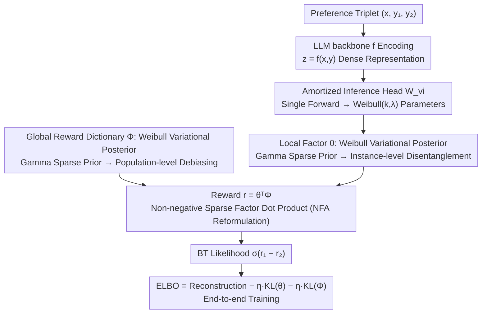

# Mitigating Reward Hacking in RLHF via Bayesian Non-negative Reward Modeling

**Conference**: ICML 2026 Oral  
**arXiv**: [2602.10623](https://arxiv.org/abs/2602.10623)  
**Code**: https://github.com/GuoweiRong/Bayesian-Non-negative-Reward-Model (Available)  
**Area**: Alignment RLHF  
**Keywords**: Reward modeling, Reward hacking, Bayesian non-negative factor analysis, Variational inference, Weibull distribution

## TL;DR
This paper reformulates the Bradley–Terry reward model as a generative process of Bayesian Non-negative Factor Analysis (NFA). By simultaneously modeling locally sparse instance latent variables $\bm{\theta}$ and a globally sparse reward dictionary $\Phi$, it suppresses reward hacking caused by shortcut features (e.g., length, style) via a "disentanglement-then-debiasing" mechanism. The entire framework is integrated into modern LLM backbones through amortized variational inference with Weibull reparameterization, consistently outperforming strong baselines like BT, Ensemble, and InfoRM on Unified-Feedback, RewardBench, HHH, and MT-Bench.

## Background & Motivation

**Background**: RLHF has become the mainstream paradigm for LLM alignment. Its core involves distilling human pairwise preferences into a differentiable Reward Model (RM), which then optimizes policies using RL algorithms like PPO. The standard approach adds a linear head $W_{\text{bt}}$ after an LLM backbone and trains it using Bradley–Terry ranking loss to assign a deterministic scalar score to responses.

**Limitations of Prior Work**: RMs are easily "hacked" in practice—policies learn to optimize proxy rewards rather than true human goals. Common shortcuts include surface cues like response length, phrasing style, and templated expressions. The root cause is reward misgeneralization: RMs extrapolate poorly outside the training distribution, and deep networks naturally favor shortcut features.

**Key Challenge**: Existing mitigation methods have side effects. Ensemble methods (e.g., BT-Ensemble, ENS) require maintaining multiple large models, doubling computational costs. Information bottleneck methods (e.g., InfoRM) only implicitly suppress irrelevant features and cannot explicitly separate "semantic intent" from "style noise." Supervised correction for specific biases (like length) only works in narrowly defined scenarios. The fundamental problem is that the scalar reward $r=\bm{z}^{\top}W_{\text{bt}}$ is a dense, black-box, and deterministic value, providing no structural room for "uncertainty" or "sparse factors."

**Goal**: (1) Introduce explicit uncertainty modeling for RM—capturing both the aleatoric uncertainty of human labeling and the epistemic uncertainty of global reward parameters; (2) Enable reward representations with sparse, interpretable structures to mechanically suppress dependence on spurious correlations; (3) Scale the solution to 8B-level LLMs without relying on multi-model ensembles.

**Key Insight**: The authors turn to Sparse Bayesian Models (SBM), specifically Non-negative Factor Analysis (NFA, such as PFA and LDA). NFA possesses three RM-friendly properties: probabilistic latent variables naturally include uncertainty, non-negative sparse priors act as implicit regularization, and non-negative basis vectors provide parts-based interpretable representations.

**Core Idea**: The reward " $r=\bm{z}^{\top}W_{\text{bt}}$ " is regenerated as " $r=\bm{\theta}^{\top}\Phi$ ", where $\bm{\theta}$ (instance local factors) and $\Phi$ (global reward dictionary) are both subject to Gamma priors to force non-negative sparsity. Local sparsity ensures instance-level disentanglement, while global sparsity ensures population-level debiasing. Together, they make the RM "insensitive to shortcuts" at the source.

## Method

### Overall Architecture
BNRM (Bayesian Non-negative Reward Model) reformulates the standard BT reward model as a hierarchical Bayesian generative process. Given a preference triplet $(\bm{x},\bm{y}_1,\bm{y}_2)$, the LLM backbone $f$ (e.g., Gemma-2B-it / Skywork-Reward-Llama-3.1-8B) first encodes each $(\bm{x},\bm{y})$ into a dense representation $\bm{z}=f(\bm{x},\bm{y})\in\mathbb{R}^{d_{\text{model}}}$. This is used to infer non-negative sparse instance local factors $\bm{\theta}\in\mathbb{R}^{K}_+$. The dot product of $\bm{\theta}$ with a similarly non-negative sparse global reward dictionary $\Phi\in\mathbb{R}^{K}_+$ yields the reward $r=\bm{\theta}^{\top}\Phi$, which is then fed into the BT likelihood $p(\bm{y}_1\succ\bm{y}_2)=\sigma(r_1-r_2)$. Crucially, both $\bm{\theta}$ and $\Phi$ are modeled with Weibull variational posteriors constrained by Gamma priors. The entire framework is trained end-to-end using amortized variational inference and Weibull reparameterization. A single forward pass simultaneously provides the "reward mean + uncertainty + decomposition of K semantic factors" without training multiple models.

### Key Designs

**1. NFA Reformulation of the Reward Generation Process: From Dense Black-box to Non-negative Sparse Factors, Disentangling Before Debiasing**

Dense scalar rewards $r=\bm{z}^{\top}W_{\text{bt}}$ are breeding grounds for reward hacking—they mix semantic intent with irrelevant features like length or templates, with no structural mechanism to decide which dimensions to trust or ignore. BNRM directly replaces the mathematical form of the reward, generating it as $r(\bm{x},\bm{y})=\bm{\theta}^{\top}\Phi$. The local latent variable $\bm{\theta}$ follows a $\mathrm{Gamma}(\alpha_0,\beta_0)$ prior, and the global dictionary $\Phi$ follows a $\mathrm{Gamma}(\gamma_0,\delta_0)$ prior, forcing both to be non-negative and highly sparse. Local sparsity allows each prompt–response to activate only a few semantic factors, achieving instance-level disentanglement. Global sparsity ensures only a few stable reward dimensions remain in the dictionary, suppressing systematic biases (length, style, templates) that appear across samples as "non-invariant features" near zero at the source. Thus, "semantic intent" and "style noise" are structurally separated, and noise factor weights are erased via global sparsity, making the RM insensitive to shortcuts by design rather than through post-hoc patches.

**2. Dual-level Uncertainty + Weibull Variational Posterior: Connecting Classical Sparse Models to LLM Backpropagation**

To introduce uncertainty into rewards, BT must be generalized to integrate over all latent variables: $p(\bm{y}_1\succ\bm{y}_2|\bm{x},\bm{y}_1,\bm{y}_2)=\int p(\bm{y}_1\succ\bm{y}_2|\bm{\theta}_1,\bm{\theta}_2,\Phi)\,q(\bm{\theta}_1)q(\bm{\theta}_2)q(\Phi)\,d\bm{\theta}_1 d\bm{\theta}_2 d\Phi$. This captures both aleatoric (labeling noise) and epistemic (global parameters) uncertainty. All three posteriors use the Weibull distribution $q(\bm{\theta}|\bm{x},\bm{y})=\mathrm{Weibull}(\bm{k},\bm{\lambda})$, where shape $\bm{k}$ ensures differentiable stability via Softplus, and scale $\bm{\lambda}$ empirically encourages sparsity via ReLU. The Weibull posterior is chosen over the Gamma posterior (conjugate to the Gamma prior) because Gamma is difficult to reparameterize and costly to sample. Weibull mimics Gamma tail behavior but allows analytical reparameterization for standard backpropagation. This enables classical sparse models like NFA, which typically require Gibbs/SVI, to be easily embedded into modern LLM training flows. An additional benefit is that this dual-level uncertainty provides a "confidence-aware" reward signal for downstream BoN/PPO, penalizing rewards in uncertain regions and mitigating over-optimization.

**3. Amortized Variational Inference + ELBO End-to-end Training: Using LLM Representations as the Inference Network**

Traditional NFA requires running Gibbs sampling or SVI per document, which is incompatible with large-batch LLM training. BNRM reuses the LLM backbone $f$ as a variational inference network (encoder). A linear head $W_{\text{vi}}\in\mathbb{R}^{d_{\text{model}}\times 2K}$ maps representation $\bm{z}$ to Weibull $(\bm{k},\bm{\lambda})$, amortizing the inference of the $\bm{\theta}$ posterior in a single forward pass and eliminating iterative per-sample inference. The training objective is the ELBO:

$$\mathcal{L}(\mathcal{D})=\mathbb{E}_{q(\bm{\theta})q(\Phi)}\big[\log p(\mathcal{D}|\bm{\theta},\Phi)\big]-\eta\,\mathrm{KL}\big(q(\bm{\theta})\|p(\bm{\theta})\big)-\eta\,\mathrm{KL}\big(q(\Phi)\|p(\Phi)\big),$$

where the first term ensures factors explain observed preferences, and the two KL terms pull the posterior toward the sparse Gamma prior to control model complexity. The hyperparameter $\eta$ acts as a knob for "sparse regularization strength." $W_{\text{llm}}, W_{\text{vi}},$ and $\Phi$ are optimized end-to-end on preference data, allowing the Bayesian framework to run under realistic budgets like LoRA (2 epochs) or 8B full-parameter fine-tuning.

### Loss & Training
The training objective is the ELBO defined above. $\eta$ is the key hyperparameter controlling sparsity (sensitivity analysis in the appendix). Specific settings: Gemma-2B-it / Gemma2-2B-it trained with LoRA for 2 epochs; Skywork-Reward-Llama-3.1-8B full fine-tuned on Skywork-Preference-v0.2 for 1 epoch. In the RL stage, BNRM serves as the proxy reward for PPO + LoRA training (1 epoch) on Llama3.1-8B-Instruct and OpenRLHF-Llama3-8B-SFT. Best-of-N tests use the two Gemma models.

## Key Experimental Results

### Main Results: ID + OOD Reward Modeling Accuracy (Gemma2-2B-it, LoRA, UF Training)

| Training Scale | Method | UF (ID) | HHH | MT | RewardBench Avg |
|----------|------|---------|-----|-----|-----------------|
| 40K | BT | 74.5 | 84.2 | 73.3 | 75.7 |
| 40K | BT-Ensemble | 75.1 | 84.9 | 74.3 | 77.8 |
| 40K | GRM-SFT | 75.8 | 85.5 | 74.2 | 77.3 |
| 40K | InfoRM | 73.9 | 83.9 | 74.6 | 79.2 |
| 40K | **BT-BNRM (Ours)** | **77.2 ↑2.7** | **87.8 ↑3.6** | **76.8 ↑3.5** | **79.7 ↑4.0** |
| 400K | BT | 76.6 | 86.4 | 75.2 | 77.5 |
| 400K | BT-Ensemble | 76.9 | 83.9 | 76.3 | 78.2 |
| 400K | InfoRM | 77.3 | 85.4 | 76.3 | 80.7 |
| 400K | **BT-BNRM (Ours)** | **78.8 ↑2.2** | **88.2 ↑1.8** | **78.2 ↑3.0** | **79.5 ↑2.0** |

With 40K data, BT-BNRM gains 4.0 on RewardBench over BT and 1.9 over the more expensive BT-Ensemble. With 400K data, it maintains a stable lead of ≥2 points, showing that sparse priors are not only lifeline in low-resource settings but also effective at scale.

### Comparison with Commercial / Open-source Large RMs (RewardBench)

| Category | Method | Average | Chat | Chat-Hard | Safety | Reasoning |
|------|------|---------|------|-----------|--------|-----------|
| Generative | GPT-4o | 86.7 | 96.1 | 76.1 | 88.1 | 86.6 |
| Generative | Gemini-1.5 | 86.8 | 94.1 | 77.0 | 85.8 | 90.2 |
| Discriminative | Nemotron-340B-Reward | 92.2 | 95.8 | 87.1 | 92.2 | 93.6 |
| Discriminative | ArmoRM-Llama3-8B | 90.8 | 96.9 | 76.8 | 92.2 | 97.3 |
| Discriminative | Skywork-1-1BT-RM-8B | 91.8 | — | — | — | — |

BNRM remains competitive against 8B/70B discriminative RMs (specifically in Chat-Hard and Safety). Being 2B/8B level without requiring ensembles, it offers significantly higher cost-performance than Nemotron-340B or ArmoRM.

### Key Findings
- **Gains are largest with small data**: The RewardBench gain (+4.0) at 40K UF is notably larger than at 400K (+2.0), confirming that sparse priors act as strong regularization when data is scarce without being "swamped" at larger scales.
- **Surge in HHH and Chat-Hard**: BT-BNRM improves HHH by 13 points (40K setting) and RewardBench Chat-Hard by 5–8 points. these subsets rely most on "semantic discernment" and are easily fooled by style shortcuts, aligning with the hypothesis that sparse factors suppress spurious correlations.
- **Contrast with InfoRM**: InfoRM uses an information bottleneck for implicit suppression, whereas BNRM uses sparse factors for explicit disentanglement. While similar on InD, BNRM is more stable on OOD (HHH, MT), suggesting explicit disentanglement-then-debiasing is more robust under distribution shift.
- **Interpretability By-product**: Each non-negative column of $\Phi$ corresponds to a "reward atom." Clustering responses can reveal human-readable semantic factors (see case study in Figure), a capability dense RMs lack.

## Highlights & Insights
- **Structural Anti-hacking**: While previous works mostly patched "symptoms" (removing length bias, ensembles, KL penalties), this work changes the "representation form"—altering the reward's mathematical structure from $\bm{z}^{\top}W$ to $\bm{\theta}^{\top}\Phi$ to make sparsity and non-negativity built-in invariants.
- **NFA × LLM Reusable Paradigm**: The use of Weibull reparameterization + LLM amortized encoders to fit classical sparse Bayesian models into modern deep networks is a mechanism that could be transferred to DPO/KTO reward modeling, reasoning scorers, or contrastive learning similarity heads.
- **Uncertainty ≠ Ensemble**: The authors demonstrate that a single model can achieve robustness comparable to or better than an ensemble, provided the model has a structure (Weibull distribution + global parameter posterior) capable of "hosting uncertainty."

## Limitations & Future Work
- **Sensitivity to Sparsity**: $\eta$ and Gamma prior hyperparameters $(\alpha_0,\beta_0,\gamma_0,\delta_0)$ directly affect sparsity. While sensitivity analysis is provided, there is no universal recommendation; hyperparameter tuning is required for new datasets.
- **Tension Between Factor Dimension K and Interpretability**: If K is too small, factors are forced back into entanglement; if too large, excessive sparsity might lose semantics. Auto-selection of K (e.g., via non-parametric Bayes) is not fully discussed.
- **Limited PPO Evaluation**: While the core benefit is RM robustness, downstream PPO/BoN was only validated on the 2B/8B scale with a single SFT base; cross-scale comparability for 70B+ remains to be seen.
- **Future Work**: Combining $\Phi$ global sparsity with reward editing/interpretability tools to allow users to "pick factors and adjust weights," moving from passive debiasing to active, controllable alignment.

## Related Work & Insights
- **vs BT-Ensemble (Coste et al., 2024)**: Ensembles use N RMs to approximate epistemic uncertainty, costing N× memory and compute. BNRM captures the same signal via a single model + global Weibull posterior with lower overhead and better results.
- **vs InfoRM (Miao et al., 2024)**: InfoRM implicitly suppresses spurious features via variational information bottleneck; BNRM uses NFA for explicit sparse priors on every factor. BNRM is more robust on OOD/HHH and more interpretable.
- **vs GRM (Yang et al., 2024)**: GRM uses SFT/DPO heads as auxiliary regularization. BNRM changes the probabilistic structure of rewards. The two are orthogonal; the paper provides a GRM-BNRM version showing sparse priors can be stacked on top of other regularizations.

## Rating
- Novelty: ⭐⭐⭐⭐ Innovative use of classical NFA with modern variational techniques for RM; theoretically sound and fresh, though NFA + deep network combinations have appeared in topic modeling.
- Experimental Thoroughness: ⭐⭐⭐⭐ Covers ID/OOD/BoN/PPO across multiple strong baselines (BT, Ensemble, InfoRM, GRM) and validates across two scales (40K/400K) and three bases.
- Writing Quality: ⭐⭐⭐⭐ Equal emphasis on formulas and diagrams; the derivation chain from BT → Bayesian BT → BNRM is fluid and accessible.
- Value: ⭐⭐⭐⭐ Provides a structural, interpretable, and low-cost solution to reward hacking with direct utility for production-grade RLHF and alignment research.

<!-- RELATED:START -->

## Related Papers

- [\[NeurIPS 2025\] Provably Efficient Online RLHF with One-Pass Reward Modeling](../../NeurIPS2025/llm_alignment/provably_efficient_online_rlhf_with_one-pass_reward_modeling.md)
- [\[ACL 2026\] AgentV-RL: Scaling Reward Modeling with Agentic Verifier](../../ACL2026/llm_alignment/agentv-rl_scaling_reward_modeling_with_agentic_verifier.md)
- [\[ACL 2025\] Dynamic Scaling of Unit Tests for Code Reward Modeling](../../ACL2025/llm_alignment/dynamic_scaling_of_unit_tests_for_code_reward_modeling.md)
- [\[ACL 2026\] Aligning Agents via Planning: A Benchmark for Trajectory-Level Reward Modeling](../../ACL2026/llm_alignment/aligning_agents_via_planning_a_benchmark_for_trajectory-level_reward_modeling.md)
- [\[ACL 2025\] Reward Generalization in RLHF: A Topological Perspective](../../ACL2025/llm_alignment/reward_generalization_in_rlhf_a_topological_perspective.md)

<!-- RELATED:END -->
