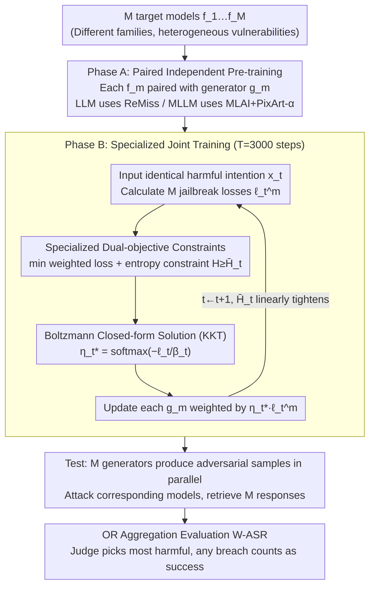

# New Wide-Net-Casting Jailbreak Attacks Risk Large Models

**Conference**: ICML 2026  
**arXiv**: [2605.17128](https://arxiv.org/abs/2605.17128)  
**Code**: The paper states "Code is available here," but the repository link is not explicitly provided in the text.  
**Area**: LLM Security / Adversarial Attacks / Joint Multi-model Jailbreaking  
**Keywords**: wide-net-casting, jailbreak, model-family specific vulnerabilities, exploration-to-exploitation, adversarial sample generator

## TL;DR
This paper defines and systematically analyzes the "wide-net-casting" jailbreak scenario (where an attacker targets a group of large models simultaneously, succeeding if any one model is breached). Based on this, the authors design an "expert-specialized" joint training method for adversarial generators using exploration-to-exploitation scheduling. This approach pushes the attack success rate to 100% across multiple LLMs/MLLMs when no external defenses are applied, revealing that current single-model jailbreak evaluations significantly underestimate real-world risks.

## Background & Motivation

**Background**: Current jailbreak research for LLMs and MLLMs is almost entirely built upon the "single-model threat model." Given a target model $f_m$, attackers use optimization methods such as GCG, AutoDAN, ReMiss, or MLAI to find an adversarial suffix or image that triggers harmful content. Evaluation metrics primarily focus on single-model ASR.

**Limitations of Prior Work**: In the real world, users do not rely on a single model—if a math problem fails on Llama, they might switch to Gemma, Mistral, or Vicuna. If this "try another one" habit is exploited maliciously, an attacker wins as long as **any one** of $M$ models provides technical details. Existing benchmarks fail to characterize this "joint vulnerability," leading to a systematic underestimation of actual deployment risks.

**Key Challenge**: Different model families (Llama / Gemma / Mistral / Vicuna; LLaVA / MiniGPT / InstructBLIP / Qwen-VL) utilize different training data, alignment recipes, and KV cache structures, making their vulnerabilities naturally heterogeneous. A sample that fails on one model might easily breach another. Vulnerabilities are amplified at the group level through an "OR" operation, an effect that single-model ASR cannot capture.

**Goal**: (1) Formalize the wide-net-casting scenario and introduce evaluation metrics reflecting the "success if any model is breached" logic; (2) Quantify the risk amplification when migrating single-model attacks to this scenario and analyze changes across same-family targets and external defenses; (3) Simulate a sophisticated attacker aware of this scenario to design a customized jailbreak method that exposes the upper bound of risk.

**Key Insight**: The authors observe that independently training $M$ generators on all harmful intentions (the "all-cover" strategy) is naturally ill-suited for wide-net-casting. Since it only takes one generator to "breach" its corresponding model for a given intention, forcing every generator to cover all weaknesses dilutes specialization. A superior strategy is **specialization**: each generator should focus strictly on the unique vulnerabilities of its corresponding model.

**Core Idea**: "Specialization" is formalized as a dual-objective constrained optimization: increasing update weights for generators where loss is minimized (exploitation) while maintaining a monotonically decreasing non-zero exploration term (exploration). Using Lagrange multipliers and KKT conditions, a unique Boltzmann update weight is derived: $\eta_t^{m,*} = \exp(-\ell_t^m/\beta_t) / \sum_j \exp(-\ell_t^j/\beta_t)$, dynamically allocating the joint training update budget across $M$ generators.

## Method

### Overall Architecture
The method consists of two phases, delivering a "group jailbreaker." In Phase A, an adversarial generator $g_m$ is paired with each target model $f_m$ ($m=1,\dots,M$) and independently pre-trained using existing single-model methods. At this stage, generators possess only "general" jailbreak knowledge without specialization. In Phase B, the $M$ generators undergo expert-specialized joint training for $T=3000$ steps. At each step, the same harmful intention $x_t$ is processed, and an entropy-constrained optimization problem is solved to determine "which generators should be prioritized for updates," forcing them to evolve into experts focusing on unique vulnerabilities. During testing, for a given intention, $M$ generators produce adversarial samples in parallel. A judge selects the most harmful response from $M$ candidates—success is achieved if at least one model is breached.

The core metric for this scenario is **W-ASR** (Wide-net-casting ASR): $\text{WASR}=\frac{1}{N}\sum_{n=1}^N\bigvee_{m=1}^M s_m^n$, where $s_m^n\in\{0,1\}$ indicates if the $n$-th intention breached the $m$-th model. The logical OR ($\bigvee$) captures the essence of "any-one-wins." A companion W-Toxicity Score simulates an attacker picking the most harmful response for scoring.

### Key Designs

**1. Formalizing the Wide-net-casting Scenario and "OR Aggregation" Baselines: Quantifying the "Try Another One" Threat**
Since existing jailbreak papers almost exclusively report single-model ASR, the common threat of switching models remains hidden. The authors establish "group jailbreaking" as a quantifiable protocol. They apply single-model methods directly as baselines: instance-based methods run $M$ independent optimizations, and model-based methods initialize $M$ generators trained independently. Using Beaver-Dam-7B as a judge, success is aggregated via logical OR. This baseline demonstrates significant risk amplification: for GCG on AdvBench, single-model ASR increases from 46.2% to a WASR of 75.0% (+28.8 pt), and ReMiss increases from 86.5% to 92.3%.

**2. Specialized Joint Training Objective: Exploitation and Sustainable Exploration**
While baselines amplify risk, the "all-cover" strategy (training every generator on all intentions) is sub-optimal. The ideal strategy is specialization. However, observed intermediate losses are noisy estimates. Pure greed (updating only the minimum loss generator) can be misled by noise, while constant uniform updates revert to the all-cover strategy. The authors formalize this as a dual-objective optimization for update weights $\bm{\eta_t}\in\Delta_M$: Objective ❶ minimizes weighted loss $\sum_m \eta_t^m \ell_t^m$ to maximize exploitation; Objective ❷ uses Shannon entropy $H(\bm{\eta_t})$ to ensure $H(\bm{\eta_t})\ge \bar{H}_t$. The threshold $\bar{H}_t=\log M\cdot (T-t)/T$ tightens linearly to shift from exploration to exploitation, a technique adapted from simulated annealing and PSO.

**3. Boltzmann Closed-form Solution and KKT Derivation: Near-Zero Overhead**
The constrained optimization problem yields a unique closed-form solution. By introducing Lagrange multipliers for the entropy and simplex constraints, the first-order KKT condition for $\eta_t^i$ results in:
$$\eta_t^{i,*}=\frac{\exp(-\ell_t^i/\beta_t)}{\sum_m \exp(-\ell_t^m/\beta_t)},$$
which is a Boltzmann distribution with temperature $\beta_t$. $\beta_t$ is uniquely determined by $\bar{H}_t$ and the current $\bm{\ell_t}$. This allows the training to remain computationally efficient, adding only a one-dimensional search for $\beta_t$ per step. The temperature $\beta_t$ naturally facilitates annealing: large $\bar{H}_t$ leads to a flat distribution (exploration), while $\bar{H}_t \to 0$ leads to a one-hot distribution (exploitation).

### Loss & Training
Joint training steps $T=3000$. Phase A utilizes ReMiss for LLMs and "MLAI + PixArt-α" for MLLMs (fine-tuning PixArt-α using MLAI results as pseudo-labels). Each step uses a harmful intention $x_t$ to compute jailbreak losses $\ell_t^m$, solving for $\beta_t$ and updating generators weighted by $\eta_t^{m,*}\cdot\ell_t^m$. $\bar{H}_t$ follows a linear decay $\log M\cdot(T-t)/T$. Training was conducted on 4×A100 GPUs.

## Key Experimental Results

### Main Results: Migration of Single-Model Methods to Wide-net-casting (AdvBench / 4 Diverse LLMs)

| Defense | Attack | Best Single-model ASR | WASR | Gain |
| :--- | :--- | :--- | :--- | :--- |
| Native Alignment Only | GCG | 46.2% (Mistral) | 75.0% | +28.8 pt |
| Native Alignment Only | ReMiss | 86.5% (Mistral) | 92.3% | +5.8 pt |
| + SmoothLLM | GCG | 26.9% | 46.1% | +19.2 pt |
| + SmoothLLM | ReMiss | 38.5% | 61.5% | +23.0 pt |
| + RobustKV | GCG | 24.6% | 37.3% | +12.7 pt |
| + RobustKV | ReMiss | 34.4% | 56.1% | +21.7 pt |

Similar trends were observed for MLLMs on MM-SafetyBench, where WASR significantly exceeded the best single-model ASR, even within the same model family.

### Ours vs. Baselines vs. Naive Strategies (W-ASR)

| Dataset + Defense | Baseline (ReMiss/MLAI+PixArt) | Naive 1 | Naive 2 | Ours |
| :--- | :--- | :--- | :--- | :--- |
| AdvBench LLM, Native | 92.3% | 95.1% | 95.8% | **100%** |
| AdvBench LLM, +SmoothLLM | 61.5% | 64.1% | 64.9% | **76.7%** |
| AdvBench LLM, +RobustKV | 56.1% | 59.2% | 60.3% | **72.8%** |
| MM-SafetyBench MLLM, Native | 93.7% | 94.9% | 95.1% | **100%** |
| MM-SafetyBench MLLM, +VLGuard | 40.2% | 43.4% | 44.1% | **53.5%** |
| MM-SafetyBench MLLM, +ASTRA | 32.9% | 35.2% | 35.6% | **43.6%** |

### Ablation Study: Scheduling Strategy and $\bar{H}_t$ (MLLM / AdvBench / Native)

| Configuration | W-ASR | Description |
| :--- | :--- | :--- |
| Baseline (MLAI+PixArt) | 93.3% | Single-model OR aggregation |
| Naive 1 (Post-hoc loss split) | 95.5% | Split intentions by loss then fine-tune |
| Naive 2 (Greedy min-loss) | 95.8% | Pure exploitation, misled by noise |
| Variant I (Inverse-prop to loss) | 96.2% | Heuristic without theory |
| Variant IV (Random $\bar{H}_t$) | 97.2% | Closed-form but no monotonic tightening |
| Variant V (Fixed $\bar{H}_t$) | 98.0% | Closed-form but no annealing |
| Variant VI (Exponential decay) | **100%** | Monotonic tightening |
| **Ours (Linear decay)** | **100%** | Simplest effective schedule |

### Key Findings
- The "OR aggregation" itself is a significant threat: GCG's WASR jumps +28.8 pt in the wide-net-casting scenario, proving current benchmarks underestimate deployment risks.
- Vulnerability heterogeneity exists even within the same model family; WASR for LLaVA variants increased from 64.1% to 87.6%.
- The closed-form solution combined with monotonic tightening of $\bar{H}_t$ is significantly superior to heuristic scheduling, proving that both theoretical optimality and annealing are essential.
- Even with specialized external defenses like VLGuard or ASTRA, WASR remains high (42-53%), indicating that current defense paradigms focusing on single-model ASR fail to address group threats.

## Highlights & Insights
- **Threat Model Redefinition**: The primary contribution is framing the "try another model" habit as a quantifiable attack vector ($\bigvee_m s_m$), rendering supposedly "safe" models vulnerable.
- **Optimization Transfer**: Moving annealing concepts from simulated annealing/PSO to adversarial generator scheduling is clever. Solving the entropy constraint with KKT yields a softmax-based update rule that is practically cost-free.
- **Dual-use Potential**: This "risk amplification" framework can be reversed for defense. Model-specific vulnerabilities can be distilled to train lightweight filters or used for adversarial training.
- **Heterogeneity as a Dimension**: "Model-specific vulnerabilities" can be extended beyond security to ensemble robustness, model routing, and MoE architectures.

## Limitations & Future Work
- **Ethical Considerations**: The paper contains potentially harmful examples and must be used cautiously. Evaluation relies on judges like Beaver-Dam-7B, which may have inherent biases.
- **Scalability**: Joint training requires synchronous backpropagation for $M$ generators, leading to linear memory growth. Large-scale ensembles (e.g., $M > 10$) may require sparse or asynchronous updates.
- **Threat Model Assumptions**: Assumes attackers can query all $M$ models simultaneously without rate limits or cross-provider detection.
- **Coverage**: Testing was limited to AdvBench and MM-SafetyBench; performance on complex red-teaming tasks or long-context scenarios is unexplored.
- **Future Directions**: Exploring cross-provider collaborative defenses and using $\eta_t^*$ as an explanation tool to reverse-engineer unique vulnerability patterns.

## Related Work & Insights
- **vs GCG (Zou et al. 2023)**: Uses GCG as a baseline; the contribution is in the scheduling of attacks rather than the discrete search operator itself.
- **vs ReMiss (Xie et al. 2024)**: Extends ReMiss from a single-model generator to a group-specialized generator system.
- **vs MLAI + PixArt-α**: Generates MLLM model-based generators by using instance-based results as pseudo-labels, a reusable contribution for MLLM jailbreaking.
- **vs Multiple Choice Learning (Guzman-Rivera et al. 2012)**: Shares the goal of allocating task responsibility but improves upon it with a soft-assignment annealing framework rather than winner-takes-all.

<!-- RELATED:START -->

## Related Papers

- [\[ICCV 2025\] Heuristic-Induced Multimodal Risk Distribution Jailbreak Attack for Multimodal Large Language Models](../../ICCV2025/llm_alignment/heuristic-induced_multimodal_risk_distribution_jailbreak_attack_for_multimodal_l.md)
- [\[ICLR 2026\] JULI: Jailbreak Large Language Models by Self-Introspection](../../ICLR2026/llm_alignment/juli_jailbreak_large_language_models_by_self-introspection.md)
- [\[ICLR 2026\] Toward Universal and Transferable Jailbreak Attacks on Vision-Language Models (UltraBreak)](../../ICLR2026/llm_alignment/toward_universal_and_transferable_jailbreak_attacks_on_vision-language_models.md)
- [\[ACL 2025\] AGD: Adversarial Game Defense Against Jailbreak Attacks in Large Language Models](../../ACL2025/llm_alignment/agd_adversarial_game_defense_against_jailbreak_attacks_in_large_language_models.md)
- [\[ICML 2026\] Towards Context-Invariant Safety Alignment for Large Language Models](towards_context-invariant_safety_alignment_for_large_language_models.md)

<!-- RELATED:END -->
