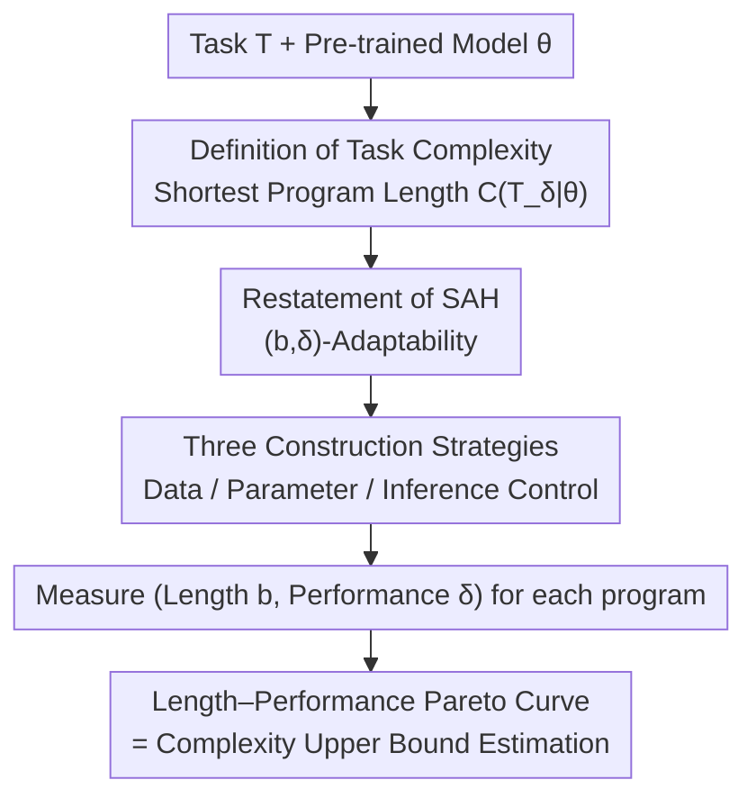

# Operationalising the Superficial Alignment Hypothesis via Task Complexity

**Conference**: ICML 2026  
**arXiv**: [2602.15829](https://arxiv.org/abs/2602.15829)  
**Code**: TBD  
**Area**: Alignment RLHF / LLM Adaptation / Algorithmic Information Theory  
**Keywords**: Superficial Alignment Hypothesis, Task Complexity, Algorithmic Information Theory, Post-training, Data/Parameter/Inference Efficient Adaptation

## TL;DR
The authors redefine the Superficial Alignment Hypothesis (SAH) using "task complexity"—an algorithmic information-theoretic metric representing the shortest program length required to solve a task at target performance. They unify three disparate lines of evidence (data-efficient, parameter-efficient, and inference-controlled) into a single strategy of finding short programs on the same length–performance Pareto curve. Experimental results indicate that adapting pre-trained models to tasks like mathematical reasoning, machine translation, and instruction following often requires only several kilobytes to megabytes of information, and the role of post-training is to compress the "program length required for high performance" by several orders of magnitude.

## Background & Motivation
**Background**: The Superficial Alignment Hypothesis (SAH), proposed by Zhou et al. (2023, LIMA), argues that a large model's "knowledge and ability" are almost entirely acquired during pre-training, and post-training (alignment/fine-tuning) merely teaches the model "which format sub-distribution to use when interacting with users." Evidence supporting it comes from three seemingly unrelated angles: ① fine-tuning strong instruction models with minimal data (e.g., 1000 samples); ② adapting models by updating very few parameters (e.g., LoRA <1%); ③ completing tasks using entirely frozen weights through carefully designed prompts (e.g., URIAL).

**Limitations of Prior Work**: SAH has never had precise definitions for core terms like "knowledge," "ability," or "format sub-distribution," leading to two issues. First, the three types of evidence are orthogonal—one discusses data volume, one parameter counts, and one inference control—making it impossible to determine if they reflect the same phenomenon. Second, critics (Raghavendra et al. 2024; Lambert 2025) argue that if a model truly "already knows" a task, performance should saturate rapidly with minimal fine-tuning; since many tasks require extensive fine-tuning to saturate, they claim SAH is invalid.

**Key Challenge**: Debating parties are using implicit and mutually incompatible metrics of "adaptation cost." A unified framework is needed to quantify data, parameters, and prompts on a single scale.

**Goal**: Provide a precise "operationalized" definition of SAH rooted in Algorithmic Information Theory (AIT), allowing (i) direct comparison of the three types of evidence in a single coordinate system and (ii) quantitative re-examination of critical views.

**Key Insight**: Adapting a task can be viewed as "writing a program that solves the task." While a self-contained program solving GSM8K from scratch would be very long (requiring language understanding, planning, and arithmetic), the length could drop sharply if the program is allowed to call pre-trained model weights $\theta$. This "reduction" quantifies how much information about the task is already contained within the model.

**Core Idea**: Define Task Complexity = the shortest program length required to achieve target performance $\delta$. SAH is restated as: "Many tasks that are inherently high-complexity become low-complexity when conditioned on the pre-trained weights $\theta$." Data, parameter, and inference perspectives are simply three construction strategies to find this short program.

## Method

### Overall Architecture
The paper does not propose a new model but a **measurement and estimation framework**. It uses AIT to rigorously define "task," "task complexity," "model information content," and "adaptability," then translates SAH into a proposition regarding these quantities. Since the true shortest program is uncomputable, the authors use three actual adaptation strategies to construct real executable programs and plot their (length $b$, performance $\delta$) points to form a Pareto curve, serving as an **upper-bound estimate** of task complexity.

The formal chain is: define a task as a quadruple $\mathtt{T}=(\mathcal{X},\mathcal{Y},p,\mathcal{S})$ (input space, output space, input distribution, scoring function). The score of program $\mathsf{P}$ on the task is the expected performance $\mathtt{score}_{\mathtt{T}}(\mathsf{P})=\mathbb{E}_{x\sim p}[\mathcal{S}(x,\mathsf{P}(x))]$. The complexity of the task at performance $\delta$ is the length of the shortest program among all that meet the requirement:

$$\mathrm{C}(\mathtt{T}_\delta)\;\overset{\text{def}}{=}\;\min_{\mathsf{P}}\{\,\text{len}(\mathsf{P}):\mathtt{score}_{\mathtt{T}}(\mathsf{P})\ge\delta\,\}$$

By allowing the program to call weights $\theta$, we get conditional complexity $\mathrm{C}(\mathtt{T}_\delta\mid\theta)$. The difference $\mathrm{I}(\mathtt{T}_\delta;\theta)=\mathrm{C}(\mathtt{T}_\delta)-\mathrm{C}(\mathtt{T}_\delta\mid\theta)$ is the "information model $\theta$ carries about task $\mathtt{T}$ at performance $\delta$." The estimation workflow is as follows:

### Key Designs

**1. Task Complexity: Unifying "Adaptation Cost" as Shortest Program Length**
The root of the SAH debate is the lack of a unified cost metric. Drawing from Kolmogorov complexity, the cost is defined as the bit-length of the shortest program achieving the target performance. However, pure Kolmogorov complexity is unsuitable for ML as it targets single strings and 100% precision. The authors introduce two modifications: using a scoring function $\mathcal{S}$ over input space $\mathcal{X}$ to define "approximate target" (inspired by Algorithmic Rate-Distortion Theory) and explicitly including the performance goal $\delta$. Thus, $\mathrm{C}(\mathtt{T}_\delta\mid\theta)$ captures both "information content" and "performance tier." Under a Turing-complete machine choice, this complexity is well-defined up to an additive constant. This design allows programs from data, parameter, and prompt perspectives to be compared on the same bit axis.

**2. (b,$\delta$)-Adaptability: Turning SAH into a Falsifiable Proposition**
SAH concerns how "easy" it is to adapt a model. The authors define: if there exists a program with length less than $b$ that allows model $\theta$ to solve $\mathtt{T}_\delta$, then $\theta$ is $(b,\delta)$-adaptable for task $\mathtt{T}$, i.e., $\mathrm{C}(\mathtt{T}_\delta\mid\theta)\le b$. SAH is then precisely restated: for many inherently high-complexity tasks, pre-trained models $\theta$ are adaptable with "small $b$ and high $\delta$." The authors admit there is no single threshold for "surface-level," so they study the entire $b$–$\delta$ trade-off curve, turning the slogan "the model already knows it" into a measurable proposition about performance reachable under a length budget.

**3. Three Construction Strategies: Programs on a Unified Curve**
Since conditional complexity is uncomputable, actual strategies are used to construct programs for the **upper bound**. The machine $\mathrm{M}$ is defined as a Python interpreter (libraries like numpy/transformers are "system" and not counted). Length is primarily determined by embedded data or parameter bits:
- **Data Perspective (Subset Training)**: Take a data subset, compress it into the program using arithmetic coding via model $\theta$, and at runtime, decompress, perform gradient updates, and infer. Length is primarily compressed data $\text{len}(\mathcal{D}'_c)$.
- **Parameter Perspective (LoRA / Bayesian-LoRA)**: Train an adapter and embed the weights. Length is the adapter parameter bits; Bayesian-LoRA optimizes rank and quantization per layer to save bits.
- **Inference Control Perspective (ICL / URIAL)**: Encode few-shot samples (or task descriptions) into compressed prompts. At runtime, decompress into context for frozen-weight inference. Length is compressed prompt $\text{len}(\kappa_c)$.

Scanning hyperparameters for each strategy yields $(b,\delta)$ points; non-dominated points form the Pareto front. This redesigns "competing explanations" as complementary techniques optimal in different regions of the length–performance curve.

### Loss & Training
The paper does not use a unified training objective—each strategy uses its established method (standard fine-tuning for Subset Training, low-rank adaptation for LoRA, none for ICL). The key convention is the length metric: only the final program $\mathsf{P}$ (script + data/parameter bits) is counted, excluding the training computation cost and Python standard libraries.

## Key Experimental Results

### Main Results
Models: SmolLM3-3B, Olmo3-7B, Olmo3-32B. Tasks: Math (GSM8K, Acc), English→French Translation (FLORES-200, BLEU), Instruction Following (IFEval, Prompt Strict). Key finding: **Extremely short programs significantly boost performance**:

| Task / Model | Pre-trained Baseline | After Adaptation | Program Length |
|--------------|----------------------|------------------|----------------|
| GSM8K / Olmo3-32B | 2.6%–29.6% (various) | 72.2% | Only 4358 bits |
| GSM8K / Olmo3-32B | — | 78.4% | ≈ Size of an ImageNet image |
| En→Fr / Olmo3-7B | 22.63 BLEU | 34.43 BLEU | Only 3992 bits |
| IFEval / All Models | — | Best performance | Slightly > $10^7$ bits (≈1.25 MB) |

Compared to TBs of pre-training data, adapting models to these tasks requires only KB–MB of information, which the authors view as evidence for SAH.

### Ablation Study
Three perspectives dominate different sections of the curve:

| Program Length Range | Dominant Perspective | Representative Method | Performance |
|----------------------|----------------------|-----------------------|-------------|
| Shortest | Inference Control | URIAL / ICL | Moderate gains for tiny programs |
| Medium | Data | Subset Training | Higher than prompting, requires more bits |
| Longest | Parameter | LoRA / Bayesian-LoRA | Direct parameter encoding, largest length |

**Revisiting critics**: ① Addressing Raghavendra et al. ("few-shot fine-tuning doesn't saturate"), the authors note SAH is defined with $\delta$—Olmo3-32B reaches 78.4% with an ImageNet-sized program, but much larger programs fail to gain significantly more, implies the required information for "saturation" is high, which is consistent with SAH. ② Addressing Liu et al. ("fine-tuning updates can be compressed to ~1 bit/param"), the authors argue this actually **overestimates** the information added; SmolLM3's entire GSM8K set is $3\times10^7$ bits, while 1 bit/param × $3\times10^9$ params is far larger, making such programs suboptimal. ③ Addressing Chen et al. ("tuning only the output linear head is insufficient for GSM8K"), Figure 4 shows this strategy is far from the Pareto curve, suggesting that "linear-only" is simply a poor short-program strategy, not proof against surface-level knowledge.

### Key Findings
- **Pre-training makes strong performance "reachable," but reaching it requires long programs**: Olmo3-7B's baseline on GSM8K is 1.1% (random) vs 67.6% (pre-trained). However, reaching saturation still requires information—SmolLM3 on GSM8K plateaus only at $\approx 5\times10^{10}$ bits (6.2 GB).
- **Post-training "collapses" complexity by orders of magnitude**: For a pre-trained Olmo3-7B, reaching peak performance requires $5\times10^6$ bits (GSM8K) / $2.5\times10^7$ bits (IFEval). After post-training, program length beyond $10^4$ bits has almost no impact on performance. This provides an AIT explanation: post-training doesn't add capacity but vastly reduces the complexity required to access existing capacity.

## Highlights & Insights
- **Turning a conceptual debate into a measurable curve**: Using "shortest program length" as a single ruler allows disparate evidence to be plotted together and critics' claims to be tested quantitatively.
- **Arithmetic coding with the model itself**: Measuring program length as bits compressed via $\theta$ naturally subtracts "information already in the model" from the program length.
- **Post-training = Complexity Collapse**: Reframing "alignment is superficial" as post-training drastically reducing the program length needed to hit the performance ceiling.

## Limitations & Future Work
- **Upper-bound estimates only**: Task complexity is uncomputable; all figures are based on the best programs found. If a perspective performs poorly, it might be a failure to find a good program rather than an inherent limitation.
- **Data leakage caveat**: GSM8K/IFEval appeared in the models' post-training data. While FLORES/e-SNLI were used for decoupling, the specific contributions of "post-training process" vs "seen data" are not fully isolated.
- **Arbitrary "surface-level" threshold**: The framework quantifies "how superficial" but doesn't define a single $(b, \delta)$ threshold for what constitutes "superficial."
- **Task coverage**: Limited to three NLP task types and three models; curve consistency across more complex agentic tasks or larger models remains to be verified.

## Related Work & Insights
- **vs Kolmogorov Complexity**: Unlike the classical definition, this incorporates input distributions and approximate performance goals $\delta$, making it a generalization suitable for ML.
- **vs MDL / Probing (Voita & Titov)**: MDL probes quantify "ease of access" to information; this framework quantifies the "entire adaptation program," allowing comparison between fine-tuning and prompting.
- **vs LIMA / Original SAH**: LIMA provided intuitive evidence (1000 samples); this work upgrades that intuition to a quantifiable, falsifiable proposition.
- **vs Delta Compression (Liu et al. 2024)**: While delta compression aims for "less information added," this work suggests many such methods are still suboptimal on the Pareto front.

## Rating
- Novelty: ⭐⭐⭐⭐⭐ Extremely novel operationalization of SAH via AIT and Pareto curves.
- Experimental Thoroughness: ⭐⭐⭐⭐ Sufficient to support the claims, though limited by upper-bound estimation and task variety.
- Writing Quality: ⭐⭐⭐⭐⭐ Logical progression from definition to verification, clearly addressing caveats.
- Value: ⭐⭐⭐⭐⭐ Provides a unified framework for a long-standing debate and insightful views on the pre-training/post-training division of labor.

<!-- RELATED:START -->

## Related Papers

- [\[ICLR 2026\] Superficial Safety Alignment Hypothesis](../../ICLR2026/llm_alignment/superficial_safety_alignment_hypothesis.md)
- [\[ICML 2026\] Alignment-Aware Decoding](alignment-aware_decoding.md)
- [\[ICML 2026\] Curriculum Learning for Safety Alignment](curriculum_learning_for_safety_alignment.md)
- [\[ICML 2026\] Implicit Safety Alignment from Crowd Preferences](implicit_safety_alignment_from_crowd_preferences.md)
- [\[AAAI 2026\] Intrinsic Barriers and Practical Pathways for Human-AI Alignment: An Agreement-Based Complexity Analysis](../../AAAI2026/llm_alignment/intrinsic_barriers_and_practical_pathways_for_human-ai_alignment_an_agreement-ba.md)

<!-- RELATED:END -->
