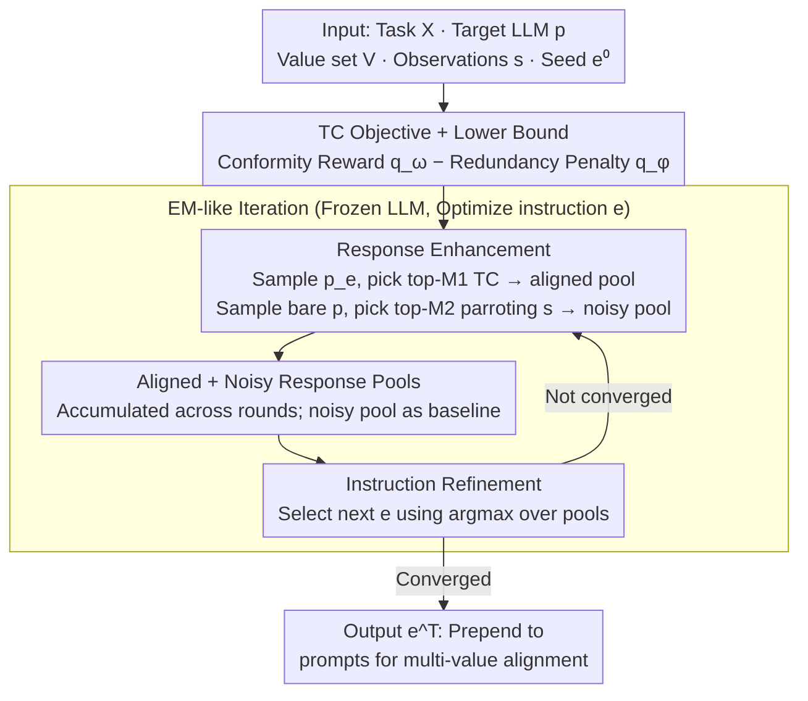

# PICACO: Pluralistic In-Context Value Alignment of LLMs via Total Correlation Optimization

**Conference**: ICML 2026  
**arXiv**: [2507.16679](https://arxiv.org/abs/2507.16679)  
**Code**: https://github.com/Salomeeeee/PICACO  
**Area**: Alignment RLHF / Value Alignment / In-Context Alignment  
**Keywords**: Pluralistic Value Alignment, In-Context Alignment (ICA), Total Correlation (TC), Meta-instruction Optimization, Black-box Optimization

## TL;DR
PICACO formalizes the challenge of "making an LLM adhere to multiple or even conflicting human values within a single prompt" as maximizing the "conditional Total Correlation (TC) between value sets and responses." Without updating model parameters, it automatically searches for a meta-instruction through an EM-like two-step iteration of "response enhancement + instruction refinement." PICACO outperforms strong baselines like OPRO and Modular Pluralism on five value evaluation sets containing up to 8 combined values across GPT-3.5, LLaMA-3.1-8B, and Gemini-1.5-Flash.

## Background & Motivation

**Background**: Compared to the high cost of updating model parameters in RLHF/SFT, **In-Context Alignment (ICA)** directly injects value descriptions and examples into the prompt during inference. This leverages the LLM's existing knowledge for alignment, offering flexibility, low cost, and real-time preference switching, which has emerged as a new branch of alignment research (e.g., URIAL, OPRO, Modular Pluralism, CICL).

**Limitations of Prior Work**: Human values are naturally pluralistic and frequently in conflict (e.g., helpful vs. harmless, stimulation vs. tradition). However, when existing ICA methods package multiple values into a single prompt, LLMs often **attend to only one or two while silently ignoring others**—a phenomenon the authors term the **Instruction Bottleneck** (as shown in Figure 1, where GPT-4o reflects only a subset of Schwartz values in its response).

**Key Challenge**: The LLM's prompt understanding process is "agnostic." The relative strength and suppression relationship between various values within a prompt are determined internally by the LLM, leaving users with no visibility or explicit control. Methods based on manual prompts (URIAL), personas (MP), or multi-community models (Modular Pluralism) either require heavy manual labor, rely on predefined value sets, or can only handle a few values, failing to "explicitly" regulate multi-value relationships.

**Goal**: To automatically search for a meta-instruction capable of carrying $K$ values simultaneously—ensuring strong fit for each $v_k$ without introducing redundant rhetoric unrelated to $v_k$—all without fine-tuning, heavy labeling, or restricted value sets.

**Key Insight**: Borrowing from information theory, **Total Correlation** $\text{TC}(\bm{V},\bm{y})=\sum_k I(\bm{v}_k;\bm{y}) - I(\bm{V};\bm{y})$ exactly matches the needs of "multi-value balancing": it rewards the mutual information of each individual value with the response while penalizing redundant overlap across the value set. By treating the LLM as a black box and the meta-instruction $\bm{e}$ as the optimizable variable, the problem becomes one of **Black-Box Optimization**.

**Core Idea**: PICACO derives an estimable lower bound for $\text{TC}_{\bm{e}}(\bm{V},\bm{y}|\bm{x})$ and employs an EM-like two-step iteration—one step to enhance a "high TC response pool" and another to select the next meta-instruction that maximizes TC over that pool. This **transforms "multi-value balancing" from a prompt engineering heuristic into an optimization problem with an explicit objective function**.

## Method

### Overall Architecture
**Input**: A set of task prompts $\mathcal{X}=\{\bm{x}_i\}_{i=1}^N$, a target LLM $p$, a value composition $\bm{V}=\{\bm{v}_k\}_{k=1}^K$, textual observations $\bm{s}$ (few-shot examples embodying these values), and a seed meta-instruction $\bm{e}^0$. **Output**: An optimized meta-instruction $\bm{e}^T$ after $T$ iterations, which can be prepended to any task prompt to align $p$ with all values in $\bm{V}$ during inference.

The pipeline follows an EM-like loop (Alg. 1): it maintains two response pools for each $\bm{x}_i$—an **aligned pool** $\bm{R}^a_i$ (sampled from prompt-instructed $p_{\bm{e}}$ and filtered for top $M_1$ TC scores) and a **noisy pool** $\bm{R}^n_i$ (sampled from the bare LLM $p$, selecting $M_2$ "negative examples" that merely parrot $\bm{s}$). Iterations alternate between "Response Enhancement" and "Instruction Refinement" until $\bm{e}^t$ converges.

### Key Designs

1.  **TC Objective + Lower Bound**:
    *   **Function**: Formalizes pluralistic alignment as an optimization problem with a clear objective, replacing trial-and-error prompt engineering.
    *   **Mechanism**: Targets the conditional total correlation $\text{TC}_{\bm{e}}(\bm{V},\bm{y}|\bm{x})=\sum_{k=1}^K I_{\bm{e}}(\bm{v}_k;\bm{y}|\bm{x})-I_{\bm{e}}(\bm{V};\bm{y}|\bm{x})$. It applies the Barber-Agakov bound to the first term and extends the CLUB upper bound for the conditional second term to derive: $\text{TC}_{\bm{e}} \geq \mathbb{E}_{\hat p(\bm{x})}\{\beta\sum_k \mathbb{E}_{p_{\bm{e}}}[\log q_{\bm{\omega}}(\bm{v}_k|\bm{x},\bm{y})] - \mathbb{E}_{p_{\bm{e}}}[\log q_{\bm{\phi}}(\bm{s}|\bm{x},\bm{y})] + \mathbb{E}_{p}[\log q_{\bm{\phi}}(\bm{s}|\bm{x},\bm{y})]\}$, where $q_{\bm{\omega}}$ is an LLM-as-judge value evaluator and $q_{\bm{\phi}}$ uses cosine similarity between $\bm{s}, \bm{x}, \bm{y}$ to characterize "parrotting redundancy."
    *   **Design Motivation**: Explicitly splits "value conformity" and "instruction redundancy." **One term rewards pluralistic adherence while the other penalizes shallow imitation/repetition**, theoretically addressing the "superficial alignment" problem noted by Zhou et al. 2023.

2.  **EM-like Iteration: Response Enhancement + Instruction Refinement**:
    *   **Function**: Implements the lower bound into an executable algorithm with frozen LLM parameters.
    *   **Mechanism**: In round $t$: (a) **Response Enhancement**: Fix $\bm{e}^{t-1}$, sample responses $\{\bm{y}_{i,j}\}$ from $p_{\bm{e}^{t-1}}$, calculate $q_{\bm{\omega}}, q_{\bm{\phi}}$, and add the top-$M_1$ samples maximizing $\log q_{\bm{\omega}}(\bm{v}_k|\cdot)-\log q_{\bm{\phi}}(\bm{s}|\cdot)$ to the aligned pool. Simultaneously, sample from bare $p$ to populate the noisy pool with $M_2$ "negative examples" showing high $q_{\bm{\phi}}$. (b) **Instruction Refinement**: Fix pools and select $\bm{e}^t=\arg\max_{\bm{e}}\frac{1}{N}\sum_i\{\sum_{j=1}^{M_1}[\sum_k\log\frac{q_{\bm{\omega}}^{\beta}}{q_{\bm{\phi}}^{1/K}}]p_{\bm{e}}(\bm{y}_{i,j}^t|\bm{x}_i)+\sum_{j=1}^{M_2}p(\hat{\bm{y}}_{i,j}|\bm{x}_i)\log q_{\bm{\phi}}\}$ to maximize the probability of "high TC responses" while suppressing "redundant noisy responses." This is done by scoring a set of candidate instructions $\{\bm{e}_k\}$.
    *   **Design Motivation**: Frozen parameters and discrete prompt space necessitate gradient-free optimization; EM-like alternating optimization is the most natural choice for "executable" and "theoretically justified" optimization. **Accumulating pools across rounds** rather than re-sampling makes expensive LLM calls stable and cost-effective ($N=50, M_1=10, M_2=15, T=10$).

3.  **Aligned + Noisy Response Pools (Redundancy Regularization)**:
    *   **Function**: Prevents optimization from collapsing into "fake alignment" where the model simply repeats keywords from $\bm{s}$.
    *   **Mechanism**: The third term $\mathbb{E}_p[\log q_{\bm{\phi}}(\bm{s}|\bm{x},\bm{y})]$ comes from the bare $p$ (without meta-instruction), acting as a "baseline redundancy probability." The final objective uses $-\log q_{\bm{\phi}}+\log q_{\bm{\phi}}^{\text{baseline}}$ as a "relative redundancy" term—penalizing $\bm{e}$ only if it makes the model **more redundant than the bare model**, avoiding mindless suppression of all similarity.
    *   **Design Motivation**: Analysis shows that Schwartz values are prone to fake alignment—responses that simply repeat value names without substance but receive high conformity scores. The noisy pool acts as a "reference distribution," compelling the model to learn values while maintaining content relevance (as observed in Finding B of section 4.2).

### Loss & Training
No parameter training is involved. The optimizer uses the LLM itself as a prompt sampler (the main experiment uses the same LLM as the target; using GPT-4o instead shows minimal impact per Fig. 4a). $q_{\bm{\omega}}$ is GPT-4o-mini, and $q_{\bm{\phi}}$ is cosine similarity between $\bm{s}, \bm{x}, \bm{y}$. Hyperparameters include $N=50, M_1=10, M_2=15, T=10$, and $\beta$ to control the trade-off between conformity and redundancy. LLM calls scale linearly with $T$ due to cross-iteration pool accumulation.

## Key Experimental Results

### Main Results
Evaluated on 5 value compositions (Helpfulness-4, Harmlessness-4, HH Balance-8, Confucianism-4, Modern Liberalism-4) across 3 target LLMs (GPT-3.5-Turbo, LLaMA-3.1-8B-Instruct, Gemini-1.5-Flash) with GPT-4o as judge. Friedman tests ($p < 10^{-4}$) confirm statistical significance.

| Target Model | Value Composition | PICACO | OPRO | URIAL | Modular | Q+IF |
| :--- | :--- | :--- | :--- | :--- | :--- | :--- |
| GPT-3.5-Turbo | Confucianism-4 | **3.788** | 3.713 | 3.622 | 3.567 | 3.306 |
| GPT-3.5-Turbo | Liberalism-4 | **3.135** | 2.961 | 3.030 | 3.036 | 2.728 |
| GPT-3.5-Turbo | HH Balance-8 | 4.257 | **4.286** | 4.097 | 4.245 | 4.082 |
| GPT-3.5-Turbo | Helpfulness-4 | **4.287** | **4.287** | 4.164 | 4.236 | 4.247 |
| LLaMA-3.1-8B | Confucianism-4 | **3.471** | 3.437 | 3.530 | 3.427 | 3.164 |
| LLaMA-3.1-8B | HH Balance-8 | 4.110 | **4.114** | 4.085 | 3.793 | 3.977 |

**Observation**: PICACO is most stable on Schwartz categories (Confucianism / Liberalism) and competitive with OPRO on HH-8. Its **advantage grows as the number of values increases**.

### Ablation Study

| Configuration | Avg. Decline (3 Compos) | Description |
| :--- | :--- | :--- |
| Full PICACO | — | Complete method |
| w/o redundancy terms $q_{\bm{\phi}}$ | Significant | Removes penalty → fake alignment / parroting $\bm{s}$ occurs |
| w/o EM iteration (1 round) | Significant | Degenerates to single-step optimization; loses accumulated pools |
| w/o Response Enhancement | Significant | No high-TC pool → refinement lacks supervision |
| w/o Instruction Refinement | Significant | Equivalent to sampling under fixed $\bm{e}^0$; cannot find better instructions |
| w/o noisy pool $M_2$ | Significant | Redundancy term lacks baseline; prone to over-suppressing relevance |

### Key Findings
*   **Scalability with Value Count**: As HH values increase from 2 to 8, PICACO maintains the largest delta relative to the bare model and the lowest coefficient of variation in conformity—indicating TC optimization naturally balances attention across multiple values.
*   **Sensitivity of Smaller Models**: On LLaMA-3.1-8B, nearly half of the baselines performed worse than the bare model, while PICACO remained stable—confirming that the Instruction Bottleneck is more severe in weaker models and PICACO mitigates it.
*   **Cost-Performance Trade-off**: PICACO + GPT-3.5-Turbo approaches the alignment level of more expensive models, offering a practical alternative.
*   **Jailbreak Resistance**: Under jailbreak templates (Andriushchenko et al. 2025), PICACO yields significantly fewer toxic responses than OPRO/Modular while maintaining higher helpfulness, attributed to the accumulation of "helpful refusal" patterns in the aligned pool and $q_{\bm{\phi}}$'s penalty on superficial safety scripts.
*   **OOD Generalizability**: PICACO maintains its lead on unseen "Value Portrait" tasks (creative writing, thread replies, etc.), suggesting meta-instructions are reusable across task types.
*   **Judge Robustness**: Replacing the judge with a weaker model (Moonshot-V1-8k) still shows PICACO outperforming OPRO, indicating the optimization is not merely overfitting a specific judge.

## Highlights & Insights
*   **Perfect Alignment with the Objective**: Total Correlation simultaneously formalizes "reflecting every value" and "avoiding collective redundancy." This elegance—where the problem statement matches the optimization objective—is a major strength.
*   **Redundancy as an Enemy of Fake Alignment**: Using $q_{\bm{\phi}}$ and a noisy pool to check for "parrotting" is a rare explicit anti-superficial-alignment mechanism in prompt optimization that could generalize to any demonstration-based method.
*   **Practical EM-like Iteration**: Spreading the cost of LLM sampling across rounds and using historical accumulation for the "top-$M_1$" selection is a critical engineering trick for making black-box LLM tuning feasible.
*   **Theoretical Extensibility**: While the TC framework handles non-conflicting values naturally, the authors generalize it to "explicit conflict" and "dynamic weights," providing clear interfaces for future work.

## Limitations & Future Work
*   **Hard Conflicts**: PICACO primarily addresses the **Instruction Bottleneck** (ensuring values are received) and encourages integration through "compromise." It does not currently provide adjustable priority weights for hard conflicts (e.g., Tradition vs. Hedonism), though this is addressed in theoretical extensions.
*   **Residual Fake Alignment**: Despite $q_{\bm{\phi}}$, "high score but empty content" cases still occur in Schwartz values. Future work could improve $q_{\bm{\phi}}$ beyond simple cosine similarity to capture semantic parrotting with paraphrasing.
*   **Computational Cost**: Multiple sampling and EM iterations still result in thousands of LLM calls during optimization. Investigating "amortized" optimizers to reduce per-query costs is necessary.
*   **Dynamic Value Sets**: The current framework uses a closed set of 4-8 values; its ability to handle "online" additions or removals of values in real-time user scenarios remains to be demonstrated.

## Related Work & Insights
*   **vs OPRO**: Both are iterative ICA methods. OPRO uses scores as a black-box objective; PICACO replaces this with a TC lower bound and explicit redundancy terms, proving significantly more effective in high-value-count or Schwartz-type scenarios.
*   **vs URIAL**: URIAL relies on high-quality manual meta-instructions and demos. PICACO's optimized prompts show better generalizability, as URIAL's performance drops significantly when manual components are removed or tasks are OOD.
*   **vs Modular Pluralism**: Modular Pluralism requires multiple fine-tuned community models; PICACO is training-free and shows better alignment balance as more values are added.
*   **vs Constitutional AI**: CAI injects values into model weights; PICACO is inference-only, allowing "hot-swapping" of value compositions without re-training.
*   **Insights**: The TC optimization objective can be transferred to multi-task prompt optimization, multi-document RAG systems, and Agent systems requiring the simultaneous satisfaction of multiple user intents.

## Rating
*   **Novelty**: ⭐⭐⭐⭐⭐ First application of Total Correlation to ICA; elegantly addresses pluralistic balance and fake alignment.
*   **Experimental Thoroughness**: ⭐⭐⭐⭐⭐ Broad coverage: 5 value sets, 3 LLMs, 9 baselines, significance tests, human eval, OOD, and jailbreak.
*   **Writing Quality**: ⭐⭐⭐⭐ Complete derivations and consistent terminology, though finding labels in section 4.2 are deeply nested.
*   **Value**: ⭐⭐⭐⭐⭐ Training-free, black-box compatible, and hot-swappable value sets make it highly relevant for industrial LLM applications.

<!-- RELATED:START -->

## Related Papers

- [\[ICML 2026\] VALUEFLOW: Toward Pluralistic and Steerable Value-based Alignment in Large Language Models](valueflow_toward_pluralistic_and_steerable_value-based_alignment_in_large_langua.md)
- [\[ICML 2026\] Quantifying the Salience of Geo-Cultural Values for Pluralistic Safety Alignment](quantifying_the_salience_of_geo-cultural_values_for_pluralistic_safety_alignment.md)
- [\[ICML 2026\] Towards Context-Invariant Safety Alignment for Large Language Models](towards_context-invariant_safety_alignment_for_large_language_models.md)
- [\[ICML 2026\] Toward Stable Value Alignment: Introducing Independent Modules for Consistent Value Guidance](toward_stable_value_alignment_introducing_independent_modules_for_consistent_val.md)
- [\[ICLR 2026\] Pretrain Value, Not Reward: Decoupled Value Policy Optimization](../../ICLR2026/llm_alignment/pretrain_value_not_reward_decoupled_value_policy_optimization.md)

<!-- RELATED:END -->
