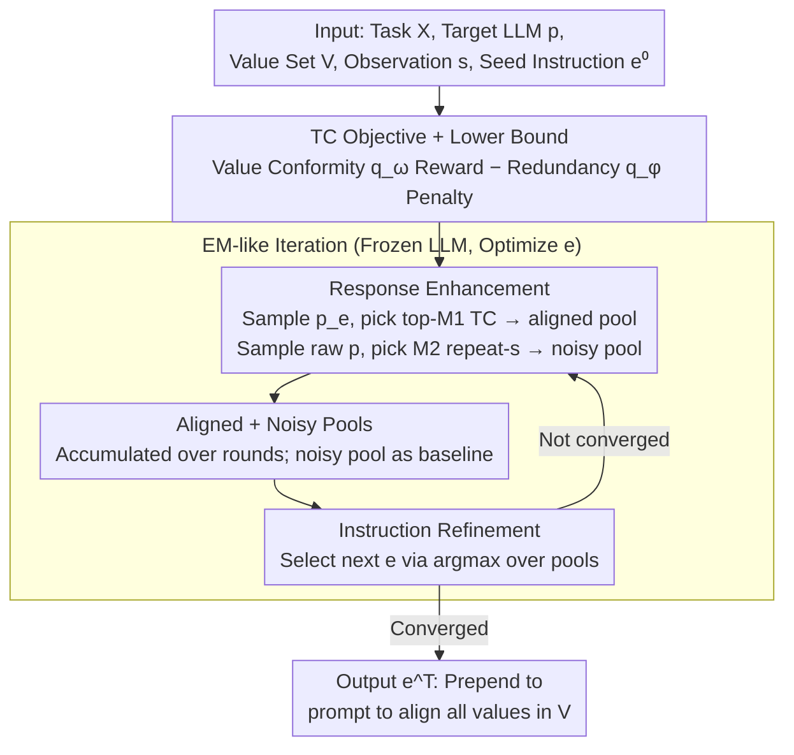

# PICACO: Pluralistic In-Context Value Alignment of LLMs via Total Correlation Optimization

**Conference**: ICML 2026  
**arXiv**: [2507.16679](https://arxiv.org/abs/2507.16679)  
**Code**: https://github.com/Salomeeeee/PICACO  
**Area**: RLHF Alignment / Value Alignment / In-Context Alignment  
**Keywords**: Pluralistic Value Alignment, In-Context Alignment (ICA), Total Correlation (TC), Meta-instruction Optimization, Black-box Optimization

## TL;DR
PICACO formalizes the task of "prompting an LLM to adhere to multiple, potentially conflicting human values simultaneously" as maximizing the "conditional Total Correlation (TC) between the value set and responses." Without altering model parameters, it uses an EM-like two-step iteration of "response enhancement + instruction refinement" to automatically search for a meta-instruction. This enables GPT-3.5, LLaMA-3.1-8B, and Gemini-1.5-Flash to outperform strong baselines like OPRO and Modular Pluralism on five value combinations involving up to 8 values.

## Background & Motivation

**Background**: Compared to the high cost of RLHF or SFT which modify model parameters, **In-Context Alignment (ICA)** directly embeds value descriptions and examples into the prompt during inference. This leverages the LLM's existing knowledge for alignment, offering flexibility, lower costs, and real-time preference switching, thus becoming a new branch of alignment research (e.g., URIAL, OPRO, Modular Pluralism, CICL).

**Limitations of Prior Work**: Human values are inherently pluralistic and often conflict (e.g., helpful vs. harmless, stimulation vs. tradition). However, when existing ICA methods place multiple values in one prompt, the LLM often **adheres to only one or two while silently ignoring others**—a phenomenon defined as the **Instruction Bottleneck** (Fig. 1 shows GPT-4o reflecting only a subset of values when required to follow multiple Schwartz values).

**Key Challenge**: The LLM’s process of understanding prompts is "agnostic"—the relative weight or suppression between values in a prompt is determined implicitly by the LLM, making it neither visible nor controllable. Methods like person-based MP or community-model-based Modular Pluralism either require heavy manual labor, rely on predefined sets, or handle only a few values, failing to "explicitly" regulate multi-value relationships.

**Goal**: To automatically discover a meta-instruction capable of carrying $K$ values simultaneously without fine-tuning, heavy labeling, or restricted value sets, ensuring strong alignment for each $v_k$ without introducing redundant wordings unrelated to $v_k$.

**Key Insight**: Borrowing **Total Correlation** from information theory: $\text{TC}(\bm{V},\bm{y})=\sum_k I(\bm{v}_k;\bm{y}) - I(\bm{V};\bm{y})$. This metric rewards the mutual information between each single value and the response while penalizing redundant overlap of the value set, mapping 1:1 to the requirements of "multi-value balance." By treating the LLM as a black box and the meta-instruction $\bm{e}$ as the optimizable variable, the problem becomes one of **Black-Box Optimization**.

**Core Idea**: Derive an estimable lower bound for $\text{TC}_{\bm{e}}(\bm{V},\bm{y}|\bm{x})$ and apply an EM-like two-step iteration—one step to enhance the "high-TC response pool" and another to select the next meta-instruction maximizing TC on that pool. This transforms "multi-value balance" from a prompt engineering challenge into an optimization problem with an explicit objective function.

## Method

### Overall Architecture
**Input**: A set of task prompts $\mathcal{X}=\{\bm{x}_i\}_{i=1}^N$, target LLM $p$, value set $\bm{V}=\{\bm{v}_k\}_{k=1}^K$, textual observations $\bm{s}$ (few-shot examples reflecting these values), and a seed meta-instruction $\bm{e}^0$. **Output**: The meta-instruction $\bm{e}^T$ after $T$ iterations, which is prepended to prompts during inference to align $p$ with all values in $\bm{V}$.

The pipeline follows an EM-like loop (Alg. 1): it maintains two response pools for each $\bm{x}_i$—an **aligned pool** $\bm{R}^a_i$ (top $M_1$ samples from $p_{\bm{e}}$ based on TC scores) and a **noisy pool** $\bm{R}^n_i$ (top $M_2$ "counter-examples" from raw $p$ that merely repeat $\bm{s}$). "Response enhancement" and "instruction refinement" are executed alternately until $\bm{e}^t$ converges.

### Key Designs

1.  **TC Objective + Estimable Lower Bound**:
    - **Function**: Formalizes pluralistic alignment as an optimization problem with an explicit goal rather than manual trial-and-error.
    - **Mechanism**: Optimizes conditional total correlation $\text{TC}_{\bm{e}}(\bm{V},\bm{y}|\bm{x})=\sum_{k=1}^K I_{\bm{e}}(\bm{v}_k;\bm{y}|\bm{x})-I_{\bm{e}}(\bm{V};\bm{y}|\bm{x})$. It uses the Barber-Agakov lower bound for the first term and a conditional version of the CLUB upper bound for the second. The resulting bound is $\text{TC}_{\bm{e}} \geq \mathbb{E}_{\hat p(\bm{x})}\{\beta\sum_k \mathbb{E}_{p_{\bm{e}}}[\log q_{\bm{\omega}}(\bm{v}_k|\bm{x},\bm{y})] - \mathbb{E}_{p_{\bm{e}}}[\log q_{\bm{\phi}}(\bm{s}|\bm{x},\bm{y})] + \mathbb{E}_{p}[\log q_{\bm{\phi}}(\bm{s}|\bm{x},\bm{y})]\}$, where $q_{\bm{\omega}}$ is an LLM-as-judge value evaluator and $q_{\bm{\phi}}$ uses cosine similarity between $\bm{s},\bm{x},\bm{y}$ to detect "redundant repetition of examples."
    - **Design Motivation**: Explicitly separates "value conformity" from "instruction redundancy," rewarding multi-value adherence while penalizing superficial imitation. This addresses the "superficial alignment" issue noted by Zhou et al. 2023.

2.  **EM-like Iteration: Response Enhancement + Instruction Refinement**:
    - **Function**: Turns the bound into an executable algorithm while keeping LLM parameters frozen.
    - **Mechanism**: In round $t$: (a) **Response Enhancement**: Fix $\bm{e}^{t-1}$, sample $\{\bm{y}_{i,j}\}$ from $p_{\bm{e}^{t-1}}$, and add top-$M_1$ samples with the highest $\log q_{\bm{\omega}}(\bm{v}_k|\cdot)-\log q_{\bm{\phi}}(\bm{s}|\cdot)$ to the aligned pool. Sample from raw $p$ to fill the noisy pool with $M_2$ "repetition" counter-examples. (b) **Instruction Refinement**: Fix the pools and select $\bm{e}^t=\arg\max_{\bm{e}}\frac{1}{N}\sum_i\{\sum_{j=1}^{M_1}[\sum_k\log\frac{q_{\bm{\omega}}^{\beta}}{q_{\bm{\phi}}^{1/K}}]p_{\bm{e}}(\bm{y}_{i,j}^t|\bm{x}_i)+\sum_{j=1}^{M_2}p(\hat{\bm{y}}_{i,j}|\bm{x}_i)\log q_{\bm{\phi}}\}$ by scoring candidate instructions.
    - **Design Motivation**: Since gradients cannot be backpropagated through discrete prompts, EM-like alternating optimization is the most natural choice. **Accumulating pools across rounds** instead of re-sampling stabilizes the process and reduces LLM call costs ($N=50, M_1=10, M_2=15, T=10$).

3.  **Aligned + Noisy Dual Pools (Redundancy Regularization)**:
    - **Function**: Prevents optimization from collapsing into "fake alignment" where the model merely repeats keywords from $\bm{s}$.
    - **Mechanism**: The term $\mathbb{E}_p[\log q_{\bm{\phi}}(\bm{s}|\bm{x},\bm{y})]$ from the raw model acts as a "baseline repetition probability." The objective uses a "relative redundancy" term $(-\log q_{\bm{\phi}}+\log q_{\bm{\phi}}^{\text{baseline}})$, penalizing $\bm{e}$ only if it causes *more* repetition than the raw model.
    - **Design Motivation**: Schwartz values are particularly prone to fake alignment where models state the value name without substance. The noisy pool acts as a reference distribution, forcing the model to learn values while maintaining content relevance.

### Loss & Training
No parameter training is involved. The optimizer uses an LLM as a prompt sampler. $q_{\bm{\omega}}$ is GPT-4o-mini; $q_{\bm{\phi}}$ is cosine similarity between $\bm{s},\bm{x},\bm{y}$. Hyperparameters include $N=50, M_1=10, M_2=15, T=10$, and $\beta$ to control the trade-off between conformity and redundancy. LLM call volume grows linearly with $T$ due to pool accumulation.

## Key Experimental Results

### Main Results
Testing on 5 value sets (Helpfulness-4, Harmlessness-4, HH Balance-8, Confucianism-4, Modern Liberalism-4) across 3 target LLMs (GPT-3.5-Turbo, LLaMA-3.1-8B-Instruct, Gemini-1.5-Flash) using GPT-4o as judge. Friedman test $p<10^{-4}$ indicates statistical significance.

| Target Model | Value Set | PICACO | OPRO | URIAL | Modular | Q+IF |
| :--- | :--- | :--- | :--- | :--- | :--- | :--- |
| GPT-3.5-Turbo | Confucianism-4 | **3.788** | 3.713 | 3.622 | 3.567 | 3.306 |
| GPT-3.5-Turbo | Liberalism-4 | **3.135** | 2.961 | 3.030 | 3.036 | 2.728 |
| GPT-3.5-Turbo | HH Balance-8 | 4.257 | **4.286** | 4.097 | 4.245 | 4.082 |
| GPT-3.5-Turbo | Helpfulness-4 | **4.287** | **4.287** | 4.164 | 4.236 | 4.247 |
| LLaMA-3.1-8B | Confucianism-4 | **3.471** | 3.437 | 3.530 | 3.427 | 3.164 |

Observation: PICACO is most stable on Schwartz-type values and competes with OPRO on HH-8. Its **advantage expands as the number of values increases**.

### Ablation Study
| Configuration | Average Performance Drop | Explanation |
| :--- | :--- | :--- |
| Full PICACO | — | Complete method |
| w/o redundancy terms $q_{\bm{\phi}}$ | Significant drop | Leads to fake alignment / copying $\bm{s}$ |
| w/o EM iteration (1 round only) | Significant drop | Degenerates to single-step optimization; loses pool benefits |
| w/o Response Enhancement | Significant drop | Lacks supervision for instruction refinement |
| w/o noisy pool $M_2$ | Significant drop | Redundancy term lacks baseline; over-penalizes correlation |

### Key Findings
- **Scalability with Value Count**: As HH values increase from 2 to 8, PICACO maintains the largest delta over baselines and the lowest variance across values, suggesting TC optimization naturally balances attention.
- **Sensitivity of Small Models**: On LLaMA-3.1-8B, nearly half of the baselines performed worse than raw queries, while PICACO remained stable, verifying it mitigates the Instruction Bottleneck in weaker models.
- **Cost-Performance tradeoff**: PICACO + GPT-3.5-Turbo approaches the alignment level of more expensive models.
- **Jailbreak Resistance**: Under jailbreak templates, PICACO results in significantly lower toxicity and higher helpfulness compared to OPRO, attributed to the accumulation of "helpful refusal" patterns in the aligned pool.
- **OOD Generalization**: On unseen tasks (Value Portrait), PICACO maintains its lead, suggesting meta-instructions are reusable across task types.

## Highlights & Insights
- **Objective Alignment**: Total Correlation perfectly formalizes the intuition of "reflecting every value + minimizing set redundancy." It shifts ICA from manual trial-and-error to a principled optimization problem.
- **Anti-Fake Alignment**: The $q_{\bm{\phi}}$ + noisy pool mechanism directly penalizes superficial alignment (copying demos), a mechanism that could be applied to any demonstration-based ICL method.
- **EM + Accumulation**: Amortizing the cost of LLM calls across rounds and selecting from "historical bests" is a key engineering trick for practical black-box prompt optimization.
- **Generalizability**: The TC framework can be extended to handle explicit conflicts and dynamic weights, providing a clear interface for future work.

## Limitations & Future Work
- Primarily addresses the **Instruction Bottleneck**; for **inherently conflicting values** (e.g., Tradition vs. Hedonism), it encourages compromise rather than offering adjustable priority weights.
- Reliance on LLM-as-judge ($q_{\bm{\omega}}$): Despite high human correlation, some "high-scoring but empty" fake alignment still exists.
- Cosine similarity $q_{\bm{\phi}}$ is only a proxy; it cannot capture deep semantic repetition obscured by paraphrasing.
- The cost of optimization (linear with $T$) is still higher than zero-shot prompting, requiring research into amortized optimizers to reduce per-query costs.

## Related Work & Insights
- **vs. OPRO**: Both are iterative ICA methods. PICACO replaces OPRO’s "raw score" with a TC lower bound and redundancy penalty, making it superior for large value sets.
- **vs. URIAL**: URIAL relies on high-quality manual meta-instructions. PICACO is automated and shows better transferability to OOD tasks where manual demos might fail.
- **vs. Modular Pluralism**: PICACO avoids the cost of multi-model aggregation and demonstrates better balance as value counts grow.
- **Insights**: The TC optimization approach can be generalized to multi-task prompt optimization, RAG document integration, and multi-intent Agent systems where "balance vs. redundancy" is a bottleneck.

## Rating
- Novelty: ⭐⭐⭐⭐⭐
- Experimental Thoroughness: ⭐⭐⭐⭐⭐
- Writing Quality: ⭐⭐⭐⭐
- Value: ⭐⭐⭐⭐⭐

<!-- RELATED:START -->

## Related Papers

- [\[ICML 2026\] Quantifying the Salience of Geo-Cultural Values for Pluralistic Safety Alignment](quantifying_the_salience_of_geo-cultural_values_for_pluralistic_safety_alignment.md)
- [\[ICML 2026\] Toward Stable Value Alignment: Introducing Independent Modules for Consistent Value Guidance](toward_stable_value_alignment_introducing_independent_modules_for_consistent_val.md)
- [\[ICML 2026\] Towards Context-Invariant Safety Alignment for Large Language Models](towards_context-invariant_safety_alignment_for_large_language_models.md)
- [\[ACL 2025\] Internal Value Alignment in Large Language Models through Controlled Value Vector Activation](../../ACL2025/llm_alignment/internal_value_alignment_in_large_language_models_through_controlled_value_vecto.md)
- [\[ACL 2026\] How Value Induction Reshapes LLM Behaviour](../../ACL2026/llm_alignment/how_value_induction_reshapes_llm_behaviour.md)

<!-- RELATED:END -->
