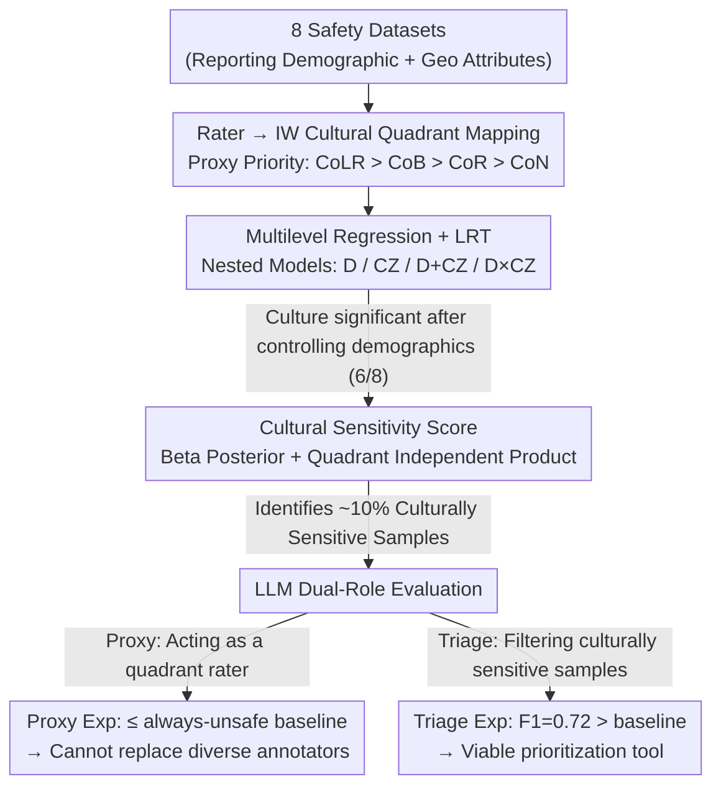

# Quantifying the Salience of Geo-Cultural Values for Pluralistic Safety Alignment

**Conference**: ICML 2026  
**arXiv**: [2606.00369](https://arxiv.org/abs/2606.00369)  
**Code**: https://github.com/asaakyan/culture-safety  
**Area**: Alignment / AI Safety / Pluralistic Alignment  
**Keywords**: Pluralistic Alignment, Cultural Values, Safety Labeling, Annotator Disagreement, Multilevel Modeling

## TL;DR
The authors re-stratify annotators into "cultural zones/quadrants" based on the Inglehart-Welzel cultural map. Using multilevel modeling across 8 safety datasets, they demonstrate that cultural zones significantlly explain variance in safety ratings even after controlling for demographics (age/sex/ethnicity) ($p<0.05$ in 6/8 datasets). They propose a Bayesian "cultural sensitivity score" quantifying that approximately 10% of samples would be mislabeled as safe if a specific cultural quadrant were ignored. Further experiments show that while LLMs are unreliable as rater proxies, they are viable as triage tools for "culturally sensitive samples."

## Background & Motivation

**Background**: Current AI safety alignment (RLHF, Constitutional AI, LLM-as-a-judge) relies heavily on human annotator safety ratings. However, the rater pools in mainstream datasets (Anthropic HH, Bai et al. 2022, Glaese et al. 2022, etc.) are highly concentrated geographically (mostly US/UK crowdsourced workers). A few geo-diverse datasets (PRISM, DICES, CREHate) have begun introducing "country" as an attribute, but most analysis remains at the descriptive visualization level.

**Limitations of Prior Work**: (i) Most safety datasets do not report geographical/cultural variables, making retrospective analysis impossible; (ii) those that do report them often analyze demographic variables (age/sex/ethnicity) and "country" separately without joint control, leading to potential misattribution of cultural effects to demographics or vice versa; (iii) the industry is adopting LLM-as-a-Judge at scale to replace human annotation, yet whether LLMs can truly simulate the judgments of diverse cultural groups has not been validated on a cultural dimension.

**Key Challenge**: Pluralistic alignment requires covering cross-cultural differences. The core question is whether existing "demographically stratified" annotation protocols are sufficient, or if culture must be stratified as a factor independent of demographics. No methodological framework has rigorously answered this question previously.

**Goal**: Quantitatively answer three sub-questions: (1) Why: Do geo-cultural factors remain significant after controlling for demographics? (2) Where: Specifically, which data samples would be mislabeled due to a lack of cultural coverage? (3) How: Can LLMs mitigate the high cost of global annotation?

**Key Insight**: The authors borrow the two main axes proposed by Inglehart and Welzel based on the World Values Survey (WVS)—Traditional vs. Secular and Survival vs. Self-Expression—which explain over 70% of cross-national variance in the WVS and divide countries into several "cultural zones." This provides a theory-driven, low-dimensional cultural proxy, avoiding the overfitting and sparsity issues of using ~200 countries as one-hot features.

**Core Idea**: Treat "cultural zones/quadrants" as fixed effects in a multilevel model, jointly fitted with demographic fixed effects and rater/item random effects. Use the Likelihood Ratio Test (LRT) to rigorously compare the goodness-of-fit between models with and without cultural factors. Construct a Bayesian posterior at the quadrant level to quantify the proportion of unsafe samples missed when ignoring a specific quadrant.

## Method

### Overall Architecture
This paper seeks to answer whether demographic stratification is sufficient for safety labeling or if culture must be listed independently. The authors approach this in three stages: first, they conduct a meta-analysis to select 8 safety datasets that report both demographic and geographic attributes (DIVE, CulturalFrames, PRISM, DICES-990, NLPositionality, D3, CREHate, Severity). Next, they map each rater to an Inglehart-Welzel cultural quadrant and perform multilevel regression to test if "culture" retains explanatory power after controlling for demographics. Finally, they use a Bayesian posterior to quantify missed unsafe samples and test whether LLMs can assist in this expensive global annotation task. The "rater → cultural quadrant" mapping serves as the foundational scaffolding for all subsequent analyses.

### Key Designs

**1. Multilevel Regression + LRT: Decoupling Cultural and Demographic Contributions**

Cultural effects are easily misattributed—a difference that seems like "Eastern European raters are stricter" might simply be because that specific group happens to be older. To distinguish these, both factors must be jointly controlled in the same model. Using the Likert score $H_{ij}$ as the response, the base model includes rater/item random effects: $H_{ij}=\beta_0+u_i+v_j+\epsilon_{ij}$ ($u_i\sim\mathcal{N}(0,\sigma_{\text{rater}}^2)$, $v_j\sim\mathcal{N}(0,\sigma_{\text{item}}^2)$). Fixed effects are layered incrementally: demographic vector $\mathbf{E}_i,\mathbf{A}_i,\mathbf{G}_i$ (ethnicity/age/gender one-hot), cultural zone one-hot vector $\mathbf{C}_i$, and interaction terms $\mathbf{C}_i\times\mathbf{E}_i$, forming four nested models: D, CZ, D+CZ, and D×CZ. Testing is performed via Likelihood Ratio Tests on nested pairs (with Benjamini-Hochberg correction), and gains are quantified using $\Delta\text{AIC}$ and the percentage of rater variance reduction $\%\Delta\sigma_{\text{rater}}^2$ (pseudo-$R^2$). Multilevel models are preferred over traditional IRR because they naturally handle unbalanced data and allow fixed effects to account for their respective variance components without absorption.

**2. Cultural Sensitivity Score: Quantifying the Cost of Ignoring Quadrants via Bayesian Posterior**

After proving cultural significance, the next step is localization—identifying which specific samples are mislabeled without cultural coverage. For each sample $i$ and quadrant $q$, a score $S_{iq}\in[0,1]$ is defined as the probability that "only quadrant $q$ labels it unsafe, while all other quadrants label it safe." If $S_{iq}>0.5$, it is labeled as culturally sensitive. Calculation involves taking the quadrant's total votes $n_{iq}$ and unsafe votes $k_{iq}$, applying a uniform Beta(1,1) prior to get the posterior $\text{Beta}(1+k_{iq}, 1+n_{iq}-k_{iq})$, and calculating the probability that the majority in that quadrant considers it unsafe, $H_{iq}=P(\theta_{iq}>0.5)$. Under the quadrant independence assumption:

$$S_{iq}=H_{iq}\cdot\prod_{q'\neq q,\,q'\text{ valid}}(1-H_{iq'}).$$

A validity filter is added to prevent demographic confounding: each quadrant must have at least 3 votes and cannot be composed of a single gender/ethnicity/age group. The Bayesian posterior provides smoothing and uncertainty quantification compared to point estimates. The product form explicitly models the "minority unsafe + majority safe" blind spot scenario.

**3. LLM Dual-Role Evaluation: Triage over Proxy**

The authors test two potential roles for LLMs in global annotation. The proxy experiment asks if an LLM can simulate a specific quadrant's ratings using a 4-label classification task. DeBERTa-Large and Gemma-3-4B are fine-tuned with masked binary cross-entropy, while Gemini-3 Flash and GPT-5 Nano are prompted. The baseline is "always predict unsafe." The triage experiment asks if LLMs can identify culturally sensitive samples first. Using samples from D3, binary classifiers are trained for "safe vs. unsafe" and "safe vs. sensitive." This design distinguishes between the failure of LLMs to replace human raters and their potential utility for prioritization.

### Loss & Training
- Multilevel regressions are fitted via maximum likelihood estimation (lme4/lmer style).
- LLM Proxy: 10 random seeds × 5 epochs, checkpoint selected by validation F1.
- Triage: 970 samples split 65/15/20 with no item overlap.

## Key Experimental Results

### Main Results: Cultural Significance After Controlling Demographics (Table 2 & 3 Summary)

| Dataset | D vs Base $p$ | CZ vs Base $p$ | D+CZ vs D $p$ | $\Delta$AIC (D+CZ vs D) |
| :--- | :--- | :--- | :--- | :--- |
| DIVE | $<0.001$ | $0.003$ | $0.581$ | $+8.35$ (No gain) |
| CulturalFrames | $0.134$ | $<0.001$ | $<0.001$ | $-41.19$ |
| PRISM | $<0.001$ | $0.003$ | $0.012$ | $-3.97$ |
| DICES-990 | $<0.001$ | $0.004$ | $0.005$ | $-5.86$ |
| D3 | $<0.001$ | $<0.001$ | $<0.001$ | $-179.88$ |
| CREHate | $<0.001$ | $0.203$ | $0.008$ | $-5.12$ |
| Severity | $0.001$ | $<0.001$ | $<0.001$ | $-40.95$ |
| NLPositionality | $0.069$ | $0.344$ | $0.271$ | $+3.62$ |

Conclusion: In 6/8 datasets, adding cultural zones significantly improves model fit after controlling for demographics (average $\Delta$AIC of $-46$, additional 4.64% rater variance explained).

### Proportion of Culturally Sensitive Samples (Table 5 Summary)

| Dataset | Sensitive Samples | Proportion ($S_{iq}>0.5$) | Valid Samples |
| :--- | :--- | :--- | :--- |
| DIVE | 123 | 13.9% | 887 |
| DICES-990 | 130 | 13.1% | 990 |
| D3 | 485 | 10.9% | 4453 |
| CREHate | 174 | 11.1% | 1562 |
| Severity | 2 | 3.0% | 66 |

### Ablation Study / LLM Automation

| Configuration | Key Metric | Description |
| :--- | :--- | :--- |
| Always-Unsafe baseline | F1 $\approx 2p/(p+1)$ | Lower bound for proxy task |
| DeBERTa-Large (Proxy) | $\le$ baseline in Q II/IV | Unreliable cultural judgment simulation |
| Gemma-3-4B (Proxy) | Comparable to DeBERTa | No stable gain from larger models |
| Gemini-3/GPT-5 (Prompted) | Below baseline | Reasoning LMs fail to recover |
| Gemma-3-4B (Triage) | F1 = 0.72, $p=0.044$ | Significantly better than baseline |
| DeBERTa-Large (Triage) | F1 = 0.71, $p=0.071$ | Consistent trend |

### Key Findings
- Cultural zones contribute significant predictive power in 6/8 datasets even after controlling for age/gender/ethnicity, invalidating the assumption that demographic stratification is sufficient.
- D3 is the only dataset where "Cultural Zone × Demographics" interactions are significant, suggesting that capturing fine-grained differences (e.g., Old + Latin American vs. Old + Confucian) requires demographic balancing *within* cultural zones.
- Approximately 10% of samples in safety datasets are culturally sensitive, meaning current RLHF data may systematically mislabel content that is dangerous to specific cultural groups as "safe."
- LLMs cannot replace diverse human raters as proxies but can serve as triage tools for cultural sensitivity ($0.72$ F1). Training for "safe-vs-sensitive" transfers to "safe-vs-unsafe," but not vice versa, suggesting sensitive samples contain richer safety representations.

## Highlights & Insights
- Integrating the Inglehart-Welzel cultural map into safety alignment provides a theory-driven, cross-dataset proxy that avoids the sparsity of country codes.
- The Bayesian cultural sensitivity score quantifies the cost of ignoring specific cultural groups as a probability, which is more robust for small samples than traditional IRR.
- The distinction between LLM as a "proxy" versus a "triage tool" provides a constructive path forward for teams with limited budgets.
- The priority ranking for geographic proxies (CoLR > CoB > CoR > CoN) is a practical takeaway: Country of Long-term Residence (CoLR) or Birth (CoB) are more reliable than Country of Nationality (CoN), which is prone to strategic reporting by crowdsourced workers.

## Limitations & Future Work
- Cultural zones/quadrants are coarse simplifications; the IW map cannot capture fine-grained regional variations (e.g., differences between Confucian and Eastern Orthodox cultures within the same quadrant).
- The meta-analysis is biased toward English-centric datasets and countries covered by the WVS.
- LLM experiments were limited to text; multimodal safety tasks require further validation.
- Future work could involve collecting fully balanced "Cultural Zone × Demographic" datasets and integrating the cultural sensitivity score into active learning pipelines.

## Related Work & Insights
- **vs. DICES (Aroyo et al., 2023), PRISM (Kirk et al., 2024)**: While these introduced geo-diverse pools, their analysis was descriptive. This paper provides rigorous statistical evidence via multilevel LRT.
- **vs. D3 (Davani et al., 2024)**: D3 used multilevel regression but analyzed demographics individually. This study jointly controls for demographics and culture, revealing significant interaction effects.
- **vs. LLM-as-a-Judge (Bai 2022b, Yuan 2025)**: This work provides evidence that even reasoning LMs fail to simulate various cultural judgments, warning against over-reliance on LLM evaluators in Constitutional AI.

## Rating
- Novelty: ⭐⭐⭐⭐
- Experimental Thoroughness: ⭐⭐⭐⭐⭐
- Writing Quality: ⭐⭐⭐⭐
- Value: ⭐⭐⭐⭐⭐

<!-- RELATED:START -->

## Related Papers

- [\[ICML 2026\] VALUEFLOW: Toward Pluralistic and Steerable Value-based Alignment in Large Language Models](valueflow_toward_pluralistic_and_steerable_value-based_alignment_in_large_langua.md)
- [\[ICML 2026\] PICACO: Pluralistic In-Context Value Alignment of LLMs via Total Correlation Optimization](picaco_pluralistic_in-context_value_alignment_of_llms_via_total_correlation_opti.md)
- [\[ACL 2026\] CuMA: Aligning LLMs with Sparse Cultural Values via Demographic-Aware Mixture of Adapters](../../ACL2026/llm_alignment/cuma_aligning_llms_with_sparse_cultural_values_via_demographic-aware_mixture_of_.md)
- [\[ICML 2026\] Korean Culture into LLM Alignment: Toward Cultural Coherence](korean_culture_into_llm_alignment_toward_cultural_coherence.md)
- [\[ICML 2026\] Curriculum Learning for Safety Alignment](curriculum_learning_for_safety_alignment.md)

<!-- RELATED:END -->
