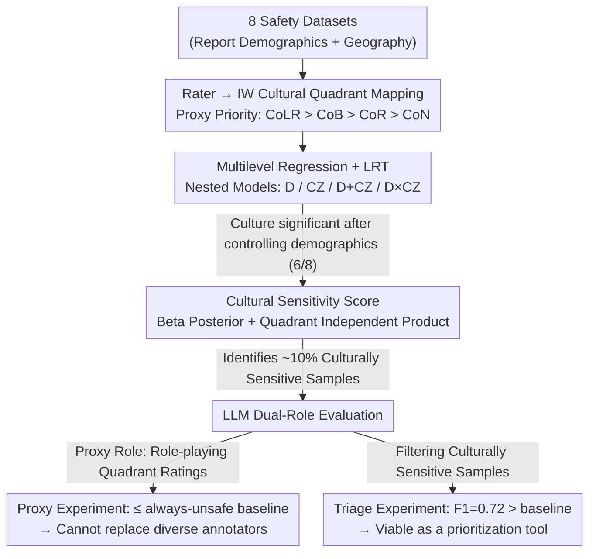

# Quantifying the Salience of Geo-Cultural Values for Pluralistic Safety Alignment

**Conference**: ICML 2026  
**arXiv**: [2606.00369](https://arxiv.org/abs/2606.00369)  
**Code**: https://github.com/asaakyan/culture-safety  
**Area**: Alignment / AI Safety / Pluralistic Alignment  
**Keywords**: Pluralistic Alignment, Cultural Values, Safety Labeling, Annotator Disagreement, Multilevel Modeling

## TL;DR
The authors re-stratify annotators into "cultural zones/quadrants" using the Inglehart-Welzel Cultural Map. Applying multilevel modeling across 8 safety datasets, they demonstrate that cultural zones significant explain safety rating variance even after controlling for demographics (age, gender, ethnicity) ($p < 0.05$ in 6/8 datasets). They further propose a Bayesian "cultural sensitivity score" to quantify that approximately 10% of samples in current datasets would be mislabeled as safe if a specific cultural quadrant were ignored. Experimental results indicate that while LLMs are unreliable as rater proxies, they are viable as triage tools for cultural sensitivity.

## Background & Motivation

**Background**: Current AI safety alignment (RLHF, Constitutional AI, LLM-as-a-judge) relies heavily on human safety ratings. However, the rater pools for mainstream datasets (e.g., Anthropic HH, Bai et al. 2022, Glaese et al. 2022) are geographically concentrated, primarily consisting of US/UK crowdsourced workers. While few geo-diverse datasets (PRISM, DICES, CREHate) have introduced "country" as an attribute, analysis remains largely limited to descriptive visualization.

**Limitations of Prior Work**: (i) Most safety datasets fail to report geographic/cultural variables, precluding retrospective analysis; (ii) existing reports analyze demographics (age/gender/ethnicity) and "country" separately without joint control, risking the misattribution of cultural effects to demographic differences or vice versa; (iii) the industry is shifting toward LLM-as-a-Judge to replace human annotation without validating whether LLMs can truly simulate the judgments of diverse cultural groups.

**Key Challenge**: Pluralistic alignment requires covering cross-cultural differences, but is the existing "demographic stratification" protocol sufficient? Or must culture be treated as an independent factor requiring separate stratification? Previously, no methodological framework existed to rigorously answer this.

**Goal**: Quantitatively address three sub-questions: (1) why: are geo-cultural factors significant after controlling for demographics? (2) where: which specific data samples are mislabeled due to lack of cultural coverage? (3) how: can LLMs mitigate the high cost of global annotation?

**Key Insight**: The authors leverage two primary axes proposed by political scientists Inglehart and Welzel based on the World Values Survey (WVS)—Traditional vs. Secular and Survival vs. Self-Expression—which explain over 70% of cross-national variance in the WVS. These axes categorize countries into "cultural zones," providing a theory-driven, low-dimensional cultural proxy that avoids the overfitting and sparsity issues associated with one-hot encoding over 200 countries.

**Core Idea**: "Cultural zones/quadrants" are treated as fixed effects in a multilevel model, fitted alongside demographic fixed effects and rater/item random effects. Likelihood ratio tests (LRT) are used to compare model fits with and without cultural variables. Additionally, a Bayesian posterior is constructed at the quadrant level to quantify the "proportion of unsafe samples missed when ignoring a specific quadrant."

## Method

### Overall Architecture
The study addresses whether demographic stratification (age/gender/ethnicity) is sufficient or if culture must be a standalone factor. The authors perform a meta-analysis to select 8 safety datasets reporting both demographics and geography (DIVE, CulturalFrames, PRISM, DICES-990, NLPositionality, D3, CREHate, Severity). After mapping each rater to an Inglehart-Welzel (IW) cultural quadrant, they conduct multilevel regression to test cultural explanatory power. Finally, they quantify cultural sensitivity and evaluate LLMs in dual roles. The "rater → cultural quadrant" mapping serves as the foundational infrastructure for all subsequent analyses.

### Key Designs

**1. Multilevel Regression + LRT: Decoupling Cultural and Demographic Contributions**

Cultural effects are prone to misattribution—e.g., a "stricter Eastern European rater" might simply reflect an older demographic. To distinguish these, both factors must be controlled jointly. Using Likert scores $H_{ij}$ as the response, the base model includes rater/item random effects: $H_{ij} = \beta_0 + u_i + v_j + \epsilon_{ij}$ where $u_i \sim \mathcal{N}(0, \sigma_{\text{rater}}^2)$ and $v_j \sim \mathcal{N}(0, \sigma_{\text{item}}^2)$. Fixed effects are added incrementally: demographics $\mathbf{E}_i, \mathbf{A}_i, \mathbf{G}_i$ (ethnicity/age/gender), cultural zone $\mathbf{C}_i$, and interaction terms $\mathbf{C}_i \times \mathbf{E}_i$, forming four nested models (D, CZ, D+CZ, D×CZ). Likelihood ratio tests (LRT) compare these pairs with Benjamini-Hochberg correction. Gains are quantified via $\Delta\text{AIC}$ and the proportion of rater variance reduction $\%\Delta\sigma_{\text{rater}}^2$ (pseudo-$R^2$). Multilevel modeling is preferred over traditional IRR as it handles imbalanced descriptors and joint variance allocation across item, rater, and group levels.

**2. Cultural Sensitivity Score: Quantifying the Cost of "Ignoring a Quadrant"**

To locate specific samples missed due to cultural gaps, a score $S_{iq} \in [0, 1]$ is defined for each sample $i$ and quadrant $q$, representing the probability that "only quadrant $q$ deems it unsafe, while all others deem it safe." A sample is "culturally sensitive" if $S_{iq} > 0.5$. Given total votes $n_{iq}$ and unsafe votes $k_{iq}$, the posterior $\text{Beta}(1 + k_{iq}, 1 + n_{iq} - k_{iq})$ is derived using a Beta(1,1) prior. The probability of a quadrant majority judging it unsafe is $H_{iq} = P(\theta_{iq} > 0.5)$. Under the quadrant independence assumption:

$$S_{iq} = H_{iq} \cdot \prod_{q' \neq q, \, q' \text{ valid}} (1 - H_{iq'}).$$

A validity filter ensures at least 3 votes per quadrant and prevents demographic mono-representation (e.g., single gender/ethnicity). The Bayesian approach smoothens noise from small samples ($n_{iq}=3$) and quantifies uncertainty, while the product form explicitly captures the "minority unsafe + majority safe" blind spot. This metric identifies a ~10% sensitivity rate across 6 datasets.

**3. LLM Dual-Role Evaluation: Triage over Proxy**

The "proxy" experiment tests if LLMs can directly simulate specific quadrant ratings as a 4-label classification task. DeBERTa-Large and Gemma-3-4B are fine-tuned using masked binary cross-entropy, and zero-shot prompts are applied to Gemini-3 Flash and GPT-5 Nano. The "always predict unsafe" baseline serves as the lower bound. The "triage" experiment evaluates if LLMs can identify culturally sensitive samples. Classifiers are trained on safe, unsafe, and sensitive subsets from D3 to compare performance. This distinguishes between the LLM's inability to replace diverse raters and its potential as a prioritization tool.

### Loss & Training
- Multilevel regression fitted via maximum likelihood estimation (lme4/lmer style); cumulative link mixed models were used for cross-checking Likert data.
- LLM Proxy: 10 random seeds × 5 epochs, selecting checkpoints via validation F1; masked cross-entropy applied only to quadrants with labels.
- Triage: 970 samples split 65/15/20 with no item overlap.

## Key Experimental Results

### Main Results: Significance of Culture After Demographic Control (Summary of Tables 2 & 3)

| Dataset | D vs Base $p$ | CZ vs Base $p$ | D+CZ vs D $p$ | $\Delta$AIC (D+CZ vs D) |
| :--- | :--- | :--- | :--- | :--- |
| DIVE | $<0.001$ | $0.003$ | $0.581$ | $+8.35$ (No Gain) |
| CulturalFrames | $0.134$ | $<0.001$ | $<0.001$ | $-41.19$ |
| PRISM | $<0.001$ | $0.003$ | $0.012$ | $-3.97$ |
| DICES-990 | $<0.001$ | $0.004$ | $0.005$ | $-5.86$ |
| D3 | $<0.001$ | $<0.001$ | $<0.001$ | $-179.88$ |
| CREHate | $<0.001$ | $0.203$ | $0.008$ | $-5.12$ |
| Severity | $0.001$ | $<0.001$ | $<0.001$ | $-40.95$ |
| NLPositionality | $0.069$ | $0.344$ | $0.271$ | $+3.62$ |

In 6/8 datasets, adding cultural zones significantly improved the model even after controlling for demographics (Average $\Delta$AIC $-46$, additional rater variance explained: 4.64%). Failures in DIVE and NLPositionality were attributed to cultural imbalance or low sample size.

### Cultural Sensitivity Proportion (Summary of Table 5)

| Dataset | Sensitive Samples | Proportion ($S_{iq} > 0.5$) | Valid Samples |
| :--- | :--- | :--- | :--- |
| DIVE | 123 | 13.9% | 887 |
| DICES-990 | 130 | 13.1% | 990 |
| D3 | 485 | 10.9% | 4453 |
| CREHate | 174 | 11.1% | 1562 |
| Severity | 2 | 3.0% | 66 |

Tightening the threshold to $S_{iq} > 0.7$ reduced the overall proportion to ~3%, showing robustness.

### Ablation Study / LLM Automation Experiments

| Configuration | Key Metric | Description |
| :--- | :--- | :--- |
| Always-Unsafe baseline | F1 $\approx 2p/(p+1)$ | Lower bound for proxy tasks |
| DeBERTa-Large (Proxy) | $\le$ baseline in Q II/Q IV | Unreliable cultural judgment simulation |
| Gemma-3-4B (Proxy) | Comparable to DeBERTa | Scale does not bring stable gains |
| Gemini-3 Flash / GPT-5 Nano | Below baseline | Reasoning models cannot recover performance |
| Gemma-3-4B (Triage, safe vs sensitive) | F1 = 0.72, $p=0.044$ | Significantly better than baseline |
| DeBERTa-Large (Triage) | F1 = 0.71, $p=0.071$ | Consistent trend |
| Safe-vs-unsafe → safe-vs-sensitive | ~ -14% to -16% F1 | Cultural sensitivity classification is harder |

### Key Findings
- Cultural zones contribute significant predictive power in 6/8 datasets even after controlling for demographics, invalidating the assumption that "demographic stratification alone is sufficient."
- D3 is the only dataset where "Cultural Zone × Demographics" interaction is significant, suggesting that identifying fine-grained differences (e.g., "Elderly + Latin" vs "Elderly + Confucian") requires within-zone demographic balancing.
- The finding that ~10% of safety items are culturally sensitive is stable across tasks/modalities, implying mainstream RLHF data systemically mislabels a tenth of culturally dangerous content as safe.
- LLMs cannot replace diverse annotators: fine-tuned and reasoning models often underperform an "always unsafe" baseline. However, fine-tuned LLMs can serve as triage tools ($F1=0.72$) for cultural sensitivity.

## Highlights & Insights
- Adopting the Inglehart-Welzel Cultural Map provides a low-dimensional and theory-driven proxy variable, avoiding the sparsity of country-level one-hot encoding.
- The Bayesian cultural sensitivity score translates the "cost of ignoring a culture" into a computable probability, providing a robust metric for small-sample scenarios.
- The "triage over proxy" conclusion offers a constructive pathway for resource-constrained teams: while LLMs cannot judge for everyone, they can prioritize samples for human review.
- The practical advice on rater proxies (Priority: CoLR > CoB > CoR > CoN) is a valuable engineering insight, as Country of Residence (CoR) and Nationality (CoN) are often corrupted by migration or strategic reporting by crowdsourced workers.

## Limitations & Future Work
- Cultural quadrants are coarse simplifications. The IW map cannot capture nuanced regional differences (e.g., Confucian vs. Eastern Orthodox differences within the same quadrant).
- Meta-analysis was skewed toward English-centric datasets and countries with available WVS data.
- LLM experiments were limited to text; multimodal safety tasks require separate validation. Fine-tuned triage models still require some initial ground-truth labels.
- Future work could collect datasets fully balanced across "Cultural Zone × Demographics" and integrate cultural sensitivity scores into active learning pipelines.

## Related Work & Insights
- **vs DICES & PRISM**: These introduced global rater pools but lacked joint control of demographic/cultural factors; Ours provides rigorous statistical evidence through multilevel modeling.
- **vs D3**: D3 used multilevel regression but analyzed demographics in isolation; Ours jointly controls for demographics, culture, and interactions.
- **vs LLM-as-a-Judge**: Ours provides strong counter-evidence against using LLMs to simulate diverse human judgment, serving as a warning to practices like Constitutional AI.
- **vs Sorensen et al. (2024)**: While their work is a conceptual taxonomy of pluralistic alignment, Ours offers a methodological implementation and quantitative evidence for geo-cultural pluralism.

## Rating
- Novelty: ⭐⭐⭐⭐ Smart cross-disciplinary application of IW maps and Bayesian sensitivity scoring; however, tools themselves are mature migrations.
- Experimental Thoroughness: ⭐⭐⭐⭐⭐ Extensive coverage across 8 datasets and multiple LLM roles.
- Writing Quality: ⭐⭐⭐⭐ Clear structure and complete statistical detail; some terms may require prior familiarity with multilevel modeling.
- Value: ⭐⭐⭐⭐⭐ Rebuts industry assumptions regarding stratification and LLM raters; provides immediate engineering guidance for RLHF and safety dataset design.

<!-- RELATED:START -->

## Related Papers

- [\[ICML 2026\] PICACO: Pluralistic In-Context Value Alignment of LLMs via Total Correlation Optimization](picaco_pluralistic_in-context_value_alignment_of_llms_via_total_correlation_opti.md)
- [\[ICML 2026\] Curriculum Learning for Safety Alignment](curriculum_learning_for_safety_alignment.md)
- [\[ICML 2026\] Implicit Safety Alignment from Crowd Preferences](implicit_safety_alignment_from_crowd_preferences.md)
- [\[ICML 2026\] MESA: Improving MoE Safety Alignment via Decentralized Expertise](mesa_improving_moe_safety_alignment_via_decentralized_expertise.md)
- [\[ICML 2026\] Towards Context-Invariant Safety Alignment for Large Language Models](towards_context-invariant_safety_alignment_for_large_language_models.md)

<!-- RELATED:END -->
