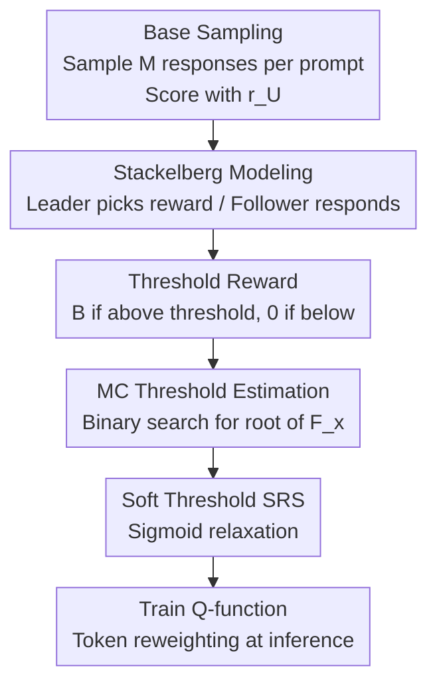

# Reward Shaping for (Inference-Time) Alignment: A Stackelberg Game Perspective

**Conference**: ICML2026  
**arXiv**: [2602.02572](https://arxiv.org/abs/2602.02572)  
**Code**: https://github.com/Haichuan23/Stackelberg-Reward-Shaping  
**Area**: Alignment RLHF / Inference-time Alignment  
**Keywords**: Inference-time Alignment, Reward Shaping, Stackelberg Game, Threshold Reward, KL Regularization

## TL;DR
The problem of "which reward model should be used to align LLMs" is modeled as a Stackelberg game. It is proved that the optimal reward is a **per-prompt threshold reward** (giving full score $B$ above the threshold and 0 below). This threshold is efficiently estimated using Monte Carlo sampling from the base model. Finally, the reward is softened via a sigmoid function and seamlessly integrated into inference-time alignment methods like CD/ARGS, increasing the average reward and GPT-4 Win-Tie rate against baselines to over 66% with almost zero additional overhead.

## Background & Motivation

**Background**: Mainstream alignment pipelines (whether training-time alignment like RLHF/DPO or inference-time alignment like Controlled Decoding and ARGS) are reward-based. They first learn a reward model $r_U$ from user preference data and then optimize the LLM to "maximize $r_U$ while not deviating too far from the base policy." This "non-deviation" is enforced by a KL regularization term $\beta\cdot D_{\mathrm{KL}}(\rho\,\|\,\rho_{\mathrm{base}})$, with the closed-form solution being $\rho_r(\bm y|\bm x)\propto\rho_{\mathrm{base}}(\bm y|\bm x)\exp(\tfrac{1}{\beta}r_U(\bm x,\bm y))$.

**Limitations of Prior Work**: It is commonly assumed that "directly maximizing the learned $r_U$ equals maximizing user utility," but this assumption is **incorrect** under KL constraints. When the base model has strong priors that conflict with user preferences, the KL regularization pulls the aligned policy back toward the base, failing to elicit the behavior the user truly desires. The paper provides a clear example: for a politically leftist base model (prior 0.9 for leftist, 0.1 for neutral), even if aligned with a true utility $r_U$ that prefers neutral responses, the probability of neutral responses is only about 0.23 under moderate intensity ($\tfrac{1}{\beta}=1$), yielding a user utility of 1.23—failing the "neutral" goal.

**Key Challenge**: To offset base bias, one must **amplify** the reward of preferred responses (e.g., raising the reward for neutral responses). However, over-amplification can cause KL divergence to explode and trigger reward hacking (where the model yields high rewards but nonsensical outputs). This represents a fundamental trade-off between "bias correction" and "anti-cheating." Furthermore, this conflict **cannot** be resolved by simply setting a fixed global upper bound or shifting rewards; it requires fine-grained sculpting of the reward landscape.

**Goal**: To answer the fundamental question of "how the reward model should be shaped" under KL-regularized alignment goals and provide a ready-to-use, zero-overhead algorithm.

**Key Insight**: The reward model provider (leader) **has no obligation to provide the true $r_U$ as-is** to the alignment process. She can choose any reward model $r$, as long as the LLM (follower), through its optimal response, maximizes the true utility for the user. This is naturally a Stackelberg game of "commit then follow."

**Core Idea**: Treat reward design as a leader's decision in a Stackelberg game. The optimal reward is solved to be a "per-prompt threshold reward," and the threshold is estimated via Monte Carlo sampling from the base model—essentially "exaggerating preferences" rather than "reporting preferences truthfully."

## Method

### Overall Architecture

The method addresses the following: given a true user reward $r_U$, a base policy $\rho_{\mathrm{base}}$, and KL intensity $\beta$, construct a shaped reward $r$ such that after the LLM follows the optimal response $\rho_r$ in Eq. (2), the **expected utility of the user under the true $r_U$ is maximized**. The process consists of four steps: ① Abstract the "reward provider vs. LLM" as a Stackelberg bilevel optimization (leader picks reward, follower responds with its closed-form solution); ② Theoretically solve for the optimal reward, which possesses a threshold structure; ③ Estimate the per-prompt optimal threshold using Monte Carlo samples from the base model; ④ Relax the hard threshold with a sigmoid to obtain robust SRS, then plug it into existing inference-time alignment methods (CD/ARGS) to reweight token probabilities during inference.

### Key Designs

**1. Stackelberg Bilevel Modeling: Turning "Reward Design" into an Optimal Leader Decision**

The pain point is that existing pipelines treat $r_U$ as a fixed input. The authors abstract the alignment pipeline into a two-player Stackelberg game: the leader (reward provider) commits to a reward model $r$, and the follower (LLM) follows with the closed-form optimal solution $\rho_r$ under KL regularization. The optimal reward is the solution to:

$$r^{*}=\operatorname*{argmax}_{r}\ \mathbb{E}_{\bm{y}\sim\rho_{r}(\cdot|\bm{x})}\big[r_{U}(\bm{x},\bm{y})\big]\quad\text{s.t.}\ \rho_r=\text{Eq.(2) optimal response},\ 0\le r(\bm x,\bm y)\le B.$$

Two points are critical: first, the leader's objective uses the **true $r_U$** (measuring actual user utility), but she can present any $r$ to the follower; second, the bound condition $0\le r\le B$ directly manages reward hacking—the appendix proves that the KL divergence is bounded by $O(B/\beta)$, making $B$ a theoretical knob for how far the leader can push the policy. Unlike Chakraborty et al. (2023), which requires the Hessian of the policy, this method leverages the closed-form structure of LLM alignment to bypass the Hessian.

**2. Threshold Reward: Optimal Shaping is "Maxing the Good, Zeroing the Rest"**

Theorem 1 provides a clean answer—the optimal reward $r^*$ is a **threshold reward** $r_{m^*}$: for each prompt $\bm x$, there exists a threshold $m^*(\bm x)$ such that

$$r_{m^*}(\bm x,\bm y)=\begin{cases}0,& r_U(\bm x,\bm y)<m^*(\bm x)\\ B,& r_U(\bm x,\bm y)>m^*(\bm x)\end{cases}$$

This dichotomizes responses based on whether the true reward exceeds a threshold. Furthermore, the optimal threshold satisfies the **self-consistency condition** $m^*(\bm x)=\mathbb{E}_{\bm y\sim\rho_{r_{m^*}}}[r_U(\bm x,\bm y)]$: the threshold equals the average true utility actually delivered to the user after the LLM is optimized by this binary landscape. The intuition is that the leader should exaggerate preferred responses and suppress others to counteract base bias. Note that the threshold is **per-prompt**, which is fundamentally different from a global $\tfrac1\beta$ adjustment.

**3. MC Threshold Estimation: Turning "Finding Threshold" into 1D Binary Search**

The self-consistency condition (Eq. 4) cannot be solved directly. The authors construct an auxiliary function:

$$F_{\bm x}(m)=\mathbb{E}_{\bm y\sim\rho_{\mathrm{base}}}\big[w_{\bm x,\bm y}(m)\cdot(r_U(\bm x,\bm y)-m)\big],\quad w_{\bm x,\bm y}(m)=\begin{cases}1,& r_U<m\\ \exp(B/\beta),& r_U\ge m\end{cases}$$

Theorem 2 proves that $F_{\bm x}(m)$ is continuous and strictly monotonically decreasing; its unique root is the optimal $m^*(\bm x)$, solvable via **binary search**. The expectation is estimated using $M$ samples from $\rho_{\mathrm{base}}(\cdot|\bm x)$ via unbiased Monte Carlo estimation $\widehat F_{\bm x}(m)$. This step is the key to implementation—it only requires base sampling and $r_U$ scoring, with no additional training.

**4. Soft Threshold Relaxation (SRS): Preventing "Hard Threshold Sensitivity"**

While $r_{m^*}$ is analytically optimal, it is discontinuous: small perturbations around the threshold cause rewards to jump from 0 to $B$. The authors introduce the SRS (Soft Reward Shaping):

$$r_{\hat m^*,\alpha}(\bm x,\bm y)=B\cdot\sigma\big(\alpha\cdot(r_U(\bm x,\bm y)-\hat m^*(\bm x))\big)$$

where $\alpha$ is the "shaping intensity." Theorem 3 shows that as $\alpha\to 0$, alignment effect vanishes (utility returns to $U_{\mathrm{base}}$), and as $\alpha\to\infty$, it converges to the hard threshold $r^*$. Corollary 1 guarantees that there always exists an $\alpha_0$ such that SRS utility $\ge$ utility from using $r_U$ directly—meaning shaping **is at least as good**. In practice, SRS is applied offline to the CD sampling dataset to train a Q-function $Q_\phi^{\text{SRS}}$.

### Loss & Training

Inference-time alignment is modeled as a token-level MDP with rewards only at the EOS. The optimal token policy is $\pi^*_{\mathrm{dec}}(y_t|\bm s_t)\propto\pi_{\mathrm{base}}(y_t|\bm s_t)\exp(\tfrac1\beta Q^*(\bm s_t,y_t))$. SRS-CD (Algorithm 1) proceeds as: sample $M=10$ trajectories per prompt from the base model $\to$ solve for $m$ using binary search on $\widehat F_{\bm x}(m)$ $\to$ shape rewards with SRS $\to$ train the Q-function on the shaped dataset following standard CD procedures. For fair comparison, the reward intensity $\tfrac1\beta$ is swept once for vanilla decoding to find the best value before reward hacking occurs and then fixed for all methods.

## Key Experimental Results

### Main Results

Evaluations were conducted on HH-RLHF and SHP benchmarks using Qwen3-8B and Llama3-8B-Instruct backbones. SRS consistently achieved the highest average reward while maintaining diversity (Div.) and coherence (Coh.):

| Setting | Method | Div. | Coh. | Reward |
|------|------|------|------|--------|
| Eval-1 (HH/Qwen) | Base policy | 0.80 | 0.61 | 2.76 |
| | ARGS | 0.78 | 0.62 | 3.23 |
| | **SRS-ARGS** | 0.78 | 0.62 | **3.33** |
| | CD | 0.79 | 0.62 | 3.09 |
| | **SRS-CD** | 0.79 | 0.62 | **3.23** |
| Eval-2 (SHP/Qwen) | ARGS | 0.82 | 0.66 | 3.26 |
| | **SRS-ARGS** | 0.81 | 0.66 | **3.40** |
| | Meanstd-CD | 0.80 | 0.65 | 2.65 |
| | **SRS-CD** | 0.78 | 0.65 | **3.37** |

### Comparison of Shaping Schemes

| Shaping Scheme | Bounded | Performance Characteristics |
|----------|---------|----------|
| Meanstd | No | Cannot scale adaptively with reward intensity; sometimes worse than base. |
| Minmax | Yes | Can approach SRS in some scenarios but sensitive to outliers; unstable across settings. |
| **SRS** | Yes + Per-prompt | Consistently optimal; corrects bias without triggering hacking. |

### Key Findings

- **GPT-4 Evaluation**: In head-to-head comparisons of 300 prompts, SRS achieved an average **Win-Tie rate of 66.83% / 69.6% / 66.65%** against Vanilla, Minmax, and Meanstd baselines, respectively.
- **Bounded shaping is key for stability**: Methods with an explicit reward bound $B$ (SRS, Minmax) adapt better to varying reward intensities.
- **Per-prompt thresholds are superior to global scaling**: Minmax uses a single extreme value for scaling, which compresses other samples; SRS avoids this via its per-prompt threshold.
- The authors honestily noted that CD fails to improve on Llama (Eval-3/4) even with unshaped rewards, which is a limitation of vanilla CD itself.

## Highlights & Insights
- **Diagnostic shift from policy to reward**: While most focus on optimizing the policy, this paper points out that the root cause is whether the reward model should be used as-is. Under KL constraints, truthful preference reporting is sub-optimal.
- **Elegant Threshold Structure**: The optimal reward is a simple binary threshold equal to the "average utility delivered after optimization," turning bilevel optimization into 1D root-finding.
- **Zero-Intrusion Deployment**: Shaping is done offline on sampled data, allowing it to be plugged into CD/ARGS without changing the inference framework.
- **Transferable Logic**: The principle of "exaggerating good samples and suppressing others" can theoretically be applied to any KL-regularized preference optimization, including training-time RLHF/DPO.

## Limitations & Future Work
- **Dependency on $r_U$ and Base Sampling**: Thresholds are estimated from $M=10$ base samples. If the base model fails to generate any preferred responses for a prompt, the estimate becomes distorted.
- **Closed-form Optimal Response Assumption**: Theoretical optimality assumes the follower responds perfectly. Real-world decoding (greedy/search) is only an approximation.
- **Scope of Evaluation**: Experiments focused on helpfulness/harmlessness with 8B models; reliability on larger models or complex multi-objective preferences (safety + style + factuality) requires further verification.
- **Training-time Alignment**: The authors did not empirically test SRS for training-time RLHF, leaving the prevention of hacking during training as a future direction.

## Related Work & Insights
- **vs. Training-time Shaping (Wang et al., Fu et al.)**: These works propose specific transformations like log-sigmoid. This paper solves for the optimal form using game theory. Training-time solutions often require full trajectories, making them hard to migrate to inference-time.
- **vs. Game-theoretic Alignment (Munos et al. 2024)**: Others view alignment as a simultaneous policy vs. policy game (Nash learning). This is a sequential leader/follower game where the leader is the reward.
- **vs. CD / ARGS**: These methods use fixed user rewards for guidance. This paper addresses the orthogonal question of "how to construct the reward in the first place," enabling plug-and-play enhancement.

## Rating
- Novelty: ⭐⭐⭐⭐⭐ Modeling reward design as a Stackelberg game to solve for threshold structure is a fresh and theoretically sound perspective.
- Experimental Thoroughness: ⭐⭐⭐⭐ 4 settings × 2 backbones + GPT-4 eval is solid, though model scale and preference types are somewhat narrow.
- Writing Quality: ⭐⭐⭐⭐⭐ Intuitive examples, clear logical flow from theory to algorithm, and honest discussion of limitations.
- Value: ⭐⭐⭐⭐ High utility due to zero-intrusion and zero-overhead enhancement of mainstream methods.

<!-- RELATED:START -->

## Related Papers

- [\[ACL 2026\] Debiasing Reward Models via Causally Motivated Inference-Time Intervention](../../ACL2026/llm_alignment/debiasing_reward_models_via_causally_motivated_inference-time_intervention.md)
- [\[NeurIPS 2025\] Inference-time Alignment in Continuous Space](../../NeurIPS2025/llm_alignment/inference-time_alignment_in_continuous_space.md)
- [\[ACL 2026\] To Intervene or Not: Guiding Inference-time Alignment with Probabilistic Model Blending](../../ACL2026/llm_alignment/to_intervene_or_not_guiding_inference-time_alignment_with_probabilistic_model_bl.md)
- [\[AAAI 2026\] W2S-AlignTree: Weak-to-Strong Inference-Time Alignment for Large Language Models via Monte Carlo Tree Search](../../AAAI2026/llm_alignment/w2s-aligntree_weak-to-strong_inference-time_alignment_for_large_language_models_.md)
- [\[ACL 2026\] AdaJudge: Adaptive Multi-Perspective Judging for Reward Modeling](../../ACL2026/llm_alignment/adajudge_adaptive_multi-perspective_judging_for_reward_modeling.md)

<!-- RELATED:END -->
