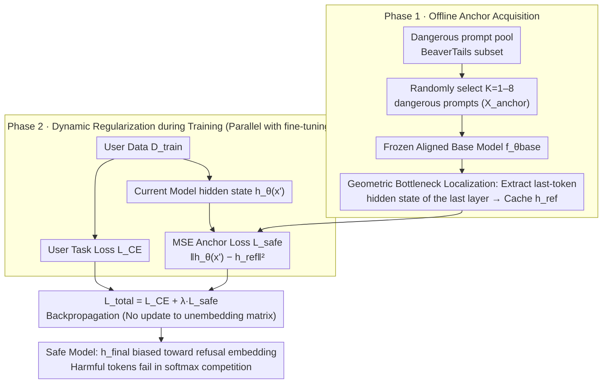

# Safety Anchor: Defending Harmful Fine-tuning via Geometric Bottlenecks

**Conference**: ICML 2026  
**arXiv**: [2605.05995](https://arxiv.org/abs/2605.05995)  
**Code**: [soyoaaa/SBR](https://github.com/soyoaaa/SBR)  
**Area**: Alignment / LLM Safety  
**Keywords**: Harmful Fine-tuning, Unembedding Bottleneck, Parameter Redundancy, MSE Anchor, RLHF Robustness

## TL;DR
This paper demonstrates that all existing HFT defenses based on "parameter space constraints" can be bypassed due to parameter redundancy. It proposes Safety Bottleneck Regularization (SBR), which relocates the defense to the unembedding layer—a geometric bottleneck. By anchoring the final-layer hidden state of just a single high-risk prompt, SBR keeps the Harmful Score < 10 under 50-epoch continuous HFT attacks without compromising benign task accuracy.

## Background & Motivation
**Background**: While RLHF enables LLMs to refuse illegal requests, fine-tuning-as-a-service allows users to upload datasets for training. Even a small number of malicious samples (Harmful Fine-tuning, HFT) can dismantle safety guardrails within a few epochs. Three existing categories of defenses—(i) parameter distance (Lisa/EWC), (ii) gradient direction (Booster), and (iii) representation drift (Vaccine/T-Vaccine)—suppress harmful behavior in early epochs.

**Limitations of Prior Work**: Through stress tests involving 50 epochs of continuous HFT, the authors found that all three types of defenses collapse after 5–10 epochs (HS > 30). Crucially, during collapse, the monitored metrics (parameter distance, gradient direction, or representation drift) do not exceed their boundaries, indicating these defenses succeed in form but fail in substance.

**Key Challenge**: LLMs are highly over-parameterized. Attackers can always find optimization directions orthogonal to defense constraints. For instance, a random Rank-1 LoRA $\Delta W=BA^\top$ (with $A$ frozen) can recover harmful capabilities, suggesting that harmful directions are pervasive rather than sparse in parameter space. Any constraint in "redundant high-dimensional parameter space" possesses a null space exploitable by attackers.

**Goal**: Identify a chokepoint unaffected by parameter redundancy that attackers cannot bypass and apply defense exclusively there.

**Key Insight**: The authors observe that the final step of token generation is the inner product of the last-layer hidden state $h_{\text{final}}$ and the word embedding $w_t$: $\text{Score}(t)=h_{\text{final}}^\top w_t$. This unembedding projection is a geometric bottleneck through which all harmful tokens must pass. Since $w_t$ is frozen, as long as $h_{\text{final}}$ is anchored toward the refusal embedding direction, the softmax will inevitably select refusal tokens.

**Core Idea**: Instead of defending in parameter space, directly anchor the final hidden state of a set of high-risk queries at the unembedding layer to remain consistent with the frozen aligned model. Regardless of how internal parameters evolve, if the bottleneck is fixed, malicious tokens cannot be generated.

## Method

### Overall Architecture
SBR operates in a fine-tuning-as-a-service scenario: the service provider holds an aligned base model $f_{\theta_{\text{base}}}$ and a set of "safety anchors" $\mathcal{X}_{\text{anchor}}=\{x'_1,\dots,x'_K\}$ (typical dangerous prompts like "How to make a bomb?"), but cannot see the user-uploaded training set $\mathcal{D}_{\text{train}}$. SBR consists of two phases:

- **Phase 1 — Anchor Acquisition (Offline)**: Use the frozen $f_{\theta_{\text{base}}}$ to extract the final-layer hidden state of the last token for each anchor $h_{\text{ref}}(x')=f^{\text{last}}_{\theta_{\text{base}}}(x')$, cached as $\mathcal{H}_{\text{ref}}$.
- **Phase 2 — Dynamic Regularization (Parallel with user fine-tuning)**: For each batch, simultaneously calculate $\mathcal{L}_{CE}$ (user task) and $\mathcal{L}_{\text{safe}}=\frac{1}{|\mathcal{X}_{\text{anchor}}|}\sum_{x'}\|h_\theta(x')-h_{\text{ref}}(x')\|_2^2$. The total objective is $\mathcal{L}_{\text{total}}=\mathcal{L}_{CE}+\lambda\mathcal{L}_{\text{safe}}$, where $\lambda$ controls refusal strength. The unembedding matrix is not updated, and the base model architecture remains unchanged.

### Key Designs

**1. Geometric Bottleneck Localization: Shifting defense from redundant parameter space to unembedding input**

Prior defenses in parameter space exhibit a null space—random Rank-1 directions can recover harmful capabilities. SBR targets the final gate of token generation: $P(t|x)=\text{softmax}(h_{\text{final}}^\top w_t)$, where refusal and harmful tokens compete. By geometrically biasing $h_{\text{final}}$ toward refusal embeddings, the refusal inner product score stays strictly higher than the harmful one. This position is unavoidable because bypassing it requires modifying both $h_{\text{final}}$ and the word embeddings $w_t$. With $w_t$ frozen, the attacker only has the $d$-dimensional $h_{\text{final}}$ constraint to manipulate, leaving almost no escape compared to high-dimensional parameter space.

**2. MSE Anchor Loss: Applying hard constraints on the bottleneck with minimal anchors**

After localizing the bottleneck, $h_{\text{final}}$ is fixed toward the refusal direction by using the base model's output as a reference. An MSE loss pulls the current model's hidden states toward cached reference values:

$$\mathcal{L}_{\text{safe}}(\theta)=\frac{1}{|\mathcal{X}_{\text{anchor}}|}\sum_{x'\in\mathcal{X}_{\text{anchor}}}\|h_\theta(x')-h_{\text{ref}}(x')\|_2^2$$

This is weighted by $\lambda$ against the user’s $\mathcal{L}_{CE}$. Remarkably, 1–8 typical dangerous prompts (from a BeaverTails subset) are sufficient. A single anchor can keep the Harmful Score < 10 without damaging benign tasks, as the refusal direction and benign reasoning direction are approximately orthogonal.

**3. Stress test paradigm: Exposing "Tandem Safety" in existing defenses via 50-epoch HFT**

The paper utilizes extreme evaluation to support its claims. Most prior works report HS within 3–5 epochs, hiding the fact that service providers might allow long-term fine-tuning. SBR tests a 10% harmful + 90% benign mixed dataset across 20–50 epochs. It also uses a Random Subspace Attack (freezing $A$, training $B$ in LoRA) to prove harmful capabilities recover via random directions. This systematically demonstrates that monitored proxy metrics (like parameter distance or embedding drift) can stay stable while safety is compromised.

### Loss & Training
LoRA rank 16 / alpha 16, AdamW lr $1\times 10^{-5}$, batch size 32, 20 epochs; anchors $K=8$, $\lambda=50$. Anchors require only a forward pass without backpropagating to the original base model. All remains follow standard baseline hyperparameters.

## Key Experimental Results

### Main Results
Llama3.1-8B, dual metrics across 4 benign downstream tasks: HS↓ (Harmful Score) and FA↑ (Fine-tuning Accuracy):

| Method | SST-2 HS↓ | SST-2 FA↑ | GSM8K HS↓ | GSM8K FA↑ | AlpacaEval HS↓ | AlpacaEval FA↑ | Avg HS↓ | Avg FA↑ |
|--------|-----------|-----------|-----------|-----------|----------------|-----------------|----------|---------|
| SFT (no defense) | 67.80 | 94.61 | 71.10 | 82.80 | 74.20 | 43.87 | 70.70 | 78.07 |
| DeepAlign | 25.90 | 93.12 | 20.70 | 88.00 | 23.70 | 33.64 | 25.10 | 76.04 |
| Lisa | 52.50 | 94.27 | 40.40 | 72.20 | 58.20 | 37.93 | 52.45 | 73.50 |
| Vaccine | 61.40 | 92.55 | 64.30 | 75.10 | 62.90 | 36.39 | 62.53 | 73.34 |
| Booster | 59.80 | 92.89 | 71.50 | 76.20 | 54.30 | 35.75 | 62.33 | 73.66 |
| **Ours (SBR)** | **5.80** | **94.15** | **5.60** | **82.60** | **6.20** | **45.82** | **5.68** | **78.17** |

### Ablation Study
**Robustness to Poisoning Ratio (Llama3.1-8B)**:

| Poison ratio $p$ | SFT HS | DeepAlign HS | Vaccine HS | Booster HS | **Ours HS** | Ours FA |
|------------------|--------|--------------|------------|------------|------------|--------|
| 0.05 | 67.90 | 21.50 | 58.70 | 59.40 | **4.10** | 93.92 |
| 0.10 | 67.80 | 25.90 | 61.40 | 59.80 | **5.80** | 94.15 |
| 0.20 | 71.90 | 29.90 | 61.90 | 64.60 | **8.20** | 93.92 |
| 0.30 | 74.30 | 33.30 | 69.20 | 67.30 | **7.30** | 93.69 |
| Avg | 70.48 | 27.65 | 62.80 | 62.78 | **6.35** | 93.92 |

**$\lambda$ Sensitivity**: Validation across $\lambda\in\{0,5,10,50,100\}$ showed $\lambda=50$ is the sweet spot for HS↓ and FA↑.

### Key Findings
- $K=1$ anchor is sufficient, reducing HS to < 10, proving the unembedding bottleneck is extremely narrow.
- SBR remains stable under 50-epoch HFT, while Lisa/Vaccine/Booster collapse by epoch 5.
- Drift-Safety Dissociation: Empirical evidence shows embedding drift remains stagnant while HS jumps from 12 to 59, proving global drift is a flawed proxy.
- Benign tasks show slight gains (Avg FA 78.17 vs SFT 78.07), supporting the orthogonality of refusal and reasoning subspaces.

## Highlights & Insights
- Stress tests and Random Subspace Attacks provide a sobering perspective on why existing HFT defenses are easily bypassed.
- Identifying "bottlenecks" is highly transferable—defenses for alignment or watermarking should target points with minimal redundancy.
- Deployment cost is nearly zero: service providers only need to cache $K$ hidden state vectors with constant overhead per forward pass.
- The lack of conflict between $\mathcal{L}_{\text{safe}}$ and $\mathcal{L}_{CE}$ provides a geometric explanation for why safety and utility do not necessarily require a trade-off.

## Limitations & Future Work
- High-risk anchor pools require preparation; the cost of updating anchors for new attack types (e.g., multimodal) is not quantified.
- Primarily validated on 7B models; whether $K=1$ suffices when dimension $d$ grows in 70B+ or MoE models remains unknown.
- If attackers can fine-tune the unembedding matrix $w_t$, the geometric bottleneck assumption may fail.
- Interactions with continual learning or multi-task fine-tuning are not explored.

## Related Work & Insights
- **vs Lisa / EWC**: These rely on parameter space constraints; SBR circumvents the null space issue by moving to the unembedding input.
- **vs Vaccine / T-Vaccine**: These monitor whole-layer drift, which decouples from HS; SBR targets the last token of the final layer for precision.
- **vs Booster / Gradient-based**: Attempts to mask harmful gradients fail because harmful directions in parameter space are not sparse.
- **vs DeepAlign**: Constrains output tokens, which affects short-output classification tasks; SBR is invariant to token length by constraining hidden states.

## Rating
- Novelty: ⭐⭐⭐⭐⭐ Relocates HFT defense from parameter space to the unembedding bottleneck.
- Experimental Thoroughness: ⭐⭐⭐⭐⭐ Extensive stress tests across 4 tasks, various poison ratios, and 3 base LLMs.
- Writing Quality: ⭐⭐⭐⭐⭐ Strong motivation in §3 with convincing, concise visualizations.
- Value: ⭐⭐⭐⭐⭐ Effective with 1 anchor, preservation of utility, and industrial deployment readiness.

<!-- RELATED:START -->

## Related Papers

- [\[ICML 2026\] SPARD: Defending Harmful Fine-Tuning Attack via Safety Projection with Relevance-Diversity Data Selection](spard_defending_harmful_fine-tuning_attack_via_safety_projection_with_relevance-.md)
- [\[ICLR 2026\] Safety Subspaces are Not Linearly Distinct: A Fine-Tuning Case Study](../../ICLR2026/llm_alignment/safety_subspaces_are_not_linearly_distinct_a_fine-tuning_case_study.md)
- [\[ICML 2026\] Curriculum Learning for Safety Alignment](curriculum_learning_for_safety_alignment.md)
- [\[ICML 2026\] Implicit Safety Alignment from Crowd Preferences](implicit_safety_alignment_from_crowd_preferences.md)
- [\[ICLR 2026\] Anchored Supervised Fine-Tuning](../../ICLR2026/llm_alignment/anchored_supervised_fine-tuning.md)

<!-- RELATED:END -->
