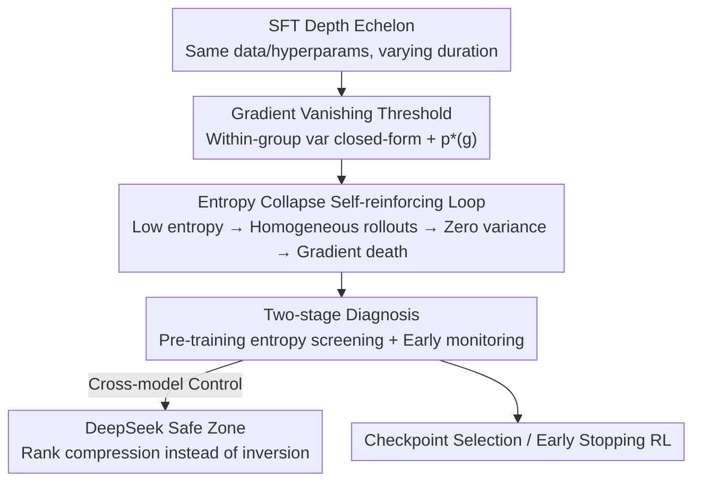

# SFT Overtraining Predicts Rank Inversion via Entropy Collapse Under RLVR

**Conference**: ICML2026  
**arXiv**: [2606.18487](https://arxiv.org/abs/2606.18487)  
**Code**: https://github.com/siddharthaphale/entropy-collapse-rlvr  
**Area**: Alignment RLHF / RLVR Post-training  
**Keywords**: Entropy Collapse, GRPO, RLVR, Checkpoint Selection, Rank Inversion

## TL;DR
The authors discover that the industry default rule of "selecting the SFT checkpoint with the highest pass@1 for GRPO" systematically fails in code generation. Longer SFT leads to higher pass@1, but the pass@10 after GRPO descends monotonically (0.806 → 0.481). The root cause is that over-SFT flattens the output distribution, causing within-group advantage variance to zero out and gradients to vanish. The authors identify high-risk checkpoints using a closed-form threshold $p^*(g)$ and a two-stage diagnosis: "pre-training entropy screening + early entropy monitoring."

## Background & Motivation

**Background**: The standard post-training recipe for code generation is "SFT followed by RLVR" (Reinforcement Learning with Verifiable Rewards, such as GRPO). In practice, the checkpoint with the highest SFT stage score (pass@1) is typically fed into RL under the assumption that "more accurate is better."

**Limitations of Prior Work**: This rule is increasingly questioned. Existing works suggest that excessive SFT leads to rote memorization rather than generalization, and RLVR narrows reasoning boundaries instead of broadening them. However, these observations remain at an "aggregate level," indicating that SFT should not be too long on average but failing to diagnose individual checkpoints. Two checkpoints with identical pass@64 may carry vastly different entropy distributions.

**Key Challenge**: The fundamental issue lies in the mismatch between evaluation temperature and RL operating temperature. Greedy pass@1 ($T=0$) measures the "capability ceiling," whereas GRPO operates by sampling at $T=1.0$. At sampling temperatures, a checkpoint's output distribution may collapse more than its greedy behavior suggests. As SFT deepens, pass@1 (capability) increases while output diversity (entropy) at $T=1.0$ decreases. Consequently, selecting the "highest pass@1" inadvertently chooses the checkpoint with the worst diversity, most prone to gradient vanishing in early GRPO.

**Goal**: (1) Theoretically characterize the conditions under which GRPO gradients structurally vanish; (2) Demonstrate the "deeper SFT → higher pass@1 → worse GRPO" rank inversion phenomenon on real models and explain the mechanism; (3) Provide actionable screening tools with near-zero additional compute requirements.

**Key Insight**: The authors exploit a mathematical property of the "critic-less" GRPO design—under binary rewards, the within-group advantage variance has a closed form $p(1-p)(g-1)/g$, and there exists a threshold $p^*(g)$ where most groups degenerate and signals zero out. Once early GRPO pushes the pass rate $p$ below $p^*(g)$, the rewards in most rollout groups become identical, causing the relative signal to vanish. This translates empirical "training failure" into a predictable phase transition.

**Core Idea**: Use "pre-training entropy" instead of "pass@1" as a screening signal for checkpoint health. Entropy directly characterizes the diversity required by GRPO, whereas pass@1 remains relatively stagnant (0.151 → 0.187) across SFT depth echelons, offering little discriminative power.

## Method

### Overall Architecture
The paper establishes a "Mechanism → Prediction → Diagnosis" pipeline rather than proposing a new algorithm. It uses a controlled experimental design (SFT depth echelon: fixed data/hyperparameters, varying SFT duration) on Qwen2.5-Coder-3B to induce rank inversion, uses DeepSeek-Coder-6.7B as a control group (staying in the "safe zone"), and finally implements the theoretical threshold $p^*(g)$ into a two-stage diagnosis.

### Key Designs

**1. Gradient Vanishing Threshold: Translating "GRPO Failure" into a Closed-form Phase Transition**

GRPO is critic-less, obtaining the advantage of each rollout by "subtracting the group mean." The authors prove (Proposition 1) that under binary rewards, the expected advantage variance of a group (size $g$, single-task pass probability $p$) is:

$$\mathbb{E}[\sigma_G^2] = p(1-p)\frac{g-1}{g}.$$

This implies that variance collapses to zero as $p \to 0$ (all wrong) or $p \to 1$ (all correct). A "majority group degeneration threshold" $p^*(g)$ exists (Proposition 2/3). When $p$ falls below $p^*$, most groups offer no learning signal. For $g=8$, $p^*(8)=0.083$. This turns the empirical phenomenon ("RL stops moving after deep SFT") into a computable criterion. Qwen's checkpoints start at $1.8\times \sim 2.3\times$ the threshold and drop below it in early GRPO; DeepSeek checkpoints remain $\geq 4.2\times$ the threshold.

**2. Entropy Collapse Self-reinforcing Loop: Five-stage Mechanism of Rank Inversion**

The authors identify a self-amplifying cycle triggered by low entropy: ① Excessive SFT compresses output distribution (entropy drops from 0.227 to 0.120 nats). ② At $T=1.0$, low entropy policies generate identical completions, homogenizing groups and pushing pass@1 toward zero (0.020 by step 200). ③ By Proposition 1, variance disappears, leading to zero gradients. ④ Policy movement stops (gradient death). ⑤ Optimizer momentum and weight decay further erode capability, returning to ①. Key evidence: GRPO **amplifies** pre-training entropy gaps.

**3. Two-stage Diagnosis: Screening High-risk Checkpoints**

**Stage 1 (Pre-RL)**: Measure average next-token entropy $H(\pi_{\text{SFT}})$ at $T=1.0$. Checkpoints below $\tau_H=0.18$ nats (e.g., Qwen 1.9/2.9/5.8 epochs) are flagged. **Stage 2 (Early GRPO)**: Monitor relative entropy drop $\Delta H(10\to150)/H(10)$. A drop exceeding $\tau_2=0.50$ signifies collapse. Stopping at step 150 saves 62.5% of RL compute. Selecting the 1.9-epoch checkpoint instead of the 5.8-epoch one recovers +0.090 absolute pass@10.

### Loss & Training
Models use BF16 + LoRA ($r=128, \alpha=128$ on all linear layers + embeddings). SFT: AdamW-8bit, lr $1\times10^{-5}$, batch 16. GRPO: DAPO variant, $g=8, \beta=0$, lr $1\times10^{-6}$, 400 steps, binary rewards. The training set is filtered to include only tasks with pass counts $\in[1, 14]$ over 16 samples to ensure gradient variance.

## Key Experimental Results

### Main Results
On the SFT depth echelon, "selecting the highest pass@1" consistently picks the **worst** GRPO starting point.

| Model / SFT epochs | Pre-training Entropy (nats) | Pre-training pass@1 | GRPO Peak pass@10 |
|---|---|---|---|
| Qwen-3B / 1.0 | 0.227 | 0.151 | **0.806** |
| Qwen-3B / 1.9 | 0.163 | 0.163 | 0.750 |
| Qwen-3B / 5.8 | 0.120 | **0.187** | 0.481 |
| DeepSeek-6.7B / 1.0 | 0.399 | 0.351 | 0.861 |
| DeepSeek-6.7B / 5.8 | 0.185 | 0.413 | 0.888 |

Qwen shows rank inversion ($\rho = -0.75$), while DeepSeek (safe zone) shows rank compression ($\rho = +1.00$).

### Key Findings
- **pass@64 is nearly invariant (0.897~0.932)**: The failure is not in "solvability" but in "sampling reliability."
- **Peak steps contract with SFT depth**: Collapsed checkpoints exhaust learning signals earlier rather than learning faster.
- **KL penalty and label smoothing fail to rescue**: The failure is determined at the SFT stage; it is not a GRPO hyperparameter issue.

## Highlights & Insights
- **Predictable Phase Transition**: Turning "RL failure" into a closed-form $\mathbb{E}[\sigma_G^2]$ calculation is the most elegant contribution.
- **Practical Diagnostic Signals**: Using entropy as a proxy for diversity allows for zero-RL-compute screening.
- **Counter-intuitive Transferability**: Any "SFT then RLVR" pipeline (math, agents, tool use) may face this risk. Don't worship pass@1; check the distance from the collapse threshold.

## Limitations & Future Work
- **Threshold Calibration**: The values $\tau_H=0.18$ and $p^*(g)$ are Qwen-specific; absolute cutoffs require recalibration for different models/tasks.
- **Limited Scope**: The study focuses on code generation with binary rewards; general tasks or dense rewards are not yet verified.
- **Diagnosis without Fix**: The method identifies failures but does not integrate training-side solutions to maintain entropy while maximizing pass@1.

## Related Work & Insights
- **vs Kang et al. (2025)**: While they predict aggregate cross-model performance, Ours diagnoses checkpoint-level failures within a family.
- **vs Zhang et al. (2026, PEAR)**: While they attribute inversion to distribution mismatch, Ours provides an entropy-based mechanism explanation.
- **vs Cui et al. (2025, Clip-Cov)**: Ours screens for entropy depletion **before** RL, whereas they handle it **during** RL.

## Rating
- Novelty: ⭐⭐⭐⭐ (Falsifying industry rules + closed-form mechanism)
- Experimental Thoroughness: ⭐⭐⭐ (Clean controlled groups, but limited to two models/code tasks)
- Writing Quality: ⭐⭐⭐⭐ (Clear mechanism → prediction → diagnosis link)
- Value: ⭐⭐⭐⭐ (Directly changes engineering practices for SFT checkpoint selection)

<!-- RELATED:START -->

## Related Papers

- [\[ACL 2026\] ComplexConstraints and Beyond: Expert Rubrics for RLVR](../../ACL2026/llm_alignment/complexconstraints_and_beyond_expert_rubrics_for_rlvr.md)
- [\[CVPR 2025\] Continual SFT Matches Multimodal RLHF with Negative Supervision](../../CVPR2025/llm_alignment/continual_sft_matches_multimodal_rlhf_with_negative_supervision.md)
- [\[ICLR 2026\] Beyond RLHF and NLHF: Population-Proportional Alignment under an Axiomatic Framework](../../ICLR2026/llm_alignment/beyond_rlhf_and_nlhf_population-proportional_alignment_under_an_axiomatic_framew.md)
- [\[ACL 2025\] LSSF: Safety Alignment via Low-Rank Safety Subspace Fusion](../../ACL2025/llm_alignment/lssf_safety_subspace.md)
- [\[ICLR 2026\] JailNewsBench: Multi-Lingual and Regional Benchmark for Fake News Generation under Jailbreak Attacks](../../ICLR2026/llm_alignment/jailnewsbench_multi-lingual_and_regional_benchmark_for_fake_news_generation_unde.md)

<!-- RELATED:END -->
