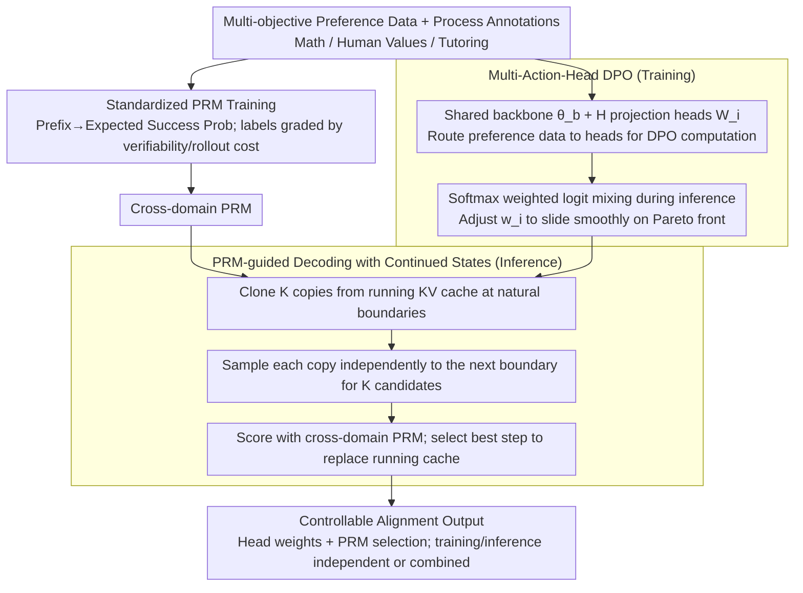

# Simultaneous Multi-objective Alignment Across Verifiable and Non-verifiable Rewards

**Conference**: ICML2026  
**arXiv**: [2510.01167](https://arxiv.org/abs/2510.01167)  
**Code**: https://github.com/pearls-lab/multiobj-align  
**Area**: Alignment RLHF  
**Keywords**: Multi-objective alignment, Multi-Action-Head DPO, PRM-guided decoding, Process Reward Model, Verifiable/Non-verifiable rewards

## TL;DR
MAHALO integrates "standardized PRM training + Multi-Action-Head DPO + PRM-guided decoding with KV-cache continuation" into a unified framework. This allows a single LLM to be simultaneously aligned across three categories: mathematics (verifiable), human values (non-verifiable), and Socratic tutoring (interactive), while enabling smooth preference switching during inference through head weights and PRM selection.

## Background & Motivation
**Background**: Mainstream alignment routes (RLHF / DPO) collapse multi-dimensional preferences into a single scalar reward, either by fixing weights during training (e.g., linear scalarization in MODPO, parameter soups) or by using a single RM to guide generation at test time.

**Limitations of Prior Work**: (1) Scalarization during training erases trade-offs between dimensions, and changing weights requires re-training; (2) Parameter merging methods like DPO Soup or Personalized Soup require re-training single-objective experts when adding new objectives, which is costly; (3) Most reward-guided decoding at test time relies on outcome RMs, facing "training-inference granularity inconsistency" when scoring partial sequences; (4) Current PRM methods almost exclusively cover verifiable domains like mathematics, lacking a general step-level training paradigm for non-verifiable domains (helpfulness/honesty).

**Key Challenge**: There is a fundamental gap between maintaining multi-dimensional structures during training and achieving fine-grained control during inference. Tightening dimensions into a scalar during training loses structure, while maintaining multiple models incurs massive computational costs; using outcome RMs at test time lacks step-level control, and training PRMs for non-verifiable domains remains difficult.

**Goal**: To simultaneously solve three sub-problems within a single framework: (a) how to train PRMs uniformly across verifiable and non-verifiable domains; (b) how to train $H$ decouplable objective heads using a shared backbone, mixed as needed during inference; (c) how to apply PRMs to step-level decoding without introducing the overhead of extra prompt re-encoding.

**Key Insight**: The authors observe that "reward verifiability" should determine whether optimization effort is spent on training or inference. Verifiable objectives (mathematical correctness) naturally provide precise step-level signals, yielding maximum returns from PRM search during inference. In contrast, signals for non-verifiable objectives (helpfulness/engagement) are noisy and better suited for shaping shared representations through multi-head training. Based on this dichotomy, the authors design the training side (MAH-DPO) and the inference side (PRM-guided decoding) as complementary components.

**Core Idea**: Use a shared backbone with $H$ DPO heads for "vectorized multi-objective alignment," combined with a cross-domain PRM for step-level guided decoding using continued KV-cache states. Training and inference components can be invoked independently or stacked, achieving "train once, deploy on-demand."

## Method

### Overall Architecture
MAHALO takes as input a set of multi-objective preference data $\{\mathcal{D}_i\}_{i=1}^H$ (Math Acc/Eng, UltraFeedback Help/Honest/Truth, Socratic Mind Acc/Eng) and corresponding process-level annotations. The framework follows the core dichotomy: verifiable objectives, with their precise signals, benefit most from **test-time search**; non-verifiable objectives, with noisier signals, are better handled via **training-time multi-head shaping**. Thus, the training side uses Multi-Action-Head DPO (one shared backbone $\theta_b$ + $H$ linear heads $W_i$) to let each objective grow on its own head, with logits mixed by weight during inference. The test-time side uses a cross-domain PRM for step-level guidance at generation boundaries ("sample candidates → PRM scoring → commit"), specifically utilizing continued KV caches to eliminate redundant encoding overhead. Both lines are supported by a **standardized PRM training paradigm** that abstracts "process rewards" from math-domain correctness to "prefix → expected success probability," allowing the same signal form $r_t$ to cover the entire alignment spectrum.

### Key Designs

**1. Standardized PRM Training: Abstracting process rewards to "prefix → expected success probability" to unify verifiable and non-verifiable domains**

Previous PRM work was limited to domains with automatic verifiers like math, where "correctness" per step is cheap to determine. Subjective objectives like helpfulness or honesty lack general step-level supervision. The key step here is redefining the process reward as the "expected probability of final success given a prefix," then grading label construction by "verifiability + rollout cost + process structure." Verifiable domains use step-level rewards with hindsight relabeling, discounting final correctness $z$ back to each step $\tilde r_t = r_t + \gamma^{n-t} z$. Averaging over $M$ rollouts provides the target $V_t^{\text{target}}$, which the PRM fits using MSE: $\mathcal{L}_{\text{PRM}} = \mathbb{E}[(p_t - V_t^{\text{target}})^2]$, training the PRM as a predictor of both step quality and future success. Non-verifiable domains are divided into three cases: Case A (clear steps, cheap rollout) uses a calibrated LLM-as-Judge for majority voting over rollouts, $r_t = \mathbb{I}[\frac{1}{M}\sum_m \mathbb{I}(J(y_{1:t}, y_{t+1:n}^{(m)})=\text{pos}) > 1/2]$; Case B (expensive rollout, e.g., multi-turn dialogue) uses direct judge scoring $r_t = J(y_{1:t})$; Case C (no clear structure) reverts to Bradley-Terry style partial sequence scoring. This abstraction allows a single PRM training paradigm to span from math to the entire alignment spectrum.

**2. Multi-Action-Head DPO: Decoupling objectives into the final layer while sharing knowledge in the backbone to avoid H-fold training costs and enable inference-time re-weighting**

MODPO forces multiple objectives into a scalar loss where weights are fixed at training; DPO Soup requires training independent models per objective. MAH-DPO instead produces a hidden state $h_{\theta_b}(x, y_{1:t}) \in \mathbb{R}^d$ from a shared backbone and assigns an independent projection head $W_i \in \mathbb{R}^d \times |V|$ for each objective $i$ to get objective-specific logits $z_i = W_i^\top h_{\theta_b}$. Each head is initialized from the SFT head with small perturbations, sharing a frozen SFT reference model $\pi_\text{ref}$. During training, samples are routed to their corresponding heads to compute DPO losses individually: $\mathcal{L}_i = -\mathbb{E}_{\mathcal{D}_i}[\log \sigma(\beta \Delta_i)]$. The total loss is a weighted sum: $\mathcal{L}_{\text{MAH-DPO}} = \sum_i \alpha_i \cdot \frac{1}{|\mathcal{B}_i|}\sum_{\mathcal{B}_i} \mathcal{L}_i$. Inference only requires weighting the logits $\pi_\text{MAH}(y_t \mid \cdot) = \text{Softmax}(\sum_i w_i z_i)$ (where $\sum_i w_i = 1$) to slide smoothly along the Pareto front. By pushing "objective separation" to the lightweight final layer and keeping "knowledge sharing" in the heavy backbone, the method avoids $H$-fold training costs and enables real-time re-weighting—latency increases are only +13% and memory +7% compared to single-head DPO.

**3. PRM-guided Decoding with Continuing Hidden State: Eliminating step-wise re-encoding with continued KV caches for deployable step-level guidance**

Existing reward-guided decoding methods re-encode the entire "prefix + new step" text after every step. Minor differences in tokenization or special tokens can cause the distribution to drift from true incremental decoding, and errors accumulate. The solution is to maintain a running past KV cache $\text{kv}_t$. At each "natural boundary" (newline in math, sentence/paragraph in values, turn in dialogue), the framework clones $K$ local caches from $\text{kv}_t$, samples independently until a boundary $\mathcal{Q}$ is triggered to get candidates $y_{t+1}^k$ and their final caches $\text{kv}_{t+1}^k$. The PRM scores each candidate $r_k = P(x, y_{1:t}, y_{t+1}^k)$, and $k^\star = \arg\max_k r_k$ is chosen. The corresponding $\text{kv}_{t+1}^{k^\star}$ directly replaces the running cache for the next step. This maintains distribution integrity via "hidden state continuity" and saves redundant encoding—resulting in 4.9x speedup for random sampling and 4.2x for PRM-guided decoding.

### Loss & Training
PRM uses MSE to fit hindsight value targets. MAH-DPO routes samples in a batch to their respective heads, calculating DPO losses individually and summing them with weights $\alpha_i$ (balanced sampling with equal $\alpha_i$ was used in experiments). Heads are initialized from the SFT head with perturbations, and the reference policy is fixed as SFT. Qwen2.5-7B-Instruct is used for Math/Socratic Mind, and Llama-3.1-8B-Instruct is used for UltraFeedback. Results are averaged over 3 independent runs.

## Key Experimental Results

### Main Results: Training-side Alignment (MAH-DPO vs. Baselines)

| Dataset | Metric | Base | SFT | Single-Head DPO | MODPO | DPO Soup | **MAH-DPO Ensemble** |
|--------|------|------|-----|-----------------|-------|----------|----------------------|
| Math | Acc | 0.711 | 0.730 | 0.725 | 0.728 | 0.726 | 0.725 |
| Math | Eng | 0.501 | 0.592 | 0.716 | 0.737 | 0.735 | **0.873** |
| Human Values | Help | 0.580 | 0.555 | 0.604 | 0.618 | 0.613 | **0.639** |
| Human Values | Honest | 0.304 | 0.300 | 0.306 | 0.348 | 0.322 | **0.369** |
| Human Values | Truth | 0.189 | 0.199 | 0.201 | 0.233 | 0.215 | **0.248** |
| Socratic Mind | Acc | 0.656 | 0.679 | 0.704 | 0.705 | – | 0.689 |
| Socratic Mind | Eng | 0.322 | 0.347 | 0.446 | 0.360 | – | **0.451** |

MAH-DPO Ensemble is the strongest across all three dimensions of Human Values. In Math, it significantly leads in Engagement while maintaining comparable Accuracy.

### Main Results: Test-time PRM-guided Decoding Gains

| Dataset | Configuration | Primary Metric | Secondary Metric |
|--------|------|--------|--------|
| Math | Base | Acc 0.685, Eng 0.513 | — |
| Math | Accuracy Value-guided | **Acc 0.799** (+11.4) | Eng 0.455 |
| Math | Engaging PRM-guided | Acc 0.701 | **Eng 0.719** (+20.6) |
| Human Values | Helpful PRM-guided | **Help 0.671** | Honest 0.405, Truth 0.279 |
| Human Values | Honesty PRM-guided | Help 0.645 | **Honest 0.469**, Truth 0.338 |
| Socratic Mind | Engaging PRM-guided | Acc 0.651 | **Eng 0.466** (+12.8) |

Verifiable objectives (Math Acc) show the largest gains at test time, supporting the core thesis that verifiability yields higher returns for test-time search.

### Training + Test Synergy (Table 5 Excerpt)

| Dataset | Configuration | Key Metrics |
|--------|------|---------|
| Math | MAH-DPO + Accuracy Value | Acc **0.800** / Eng 0.855 |
| Math | MAH-DPO + Engaging PRM | Acc 0.721 / Eng **0.906** |
| Human Values | MAH-DPO + Honest PRM | Honest **0.520** / Truth **0.411** |
| Socratic Mind | MAH-DPO + Engaging PRM | Acc 0.712 / Eng **0.542** |

The combination of training and inference pushes the Pareto front outward, revealing positive transfer for related objectives (e.g., Honest PRM also boosting Truth).

### Key Findings
- **Reward verifiability determines optimization focus**: Highly verifiable rewards like Math Acc are primarily boosted by test-time PRM search (+11.4), whereas subjective rewards like Help/Honest/Eng are best shaped through multi-head training. Combining both pushes the limits further.
- **Head weights provide smooth Pareto control**: Adjusting Acc/Eng head weights in Math generates a smooth accuracy-engagement curve without sudden collapses in non-target dimensions, allowing on-demand deployment for different preference profiles without re-training.
- **Unified PRMs generalize across domains**: A PRM trained on 7 mixed dimensions outperforms the base model in all 3 domains and 7 dimensions, approaching the performance of domain-specific PRMs. This proves that process-level reward structures share commonalities.

## Highlights & Insights
- The grading of PRM training labels by "verifiability + rollout cost + process structure" is a significant engineering contribution, extending process supervision from math to the full alignment stack.
- Multi-Action-Head DPO is an elegant MoE-like variant for alignment. By routing DPO data to specific heads, it prevents gradient conflict between objectives with minimal overhead (+13% latency, +7% VRAM).
- The "Continuing Hidden State" trick yields a 4x speedup, making step-level guided decoding feasible for real-world deployment. This idea can be extended to speculative decoding, tree search, and multi-turn agents.
- The empirical recipe "Verifiable → Test-time search; Non-verifiable → Training-side shaping" provides a clear prior for future alignment research, avoiding wasted compute.

## Limitations & Future Work
- Non-verifiable PRM labels rely on LLM-as-Judge, which inherits judge biases and requires human-labeled ratings for calibration. More systematic analysis of judge robustness is needed.
- Experiments focused on 7B–8B models across 7 dimensions. The scaling behavior regarding backbone capacity and head interference for larger models (70B+) or higher-dimensional (>10) objectives is unverified.
- Currently, head weights are manually set. Automating this via online user feedback (contextual bandits/RL on weights) is a natural extension.
- Step partitioning strategies for structured outputs (code, JSON) or extremely long sequences are missing, which may affect practical engineering deployment.

## Related Work & Insights
- **vs. MODPO**: MODPO fixes weights during training; MAH-DPO decouples objectives into heads, allowing $w_i$ adjustment during inference to slide across the Pareto front. MAH-DPO Ensemble outperforms MODPO in Human Values.
- **vs. DPO Soup**: Soup methods require training full independent models; MAH-DPO only adds lightweight linear heads, keeping training costs nearly constant.
- **vs. ARGS / Reward-Guided Decoding**: Existing RGD uses outcome RMs with granularity mismatches and re-encoding overhead. This work combines PRM with KV-cache continuation to solve both precision and efficiency issues.
- **vs. Math-Shepherd**: While Math-Shepherd is limited to math, this work abstracts PRM training to "prefix → expected success" and designs Case A/B/C construction methods for the whole alignment spectrum.

## Rating
- Novelty: ⭐⭐⭐⭐ While individual components exist, the unified framework plus the "verifiability-based optimization" recipe is a distinct new contribution.
- Experimental Thoroughness: ⭐⭐⭐⭐⭐ Comprehensive coverage: 3 domains, 7 dimensions, training vs. testing comparisons, conflict subsets, scaling to 5 heads, and efficiency analysis.
- Writing Quality: ⭐⭐⭐⭐ Findings are concisely summarized; the background on the RLHF/PRM/RGD landscape is well-articulated.
- Value: ⭐⭐⭐⭐⭐ MAH-DPO and continued-state PRM decoding are practically useful, and the optimization priority rules guide future multi-objective alignment design.

<!-- RELATED:START -->

## Related Papers

- [\[ICML 2026\] Decoupling Reasoning and Confidence: Resurrecting Calibration in Reinforcement Learning from Verifiable Rewards](decoupling_reasoning_and_confidence_resurrecting_calibration_in_reinforcement_le.md)
- [\[ICLR 2026\] RLBFF: Binary Flexible Feedback to Bridge Between Human Feedback & Verifiable Rewards](../../ICLR2026/llm_alignment/rlbff_binary_flexible_feedback_to_bridge_between_human_feedback_verifiable_rewar.md)
- [\[ICLR 2026\] OrthAlign: Orthogonal Subspace Decomposition for Non-Interfering Multi-Objective Alignment](../../ICLR2026/llm_alignment/orthalign_orthogonal_subspace_decomposition_for_non-interfering_multi-objective_.md)
- [\[ICLR 2026\] Multi-objective Large Language Model Alignment with Hierarchical Experts](../../ICLR2026/llm_alignment/multi-objective_large_language_model_alignment_with_hierarchical_experts.md)
- [\[ICLR 2026\] Bradley–Terry and Multi-Objective Reward Modeling Are Complementary](../../ICLR2026/llm_alignment/bradley-terry_and_multi-objective_reward_modeling_are_complementary.md)

<!-- RELATED:END -->
