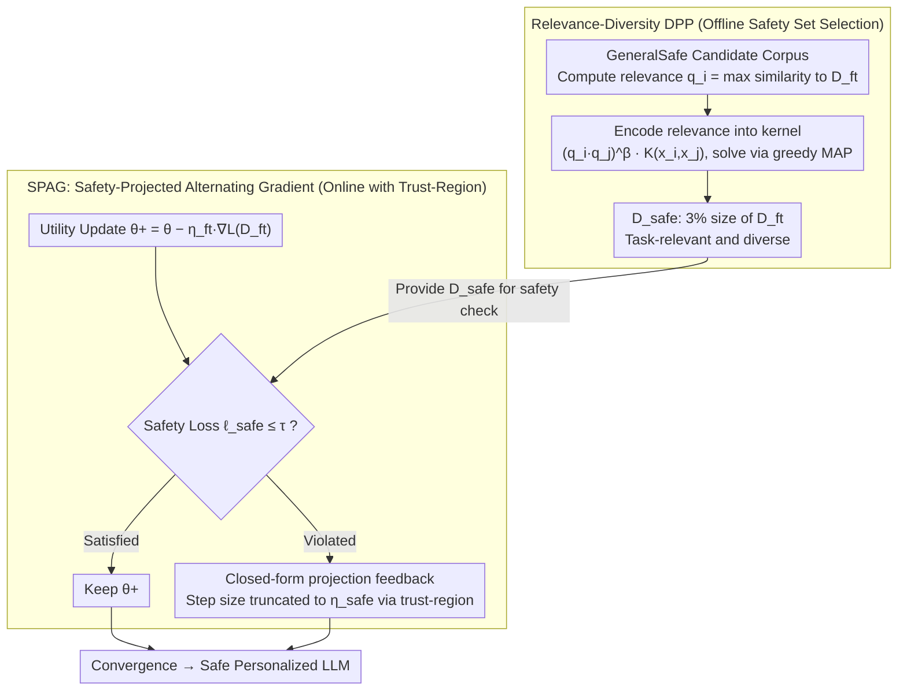

# SPARD: Defending Harmful Fine-Tuning Attack via Safety Projection with Relevance-Diversity Data Selection

**Conference**: ICML 2026  
**arXiv**: [2605.28030](https://arxiv.org/abs/2605.28030)  
**Code**: https://github.com/shuhao02/SPARD (Available)  
**Area**: LLM Security / Alignment RLHF / Harmful Fine-tuning Defense  
**Keywords**: Harmful Fine-tuning Attack, Safety Projection, Determinant Point Process (DPP), Safety-Constrained Optimization, LoRA

## TL;DR
SPARD combines "Safety-Projected Alternating Gradient (SPAG)" and "Relevance-Diversity DPP Safety Data Selection" to explicitly formulate "post-fine-tuning safety constraints" as a constrained optimization problem. It updates parameters for utility first and then uses a closed-form projection to pull them back into the safety half-space. By using only 3% task-relevant yet diverse safety samples, it reduces the average ASR of four harmful fine-tuning attacks from 87.93% (SFT) to 9.45% with negligible impact on downstream performance.

## Background & Motivation

**Background**: Fine-tuning-as-a-service has become mainstream for LLM deployment. However, downstream fine-tuning can rapidly erode the safety alignment established during pre-training. Attackers can bypass safety guardrails by injecting a small number of malicious samples (harmful fine-tuning attack) into user-uploaded datasets.

**Limitations of Prior Work**: Existing defenses follow two paths: (i) Prompt/Structural constraint methods (e.g., PTST, SafeLoRA), which rely on safety prompt re-injection during inference or limiting LoRA subspaces, often showing sensitivity to templates and layer selection. (ii) Safety data regularization methods (e.g., SafeInstr, Lisa, SafeGrad), which incorporate safety samples as penalty or proximal terms in the loss. The latter has two flaws: (i) Safety constraints are treated as soft penalties where the coefficient $\lambda$ is difficult to tune, lacking explicit control over the utility-safety trade-off; (ii) Safety samples are usually selected randomly, ignoring that task-relevant safety samples provide stronger corrective signals.

**Key Challenge**: The fundamental issue is the geometric conflict between the "utility gradient" and the "safety gradient." Linear mixing via penalty terms neither guarantees feasibility nor adaptivity of correction strength across different tasks/attacks. Furthermore, the "quality" dimension of safety samples (relevance to $D_{ft}$ and subset diversity) has not been jointly optimized.

**Goal**: (a) Formulate safe fine-tuning explicitly as a constrained optimization problem: $\min_\theta L(D_{ft},\theta)$ s.t. $L(D_{safe},\theta)\le\tau$, with a closed-form solution requiring no hyperparameter tuning; (b) Design a safety data selector modeling both relevance and diversity to enable a small scale $D_{safe}$ to cover broad risks.

**Key Insight**: A key experiment in Figure 2 shows that as safety samples are grouped by cosine similarity to $D_{ft}$, the ASR first decreases monotonically (68.8% → 11.4%) but rebounds to 16.6% when similarity is too high (≈0.94). This indicates that both relevance and diversity are indispensable; similarity-based selection alone causes the safety set to collapse into a narrow risk area.

**Core Idea**: Upgrade both "safety soft penalties" and "random data selection." Use a projection method to treat safety constraints as geometric feasibility conditions, and employ Relevance-Diversity DPP to jointly encode relevance weights $(q_iq_j)^\beta$ and sample diversity within the kernel.

## Method

### Overall Architecture
SPARD formulates the requirement that the model must satisfy safety loss constraints after fine-tuning as $\min_\theta L(D_{ft},\theta)$ s.t. $L(D_{safe},\theta)\le\tau$. This is implemented in two stages. In the offline phase, **Relevance-Diversity DPP** selects a small safety set $D_{safe}$ (3% of $D_{ft}$'s size) from a general corpus, ensuring relevance to the downstream task and diversity. In the online phase, **SPAG (Safety-Projected Alternating Gradient)** performs a standard utility update on $D_{ft}$ to obtain $\theta^+$, checks if the safety loss overflows using $D_{safe}$, and applies a closed-form projection along the safety gradient to return parameters to the safety half-space (with step size stabilized via trust-region truncation). This results in a "Safe Personalized LLM" where downstream accuracy is close to SFT but safety guardrails remain intact.

### Key Designs

**1. Relevance-Diversity DPP: Jointly Encoding Relevance and Diversity**

The quality of $D_{safe}$ determines the accuracy of the corrective signal. The U-shaped ASR curve in Figure 2 proves that pursuing only relevance makes the safety set collapse and overfit to narrow risks, while pursuing only diversity fails to provide task-related correction. 

Conventional DPP favors diversity based on $P(C)\propto\det(L_C)$ but ignores relevance. SPARD assigns a relevance score $q_i=\max_{x_z\in D_{ft}}\text{sim}(x_i,x_z)$ to each candidate and incorporates it into the kernel $\widehat{K}_{ij}=(q_iq_j)^\beta K(x_i,x_j)$. The selection probability decomposes into $P(C)\propto\prod_{x_i\in C}q_i^{2\beta}\cdot\det(L_C)$, where the first term weights relevant samples and the second term encourages diversity via determinant volume. $\beta$ serves as a hyperparameter to balance both. Embeddings use the mean hidden state of the pre-trained LLM's final layer, solved via greedy MAP by picking samples that maximize marginal gain $\widehat{L}_{ii}-\|w_i\|^2$, reducing single-step complexity to $O(m)$.

**2. SPAG: Geometric "On-Demand Projection" with Trust-Region Truncation**

Existing regularization methods use a global penalty coefficient $\lambda$, failing to provide feasibility or adaptive correction. SPAG treats the safety constraint $L(D_{safe},\theta)\le\tau$ as a geometric condition. After a utility update to $\theta^+$, the constraint is linearized via first-order Taylor expansion at $\theta^+$, defining a half-space $C^+=\{\theta:L(D_{safe},\theta^+)+\langle g_{safe},\theta-\theta^+\rangle\le\tau\}$. The projection of $\theta^+$ onto this half-space has a closed-form solution via KKT conditions. When violated, the update is $\theta_{new}=\theta^+ - \frac{L(D_{safe},\theta^+)-\tau}{\|g_{safe}\|^2}g_{safe}$.

The step size is determined by the current violation magnitude $\ell_{safe}-\tau$ and the gradient norm. If the model is already safe, the step size is zero; more severe violations trigger stronger corrections. To prevent step size explosion when the safety gradient norm $\|g_{safe}\|$ is extremely small, SPAG incorporates a trust-region radius $\eta_{safe}$, truncating the actual step size to $\alpha=\min(\frac{\ell_{safe}-\tau}{\|g_{safe}\|^2},\eta_{safe})$. This allows a sliding scale for the "safety-utility" trade-off; larger steps prioritize safety, while smaller steps protect utility.

### Loss & Training
No new loss terms are introduced. Utility steps use standard task CE loss $L(D_{ft},\theta)$, and safety steps use $L(D_{safe},\theta)$. LoRA settings: rank $r=32$, alpha $=4$. Optimizer: AdamW. Learning rate: $5\times10^{-5}$. Training: GSM8K (10 epochs), OpenBookQA (3 epochs). Safety threshold $\tau=0.2$. $D_{safe}$ ratio $p=0.03$. DPP index $\beta=4$. Safety mini-batch size is 1.

## Key Experimental Results

### Main Results

| Dataset / Model | Attack Setting | Metric | SFT | Lisa | SafeGrad | **SPARD** |
|--------|------|------|----------|-----|------|-----|
| GSM8K / Qwen-2.5-7B | Avg. 4 Attacks | ASR ↓ | 87.93 | 19.12 | 30.18 | **9.45** |
| GSM8K / Qwen-2.5-7B | Avg. 4 Attacks | HS ↓ | 4.28 | 1.56 | 1.93 | **1.32** |
| GSM8K / Qwen-2.5-7B | Avg. 4 Attacks | GSM8K Acc ↑ | **86.77** | 78.45 | 85.71 | 85.77 |
| GSM8K / LLaMA-3.2-3B | Avg. 4 Attacks | ASR ↓ | 91.36 | 24.19 | 71.77 | **12.09** |
| GSM8K / LLaMA-3.2-3B | Avg. 4 Attacks | Acc ↑ | **72.27** | 65.03 | 64.29 | 71.23 |
| OpenBookQA / Qwen-2.5-7B | Avg. 4 Attacks | ASR ↓ | 40.29 | 18.80 | 20.63 | **14.54** |
| OpenBookQA / Qwen-2.5-7B | Avg. 4 Attacks | Acc ↑ | **83.70** | 78.90 | 83.30 | 83.25 |

Ours achieves the lowest ASR/HS across all combinations of models and attacks (BeaverTails / I-BeaverTails / LatHarmful / Q-LatHarmful). Downstream accuracy drops by less than 1% compared to SFT, significantly outperforming SafeGrad in terms of safety.

### Ablation Study

| Configuration | Avg ASR | GSM8K Acc | Description |
|------|---------|-----------|------|
| Full SPARD | 9.45 | 85.77 | SPAG + Relevance-Diversity DPP + trust-region |
| SPARD w/o trust-region | 5.03 | 81.92 | Unconstrained projection: safer, but accuracy drops 3.85% |
| SPARD w/ Random Selection | Increase | Similar | DPP selection is crucial for lowering ASR |
| $\beta=0$ (Diversity-only) | Higher | — | Optimal ASR reached at $\beta\in[2,4]$ |
| $p=0$ (No safety data) | >80 | — | Equivalent to SFT |
| $p\in[0.03,0.05]$ | Lowest | — | 3-5% is the "sweet spot" |

### Key Findings
- **Relevance is not "Higher is Better"**: Figure 2 reveals a U-shaped ASR curve, confirming that safety data selection requires a balance of relevance and diversity.
- **Trust-Region as a Utility Knob**: Removing it further reduces ASR to 5.03% but hurts downstream accuracy. It provides a post-deployment adjustment point without retraining.
- **Efficacy with Small Samples**: Using only $p=3\%$ safety samples and sampling 1 safety sample per step is sufficient to significantly reduce ASR, with much lower overhead than Lisa's bi-state optimization.
- **Structural Stability**: Evaluation on LLaMA-3.2-3B shows SPARD suppresses ASR from 98.99% (SFT) to 11.31%, indicating the projection mechanism is not dependent on specific backbone vulnerabilities.

## Highlights & Insights
- **Upgrading Safety Constraints to Geometric Projections**: Unlike penalty methods which provide no feasibility guarantee, SPAG uses "on-demand projection" from KKT conditions. This eliminates $\lambda$ tuning and provides first-order feasibility guarantees with minimal code changes.
- **Relevance-Weighting in DPP Kernels**: By adding a $(q_iq_j)^\beta$ factor to a traditional diversity tool, the selection probability captures both relevance and diversity independently. This trick is transferable to other subset selection problems like instruction tuning or RLHF preference pairing.
- **Empirical Insight from the U-Curve**: Many studies stop at monotonic trends; discovering the rebound at extreme similarity (0.94) provides the empirical basis for the necessity of diversity.

## Limitations & Future Work
- **Limitations**: Relevance scores $q_i$ rely on static pre-trained embeddings; subset quality may degrade for OOD tasks where all candidates have low similarity.
- **Identified Flaws**: (i) Experiments are limited to 7B/3B models and LoRA; full-parameter tuning impacts are untested. (ii) Attack coverage excludes prompt-injection or weight-tampering. (iii) Trust-region setting $\eta_{safe} = \eta_{ft}$ lacks theoretical guidance. (iv) Training overhead is approximately 2x that of SFT due to dual forward/backward passes.
- **Future Directions**: Update embeddings using LoRA hidden states during training; extend SPAG to joint projections for multiple constraints (toxicity, bias, privacy); study adaptive $\eta_{safe}$ schedulers.

## Related Work & Insights
- **vs SafeInstr (Bianchi et al., 2024)**: Uses 3% random safety samples for self-regularization. SPARD uses 3% via DPP + projection, significantly outperforming them on ASR (9.45% vs 73.59% on Qwen-GSM8K), proving how safety samples are used matters more than how many.
- **vs Lisa (Huang et al., 2024c)**: Uses bi-state optimization and proximal terms. SPARD achieves higher accuracy (+6.2%) and lower ASR (12.09% vs 24.19%) on LLaMA with a single-step projection.
- **vs SafeGrad (Yi et al., 2025)**: SafeGrad filters safety-conflicting gradients ("subtraction" in gradient space). SPARD performs "projection rollback" in parameter space, which proves more stable.
- **vs SafeLoRA / PTST**: These rely on structural constraints or inference-time templates; SPARD is more general as it does not restrict LoRA structure or depend on templates.

## Rating
- Novelty: ⭐⭐⭐⭐ Projection is classic in RL/fairness but elegantly adapted to LLM defense with customized DPP kernels.
- Experimental Thoroughness: ⭐⭐⭐⭐ Strong coverage across models, tasks, and attacks, but lacks evaluation on 13B+ models or non-poisoning attacks.
- Writing Quality: ⭐⭐⭐⭐ Clear motivation via the U-curve; mathematical derivations are sound.
- Value: ⭐⭐⭐⭐⭐ A parameter-free, plug-and-play defense paradigm for fine-tuning-as-a-service with high safety efficiency.

<!-- RELATED:START -->

## Related Papers

- [\[ICML 2026\] Safety Anchor: Defending Harmful Fine-tuning via Geometric Bottlenecks](safety_anchor_defending_harmful_fine-tuning_via_geometric_bottlenecks.md)
- [\[ICML 2026\] GIST: Targeted Data Selection for Instruction Tuning with Gradient Subspace Projection](gist_targeted_data_selection_for_instruction_tuning_via_coupled_optimization_geo.md)
- [\[ICML 2026\] Efficient Preference Poisoning Attack on Offline RLHF](efficient_preference_poisoning_attack_on_offline_rlhf.md)
- [\[ICLR 2026\] Data Selection for LLM Alignment Using Fine-Grained Preferences](../../ICLR2026/llm_alignment/data_selection_for_llm_alignment_using_fine-grained_preferences.md)
- [\[AAAI 2026\] Importance-Aware Data Selection for Efficient LLM Instruction Tuning](../../AAAI2026/llm_alignment/importance-aware_data_selection_for_efficient_llm_instruction_tuning.md)

<!-- RELATED:END -->
