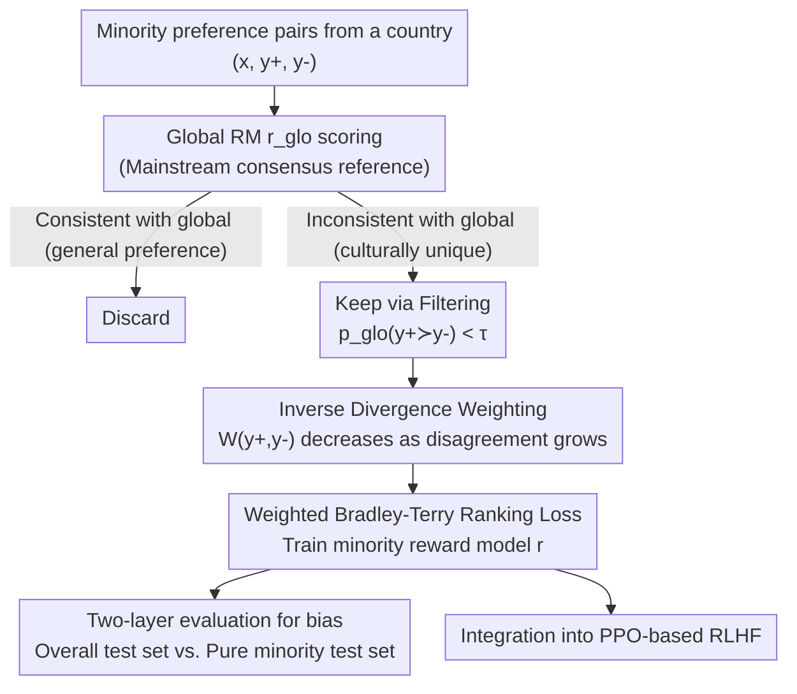

# Steerable Cultural Preference Optimization of Reward Models

**Conference**: ICML 2026  
**arXiv**: [2606.18606](https://arxiv.org/abs/2606.18606)  
**Code**: https://github.com/minsik-ai/Steerable-Cultural-Preference  
**Area**: Alignment RLHF / Reward Models  
**Keywords**: Cultural alignment, Reward model, Diverse alignment, Preference filtering, Preference weighting

## TL;DR
SCPO uses a "global reward model" as a reference frame. It first **filters** out general preferences in minority groups that align with global consensus, leaving only preferences with genuine cultural differences. It then applies **inverse divergence weighting** to reduce the influence of extreme outlier preferences. This approach trains steerable reward models that represent specific minority perspectives without being excessively biased—improving minority reward models by up to ~7 points across 7 countries in PRISM and GlobalOpinionQA datasets, while achieving 170%–280% higher data efficiency compared to full fine-tuning.

## Background & Motivation
**Background**: LLM alignment (RLHF/DPO) has traditionally treated "annotator preference" as a unified target for prediction. Most reward models (RM) are fitted to a single preference distribution representing mainstream populations or specific regions.

**Limitations of Prior Work**: This practice systematically biases models toward the perspectives of privileged groups or Western developed nations, causing the preferences of minority cultural sub-communities to be overlooked. Serving globally diverse cultures requires alignment models that can be "steered" toward specific group perspectives without becoming overly biased.

**Key Challenge**: Directly fine-tuning a reward model on all preference data from a specific country mixes two types of information: preferences reflecting unique cultural characteristics and general preferences that already align with global consensus. Furthermore, such data often contains labeling noise or potentially harmful extreme preferences. Fitting the full dataset fails to isolate "uniqueness" and risks over-biasing toward extreme samples. Existing group alignment methods (e.g., GPO requires an external transformer module difficult to integrate into standard RLHF; GRPO optimizes only for the worst-case group loss and ignores steerability for individual groups) do not address this contradiction.

**Goal**: To train **steerable** (one of the three pillars of diverse alignment) reward models for specific national perspectives within the RLHF framework, while addressing three questions: How to ensure balanced viewpoints in minority RMs? Can existing global RM scores be reused to train minority models? Which preference data is truly useful for training?

**Key Insight**: The authors observe that a "global reward model" trained on broad preference data (e.g., OpenAssistant, Tülu 3) can serve as a reference for "mainstream/consensus preferences." Preference pairs where minority annotations **disagree** with the global RM predictions reflect the truly unique aspects of that culture. Conversely, pairs with excessively large disagreement may be outliers that lead to over-bias. Note that the authors do not assume the global RM is "correct"; it is used as a ruler to distinguish "minority vs. majority."

**Core Idea**: Use global RM scores to process minority preference data in two steps: **Filtering** (removing general pairs consistent with global consensus) and **Inverse Divergence Weighting** (down-weighting extreme outliers). The minority RM is then trained using a weighted ranking loss.

## Method

### Overall Architecture
The input consists of pairwise preference data $(x, y^+, y^-)$ from a specific minority group (e.g., from PRISM, where $y^+$ is the preferred response). SCPO first employs a fixed global reward model $r_\text{glo}$ to score each pair. It then performs two operations: **Filtering**—discarding pairs the global RM already agrees with (general preferences useless for learning cultural uniqueness); and **Weighting**—assigning training weights inversely proportional to the magnitude of disagreement between minority annotations and the global RM. Larger disagreement results in lower weights to prevent extreme outliers from biasing the model. Finally, a weighted binary ranking loss is used to fine-tune an existing model into a national minority reward model, which can be directly integrated into PPO-based RLHF.

### Key Designs

**1. Global RM as Reference + Preference Filtering: Isolating Genuine Cultural Differences**

To address the issue of minority preference data being mixed with general preferences, SCPO uses $r_\text{glo}$ as a benchmark. Pairs that the global RM "already agrees with" are removed, keeping only those where the global RM disagrees. Based on the Bradley-Terry model, the probability that the global RM favors $y^+$ over $y^-$ is:

$$p_\text{glo}(y^+\succ y^-\mid x)=\frac{e^{r_\text{glo}(x,y^+)}}{e^{r_\text{glo}(x,y^+)}+e^{r_\text{glo}(x,y^-)}}<\tau,$$

Pairs are retained only when this probability is below a threshold $\tau \in [0, 1]$ (indicating the global RM actually favors $y^-$, contrary to the minority label). Smaller $\tau$ values result in more aggressive filtering. This focuses training on "what makes this culture different" rather than universal preferences. This significantly reduces data volume to 1/2 or 1/3 of the original size, yielding 170%–280% data efficiency.

**2. Inverse Divergence Weighting: Mitigating Over-bias from Extreme Outliers**

Filtering alone is insufficient because disagreement magnitudes vary. The authors define "divergence" as the degree of disagreement: high divergence occurs when $p_\text{glo}(y^+\succ y^-\mid x)$ is very low (the global RM strongly favors the response the minority group rejects). Small disagreement suggests valid, subtle cultural differences; large disagreement may indicate noise, labeling errors, or harmful content. Using the probabilistic nature of the Bradley-Terry model, the inverse weight is defined as:

$$W(y^+,y^-)=\min\!\Big(e^{(r_\text{glo}(x,y^+)-r_\text{glo}(x,y^-))/\beta},\,1\Big),$$

where $\beta > 0$ is a temperature parameter controlling sharpness. If $r_\text{glo}(x,y^-) > r_\text{glo}(x,y^+)$, the weight is $<1$. This does not judge content quality directly but modulates training impact based on disagreement magnitude—emphasizing subtle differences while dampening outliers to preserve core global knowledge.

**3. Weighted Ranking Loss and Two-layer Evaluation**

The training uses a weighted binary ranking loss:

$$L=-\mathbb{E}_{D}\big[W(y^+,y^-)\,\log\sigma\big(r(x,y^+)-r(x,y^-)\big)\big],$$

where $r$ is the minority reward model being trained. To diagnose if the model is "over-biased," a **two-layer evaluation** is used: one layer tests on all national preferences (overall performance, higher is better), and the other tests on "purely unique minority preferences" (**higher is not necessarily better**—excessively high scores indicate the model is merely pandering to extreme minority views). This dual approach identifies whether a minority RM is truly balanced.

### Loss & Training
The core is the weighted Bradley-Terry ranking loss. Two key hyperparameters are used: the filtering threshold $\tau$ (controlling data retention) and the weighting temperature $\beta$ (controlling weight sharpness). The global RM can be the initial checkpoint of the model being trained, requiring no extra auxiliary modules.

## Key Experimental Results

### Main Results
Experiments were conducted across 7 countries in PRISM using OpenAssistant and Tülu 3 as backbone RMs. The following table shows average accuracy for the OpenAssistant RM on the "Overall National Preference" test set (higher is better):

| Method | 7-Country Avg (Overall) | Description |
|------|------|------|
| Global RM (Unaligned) | 58.55 | Direct use of global RM |
| Baseline (Full Fine-tune) | 62.12 | Fine-tuning without filtering/weighting |
| Filtered Only | 46.87 | Filtering without weighting → Significant performance drop |
| Inverse Weighted Only | 56.62 | Weighting without filtering |
| SCPO (W) | 61.13 | Complete flow with weighting only |
| **SCPO (F + W)** | **62.72** | Filtering + Weighting; overall best |
| SCPO (F + W)$_\text{tuned}$ | 63.42 | Further improvement after tuning |

The paper reports that minority RMs improve by up to ~7 points compared to the baseline across datasets, with up to 280% higher data efficiency.

### Ablation Study
OpenAssistant RM average across 7 countries on the "Pure Minority Preference" test set (**higher is not necessarily better**):

| Configuration | Pure Minority Avg | Meaning |
|------|---------|------|
| Baseline | 27.37 | Full fine-tune; fails to learn minority features |
| Filtered Only | 63.01 | Filtering only → Score jumps to 63; **Severe over-bias** |
| Inverse Weighted Only | 46.70 | Weighting only; moderate bias |
| SCPO (W) | 18.21 | Weighting only; overly conservative |
| SCPO (F + W) | 40.57 | Combined; pulls over-bias back to a balanced range |

### Key Findings
- **Filtering and Weighting must be combined**: Filtering alone causes the model to over-bias (63.01 on pure minority tests); adding inverse weighting brings it to a balanced range (40.57) while maintaining optimal overall performance.
- **"Higher is better" is invalid here**: High scores on pure minority tests are a danger signal, validating the two-layer evaluation design.
- **High Data Efficiency**: Cutting data to 1/2–1/3 via filtering still matches or exceeds full fine-tuning performance.

## Highlights & Insights
- **Defining Uniqueness via Reference**: Instead of learning minority preferences directly, SCPO defines "cultural uniqueness" as "disagreement with the global RM," avoiding the assumption that the global RM is inherently "correct."
- **Exposing the "High Score Illusion"**: The two-layer evaluation reveals that high minority-specific scores can indicate over-bias, a valuable insight for diverse alignment evaluation.
- **Strong Transferability**: The concept of weighting via divergence from a strong reference can be applied to any personalized alignment scenario where outlier bias is a concern.

## Limitations & Future Work
- **Dependency on Global RM Quality**: SCPO uses the global RM as a ruler. If the global RM itself is biased, the "disagreement" judgment will be skewed.
- **Entanglement of Divergence**: The weight is based on disagreement magnitude only and does not distinguish between harmful content, true cultural differences, and labeling errors.
- **Limited Scope**: The evaluation is restricted to 7 countries and relatively small datasets; the scalability and transferability of hyperparameters need further testing.

## Related Work & Insights
- **vs. GPO / GRPO**: GPO requires an external transformer module, and GRPO focuses only on worst-case group loss. SCPO produces a standard reward model that is a drop-in replacement for standard RLHF.
- **vs. RAFT / SuperHF**: These use RMs to filter high-score samples for fine-tuning but do not target minority alignment or use comparative filtering.
- **vs. OPTune / Mallows-DPO**: These apply weighting based on reward margins but do not combine it with filtering for comparative group-level analysis.

## Rating
- Novelty: ⭐⭐⭐⭐ Defining uniqueness through global disagreement and combining it with inverse weighting is a clever, practical approach.
- Experimental Thoroughness: ⭐⭐⭐⭐ Solid results across multiple backbones and datasets, though sample sizes per country are small.
- Writing Quality: ⭐⭐⭐⭐ Clear motivation and methodology; the counter-intuitive evaluation logic is well-explained.
- Value: ⭐⭐⭐⭐ High data efficiency and direct compatibility with RLHF make this a strong contribution to diverse alignment.

<!-- RELATED:START -->

## Related Papers

- [\[ICML 2026\] VALUEFLOW: Toward Pluralistic and Steerable Value-based Alignment in Large Language Models](valueflow_toward_pluralistic_and_steerable_value-based_alignment_in_large_langua.md)
- [\[ICML 2026\] Korean Culture into LLM Alignment: Toward Cultural Coherence](korean_culture_into_llm_alignment_toward_cultural_coherence.md)
- [\[ACL 2025\] AMoPO: Adaptive Multi-objective Preference Optimization without Reward Models and Reference Models](../../ACL2025/llm_alignment/amopo_adaptive_multi-objective_preference_optimization_without_reward_models_and.md)
- [\[ICML 2026\] Autoregressive Direct Preference Optimization](autoregressive_direct_preference_optimization.md)
- [\[ICML 2026\] Quantifying the Salience of Geo-Cultural Values for Pluralistic Safety Alignment](quantifying_the_salience_of_geo-cultural_values_for_pluralistic_safety_alignment.md)

<!-- RELATED:END -->
