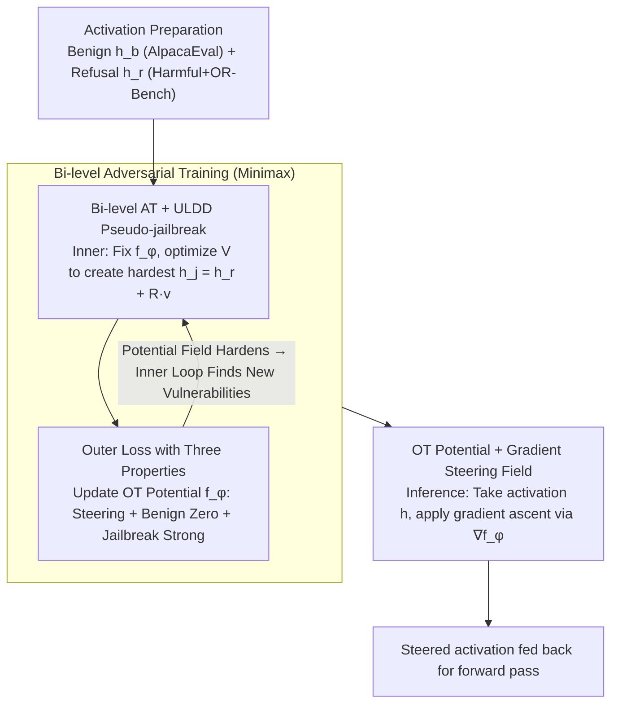

# Steering Beyond the Support: Adversarial Training on Unsupervised Jailbroken Activation Simulation

**Conference**: ICML 2026  
**arXiv**: [2605.24535](https://arxiv.org/abs/2605.24535)  
**Code**: None  
**Area**: LLM Safety / Jailbreak Defense / Activation Steering / Adversarial Training  
**Keywords**: safety steering, jailbreak defense, unsupervised latent direction, bi-level adversarial training, optimal transport

## TL;DR
This paper addresses the failure of supervised safety steering on unseen jailbreak attacks by proposing "unsupervised latent direction discovery + bi-level adversarial training" to simulate new jailbroken states in the activation space. These simulated states are used as adversarial samples to train an OT potential function (whose gradient forms a spatially varying steering field). The method reduces the attack success rate to under 5% across three LLMs and six classic jailbreak types while maintaining benign utility.

## Background & Motivation

**Background**: Safety steering is a mainstream lightweight solution for LLM jailbreak defense—intervening in hidden activations during inference without retraining the model (e.g., adding refusal directions linearly, conditional steering, or null-space constraints) to push triggers of harmful responses back into the refusal region while preserving benign functions.

**Limitations of Prior Work**: All such methods are **supervised**, requiring paired activations of "benign / known jailbreaks" as training support. However, real-world jailbreaks evolve constantly (GCG suffixes, AutoDAN, PAIR, TAP, FewShot, etc.), and training data only captures a fraction of them. Empirical evidence with AlphaSteer on Mistral-v2-7B (Tab. 1) shows that when trained on only a subset of jailbreak families, the SR for in-distribution attacks drops to 1.8–8.4, but rebounds to over 30% for unseen families. Supervised steering essentially learns local corrections around seen jailbreaks.

**Key Challenge**: Training support is **static and finite**, whereas the real distribution of jailbroken activations is **open and OOD**. One must choose between global intervention (damaging benign utility) or conditional intervention (failing to generalize).

**Goal**: (1) Expand training support zero-shot without relying on jailbreak labels; (2) achieve near-zero intervention on benign activations and strong intervention on jailbroken ones; (3) allow the steering mechanism to evolve to catch unseen attacks.

**Key Insight**: The authors leverage *unsupervised latent direction discovery* (ULDD; Mack & Turner 2024), which uses unlabeled prompts to find directions $V \in \mathbb{R}^{d\times K}$ in shallow layers. Injecting these can **causally** alter deep activations to induce various behaviors. Tab. 2 shows these directions can generate hundreds of successful "simulated jailbreaks" on LLaMA-3-8B / Mistral-v2-7B / Qwen-2.5-7B with cosine similarities <0.11, demonstrating high diversity.

**Core Idea**: Use ULDD to **extrapolate** OOD "pseudo-jailbroken activations" from refusal-state activations. This extrapolation is embedded into bi-level adversarial training: the inner loop generates pseudo-jailbreaks that are hardest for the current steering to correct, while the outer loop trains the steering to push these pseudo-jailbreaks back to the refusal region, **forcing the simulated support to approximate the real jailbreak subspace**.

## Method

### Overall Architecture

To solve the generalization issue of supervised steering, the framework integrates three components: upgrading the fixed refusal vector to a potential function gradient field, extrapolating OOD pseudo-jailbreak activations via ULDD, and using bi-level AT for co-evolution. Let the hidden state of an aligned LLM $F$ at layer $\ell$ be $h_\ell(x) \in \mathbb{R}^d$. The training phase maintains: benign activations $h_b$, refusal activations $h_r$ (1500 harmful requests + OR-Bench boundaries), a small MLP potential function $f_\phi: \mathbb{R}^d \to \mathbb{R}$, and $K$ ULDD directions $V \in \mathbb{R}^{d \times K}$. The inner step optimizes $V$ to find $h_j^{\text{adv}} = h_r + R v$ that is "hardest to steer" under the current $\phi$. The outer step updates $\phi$ to satisfy steerability, zero intervention on benign, and strong intervention on jailbroken activations. At test time, activations $h$ are updated via $K$ steps of gradient ascent: $h^{(k+1)} = h^{(k)} + \eta \nabla_h f_\phi(h^{(k)})$.

### Key Designs

**1. OT Potential + Gradient Steering Field: Replacing fixed vectors with input-dependent nonlinear fields**

Supervised steering typically applies a global refusal vector, treating benign and jailbroken activations identically. This work models the mapping from "jailbroken distribution $\mu \to$ refusal distribution $\nu$" as a Steiner-Wasserstein-1 transport. Using Kantorovich-Rubinstein duality $W_1(\mu,\nu) = \sup_{\|f\|_L \le 1}(\mathbb{E}_\mu[f] - \mathbb{E}_ \nu[f])$, a 1-Lipschitz potential function $f_\phi$ is trained to output large values for refusal activations and small values elsewhere. Its gradient $v_\phi(h) = \nabla_h f_\phi(h)$ naturally forms a field pushing $h$ toward the refusal region. Lipschitz constraints are enforced via WGAN-GP gradient penalties $L_{\text{GP}} = \mathbb{E}[\text{ReLU}(\|\nabla_{\hat h} f_\phi\|_2 - 1)]$. This MLP-based field suppresses fixed-vector limitations; Appendix G confirms MLP potentials outperform linear steering.

**2. Outer Loss with Three Properties: Potential difference and gradient norms as control knobs**

The potential field must distinguish between benign and jailbroken states. The outer loss comprises three terms. General steerability $L_g = L_{\text{OT}} + \lambda_{\text{GP}} L_{\text{GP}}$, where $L_{\text{OT}} = -(\mathbb{E}_{h_r}[f_\phi(h_r)] - \mathbb{E}_{h_-}[f_\phi(h_-)])$, increases the potential difference between refusal and other activations. Zero guidance for benign is achieved via gradient norm penalty $L_b = \mathbb{E}_{h_b}[\|\nabla_h f_\phi(h_b)\|_2^2]$, forcing the gradient at benign activations to zero. Conversely, strong guidance for jailbroken $L_j = -\mathbb{E}_{h_j}[\|\nabla_h f_\phi(h_j)\|_2^2]$ encourages large gradients near pseudo-jailbreaks. This spatially varies the steering intensity based on semantic location.

**3. Bi-level AT: Online generation of hardest pseudo-jailbreaks via ULDD**

The inner step fixes $\phi$ and updates $V$ to maximize $L_j(h_j^{\text{adv}}; f_\phi) + \gamma L_{\text{ULDD}}(h_r)$. The ULDD loss $L_{\text{ULDD}} = \mathbb{E}_{u\in U, v\in V}[\langle u, \Delta h_t(v)\rangle] - \lambda(\|U^\top U - I\|^2 + \|V^\top V - I\|^2)$ ensures directions induce significant and independent semantic shifts. This minimax setup makes $L_j$ a maximization in the inner loop (creating vulnerabilities) and a minimization in the outer loop (fixing them). Progress is measured by subspace coverage (Eq. 18-19), the ratio of energy of pseudo-jailbreaks projected onto real attack family $a$ subspaces. Coverage grows monotonically as Avg. SR decreases (Fig. 6-7).

### Loss & Training

The full bi-level minimax objective:  
Inner: $V \in \arg\max_V [L_j(h_j^{\text{adv}}; f_\phi) + \gamma L_{\text{ULDD}}(h_r)]$, where $h_j^{\text{adv}} = h_r + R v,\ v \sim V$.  
Outer: $\phi \in \arg\min_\phi L_g(h_b, h_r, h_j^{\text{adv}}; f_\phi) + \lambda_1 L_b(h_b; f_\phi) + \lambda_2 L_j(h_j^{\text{adv}}; f_\phi)$.  
Data: 500 AlpacaEval (Benign) + 500 OR-Bench (Boundary) + 1000 Harmbench samples.

## Key Experimental Results

### Main Results

Defense performance on Harmbench (StrongReject SR ↓):

| Model | Baseline | + CB | + LAT | + ROSI | + AlphaSteer | + Ours |
|------|------|------|-------|--------|--------------|--------|
| LLaMA-3-8B Safety Avg | 14.93 | **3.85** | 5.05 | 6.04 | 5.38 | 4.01 |
| Mistral-v2-7B Safety Avg | 59.72 | 5.42 | 6.70 | 8.47 | 5.86 | **5.26** |
| Qwen-2.5-7B Safety Avg | 33.27 | 5.70 | 5.82 | 7.80 | 4.48 | **4.46** |

Utility metrics (Tab. 4, Utility = (ARC + TruthfulQA + GSM8K)/3 − OR-FPR ↑):

| Model | Baseline | + CB | + LAT | + ROSI | + AlphaSteer | + Ours |
|------|------|------|-------|--------|--------------|--------|
| LLaMA-3-8B Utility | 56.5 | 14.0 | 23.5 | 30.1 | 37.9 | **46.5** |
| Mistral-v2-7B Utility | 56.4 | −26.0 | 24.5 | 20.7 | 31.4 | **36.6** |
| Qwen-2.5-7B Utility | 74.8 | 40.3 | 46.8 | 42.2 | 49.8 | **53.5** |

CB/LAT show strong defense but severe over-refusal (Mistral OR-FPR 83.3%). Ours maintains basic capabilities while keeping OR-FPR between 16–23%.

### Ablation Study

| Configuration | Mistral SR ↓ | Notes |
|------|--------------|------|
| Baseline Model | 63.34 | No defense |
| Ours (Non-adaptive) | 7.10 | Standard GCG, etc. |
| Adaptive GCG | 12.55 | Optimized suffix against defense |
| Steering-aware GCG | 15.54 | Optimization minimizes $\|\nabla f_\phi\|$ |

| Training Strategy | Trend | Notes |
|----------|------|------|
| Targeted AT | Coverage plateaus, SR stays high | Targeted prefixes limit diversity |
| Unsupervised AT (Ours) | Coverage rises across 6 families, SR drops | ULDD diversity enables broad coverage |
| Without AT | Coverage static, SR improvement limited | Bi-level AT is the primary driver |

### Key Findings

- **Subspace coverage correlates strongly with defense strength** (Fig. 6-7). The coverage increase is a mirror image of the SR decrease, providing an interpretable proxy for training.
- **Performance collapses without bi-level AT**, indicating the "vulnerability finding" process is more critical than potential function capacity alone.
- **Robustness against adaptive attacks**: Even when attackers optimize for zero gradient, the SR remains low compared to the baseline.
- **Improved OR-Bench performance**: High weight on benign zero-guidance $\lambda_1$ results in significantly lower OR-FPR than other strong defenses.

## Highlights & Insights

- Repurposing *unsupervised latent direction discovery* (typically for interpretability) as a "zero-cost jailbreak simulator" to create OOD attack samples in activation space is highly novel.
- Moving from fixed refusal vectors to gradient fields of potential functions decouples "where to steer" from "how hard to steer," allowing benign and jailbroken states to coexist in the same model layer.
- Subspace coverage via PCA energy ratios is a powerful metric for explaining why adversarial training generalizes.
- The framework effectively transfers the WGAN dual perspective to the activation space, replacing pixel-level perturbations with latent direction extrapolation.

## Limitations & Future Work

- Simulation is limited by "linear direction extrapolation." Non-natural language jailbreaks like base64 or ciphers might lie in regions unreachable by linear ULDD.
- Verification is restricted to 7-8B models; scalability to 70B+ and potential training costs remain unexplored.
- Inference latency increases due to $K$-step gradient ascent compared to one-shot linear steering.
- Sensitivity to hyperparameters like weights $\lambda_1, \lambda_2$ and extrapolation magnitude $R$ lacks exhaustive scanning in the main text.
- Bias in evaluators (StrongReject/Gemma-2B) for OR-FPR was not extensively discussed.

## Related Work & Insights

- **vs Refusal Direction / AlphaSteer**: These are linear steering methods using a **global fixed direction + supervised training**. This work adopts an MLP-based gradient field + unsupervised AT, outperforming them in both SR and Utility.
- **vs Conditional Activation Steering / JBShield**: These require labels to classify inputs. The proposed method bypasses the labeling problem by simulating jailbreaks via ULDD.
- **vs Circuit Breaker / LAT**: CB/LAT suppress harmful activations but suffer from high over-refusal (30-80%). This work explicitely optimizes for zero guidance on benign samples, reducing OR-FPR to 16–23%.
- **vs Mack & Turner (2024)**: While they used ULDD for probing/behavioral guidance, this work uses it to generate adversarial samples for security training—a paradigm that could be applied to hallucination or unlearning.

<!-- RELATED:START -->

## Related Papers

- [\[ICML 2026\] Adaptive Probe-based Steering for Robust LLM Jailbreaking](adaptive_probe-based_steering_for_robust_llm_jailbreaking.md)
- [\[NeurIPS 2025\] Short-length Adversarial Training Helps LLMs Defend Long-length Jailbreak Attacks](../../NeurIPS2025/llm_alignment/short-length_adversarial_training_helps_llms_defend_long-length_jailbreak_attack.md)
- [\[ICLR 2026\] AlphaSteer: Learning Refusal Steering with Principled Null-Space Constraint](../../ICLR2026/llm_alignment/alphasteer_learning_refusal_steering_with_principled_null-space_constraint.md)
- [\[ICML 2026\] Consistency Training Can Entrench Misalignment](consistency_training_can_entrench_misalignment.md)
- [\[CVPR 2026\] Principled Steering via Null-space Projection for Jailbreak Defense in Vision-Language Models](../../CVPR2026/llm_alignment/principled_steering_via_null-space_projection_for_jailbreak_defense_in_vision-la.md)

<!-- RELATED:END -->
