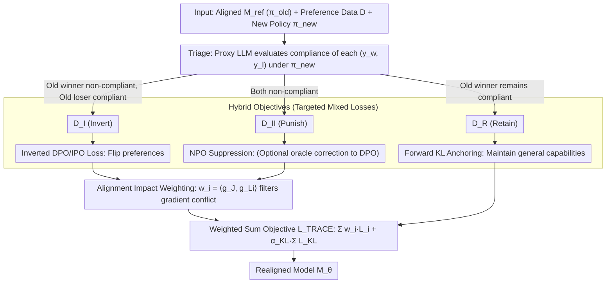

# The Realignment Problem: When Right becomes Wrong in LLMs

**Conference**: ICML 2026  
**arXiv**: [2511.02623](https://arxiv.org/abs/2511.02623)  
**Code**: Available (Released as mentioned in the paper)  
**Area**: LLM Alignment / Preference Learning / Policy Realignment  
**Keywords**: realignment, alignment-reality gap, triage, IPO, NPO, bilevel optimization

## TL;DR
This paper formalizes the problem of "what to do when policies change after model deployment" as the Realignment problem. It proposes the TRACE framework: using a stronger proxy model to classify existing preference pairs into three categories (Invert / Punish / Retain), followed by surgical realignment using a hybrid IPO+NPO+KL objective. This approach allows models to adapt to policy drift without a new round of human annotation.

## Background & Motivation

**Background**: For industrial LLM deployment, the mainstream alignment methods are RLHF / DPO, which train a model $\mathcal{M}_\theta$ using a binary preference dataset $\mathcal{D}=\{(x, y_w, y_l)\}$ derived from a BPO labeling pipeline. This alignment is guideline-dependent: once the data is internalized into parameters, the original policy guidelines become neither visible nor editable.

**Limitations of Prior Work**: Regulations (EU AI Act, NIST RMF), cultures, and organizational risk appetites are constantly evolving; what was compliant yesterday may be a violation today. Redoing full-scale human annotation is prohibitively expensive; machine unlearning can only delete but not "modify rules"; simply using NPO to punish old behaviors leads to over-conservatism and over-refusal; and influence function-based methods are hypersensitive to minor policy changes and difficult to implement for closed-source models.

**Key Challenge**: Policies are dynamic, while parametric alignment is immutable—creating an **Alignment-Reality Gap**. Existing methods are either too costly (re-labeling) or lack the right tools (unlearning/NPO lack positive signals).

**Goal**: Without re-labeling, treat "policy updates" as a **dataset re-interpretation** problem. Given a new policy $\pi_{\text{new}}$ and an existing preference dataset, automatically decide how to utilize each data point (invert / suppress / retain) and use surgical optimization to push the model toward the new policy without destroying general capabilities.

**Key Insight**: The authors introduce a simplified yet practical "non-blind" assumption—access to the original preference dataset is available (even if $\pi_{\text{old}}$ itself is unknown). This avoids the unstable operation of sampling thousands of responses to infer an implicit policy under blind settings.

**Core Idea**: Use a stronger proxy LLM as an oracle for $\pi_{\text{new}}$ to classify each $(y_w, y_l)$ pair into three categories. Then, perform fine-grained alignment using a hybrid loss of "IPO for inversion + NPO for suppression + KL for retention" combined with impact weighting via bilevel optimization.

## Method

### Overall Architecture
The starting point is a model $\mathcal{M}_{\text{ref}}$ aligned to $\pi_{\text{old}}$ and the original preference data $\mathcal{D}$. Given a new policy $\pi_{\text{new}}$ (a function returning compliant/non-compliant), TRACE follows three stages: **Stage 1 Triage** uses a proxy LLM to evaluate the compliance of each $(x, y_w, y_l)$ under $\pi_{\text{new}}$, assigning them to $\mathcal{D}_I$ (Invert), $\mathcal{D}_{II}$ (Punish), or $\mathcal{D}_R$ (Retain); **Stage 2 Hybrid Objectives** applies different losses to each category; **Stage 3 Alignment Impact Weighting** derives a weight $w_i$ for each sample via bilevel optimization, followed by a weighted sum optimization of the model $\mathcal{M}_\theta$.

### Key Designs

1.  **Triage: Three-way data split using the new policy as an oracle**:
    *   **Function**: Resolves the "False Dichotomy" error made by naive realignment-one cannot assume that if "$y_w$ is non-compliant, $y_l$ must be compliant," as $\pi_{\text{new}}$ might render both non-compliant.
    *   **Mechanism**: Uses a proxy LLM to evaluate $\pi_{\text{new}}(y_w|x)$ and $\pi_{\text{new}}(y_l|x)$ simultaneously. Pairs fall into three buckets: $\mathcal{D}_I$ (old winner non-compliant, old loser compliant; requires inversion), $\mathcal{D}_{II}$ (both non-compliant; requires suppression), and $\mathcal{D}_R$ (old winner remains compliant; retain). A theoretical fourth case where "both are compliant" is merged into $\mathcal{D}_R$ as it provides no discriminative signal for optimization.
    *   **Design Motivation**: The authors highlight that the Triage stage contributes the most to alignment gains—removing Triage and using a uniform punitive approach on the full dataset causes Target Policy Agreement to drop from 70.7% to 58.1%, a 12.6 percentage point decrease.

2.  **Hybrid Objectives: Targeted losses for specific needs**:
    *   **Function**: Uses different optimization signals for different conflict types to avoid wasting data or inducing over-refusal.
    *   **Mechanism**: For $\mathcal{D}_I$, an inverted DPO/IPO loss is used: $\mathcal{L}_I=-\log\sigma\big(\beta(\log\frac{p_\theta(y_l|x)}{p_{\text{ref}}(y_l|x)} - \log\frac{p_\theta(y_w|x)}{p_{\text{ref}}(y_w|x)})\big)$. For $\mathcal{D}_{II}$, NPO is used by default to suppress both $y_w$ and $y_l$; optionally, an oracle-LLM can generate a corrective response $y_c$ to use DPO loss on $(y_c, y_w)$. For $\mathcal{D}_R$, forward KL divergence $\mathcal{L}_{KL}=D_{KL}(\text{Logits}_{\mathcal{M}_{\text{ref}}} \| \text{Logits}_{\mathcal{M}_\theta})$ anchors general capabilities.
    *   **Design Motivation**: NPO alone provides only negative signals, turning models into "safe machines that answer nothing." Adding oracle corrections for $\mathcal{D}_{II}$ allows the model to learn "what to say" rather than just "what not to say." The KL term prevents catastrophic forgetting of the original distribution on the retain set.

3.  **Alignment Impact Weighting: Bilevel optimization weights**:
    *   **Function**: Ensures the scarce gradient budget is spent on samples that truly drive policy compliance, filtering out local updates that are orthogonal or conflicting with the global goal.
    *   **Mechanism**: Based on the U2A idea, the gradient of the global objective $\mathcal{J}$ (e.g., $\pi_{\text{new}}$ compliance), $g_\mathcal{J}=\nabla_\theta \mathcal{J}(\theta_{\text{ref}})$, is treated as the "gold standard direction." For each conflicting sample, its task gradient $g_{\mathcal{L}_i}=\nabla_\theta \mathcal{L}_i(\theta_{\text{ref}})$ is calculated to define weights $w_i=\langle g_\mathcal{J}, g_{\mathcal{L}_i}\rangle$. The final objective is $\mathcal{L}_{\text{TRACE}}(\theta)=\sum_{i\in\mathcal{D}_I\cup\mathcal{D}_{II}} w_i \mathcal{L}_i(\theta) + \alpha_{KL}\sum_{j\in\mathcal{D}_R}\mathcal{L}_{KL}(\theta;j)$.
    *   **Design Motivation**: This is an approximation of marginal gain derived from the implicit function theorem ($H_{\mathcal{L}_i}\approx \gamma I$ simplifies to dot product). It acts as a "gradient filter"—orthogonal sample weights are ~0, and opposing sample weights are negative, automatically avoiding harmful updates. Ablations show that removing impact weighting drops Target Policy Agreement by 7.4 points and is accompanied by degradation in GPQA and HellaSwag.

### Loss & Training
The final objective $\mathcal{L}_{\text{TRACE}}$ is provided above. $\beta$ is the DPO temperature, and $\alpha_{KL}$ is a fixed coefficient for the KL term on the retain set. Training was validated on three backbones: Qwen2.5-7B, Gemma-2-9B, and Llama-3.1-8B.

## Key Experimental Results

### Main Results (Pairwise Win Rate %, average across three backbones)

| Comparison | PKU-SafeRLHF | SynthValueBench | Label Consistency α |
|------|--------------|-----------------|--------------|
| DPO-Gold vs TRACE | 68.2 | 74.6 | 0.80-0.82 |
| **TRACE vs U2A** | **81.8** | **85.3** | 0.75-0.79 |
| U2A vs TRACE | 18.2 | 14.7 | — |

TRACE significantly outperforms the U2A baseline (~82-85% win rate). Meanwhile, the gap between TRACE and the "fully re-labeled gold standard" DPO-Gold is reasonable (DPO-Gold wins against TRACE only 68-75% of the time), indicating that TRACE has closed much of the gap between NPO-style methods and full re-labeling.

### Ablation Study & General Capability (PKU-SafeRLHF)

| Model | GPQA | MMLU | HellaSwag | GSM8K |
|------|------|------|-----------|-------|
| Base (Pre-alignment) | 31.6 | 70.6 | 81.4 | 70.4 |
| DPO-Gold (Full re-label) | 32.1 | 70.5 | 81.3 | 70.8 |
| **TRACE (Ours)** | 30.1 | 70.2 | 78.2 | 70.6 |
| U2A (Baseline) | 29.5 | 70.2 | 80.8 | 69.9 |

| Ablation (Llama-3.1-8B) | Target Policy Agree. | ASR | MMLU |
|----------------------|----------------------|-----|------|
| Full TRACE | 70.7 | 27.3 | ~70 |
| – Triage (Uniform punitive) | 58.1 (-12.6) | — | — |
| – Impact Weighting | 62.8 (-7.9) | 32.1 (+4.8) | — |
| – KL on Retain | ~70 | — | ~64 (-6.1) |

### Key Findings
- **Triage is the primary factor**: Removing it results in a -12.6 point drop, proving that "tri-categorizing data based on the new policy" contributes the core signal. This suggests to the community that the bottleneck of realignment lies in data re-interpretation rather than loss design.
- **Impact weighting improves performance and prevents degradation**: Removing it not only hurts alignment but also increases ASR and degrades HellaSwag/GPQA, confirming its role in filtering gradient conflicts.
- **KL term acts as a utility anchor**: Removing it doesn't change alignment but drops MMLU by 6 points, showing its role is purely to "prevent forgetting while learning the new."
- **Helpfulness comes at a cost**: TRACE drops 3 points on HellaSwag compared to the base. The authors honestly describe this as a "Helpfulness-Utility trade-off" rather than packaging it as lossless. This cost is acceptable in deployment scenarios where alignment is the priority.

## Highlights & Insights
- **Clear separation of realignment from unlearning**: Methods like U2A assume an existing forget set; TRACE provides the upstream solution for "how to derive a forget set from policy changes." This reframe is simple yet fundamental.
- **The triple-loss + weighted hybrid design is a reusable trick**: It can be applied to any "policy-driven behavior modification" scenario—safety redirection, brand voice switching, or regional compliance—not just RLHF.
- **Pragmatism of the non-blind assumption**: Instead of pretending to solve blind realignment (which requires sampling thousands of responses to estimate implicit policy and is unstable), the paper directly states "we have the original preference data." This setting is entirely reasonable under industrial BPO pipelines. The authors acknowledge a "theoretical ceiling for data-reuse realignment" instead of claiming it is a panacea.

## Limitations & Future Work
- The authors admit a robustness gap remains vs. DPO-Gold (adversarial ASR, win rate), reflecting the information upper bound of data-reuse methods—if $\pi_{\text{new}}$ introduces a new dimension completely uncovered by old data, new data is eventually needed.
- Dependence on the quality of proxy LLM judgments; biases in the proxy may propagate downstream; neutrality of proxies on subjective values (culture, politics) is questionable.
- Impact weighting uses an isotropic Hessian approximation, which may distort under strong loss landscape anisotropy.
- The decline in helpfulness on HellaSwag is real; re-weighting is needed for helpfulness-critical deployments (creative writing, customer service).
- Future directions: Making Triage continuous/fuzzy to adapt to non-binary preferences; introducing small-scale active labeling for information gaps between "new policy vs. old data."

## Related Work & Insights
- **vs DPO (Rafailov et al. 2023)**: DPO handles initial alignment assuming full new human preference data; TRACE handles post-deployment policy updates by recycling old data.
- **vs NPO (Zhang et al. 2024)**: NPO only suppresses bad responses, easily collapsing into over-conservatism; TRACE's Invert class uses IPO for positive signals and Punish class uses oracle correction, avoiding this failure mode.
- **vs U2A (Feng et al. 2025)**: U2A proposes forget set weighting but assumes the set is known; TRACE complements this by identifying the forget set.
- **vs value evaluation benchmarks (ValueBench, WorldValuesBench)**: These only diagnose value drift; TRACE provides a therapeutic intervention.

## Rating
- Novelty: ⭐⭐⭐⭐ The Triage stage is a clean new contribution; the hybrid loss and impact weighting are clever combinations of existing components.
- Experimental Thoroughness: ⭐⭐⭐⭐⭐ Three backbones × two datasets × human eval + adversarial tests + general capability + three types of ablations; very solid.
- Writing Quality: ⭐⭐⭐⭐⭐ Concepts like Realignment, Alignment-Reality Gap, and False Dichotomy are clearly framed; assumptions (non-blind) and costs (HellaSwag drop) are explicit.
- Value: ⭐⭐⭐⭐⭐ Directly addresses industrial deployment pain points with open-source code and high feasibility; LLM providers can adopt this immediately.

<!-- RELATED:START -->

## Related Papers

- [\[AAAI 2026\] When Human Preferences Flip: An Instance-Dependent Robust Loss for RLHF](../../AAAI2026/llm_alignment/when_human_preferences_flip_an_instance-dependent_robust_loss_for_rlhf.md)
- [\[ICML 2026\] When Distance Distracts: Representation Distance Bias in BT-Loss for Reward Models](when_distance_distracts_representation_distance_bias_in_bt-loss_for_reward_model.md)
- [\[ICML 2026\] PICACO: Pluralistic In-Context Value Alignment of LLMs via Total Correlation Optimization](picaco_pluralistic_in-context_value_alignment_of_llms_via_total_correlation_opti.md)
- [\[ICML 2025\] Diverging Preferences: When do Annotators Disagree and do Models Know?](../../ICML2025/llm_alignment/diverging_preferences_when_do_annotators_disagree_and_do_models_know.md)
- [\[NeurIPS 2025\] Ask a Strong LLM Judge when Your Reward Model is Uncertain](../../NeurIPS2025/llm_alignment/ask_a_strong_llm_judge_when_your_reward_model_is_uncertain.md)

<!-- RELATED:END -->
