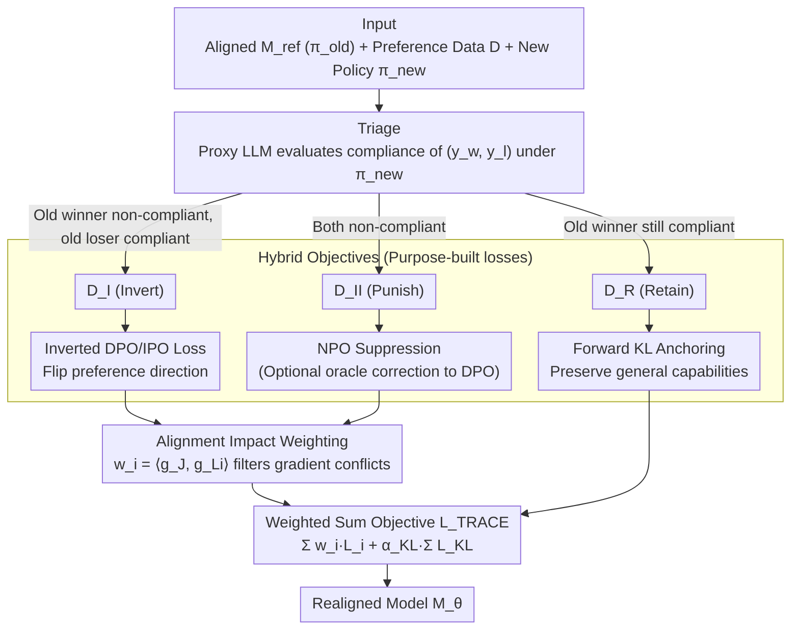

# The Realignment Problem: When Right becomes Wrong in LLMs

**Conference**: ICML 2026  
**arXiv**: [2511.02623](https://arxiv.org/abs/2511.02623)  
**Code**: Yes (Release mentioned in paper)  
**Area**: LLM Alignment / Preference Learning / Policy Realignment  
**Keywords**: realignment, alignment-reality gap, triage, IPO, NPO, bilevel optimization  

## TL;DR
This paper formalizes the problem of "what to do when policies change after model deployment" as the Realignment problem. It proposes the TRACE framework: using a stronger proxy model to categorize existing preference pairs into three classes (Invert / Punish / Retain), followed by a surgical realignment using hybrid IPO+NPO+KL objectives. This enables adaptation to policy drift without the need for a new round of human annotation.

## Background & Motivation

**Background**: For industrial LLM deployment, the mainstream alignment approach is RLHF / DPO — training a model $\mathcal{M}_\theta$ using a binary preference dataset $\mathcal{D}=\{(x, y_w, y_l)\}$ generated from a BPO annotation pipeline. This alignment is guideline-dependent: once data is integrated into parameters, the original policy guideline becomes invisible and immutable.

**Limitations of Prior Work**: Regulations (EU AI Act, NIST RMF), cultures, and organizational risk preferences are dynamic; behaviors compliant yesterday may be violations today. Redoing full-scale human annotation is prohibitively expensive; machine unlearning can only delete but not "modify rules"; pure NPO punishment of old behaviors makes models overly conservative, leading to over-refusal; influence function-based methods are sensitive to minor policy changes and difficult to implement for closed-source models.

**Key Challenge**: Policies are dynamic, but parametric alignment is immutable — creating an **Alignment-Reality Gap**. Existing methods are either "too costly (re-labeling)" or "the wrong tools (unlearning / NPO lacks positive signals)."

**Goal**: Without re-labeling by humans, transform "policy updates" into a **dataset re-interpretation** problem — given a new policy $\pi_{\text{new}}$ and an existing preference dataset, automatically determine how each data point should be used (invert / suppress / retain), then push the model toward the new policy via surgical optimization while preserving general capabilities.

**Key Insight**: The authors introduce a simplified but practical "non-blind" assumption — having access to the original preference dataset (even if $\pi_{\text{old}}$ itself is unknown). This avoids the unstable operations of sampling thousands of responses to infer an implicit policy under a blind setting.

**Core Idea**: Use a stronger proxy LLM as an oracle for $\pi_{\text{new}}$ to classify each $(y_w, y_l)$ pair into three categories, then perform fine-grained alignment using a hybrid loss of "IPO for inversion + NPO for suppression + KL for retention" combined with impact weighting via bilevel optimization.

## Method

### Overall Architecture
The starting point is a model $\mathcal{M}_{\text{ref}}$ aligned to $\pi_{\text{old}}$ and the original preference data $\mathcal{D}$. Given a new policy $\pi_{\text{new}}$ (a function returning compliant/non-compliant), TRACE follows three stages: **Stage 1 Triage** evaluates the compliance of each $(x, y_w, y_l)$ under $\pi_{\text{new}}$ using a proxy LLM, categorizing them into $\mathcal{D}_I$ (Invert), $\mathcal{D}_{II}$ (Punish), and $\mathcal{D}_R$ (Retain); **Stage 2 Hybrid Objectives** applies different losses to each category; **Stage 3 Alignment Impact Weighting** derives a weight $w_i$ for each sample via bilevel optimization, followed by a weighted sum optimization of model $\mathcal{M}_\theta$.

### Key Designs

1.  **Triage: Segmenting data into three categories using the new policy as an oracle**:
    - **Function**: Solves the "False Dichotomy" error in naive realignment — one cannot assume that "if $y_w$ is non-compliant, $y_l$ must be compliant," as $\pi_{\text{new}}$ might render both non-compliant.
    - **Mechanism**: A proxy LLM evaluates both $\pi_{\text{new}}(y_w|x)$ and $\pi_{\text{new}}(y_l|x)$. Pairs are bucketed: $\mathcal{D}_I$ (old winner non-compliant, old loser compliant; requires inversion), $\mathcal{D}_{II}$ (both non-compliant; requires suppression), $\mathcal{D}_R$ (old winner still compliant; retain). A theoretical fourth case, "both compliant," is merged into $\mathcal{D}_R$ as it provides no discriminative signal for optimization.
    - **Design Motivation**: The authors explicitly note that the Triage stage contributes most of the alignment gain — removing Triage and using a uniform punitive approach on all data drops Target Policy Agreement from 70.7% to 58.1% (a 12.6 point difference).

2.  **Hybrid Objectives: Purpose-built losses for specific conflicts**:
    - **Function**: Uses different optimization signals for different conflict types to avoid wasting data or inducing over-refusal.
    - **Mechanism**: For $\mathcal{D}_I$, an inverted DPO/IPO loss is used: $\mathcal{L}_I=-\log\sigma\big(\beta(\log\frac{p_\theta(y_l|x)}{p_{\text{ref}}(y_l|x)} - \log\frac{p_\theta(y_w|x)}{p_{\text{ref}}(y_w|x)})\big)$. For $\mathcal{D}_{II}$, NPO is used by default to suppress both $y_w$ and $y_l$; optionally, an oracle-LLM can generate a corrective response $y_c$ to switch to a DPO loss on $(y_c, y_w)$. For $\mathcal{D}_R$, a forward KL divergence $\mathcal{L}_{KL}=D_{KL}(\text{Logits}_{\mathcal{M}_{\text{ref}}} \| \text{Logits}_{\mathcal{M}_\theta})$ anchors general capabilities.
    - **Design Motivation**: NPO alone provides only negative signals, turning models into "safety machines" that refuse everything. Adding oracle corrections for $\mathcal{D}_{II}$ allows the model to learn "what to say" rather than just "what not to say." The KL term prevents catastrophic forgetting of the original distribution on the retain set.

3.  **Alignment Impact Weighting: Weights via Bilevel Optimization**:
    - **Function**: Ensures the scarce gradient budget is spent on samples that truly push policy compliance, filtering out local updates that are orthogonal or conflicting with global goals.
    - **Mechanism**: Based on the U2A idea, the gradient of the global objective $\mathcal{J}$ (e.g., $\pi_{\text{new}}$ compliance degree), $g_\mathcal{J}=\nabla_\theta \mathcal{J}(\theta_{\text{ref}})$, is treated as the "gold standard direction." For each conflicting sample, its specific task gradient $g_{\mathcal{L}_i}=\nabla_\theta \mathcal{L}_i(\theta_{\text{ref}})$ is computed to define the weight $w_i=\langle g_\mathcal{J}, g_{\mathcal{L}_i}\rangle$. The final objective is $\mathcal{L}_{\text{TRACE}}(\theta)=\sum_{i\in\mathcal{D}_I\cup\mathcal{D}_{II}} w_i \mathcal{L}_i(\theta) + \alpha_{KL}\sum_{j\in\mathcal{D}_R}\mathcal{L}_{KL}(\theta;j)$.
    - **Design Motivation**: This is a marginal gain approximation derived from the implicit function theorem (simplified to a dot product assuming $H_{\mathcal{L}_i}\approx \gamma I$). It acts as a "gradient filter" — orthogonal samples have weights near zero, and conflicting samples have negative weights, automatically avoiding harmful updates. Ablations show Target Policy Agreement drops 7.4 points without impact weighting, alongside degradation in GPQA and HellaSwag.

### Loss & Training
The final objective $\mathcal{L}_{\text{TRACE}}$ is provided above. $\beta$ is the DPO temperature, and $\alpha_{KL}$ is a fixed coefficient for the KL term on the retain set. Training was verified on three backbones: Qwen2.5-7B, Gemma-2-9B, and Llama-3.1-8B.

## Key Experimental Results

### Main Results (Pairwise Win Rate %, Average of 3 Backbones)

| Comparison | PKU-SafeRLHF | SynthValueBench | Annotation Consistency α |
| :--- | :--- | :--- | :--- |
| DPO-Gold vs TRACE | 68.2 | 74.6 | 0.80-0.82 |
| **TRACE vs U2A** | **81.8** | **85.3** | 0.75-0.79 |
| U2A vs TRACE | 18.2 | 14.7 | — |

TRACE significantly outperforms the U2A baseline (~82-85% win rate). The gap between TRACE and the "fully re-labeled gold standard" DPO-Gold is reasonable (DPO-Gold wins against TRACE only 68-75% of the time), suggesting TRACE bridges much of the gap between NPO-style methods and full re-labeling.

### Ablation Study & General Ability (PKU-SafeRLHF)

| Model | GPQA | MMLU | HellaSwag | GSM8K |
| :--- | :--- | :--- | :--- | :--- |
| Base (Pre-alignment) | 31.6 | 70.6 | 81.4 | 70.4 |
| DPO-Gold (Full re-label) | 32.1 | 70.5 | 81.3 | 70.8 |
| **TRACE (Ours)** | 30.1 | 70.2 | 78.2 | 70.6 |
| U2A (Baseline) | 29.5 | 70.2 | 80.8 | 69.9 |

| Ablation (Llama-3.1-8B) | Target Policy Agree. | ASR | MMLU |
| :--- | :--- | :--- | :--- |
| Full TRACE | 70.7 | 27.3 | ~70 |
| – Triage (Uniform punitive) | 58.1 (-12.6) | — | — |
| – Impact Weighting | 62.8 (-7.9) | 32.1 (+4.8) | — |
| – KL on Retain | ~70 | — | ~64 (-6.1) |

### Key Findings
- **Triage is the primary contributor**: Removing it causes a -12.6 point drop, indicating that "categorizing data by the new policy" provides the essential signal — suggesting that the bottleneck for realignment lies in data re-interpretation rather than loss design alone.
- **Impact weighting improves performance and prevents degradation**: Removing it not only hurts alignment but also increases ASR and degrades HellaSwag/GPQA, confirming its role in filtering gradient conflicts.
- **KL term serves as a utility anchor**: Removing it doesn't change alignment but drops MMLU by 6 points, showing its role is purely to prevent forgetting old knowledge while learning new policies.
- **Helpfulness comes at a cost**: Ours drops 3 points on HellaSwag compared to the base. The authors candidly describe this as a "Helpfulness-Utility trade-off" rather than claiming it's lossless — an acceptable cost in deployment scenarios where alignment is the priority.

## Highlights & Insights
- **Explicit decoupling of realignment and unlearning**: While methods like U2A assume a forget set is given, TRACE provides the upstream solution for "how to derive a forget set from policy changes." This reframe is a fundamental contribution.
- **Hybrid losses + weighted design is a reusable trick**: This architecture can be applied to any policy-driven behavior modification — safety redirection, brand voice switching, or regional compliance, not just RLHF.
- **Practical engineering in the non-blind assumption**: Instead of solving blind realignment (which requires thousands of samples to estimate implicit policy and is unstable), the paper assumes access to original preference data. This is entirely reasonable in industrial BPO pipelines. The authors acknowledge the info-theoretic ceiling of data-reuse realignment rather than presenting it as a panacea.

## Limitations & Future Work
- Authors admit a robustness gap remains compared to DPO-Gold (Adversarial ASR, win rate), reflecting the information limit of data-reuse methods — if $\pi_{\text{new}}$ introduces a new dimension not covered by old data, new data is inevitable.
- Reliance on the quality of proxy LLM judgments; biases in the proxy may propagate downstream, especially in subjective areas (culture, politics).
- Impact weighting uses an isotropic Hessian approximation, which may be inaccurate under strong loss landscape anisotropy.
- Helpfulness degradation on HellaSwag is real; deployment in helpfulness-critical scenarios (creative writing, customer service) requires re-balancing.
- Future work: Developing continuous / fuzzy triage to adapt to non-binary preferences; introducing small-scale active labeling for information gaps between new policies and old data.

## Related Work & Insights
- **vs DPO (Rafailov et al. 2023)**: DPO handles initial alignment assuming full new human preference data; TRACE handles post-deployment policy updates by recycling old data.
- **vs NPO (Zhang et al. 2024)**: NPO only suppresses bad responses and risk over-conservatism; TRACE's Invert class uses IPO for positive signals and Punish class uses oracle corrections, avoiding this failure mode.
- **vs U2A (Feng et al. 2025)**: U2A proposes forget set weighting but assumes the set is known. TRACE completes the pipeline by identifying the forget set.
- **vs value evaluation benchmarks (ValueBench, WorldValuesBench)**: These only diagnose value drift; TRACE provides a therapeutic intervention.

## Rating
- Novelty: ⭐⭐⭐⭐ The Triage stage is a clean new contribution; the hybrid loss and impact weighting are sophisticated combinations of existing components.
- Experimental Thoroughness: ⭐⭐⭐⭐⭐ Solidly executed across 3 backbones × 2 datasets × human eval + adversarial tests + general ability + 3 types of ablations.
- Writing Quality: ⭐⭐⭐⭐⭐ Clear framing with concepts like Realignment, Alignment-Reality Gap, and False Dichotomy. Assumptions (non-blind) and costs (HellaSwag drop) are transparently stated.
- Value: ⭐⭐⭐⭐⭐ Directly addresses industrial deployment pain points with open-code availability and high practical utility for LLM providers.

<!-- RELATED:START -->

## Related Papers

- [\[AAAI 2026\] When Human Preferences Flip: An Instance-Dependent Robust Loss for RLHF](../../AAAI2026/llm_alignment/when_human_preferences_flip_an_instance-dependent_robust_loss_for_rlhf.md)
- [\[ICML 2026\] PICACO: Pluralistic In-Context Value Alignment of LLMs via Total Correlation Optimization](picaco_pluralistic_in-context_value_alignment_of_llms_via_total_correlation_opti.md)
- [\[ICML 2025\] Diverging Preferences: When do Annotators Disagree and do Models Know?](../../ICML2025/llm_alignment/diverging_preferences_when_do_annotators_disagree_and_do_models_know.md)
- [\[NeurIPS 2025\] Ask a Strong LLM Judge when Your Reward Model is Uncertain](../../NeurIPS2025/llm_alignment/ask_a_strong_llm_judge_when_your_reward_model_is_uncertain.md)
- [\[ACL 2026\] WildFeedback: Aligning LLMs With In-situ User Interactions And Feedback](../../ACL2026/llm_alignment/wildfeedback_aligning_llms_with_in-situ_user_interactions_and_feedback.md)

<!-- RELATED:END -->
