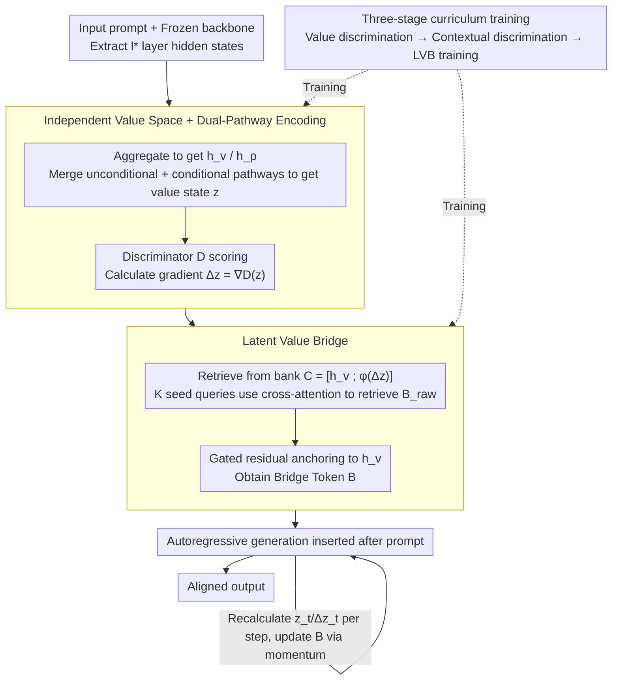

# Toward Stable Value Alignment: Introducing Independent Modules for Consistent Value Guidance

**Conference**: ICML 2026 Spotlight  
**arXiv**: [2605.11712](https://arxiv.org/abs/2605.11712)  
**Code**: https://github.com/Clervils/SVGT.git (Available)  
**Area**: LLM Alignment / RLHF Alternatives / Inference-time Guidance  
**Keywords**: Value Alignment, Inference-time Guidance, Bridge Tokens, Independent Value Modules, Safety

## TL;DR
This paper proposes SVGT, which shifts value alignment from "embedding into backbone parameters/activations" to "attaching an independent value module." This module first determines the safety direction within an isolated value space based on current hidden states, and then explicitly guides the generation trajectory using a set of learnable Bridge Tokens as attention anchors. Across four backbones, SVGT reduces harmful scores by over 70% with negligible loss in fluency.

## Background & Motivation

**Background**: Mainstream LLM alignment methods are categorized by their intervention timing: training-time methods (RLHF/PPO, DPO, IPO, KTO, Constitutional AI) optimize value preferences into the weights; inference-time methods (System Prompt, reward-guided decoding at the output layer, Representation Engineering like ITI/CAA/RE-Control at the activation layer) guide generation through prompts or hidden state interventions.

**Limitations of Prior Work**: Training-time methods "smear" values across billions of parameters, often resulting in safety being a shallow output pattern rather than a deep invariant representation, making them vulnerable to jailbreaks. While inference-time methods preserve weights, approaches like ITI/CAA that directly inject steering vectors into the residual stream frequently encounter inconsistent or inverse steering and significantly increase perplexity, affecting fluency.

**Key Challenge**: The authors identify a structural contradiction—stable value representation requires "continuous activation and coupling to generation across all contexts," whereas the residual stream is inherently highly dynamic. Value directions are iteratively reshaped, compressed, and drifted by task signals; when task-driven dynamics and value signals coexist in the same space within the backbone, the former systematically "displaces" the latter.

**Goal**: To re-characterize alignment as "generation-time optimization," allowing an independent module to actively perceive, judge, and guide during inference, rather than passively reading alignment priors from weights.

**Key Insight**: Drawing from cognitive science regarding human moral/value judgment (Haidt, Cushman): value reasoning relies on normative mechanisms that are stable across contexts and decoupled from specific task representations. Accordingly, value processing is moved entirely into an independent value space and acts back on the backbone through an "explicit interface."

**Core Idea**: A two-stage structure comprising an "Independent Value Space + Bridge Tokens." The former provides a context-invariant and stable value direction $\Delta\mathbf{z}$, while the latter translates abstract corrections into a set of learnable latent tokens. These serve as attention anchors inserted at the prefix, naturally influencing the generation trajectory through the frozen backbone's attention mechanism.

## Method

### Overall Architecture
SVGT transforms alignment from "encoding into backbone weights" to "attaching an external value module": the backbone $\theta_{\mathrm{LLM}}$ is frozen throughout, with an external value policy $\pi_\phi$ attached. It extracts hidden states from designated mid-to-late layers $l^*$, determines "whether the current generation direction is safe" within a value space isolated from the task space, provides a correction direction $\Delta\mathbf{z}=\nabla_\mathbf{z}\mathcal{D}(\mathbf{z})$, and translates this abstract correction into $K$ Bridge Tokens $\mathbf{B}\in\mathbb{R}^{K\times d}$ inserted after the prompt. Autoregressive generation is then steered by these tokens via the frozen attention mechanism. This structure extends standard decoding $P(y_t|y_{<t},x)$ into $P(y_t|y_{<t},x,\mathbf{c}_v)$ with explicit value context, where $\mathbf{c}_v=\pi_\phi(\mathcal{E}(\mathbf{h}))$.

### Key Designs

**1. Independent Value Space + Dual-Pathway Encoding: Isolating Value Directions from Dynamic Residual Streams**

**Design Motivation**: The residual stream's high dynamics cause value signals to be repeatedly squeezed and shifted. Instead of forcibly injecting steering vectors into the original space, SVGT uses an aggregation operator $\mathcal{A}$ (last-token or attention pooling) to extract the current state $\mathbf{h}_v$ and prompt context $\mathbf{h}_p$ from the hidden sequence $\mathbf{H}^{(l^*)}$. These are fused into an isolated value state $\mathbf{z}$ via two complementary pathways: the unconditional pathway $f_u(\mathbf{h}_v)$ learns "context-independent global value priors," while the conditional pathway $\mathrm{CrossAttn}(f_c(\mathbf{h}_v),f_c(\mathbf{h}_p))$ integrates prompt-specific information via cross-attention. The fusion yields $\mathbf{z}=\mathcal{R}\big(f_u(\mathbf{h}_v)+\lambda\cdot\mathrm{CrossAttn}(\cdots)\big)$. A discriminator $\mathcal{D}$ assigns an alignment score to $\mathbf{z}$, and the gradient direction $\Delta\mathbf{z}=\nabla_\mathbf{z}\mathcal{D}(\mathbf{z})$ defines the required correction (following PPLM's gradient guidance but isolated from the residual stream). Dual pathways are used because the safety of a response can depend on the prompt—unconditional encoding alone cannot distinguish this, whereas the dual structure separates stable priors from prompt-specific corrections.

**2. Latent Value Bridge: Translating Abstract Corrections into Attention Anchors the Backbone can "See"**

**Mechanism**: $\Delta\mathbf{z}$ is an abstract direction in the value space not directly readable by the backbone. The LVB projects it into $K$ tokens that enter the attention mechanism. First, a retrieval bank $\mathbf{C}=[\mathbf{h}_v;\phi(\Delta\mathbf{z})]^\top$ is constructed, projecting the prompt terminal state and value correction to the backbone dimension $d$. Then, $K$ learnable seed queries $\mathbf{Q}$ retrieve $\mathbf{B}_{\mathrm{raw}}=\mathrm{softmax}(\mathbf{Q}\mathbf{C}^\top/\sqrt{d})\mathbf{C}$ through cross-attention. Finally, $\mathbf{B}=\mathrm{LayerNorm}(\mathbf{1}_K\mathbf{h}_v+\alpha\cdot\mathbf{B}_{\mathrm{raw}})$ anchors them to valid $\mathbf{h}_v$ via gated residuals, with the gate $\alpha$ initialized near zero. Since Bridge Tokens are weighted combinations of existing valid hidden states rather than outlier vectors, they reside on the backbone's learned manifold, minimizing perplexity increases. They are "late-bound"—inserted after the prompt is processed to ensure guidance is built on complete semantics without polluting context representations. During generation, LVB runs dynamically, recalculating $\mathbf{z}_t$ and $\Delta\mathbf{z}_t$ per token to adaptively strengthen guidance when the model deviates and relax it when safe.

**3. Three-stage Curriculum Training: Stepwise Acquisition of Discrimination and Guidance Capabilities**

**Function**: Given the disparity in difficulty between value judgment and language generation, end-to-end training can be counterproductive. Capability is unlocked via curriculum learning. Stage 1 trains the unconditional encoder + discriminator using standard BCE on text samples to establish general priors for toxicity/unsafe instructions. Stage 2 trains the conditional pathway on prompt-response pairs using asymmetric learning rates (low LR for the unconditional branch, high LR for the conditional branch) to maintain functional separation. Stage 3 freezes the backbone, encoder, and discriminator to train the projector using a weighted loss: CE for teacher-forcing behavioral cloning, safety loss $\mathcal{L}_{\mathrm{safe}}=\mathrm{mean}(\mathrm{softplus}(s)+\alpha\,\mathrm{ReLU}(s))$ for dense token-level supervision, and manifold regularization $\mathcal{L}_{\mathrm{reg}}=\max\big(\big|\,\|\mathbf{B}\|/\|\mathbf{h}_{M-1}\|-1\,\big|-\tau,\,0\big)$ to keep Bridge output energy close to the prompt state, preventing it from leaving the valid manifold.

### Loss & Training
The total objective for Stage 3 is $\mathcal{L}_{\mathrm{total}}=\lambda_{\mathrm{ce}}\mathcal{L}_{\mathrm{ce}}+\lambda_{\mathrm{safe}}\mathcal{L}_{\mathrm{safe}}+\lambda_{\mathrm{reg}}\mathcal{L}_{\mathrm{reg}}$. Key hyperparameters: number of Bridge Tokens $K=5\text{-}10$, value space dimension $d_v=128\text{-}256$, and hidden extraction from mid-to-late layers (layer 20 for Llama-3.2-3B). Zero-initialization of the gate $\alpha$ and manifold regularization ensure that early training does not disrupt generation quality.

## Key Experimental Results

### Main Results
Across four backbones (GPT-2 124M / Qwen2-1.5B / Llama-3.2-3B / Mistral-7B) and three alignment baselines (System Prompt, DPO+LoRA, ITI/RE-Control), SVGT shows comprehensive leads. On Llama-3.2-3B:

| Method | WildGuard Harmful↓ | BeaverTails↓ | HarmBench ASR↓ | HarmBench Refusal↑ | PPL (Fluency) |
|------|------------------|--------------|----------------|-------------------|---------------|
| No Guidance | 29.69 | 58.95 | 67.00 | 27.5 | 6.71 |
| System Prompt | 13.73 | 42.04 | 37.00 | 70.5 | 6.92 |
| DPO (LoRA) | 8.28 | 34.71 | 25.50 | 69.2 | 9.21 |
| ITI | 12.97 | 40.63 | 28.70 | 65.0 | 11.01 |
| RE-Control | 12.22 | 39.27 | 30.50 | 70.5 | 9.54 |
| **SVGT (Ours)** | **7.84** | **28.58** | **18.50** | **75.5** | **7.34** |

On Mistral-7B, improvements are more pronounced: BeaverTails dropped from 50.90 to 13.40 (−73.7%), refusal rate increased from 18.4% to 92%, and PPL remained nearly stable at 5.52 compared to 5.60; ITI pushed PPL to 10.31.

### Ablation Study

| Configuration | WildGuard↓ | BeaverTails↓ | PPL |
|------|-----------|--------------|-----|
| No Guidance | 29.69 | 58.95 | 6.71 |
| SVGT-Inject (Direct residual injection) | 13.29 | 37.33 | — |
| SVGT-Bridge (Ours, Bridge Token mechanism) | 7.84 | 28.58 | 7.34 |

| Stage 1 → Stage 2 Discrimination Accuracy (Llama-3.2-3B BeaverTails) | Acc | F1 | AUROC |
|---|---|---|---|
| Unconditional only | 68.55 | 68.42 | 78.45 |
| + Conditional | 83.48 (+14.9) | 83.06 (+14.6) | 90.91 (+12.5) |

Conditional encoding significantly improves performance on context-dependent data like BeaverTails, validating the dual-pathway design.

### Key Findings
- Bridge Tokens reduce harmful scores by ~40% more than direct residual injection (SVGT-Inject), proving explicit attention anchors and late-binding are superior to steering vectors.
- **Consistency across scales**: ASR was reduced by 70%-80% and refusal rates pushed to 75%+ from GPT-2 (124M) to Mistral-7B, showing alignment efficacy is independent of backbone size or pre-alignment quality.
- **PPL and Fluency**: While ITI/RE-Control increased PPL by 60%-80%, SVGT remained close to baseline (Llama-3.2-3B +9%, GPT-2 even decreased) because Bridge Tokens are constrained to the learned manifold.
- **Dynamic Adaptation**: In adversarial prompt experiments, while unguided trajectories remained in high-risk zones, SVGT's harmful scores consistently decreased as decoding progressed, proving the efficacy of token-level correction.
- **Acceptable Overhead**: VRAM +3%, latency +52%-65%, and robust to Bridge refresh intervals $r\in[1,10]$, allowing for performance-efficiency trade-offs.

## Highlights & Insights
- **Structural vs. Parametric Alignment**: Moving value processing out of the backbone is a paradigm shift—preserving original model capabilities while avoiding the "shallow pattern" issues of RLHF. Alignment evolves with the module rather than being fixed in a specific training version.
- **Bridge Tokens as "Attention Interfaces for Values"**: Using learnable tokens as anchors is an elegant design—leveraging existing attention mechanisms without adding parameters to the main network and avoiding residual stream pollution. This can extend to other scenarios like multi-modal alignment or role-playing.
- **Reuse of Gradient-based Correction**: Applying $\Delta\mathbf{z}=\nabla\mathcal{D}$ follows PPLM's steering concept but modularizes it. By calculating gradients in an isolated value space and projecting them back via Bridge Tokens, SVGT performs "gradient calculation in a quotient space and lifting back to the original space," which is geometrically cleaner.

## Limitations & Future Work
- The value space was trained only on safety-related binary labels; scalability to diverse values (fairness, privacy, etc.) is unverified.
- Discriminator $\mathcal{D}$ relies on explicit supervision; deploying SVGT to areas without human labels (e.g., financial compliance) would require retraining.
- Dynamic LVB recalculation adds 50%-65% latency, which is acceptable for chatbots but might be a bottleneck for high-throughput batch inference.
- The selections of $K$, $d_v$, and $l^*$ remain empirical, lacking automated or theoretically-backed design guidance.
- Consistency over very long sequences (thousands of tokens) needs further validation to ensure Bridge Tokens are not diluted.

## Related Work & Insights
- **vs. DPO/RLHF**: Unlike DPO which embeds preferences in weights, SVGT is plug-and-play, allowing for local safety hardening without affecting general capabilities.
- **vs. ITI/CAA/RE-Control (Representation Engineering)**: These disrupt internal representations and spike PPL; SVGT uses the attention interface to maintain fluency and dynamic adjustment.
- **vs. Prompt Engineering / System Prompt**: System prompts are easily overridden by adversarial prompts; SVGT's hidden-layer tracking and correction are more robust to jailbreaks.
- **vs. PPLM**: While both use $\nabla\mathcal{D}$ for guidance, PPLM's direct hidden state modification is inefficient and unstable; SVGT modularizes and stabilizes this process via Bridge Tokens.

## Rating
- **Novelty**: ⭐⭐⭐⭐ The "independent value module + Bridge Token anchor" is a clear and original alignment paradigm.
- **Experimental Thoroughness**: ⭐⭐⭐⭐ Performance across four scales, multiple baselines, and benchmarks is comprehensive, though diverse value scenarios are missing.
- **Writing Quality**: ⭐⭐⭐⭐ Motivation is logically sound (Cognitive Science $\rightarrow$ Structural Contradiction $\rightarrow$ Design), and diagrams are clear.
- **Value**: ⭐⭐⭐⭐ Provides an industrially deployable solution for plug-and-play safety hardening with minimal impact on fluency.

<!-- RELATED:START -->

## Related Papers

- [\[ACL 2025\] Internal Value Alignment in Large Language Models through Controlled Value Vector Activation](../../ACL2025/llm_alignment/internal_value_alignment_in_large_language_models_through_controlled_value_vecto.md)
- [\[ICML 2026\] PICACO: Pluralistic In-Context Value Alignment of LLMs via Total Correlation Optimization](picaco_pluralistic_in-context_value_alignment_of_llms_via_total_correlation_opti.md)
- [\[ACL 2026\] How Value Induction Reshapes LLM Behaviour](../../ACL2026/llm_alignment/how_value_induction_reshapes_llm_behaviour.md)
- [\[ICLR 2026\] Unifying Stable Optimization and Reference Regularization in RLHF (DAR)](../../ICLR2026/llm_alignment/unifying_stable_optimization_and_reference_regularization_in_rlhf.md)
- [\[CVPR 2026\] DRM: Diffusion-based Reward Model With Step-wise Guidance](../../CVPR2026/llm_alignment/drm_diffusion-based_reward_model_with_step-wise_guidance.md)

<!-- RELATED:END -->
