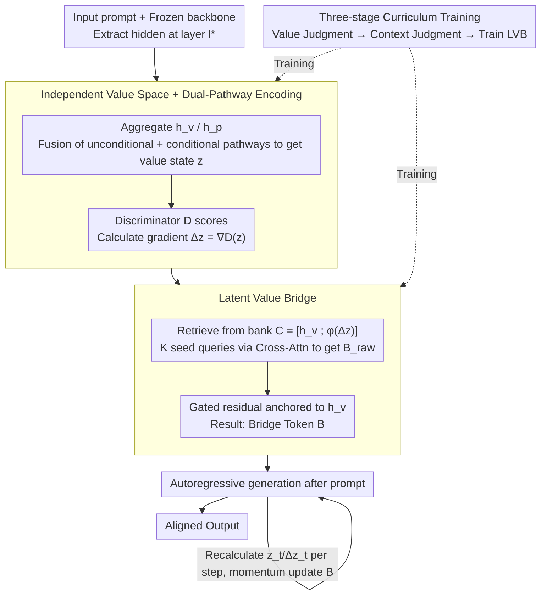

# Toward Stable Value Alignment: Introducing Independent Modules for Consistent Value Guidance

**Conference**: ICML 2026 Spotlight  
**arXiv**: [2605.11712](https://arxiv.org/abs/2605.11712)  
**Code**: https://github.com/Clervils/SVGT.git (Available)  
**Area**: LLM Alignment / RLHF Alternatives / Inference-time Guidance  
**Keywords**: Value Alignment, Inference-time Guidance, Bridge Tokens, Independent Value Modules, Safety

## TL;DR
This paper proposes SVGT, which shifts value alignment from "embedding in backbone parameters/activations" to "attaching an independent value module." It first continuously determines safety directions within an isolated value space based on current hidden states, and then explicitly guides generation trajectories using a set of learnable Bridge Tokens as attention anchors. Across four backbones, it consistently reduces toxicity scores by over 70% with almost no loss in fluency.

## Background & Motivation

**Background**: Mainstream LLM alignment methods can be categorized into two types based on intervention timing: training-time (RLHF/PPO, DPO, IPO, KTO, Constitutional AI), which optimizes value preferences into weights; and inference-time (System Prompt, reward-guided decoding at the output layer, Representation Engineering at the activation layer like ITI/CAA/RE-Control), which guides generation through prompts or hidden state interventions.

**Limitations of Prior Work**: Training-time methods "spread" values across billions of parameters, often causing safety to degenerate into shallow output patterns rather than deep invariant representations, making them susceptible to jailbreaks. While inference-time methods do not modify weights, approaches like ITI/CAA that directly inject steering vectors into the residual stream often exhibit inconsistent or inverse steering and increase perplexity, affecting fluency.

**Key Challenge**: The authors identify a structural contradiction—stable value representation requires being "continuously activatable and coupled to generation across all contexts," whereas the residual stream is inherently highly dynamic. Value directions are iteratively reshaped, compressed, and shifted by task signals. When task-driven dynamics and value signals coexist in the same space within the backbone, the former systematically "crowds out" the latter.

**Goal**: To reframe alignment as "generation-time optimization," allowing an independent module to actively perceive, judge, and guide during inference, rather than passively reading alignment priors from weights.

**Key Insight**: Drawing from cognitive science theories of human moral/value judgment (Haidt, Cushman): value reasoning relies on normative mechanisms stable across contexts and decoupled from specific task representations. Accordingly, value processing is moved entirely into an independent value space and then acts back on the backbone through an "explicit interface."

**Core Idea**: A two-stage structure consisting of an "Independent Value Space + Bridge Tokens." The former provides a context-invariant and stable value direction $\Delta\mathbf{z}$, while the latter translates abstract corrections into a set of learnable latent tokens. These serve as attention anchors inserted at the prefix, naturally influencing the generation trajectory through the frozen backbone's attention mechanism.

## Method

### Overall Architecture
SVGT changes alignment from "writing into backbone weights" to "adding an external value module." The backbone $\theta_{\mathrm{LLM}}$ remains frozen, while an external independent value policy $\pi_\phi$ is attached. It extracts hidden states from specified mid-to-late layers $l^*$, determines if the "current generation direction is safe" within a value space isolated from the task space, provides a correction direction $\Delta\mathbf{z}=\nabla_\mathbf{z}\mathcal{D}(\mathbf{z})$, and translates this abstract correction into $K$ Bridge Tokens $\mathbf{B}\in\mathbb{R}^{K\times d}$. These are inserted after the prompt, pulling the autoregressive generation under the influence of frozen attention. This architecture extends standard decoding $P(y_t|y_{<t},x)$ to $P(y_t|y_{<t},x,\mathbf{c}_v)$ with explicit value context, where $\mathbf{c}_v=\pi_\phi(\mathcal{E}(\mathbf{h}))$.

### Key Designs

**1. Independent Value Space + Dual-Pathway Encoding: Isolating value directions from the dynamic residual stream**

Addressing the issue where the residual stream is highly dynamic and value signals are suppressed, SVGT avoids direct steering vector injection. It uses an aggregation operator $\mathcal{A}$ (last-token or attention pooling) to extract the current state $\mathbf{h}_v$ and prompt context $\mathbf{h}_p$ from hidden sequences $\mathbf{H}^{(l^*)}$. These are fused into an isolated value state $\mathbf{z}$ via two pathways: the unconditional pathway $f_u(\mathbf{h}_v)$ learns "context-independent global value priors," and the conditional pathway $\mathrm{CrossAttn}(f_c(\mathbf{h}_v),f_c(\mathbf{h}_p))$ integrates prompt specificity. The result is weighted as $\mathbf{z}=\mathcal{R}\big(f_u(\mathbf{h}_v)+\lambda\cdot\mathrm{CrossAttn}(\cdots)\big)$. A discriminator $\mathcal{D}$ assigns an alignment score to $\mathbf{z}$, and the gradient $\Delta\mathbf{z}=\nabla_\mathbf{z}\mathcal{D}(\mathbf{z})$ defines the correction (following PPLM's gradient guidance but within an isolated space). The dual-pathway approach ensures safety judgments, which may vary depending on the prompt, are accurate by separating stable priors from prompt-specific adjustments.

**2. Latent Value Bridge: Translating abstract corrections into attention anchors "visible" to the backbone**

$\Delta\mathbf{z}$ in the value space is an abstract direction not directly read by the backbone. The LVB maps it into $K$ tokens that enter the attention mechanism. First, a retrieval bank $\mathbf{C}=[\mathbf{h}_v;\phi(\Delta\mathbf{z})]^\top$ is constructed by projecting the prompt state and value correction to backbone dimension $d$. Then, $K$ learnable seed queries $\mathbf{Q}$ retrieve $\mathbf{B}_{\mathrm{raw}}=\mathrm{softmax}(\mathbf{Q}\mathbf{C}^\top/\sqrt{d})\mathbf{C}$ via cross-attention. Finally, a gated residual $\mathbf{B}=\mathrm{LayerNorm}(\mathbf{1}_K\mathbf{h}_v+\alpha\cdot\mathbf{B}_{\mathrm{raw}})$ anchors it to a valid $\mathbf{h}_v$, with the gate $\alpha$ initialized near zero. These Bridge Tokens are weighted combinations of existing valid hiddens rather than out-of-distribution vectors, ensuring they fall on the backbone's learned manifold and minimize perplexity impact. They are "late-binding," inserted after prompt processing, and dynamically updated per token via momentum, allowing adaptive correction.

**3. Three-stage Curriculum Training: Step-wise transition from "judging" to "dynamic judging" to "guiding generation"**

Since value judgment and language generation differ in difficulty, curriculum learning is used. Stage 1 trains the unconditional encoder + discriminator on independent text samples using BCE to establish general toxicity/safety priors. Stage 2 trains the conditional pathway on prompt-response pairs using asymmetric learning rates (low LR for unconditional, high LR for conditional) to enforce functional separation. Stage 3 freezes the backbone, encoder, and discriminator to train the projector with three weighted losses: CE for imitation, safety loss $\mathcal{L}_{\mathrm{safe}}=\mathrm{mean}(\mathrm{softplus}(s)+\alpha\,\mathrm{ReLU}(s))$ for token-level supervision, and manifold regularization $\mathcal{L}_{\mathrm{reg}}=\max\big(\big|\,\|\mathbf{B}\|/\|\mathbf{h}_{M-1}\|-1\,\big|-\tau,\,0\big)$ to keep Bridge output energy close to the prompt state.

### Loss & Training
The total objective for Stage 3 is $\mathcal{L}_{\mathrm{total}}=\lambda_{\mathrm{ce}}\mathcal{L}_{\mathrm{ce}}+\lambda_{\mathrm{safe}}\mathcal{L}_{\mathrm{safe}}+\lambda_{\mathrm{reg}}\mathcal{L}_{\mathrm{reg}}$. Key hyperparameters: number of Bridge Tokens $K=5\text{-}10$, value space dimensionality $d_v=128\text{-}256$, and hidden extraction from mid-to-late layers (e.g., layer 20 for Llama-3.2-3B). Zero-initialized gate $\alpha$ and manifold regularization prevent early training from disturbing generation quality.

## Key Experimental Results

### Main Results
SVGT consistently outperforms across four backbones (GPT-2 124M / Qwen2-1.5B / Llama-3.2-3B / Mistral-7B) and three baseline types (System Prompt, DPO+LoRA, ITI/RE-Control). On Llama-3.2-3B:

| Method | WildGuard Toxicity↓ | BeaverTails↓ | HarmBench ASR↓ | HarmBench Denial↑ | PPL (Fluency) |
|------|------------------|--------------|----------------|-------------------|---------------|
| No Guidance | 29.69 | 58.95 | 67.00 | 27.5 | 6.71 |
| System Prompt | 13.73 | 42.04 | 37.00 | 70.5 | 6.92 |
| DPO (LoRA) | 8.28 | 34.71 | 25.50 | 69.2 | 9.21 |
| ITI | 12.97 | 40.63 | 28.70 | 65.0 | 11.01 |
| RE-Control | 12.22 | 39.27 | 30.50 | 70.5 | 9.54 |
| **SVGT** | **7.84** | **28.58** | **18.50** | **75.5** | **7.34** |

On Mistral-7B, performance is even more significant: BeaverTails scores dropped from 50.90 to 13.40 (−73.7%), denial rate increased from 18.4% to 92%, and PPL remained stable (even decreasing from 5.60 to 5.52), while ITI pushed PPL to 10.31.

### Ablation Study

| Configuration | WildGuard↓ | BeaverTails↓ | PPL |
|------|-----------|--------------|-----|
| No Guidance | 29.69 | 58.95 | 6.71 |
| SVGT-Inject (Injecting correction into residual) | 13.29 | 37.33 | — |
| SVGT-Bridge (Full version with Bridge Tokens) | 7.84 | 28.58 | 7.34 |

| Stage 1 → Stage 2 Value Judgment Accuracy (Llama-3.2-3B BeaverTails) | Acc | F1 | AUROC |
|---|---|---|---|
| Unconditional only | 68.55 | 68.42 | 78.45 |
| + Conditional | 83.48 (+14.9) | 83.06 (+14.6) | 90.91 (+12.5) |

The conditional encoding significantly improves results on context-dependent data like BeaverTails, justifying the dual-pathway design.

### Key Findings
- Bridge Tokens reduce toxicity by ~40% compared to direct injection (SVGT-Inject), proving "explicit attention anchors + late-binding" is superior to "steering vector injection."
- Consistency across scales: ASR is reduced by 70%-80% from GPT-2 to Mistral-7B, showing alignment efficacy is independent of backbone size or pre-alignment quality.
- PPL and Fluency: While ITI/RE-Control increase PPL by 60%-80%, SVGT remains close to the baseline (Llama-3.2-3B +9%, GPT-2 actually decreased) because Bridge Tokens are constrained to learned manifolds.
- Dynamic Adversarial Experiments: SVGT's per-token $\Delta\mathbf{z}_t$ allows real-time correction, whereas unguided trajectories remain in high-risk zones.
- Acceptable Overhead: VRAM +3%, Latency +52%-65%, and robust to Bridge refresh intervals $r\in[1,10]$, allowing flexibility.

## Highlights & Insights
- **Structural vs. Parametric Alignment**: Moving value processing out of the backbone is a paradigm shift—preserving original model capabilities (frozen backbone) while avoiding shallow pattern issues in RLHF. Alignment evolves with the module rather than the training version.
- **Bridge Tokens as "Attention Interface for Values"**: Using tokens as anchors is elegant. It reuses existing attention mechanisms without adding parameters to the main network and avoids residual stream contamination.
- **Reuse of Gradient Correction Signals**: Using $\Delta\mathbf{z}=\nabla\mathcal{D}$ as a steering direction follows PPLM but modularizes and stabilizes it by performing the operation in a quotient space before lifting it back to the original space.
- The use of curriculum training and asymmetric learning rates is a subtle but vital detail that ensures pathways do not converge into redundant functions.

## Limitations & Future Work
- The value space was trained only on safety labels; scalability to multi-dimensional values (fairness, privacy, medical ethics) is unverified.
- Discriminator $\mathcal{D}$ still relies on supervised labels; deployment to new domains without human labels requires retraining, so it is not true zero-shot alignment.
- Dynamic LVB increases latency by 50%-65%, which might be an issue for high-throughput batch inference.
- The choice of $K$, $d_v$, and $l^*$ remains empirical without automated or interpretability-based guidance.
- Long-range consistency needs further validation to ensure Bridge Tokens are not diluted during very long sequence generation.

## Related Work & Insights
- **vs DPO/RLHF**: DPO embeds preferences into weights and requires full retraining. SVGT is plug-and-play and does not compromise general capabilities.
- **vs ITI/CAA/RE-Control (Representation Engineering)**: These methods disrupt internal representations and spike PPL; SVGT uses the attention interface to maintain fluency and dynamic adjustment.
- **vs Prompt Engineering / System Prompt**: System prompts lack deep guidance and are easily bypassed. SVGT is more robust to jailbreaks by tracking and correcting at the hidden level.
- **vs PPLM**: SVGT modularizes the gradient-as-guidance idea of PPLM, moving it from the inefficient/unstable residual stream to a controlled value space.

## Rating
- Novelty: ⭐⭐⭐⭐ The "Independent Value Module + Bridge Token Anchors" is a clear and original alignment paradigm.
- Experimental Thoroughness: ⭐⭐⭐⭐ Comprehensive cross-scale backbones, baselines, and benchmarks, though multi-value scenarios are missing.
- Writing Quality: ⭐⭐⭐⭐ Motivation and design are logically connected and diagrams are clear.
- Value: ⭐⭐⭐⭐ Provides a deployable plug-and-play safety solution for released models with minimal fluency loss.

<!-- RELATED:START -->

## Related Papers

- [\[ICML 2026\] VALUEFLOW: Toward Pluralistic and Steerable Value-based Alignment in Large Language Models](valueflow_toward_pluralistic_and_steerable_value-based_alignment_in_large_langua.md)
- [\[ICLR 2026\] EigenBench: A Comparative Behavioral Measure of Value Alignment](../../ICLR2026/llm_alignment/eigenbench_a_comparative_behavioral_measure_of_value_alignment.md)
- [\[ACL 2025\] Internal Value Alignment in Large Language Models through Controlled Value Vector Activation](../../ACL2025/llm_alignment/internal_value_alignment_in_large_language_models_through_controlled_value_vecto.md)
- [\[ICLR 2026\] Pretrain Value, Not Reward: Decoupled Value Policy Optimization](../../ICLR2026/llm_alignment/pretrain_value_not_reward_decoupled_value_policy_optimization.md)
- [\[ICML 2026\] PICACO: Pluralistic In-Context Value Alignment of LLMs via Total Correlation Optimization](picaco_pluralistic_in-context_value_alignment_of_llms_via_total_correlation_opti.md)

<!-- RELATED:END -->
