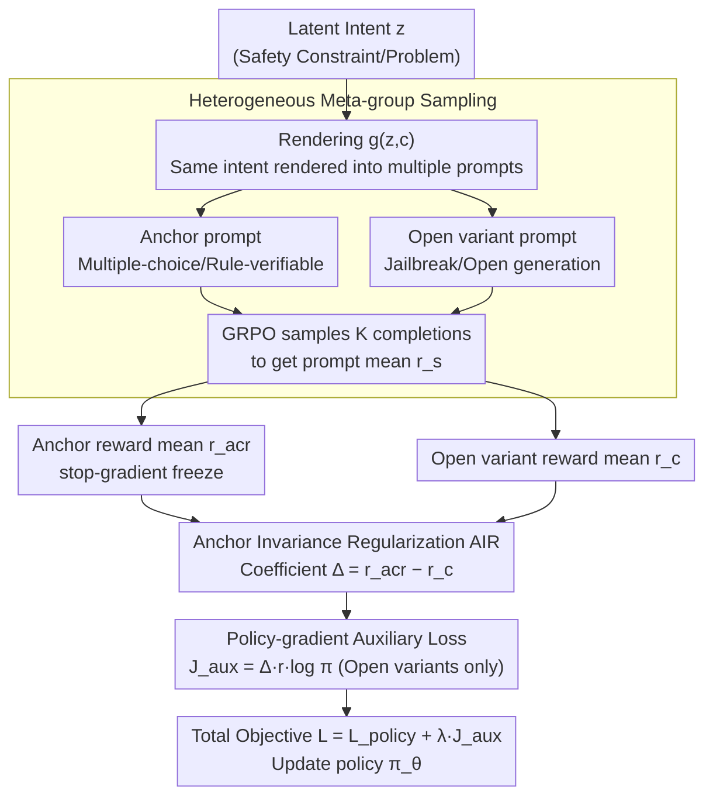

# Towards Context-Invariant Safety Alignment for Large Language Models

**Conference**: ICML 2026  
**arXiv**: [2605.20994](https://arxiv.org/abs/2605.20994)  
**Code**: Not released  
**Area**: Alignment RLHF  
**Keywords**: Context invariance, safety alignment, GRPO, invariant risk minimization, reward hacking

## TL;DR
The authors propose AIR (Anchor Invariance Regularization), which treats verifiable prompts as "anchors" and utilizes stop-gradients to pull open-ended variants toward the anchor's performance. Inserted as an auxiliary loss in GRPO, it improves OOD group-level consistency across safety, moral, and mathematical domains by an average of 33.49% and ID by 12.71%.

## Background & Motivation
**Background**: Preference-based post-training (RLHF / DPO / GRPO, etc.) has become the standard paradigm for LLM alignment. RLHF encodes human preferences into the policy via reward models; GRPO, which eliminates the value network using group-relative advantage, is the current de facto choice for reasoning training.

**Limitations of Prior Work**: Safety alignment is "brittle." When the same harmful intent is wrapped in a different jailbreak context, the model may refuse the standard prompt but comply with the rewritten one. This "superficial vulnerability" indicates that the model learns surface cues rather than underlying intent, a direct consequence of reward hacking and alignment faking.

**Key Challenge**: To ensure behavior depends solely on intent rather than surface form, one might consider Invariant Risk Minimization (IRM / V-REx) from domain generalization. However, in safety alignment, **supervision quality is asymmetric**—verifiable prompts (multiple-choice, rule-based) provide ground truth, while open-ended generation relies on noisy, hackable LLM judges. Symmetric variance penalties (V-REx) merely reduce the gap between contexts; they **can pull poor performance up or pull high performance down**. The authors formally prove that when the anchor risk $R_a$ is significantly lower than the open-ended risk $R_o$, symmetric penalties yield a "downgrading" descent direction, destroying reliable capabilities to align with a noisy proxy.

**Goal**: Design an asymmetric invariance regularizer that "freezes and preserves" the anchor's capability, ensuring that all alignment pressure is applied only to the open-ended variants.

**Key Insight**: Observing that "at least one form of reliable supervision (multiple-choice/rule-verifiable) exists in safety alignment," this can be treated as a "privileged environment" in IRM and converted into a unidirectional anchor via stop-gradients.

**Core Idea**: Replace the symmetric variance term in V-REx with $\Omega_{\text{AIR}} = \sum_{c \neq c_{\text{acr}}} (R_c - \text{sg}[R_{c_{\text{acr}}}])^2$ and formulate it as a policy-gradient auxiliary loss for plug-and-play integration with GRPO/GSPO.

## Method

### Overall Architecture
This paper addresses the brittle safety alignment where harmful intents are bypassed via jailbreak wrappers. The mechanism treats "automatically verifiable prompts" as anchors and uses stop-gradients to pull open-ended variants toward the anchor's performance. Specifically, a latent intent $z$ (e.g., a safety constraint or a math problem) is expressed through a rendering function $g(z,c)$ into two classes of prompts: an **anchor** (multiple-choice/True-False/rule-verifiable) and an **open variant** (jailbreak wrapper/open generation). During training, the data loader constructs a **meta-group** $\mathcal{S}_z = \mathcal{A}_z \cup \mathcal{O}_z$ instead of independent prompt sampling. For each prompt $s$ in the group, $K$ completions are sampled per GRPO to obtain prompt-level means $\bar r_s$ and variances $\sigma_s$. Consequently, under the **same parameter $\theta$**, the anchor reward $\bar r_{\text{acr}} = \frac{1}{|\mathcal{A}_z|}\sum_{s \in \mathcal{A}_z}\bar r_s$ and each variant reward $\bar r_c$ are calculated synchronously, with their difference serving as an asymmetric coefficient for the policy gradient.

### Key Designs

**1. Heterogeneous meta-group sampling: Synchronous estimation of anchors and variants**

The pipeline begins with data organization, which is crucial for the accuracy of the asymmetric coefficient. The AIR coefficient relies on $\bar r_{\text{acr}} - \bar r_c$; if estimated across different steps or parameter states $\theta$, the coefficient would be contaminated by variance from asynchronous updates. The authors configure the data loader to sample prompts by latent $z$ into a meta-group $\mathcal{S}_z = \mathcal{A}_z \cup \mathcal{O}_z$. Each batch includes $m$ anchor prompts and $n$ open variants, reusing the GRPO $K$-rollout to obtain $\bar r_s$ and $\sigma_s$. While the standard intra-group relative advantage $\hat A_{s,k} = (r_{s,k} - \bar r_s)/(\sigma_s + \epsilon)$ drives the main policy loss, the AIR term uses $\bar r_{\text{acr}} - \bar r_c$ from the same rollout to approximate $R_c - \tau_{\text{acr}}$. This synchronous estimation minimizes coefficient variance.

**2. Anchor Invariance Regularization (AIR): Replacing symmetric variance with unidirectional stop-gradient**

After acquiring rewards, the core step is alignment. Brittle safety alignment suggests the model relies on surface cues; thus, IRM/V-REx is used to force behavior to depend solely on intent. However, safety supervision is **asymmetric**—anchors have ground truth, while open generation uses noisy LLM judges. V-REx's symmetric variance $\text{Var}_c[R_c(\theta)]$ pulls performance in both directions. The authors replace this with a unidirectional form $\Omega_{\text{AIR}} = \sum_{c \in \mathcal{C} \setminus \{c_{\text{acr}}\}} (R_c(\theta) - \text{sg}[R_{c_{\text{acr}}}(\theta)])^2$. Since $\nabla_\theta \text{sg}[R_{c_{\text{acr}}}] = 0$, the gradient structurally excludes $\nabla_\theta R_{\text{acr}}$, preventing the reduction of the gap by "downgrading the anchor." In cases where open-ended risk is higher than the anchor ($R_c > \tau_{\text{acr}}$), the positive coefficient acts as reinforcement; when reward hacking pulls the open-ended risk artificially low ($R_c < \tau_{\text{acr}}$), the negative coefficient acts as a penalty. Formal proof in Appendix A.3 shows that symmetric V-REx generates a "downgrading" gradient when $R_o > R_a$; AIR effectively excises this direction.

**3. Policy-gradient auxiliary loss: A differentiable surrogate for plug-and-play GRPO**

To make $\Omega_{\text{AIR}}$ backpropagatable, the authors apply the log-derivative trick. Since $R_c$ is an expectation, the gradient $\nabla_\theta \Omega_{\text{AIR},c} = -\mathbb{E}_y[2(R_c-\tau_{\text{acr}}) \cdot r(s,y) \cdot \nabla_\theta \log \pi_\theta(y|s)]$ leads to a differentiable surrogate $\mathcal{J}_{\text{aux}} = -\frac{1}{N}\sum_i (R_c - \tau_{\text{acr}}) \cdot r_i \cdot \log \pi_\theta(y_i|s_i)$. The final training objective adds this to the policy loss: $\mathcal{L}_{\text{total}} = \mathcal{L}_{\text{policy}} + \lambda \mathcal{J}_{\text{aux}}$. The coefficient $(R_c - \tau_{\text{acr}})$ acts as a dynamic weight, automatically switching between reinforcement and penalty. This bypasses backpropagation through $R_c$ itself and ensures compatibility with existing GRPO/GSPO codebases without requiring value networks or human annotation.

### Loss & Training
The total objective follows Algorithm 1: the GRPO clipped surrogate plus $\lambda \Delta_s r_{s,k} \log \pi_\theta(y_{s,k}|s)$ (active only for open prompts $s \in \mathcal{O}_z$), where $\Delta_s = \bar r_{\text{acr}} - \bar r_s$ is detached. The backbone is Qwen-2.5-14B, trained for 3000 steps across three domains with $K=3$, lr $5\times 10^{-7}$, and $\lambda = 8\times 10^{-4}$. The composite reward is $r = r_{\text{task}} + r_{\text{fmt}}$, where format rewards require `<think>…</think><answer>…</answer>` (and `\boxed{}` for Math). Task rewards use rule validation for anchors and LLM-as-a-judge for open variants.

## Key Experimental Results

### Main Results
Prompt-level Acc and group-level $\text{Acc}_{\text{group}}$ (calculated only if **all variants** in a meta-group are correct) are reported across three domains (Safety / Moral / Math).

| Setting | Configuration | Safety Acc / Group | Moral Acc / Group | Math Acc / Group |
|------|------|--------------------|-------------------|------------------|
| ID | GRPO | 96.92% / 71.15% | 75.39% / 34.31% | 93.81% / 64.60% |
| ID | GRPO + V-REx | 82.15% / 35.40% | 58.20% / 7.15% | 93.02% / 60.71% |
| ID | **GRPO + AIR** | **98.46% / 84.62%** | **85.51% / 59.85%** | 93.64% / 63.72% |
| ID | GSPO + AIR | **99.81% / 98.08%** | 84.57% / 65.69% | **94.93% / 68.14%** |
| OOD | GRPO | 73.04% / 13.73% | 62.68% / 14.71% | 82.30% / 40.71% |
| OOD | GRPO + V-REx | 62.25% / 8.82% | 53.12% / 3.68% | 83.19% / 42.48% |
| OOD | **GRPO + AIR** | **88.24% / 60.78%** | **80.70% / 47.79%** | 88.49% / 61.06% |
| OOD | GSPO + AIR | **93.14% / 63.73%** | 81.07% / 49.26% | 86.28% / 51.33% |

On average, GRPO+AIR improved OOD $\text{Acc}_{\text{group}}$ from 23.05% to 56.54% (+33.49pp) and OOD Acc from 72.67% to 85.81% (+13.14pp).

### Ablation Study

| Config | Key Phenomenon | Description |
|------|---------|------|
| GRPO (No invariance) | Low OOD group consistency | Overfitting to surface cues; vulnerable to jailbreaks |
| GRPO + V-REx (Symmetric) | Safety group dropped 71.15 → 35.40 | Anchors penalized to match noisy variants (Sec 3.2 Failure Mode) |
| GRPO + V-REx in Math | Minor drop (64.60 → 60.71) | Math is mostly verifiable; low supervision asymmetry means weak V-REx side-effects |
| GRPO + AIR | Stable anchors, significant variant gains | Non-symmetric stop-gradient excises "anchor downgrading" |
| Extreme Reward Hacking Stress Test | Open-end only rewards "I am sorry" | GRPO is fully hacked (collapses on Oracle judge); AIR preserves oracle safety scores |

### Key Findings
- **Formalized Failure Modes**: Appendix A.3 proves the existence of a downgrading direction for symmetric V-REx when $R_o > R_a$.
- **Asymmetry vs. Gains**: The more unreliable the supervision (Safety/Moral), the higher the gains from AIR. In Math, where reliability gaps are smaller, gains are more modest.
- **$\lambda$ Sweet Spot**: Peak Avg Acc and $\text{Acc}_{\text{group}}$ occur at $\lambda \approx 8\times 10^{-4}$. Excessive values suppress task-specific signals.
- **Compressed Latent Geometry**: Intra-group representation dispersion dropped from 86.47 (GRPO) to 71.54 (AIR), suggesting consistent internal mapping of different surface forms with the same intent.

## Highlights & Insights
- **Stop-gradient as a "Privileged Environment" Switch**: While IRM researchers debate "true" environments, AIR offers an engineering solution: detach the verifiable context as a reference.
- **Auxiliary Loss vs. New Optimizer**: AIR is a simple $\lambda \mathcal{J}_{\text{aux}}$ term, keeping GRPO/GSPO code intact while facilitating reproduction on other RL backbones (e.g., DPO).
- **Group-level Accuracy Metric**: This metric—requiring all variants of an intent to be correct—is harder to "game" than prompt-level Acc and should be standard for safety benchmarks.
- **Supervision Geometry Interpretation**: Jailbreaks are explained not just by model capacity but by "supervision geometry," where symmetric regularizers under asymmetric supervision structurally degrade the model.

## Limitations & Future Work
- **Dependency on Reliable Anchors**: For open tasks (creative writing, long-horizon agents), constructing verifiable anchors is difficult.
- **Lack of Human Preference Data**: Experiments utilized rule-based or LLM-as-judge rewards; stability under real human preference (pairwise) remains an open question.
- **Scale Constraint**: Verified only up to 14B; scaling behavior of the $\lambda$ "sweet spot" is unknown.
- **Meta-group Construction Overhead**: Preparing verifiable and open-ended versions for every intent involves significant data engineering.
- **Two-context Formal Analysis**: Theorem A.3's proof of the degradation direction focuses on $|\mathcal{C}|=2$; existence in multi-context scenarios is not formally established.

## Related Work & Insights
- **vs. V-REx / IRM (Krueger 2021, Arjovsky 2019)**: AIR incorporates supervision asymmetry into the regularizer by designating a detached anchor, preventing symmetric collapse.
- **vs. Rule-based Rewards (Mu 2024)**: Unlike treating rules purely as reward terms, AIR uses them as invariance reference points to "transmit" trust to noisy contexts.
- **vs. Constrained RLHF (Moskovitz 2023)**: AIR avoids explicit constraints or heavy KL penalties by adaptively reinforcing or penalizing open generation based on anchor performance.
- **vs. Weak-to-Strong (Burns 2023)**: Shares the intuition of using reliable supervision to guide hard-to-verify capabilities, implementing this at the RL phase via gradient-level asymmetry.

## Rating
- Novelty: ⭐⭐⭐⭐ Using stop-gradients to adapt V-REx is elegant, supported by formal proof of failure modes and practical implementation.
- Experimental Thoroughness: ⭐⭐⭐⭐ Covers three domains, two optimizers, and ID/OOD data; includes stress tests and visualization.
- Writing Quality: ⭐⭐⭐⭐ Clear progression from motivation to correction; formal analysis in Appendix A is precise.
- Value: ⭐⭐⭐⭐ Provides a plug-and-play RL solution for "brittle safety," with high transferability to RLHF and agent safety.

<!-- RELATED:START -->

## Related Papers

- [\[ICML 2026\] Curriculum Learning for Safety Alignment](curriculum_learning_for_safety_alignment.md)
- [\[ICLR 2026\] GuardAlign: Test-time Safety Alignment in Multimodal Large Language Models](../../ICLR2026/llm_alignment/guardalign_test-time_safety_alignment_in_multimodal_large_language_models.md)
- [\[AAAI 2026\] EASE: Practical and Efficient Safety Alignment for Small Language Models](../../AAAI2026/llm_alignment/ease_practical_and_efficient_safety_alignment_for_small_language_models.md)
- [\[ICML 2026\] PICACO: Pluralistic In-Context Value Alignment of LLMs via Total Correlation Optimization](picaco_pluralistic_in-context_value_alignment_of_llms_via_total_correlation_opti.md)
- [\[ICML 2026\] VALUEFLOW: Toward Pluralistic and Steerable Value-based Alignment in Large Language Models](valueflow_toward_pluralistic_and_steerable_value-based_alignment_in_large_langua.md)

<!-- RELATED:END -->
