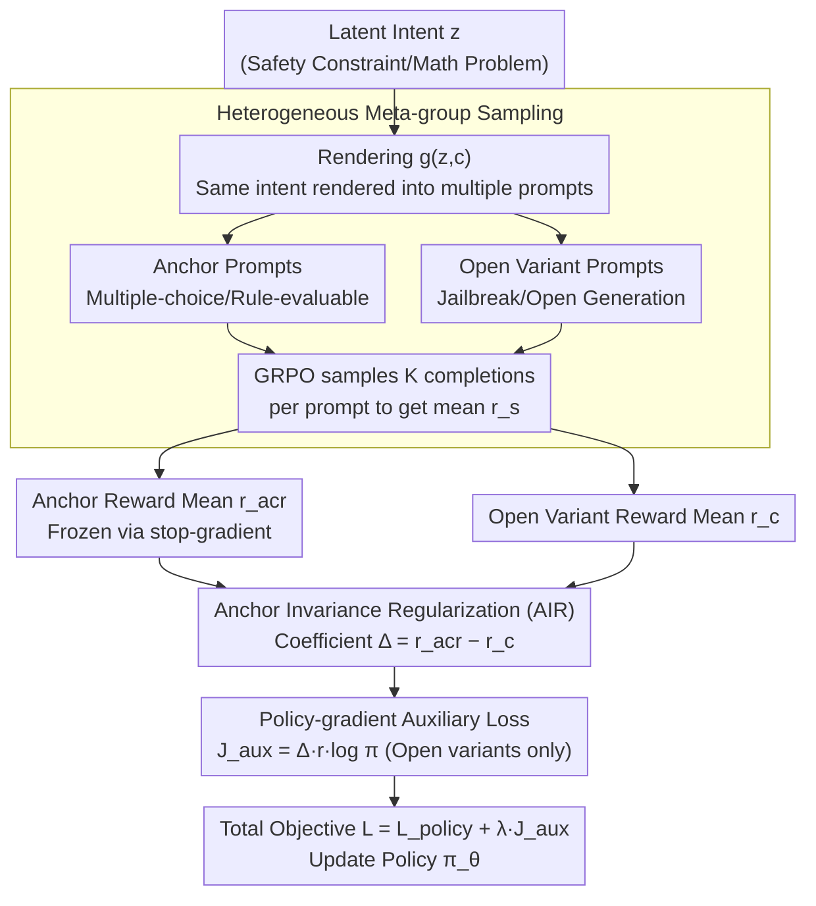

# Towards Context-Invariant Safety Alignment for Large Language Models

**Conference**: ICML 2026  
**arXiv**: [2605.20994](https://arxiv.org/abs/2605.20994)  
**Code**: Undisclosed  
**Area**: Alignment RLHF  
**Keywords**: Context Invariance, Safety Alignment, GRPO, Invariant Risk Minimization, Reward Hacking

## TL;DR
The authors propose AIR (Anchor Invariance Regularization), which treats verifiable prompts as "anchors" and utilizes stop-gradients to unilaterally pull open-ended variants toward anchor performance. Integrated as an auxiliary loss in GRPO, it improves OOD group-level consistency across safety, morality, and mathematics domains by 33.49% on average and ID by 12.71%.

## Background & Motivation
**Background**: Preference-based post-training (RLHF, DPO, GRPO, etc.) has become the standard paradigm for LLM alignment. RLHF encodes human preferences into the policy via reward models; GRPO, which eliminates the value network using group-relative advantages, is the current de facto choice for reasoning training.

**Limitations of Prior Work**: Safety alignment is "brittle." When the same harmful intent is wrapped in different jailbreak prompts, a model might refuse the standard prompt but immediately comply with the rewritten one. This susceptibility to "re-skinning" indicates that the model learns superficial cues rather than underlying intent—a direct consequence of reward hacking and alignment faking.

**Key Challenge**: To make behavior dependent only on intent rather than surface form, one might consider "Invariant Risk Minimization" (IRM / V-REx) from domain generalization. However, in safety alignment, **supervision quality is asymmetric**—verifiable prompts (multiple-choice, rule-evaluable) have ground truth, while open-ended generation relies on noisy, easily hacked LLM judges. Symmetric variance penalties (V-REx) merely flatten gaps between contexts, which **can pull good performance down just as easily as pulling bad performance up**. The authors formally prove that when the anchor risk $R_a$ is significantly lower than the open-ended risk $R_o$, symmetric penalties generate a descent direction that "degrades the anchor," sacrificing reliable capabilities to align with noisy proxies.

**Goal**: Design an asymmetric invariance regularizer that "freezes and preserves" anchor capabilities while focusing all alignment pressure on open-ended variants.

**Key Insight**: Observing that "at least one form of reliable supervision (multiple-choice/rule-evaluable) exists in safety alignment," this can be treated as a "privileged environment" in IRM and converted into a unidirectional anchor via stop-gradients.

**Core Idea**: Replace the symmetric variance term in V-REx with $\Omega_{\text{AIR}} = \sum_{c \neq c_{\text{acr}}} (R_c - \text{sg}[R_{c_{\text{acr}}}])^2$ and formulate it as a policy-gradient auxiliary loss that can be plugged into GRPO/GSPO.

## Method

### Overall Architecture
This paper addresses brittle safety alignment where harmful intents are bypassed by jailbreak packaging. It treats "automatically verifiable prompts" as anchors and uses stop-gradients to pull open-ended variants toward the anchor's performance. Specifically, a latent intent $z$ (a safety constraint or math problem) is expressed through a rendering function $g(z,c)$ into two types of prompts: **anchors** (multiple-choice/True-False/rule-evaluable) and **open variants** (jailbreak-wrapped/open generation). During training, the data loader constructs a **meta-group** $\mathcal{S}_z = \mathcal{A}_z \cup \mathcal{O}_z$ per $z$ to feed the policy $\pi_\theta$ simultaneously. For each prompt $s$ in the group, $K$ completions are sampled via GRPO to obtain prompt-level mean rewards $\bar r_s$ and variances $\sigma_s$. Consequently, under the **same parameters $\theta$**, the anchor reward $\bar r_{\text{acr}} = \frac{1}{|\mathcal{A}_z|}\sum_{s \in \mathcal{A}_z}\bar r_s$ and the open variant rewards $\bar r_c$ are calculated synchronously, using their difference as an asymmetric coefficient for the policy gradient.

### Key Designs

**1. Heterogeneous Meta-group Sampling: Estimating Anchors and Open Variants under Identical Parameters**

The pipeline begins with data organization, which determines the accuracy of the asymmetric coefficient. The AIR coefficient relies on $\bar r_{\text{acr}} - \bar r_c$; if anchors and open variants were estimated at different steps or under different $\theta$, the coefficient would be contaminated by variance from asynchronous updates. The authors use a meta-group $\mathcal{S}_z = \mathcal{A}_z \cup \mathcal{O}_z$ per latent $z$, fitting $m$ anchor prompts and $n$ open variants into each batch. Reusing GRPO's internal $K$-rollout provides the mean $\bar r_s$ and variance $\sigma_s$ for each prompt. While intra-prompt relative advantages $\hat A_{s,k} = (r_{s,k} - \bar r_s)/(\sigma_s + \epsilon)$ drive the primary policy loss, the AIR term uses $\bar r_{\text{acr}} - \bar r_c$ within the same batch to approximate $R_c - \tau_{\text{acr}}$. Synchronous estimation minimizes coefficient variance (with $\bar r_{\text{acr}}$ synchronized across workers in distributed training).

**2. Anchor Invariance Regularization (AIR): Replacing Symmetric Variance with Unidirectional Stop-Gradients**

The core step is using the anchor and open variant rewards for alignment. Fragile safety alignment indicates that models learn surface features; thus, IRM/V-REx is adapted to force behavior to depend only on intent. However, safety supervision is **asymmetric**—anchors have ground truth, while open generation relies on noisy LLM judges. V-REx's symmetric variance term $\text{Var}_c[R_c(\theta)]$ flattens context gaps by potentially degrading higher-performing anchors. The authors propose an asymmetric form: $\Omega_{\text{AIR}} = \sum_{c \in \mathcal{C} \setminus \{c_{\text{acr}}\}} (R_c(\theta) - \text{sg}[R_{c_{\text{acr}}}(\theta)])^2$. Since $\nabla_\theta \text{sg}[R_{c_{\text{acr}}}] = 0$, the gradient structurally excludes $\nabla_\theta R_{\text{acr}}$, preventing the gap from closing via anchor degradation. Both scenarios are handled: if open-ended risk is higher than the anchor ($R_c > \tau_{\text{acr}}$), the positive coefficient reinforces samples closer to the anchor; if reward hacking artificially inflates the open-ended reward ($R_c < \tau_{\text{acr}}$), the negative coefficient acts as a penalty. This is necessary because Appendix A.3 formally proves that symmetric V-REx introduces a "descend-the-anchor" direction when $\lambda > -1/\Delta$ and $R_o > R_a$; AIR cuts this direction from the regularizer gradient.

**3. Policy-Gradient Auxiliary Loss: A Differentiable Surrogate for Plug-and-Play Integration**

The final step is making the asymmetric coefficient backpropagatable. Since $R_c$ in $\Omega_{\text{AIR}}$ is a sampling expectation, it cannot be directly differentiated. Using the log-derivative trick, the authors derive $\nabla_\theta \Omega_{\text{AIR},c} = -\mathbb{E}_y[2(R_c-\tau_{\text{acr}}) \cdot r(s,y) \cdot \nabla_\theta \log \pi_\theta(y|s)]$. This corresponds to a differentiable surrogate $\mathcal{J}_{\text{aux}} = -\frac{1}{N}\sum_i (R_c - \tau_{\text{acr}}) \cdot r_i \cdot \log \pi_\theta(y_i|s_i)$. The final training objective simply adds this to the policy loss: $\mathcal{L}_{\text{total}} = \mathcal{L}_{\text{policy}} + \lambda \mathcal{J}_{\text{aux}}$. The coefficient $(R_c - \tau_{\text{acr}})$ acts as a dynamic weight—positive for reinforcement and negative for penalty—automatically switching directions. This avoids differentiating through $R_c$ while maintaining compatibility with existing GRPO/GSPO stacks without requiring additional value networks.

### Loss & Training
The total objective follows Algorithm 1: GRPO's clipped surrogate plus $\lambda \Delta_s r_{s,k} \log \pi_\theta(y_{s,k}|s)$ (active only for open prompts $s \in \mathcal{O}_z$), where $\Delta_s = \text{detach}(\bar r_{\text{acr}} - \bar r_s)$. The backbone is Qwen-2.5-14B, trained for 3000 steps across three domains, with $K=3$, lr $5\times 10^{-7}$, and $\lambda = 8\times 10^{-4}$. Composite reward $r = r_{\text{task}} + r_{\text{fmt}}$: format rewards require `<think>…</think><answer>…</answer>` (and `\boxed{}` for Math), with +1.25 for correct format and -1.0 for incorrect. Task rewards use rule validation for anchors and LLM-as-a-judge for open variants (safety uses log-odds of Safe vs. Unsafe across 10 facets; morality uses YES/NO token log-prob thresholds; math uses `math_verify` symbolic comparison).

## Key Experimental Results

### Main Results
Prompt-level Accuracy (Acc) and group-level Accuracy ($\text{Acc}_{\text{group}}$) are reported for three domains (Safety / Moral / Math). Group accuracy requires **all variants within a meta-group** to be correct, quantifying "re-skinning invariance." Open variants are re-evaluated using GPT-4.

| Setting | Configuration | Safety Acc / Group | Moral Acc / Group | Math Acc / Group |
|------|------|--------------------|-------------------|------------------|
| ID | GRPO | 96.92% / 71.15% | 75.39% / 34.31% | 93.81% / 64.60% |
| ID | GRPO + V-REx | 82.15% / 35.40% | 58.20% / 7.15% | 93.02% / 60.71% |
| ID | **GRPO + AIR** | **98.46% / 84.62%** | **85.51% / 59.85%** | 93.64% / 63.72% |
| ID | GSPO + AIR | **99.81% / 98.08%** | 84.57% / 65.69% | **94.93% / 68.14%** |
| OOD | GRPO | 73.04% / 13.73% | 62.68% / 14.71% | 82.30% / 40.71% |
| OOD | GRPO + V-REx | 62.25% / 8.82% | 53.12% / 3.68% | 83.19% / 42.48% |
| OOD | **GRPO + AIR** | **88.24% / 60.78%** | **80.70% / 47.79%** | 88.49% / 61.06% |
| OOD | GSPO + AIR | **93.14% / 63.73%** | 81.07% / 49.26% | 86.28% / 51.33% |

On average, GRPO+AIR improves OOD $\text{Acc}_{\text{group}}$ from 23.05% to 56.54% (+33.49pp) and OOD Acc from 72.67% to 85.81% (+13.14pp). The same trick is successfully replicated on GSPO.

### Key Findings
- **Formalized Failure Modes**: Appendix A.3 provides proofs for two cases where symmetric V-REx introduces an anchor-degradation direction when $\lambda > -1/\Delta$ and $R_o > R_a$, explaining the collapse at the gradient geometry level.
- **Supervision Asymmetry Correlation**: AIR gains are largest in Safety/Moral domains where supervision is least reliable. In Math, where nearly all contexts are verifiable and the reliability gap is small, AIR performs similarly to the baseline.
- **Lambda Sweet Spot**: Both Avg Acc and $\text{Acc}_{\text{group}}$ peak at $\lambda \approx 8\times 10^{-4}\!\sim\!10^{-3}$. Excessively large values over-constrain the model, suppressing task-specific signals.
- **Latent Geometry Compression**: Adding AIR reduces the mean intra-group representation dispersion from 86.47 (GRPO) to 71.54, indicating that the model maps different surface forms of the same intent to more consistent internal representations.

## Highlights & Insights
- **Stop-gradient as a "Privileged Environment" Switch**: While IRM research debated environment identification, AIR offers an engineering solution: detach the verifiable context as a reference, structurally preventing regularizer regression. This trick is applicable to any RL scenario with asymmetric supervision reliability.
- **Auxiliary Loss over New Optimizer**: AIR is implemented as a simple $\lambda \mathcal{J}_{\text{aux}}$ term, leaving GRPO/GSPO code untouched. This low implementation cost means other RL backbones (DPO/SimPO) can replicate it by merely adding the loss and meta-group structure.
- **Value of Group-level Accuracy**: Using "all variants must be correct" as a single scalar provides a metric less susceptible to surface-level gaming than prompt-level accuracy; future safety benchmarks should adopt this.
- **Reinterpreting Jailbreaks**: Instead of attributing jailbreaks solely to model capacity or data, this work provides a new perspective based on "supervision geometry," showing how symmetric regularizers under asymmetric supervision structurally lead to anchor degradation.

## Limitations & Future Work
- **Reliance on "Reliable Anchor" Assumption**: For many open-ended tasks (creative writing, long-horizon agents), constructing verifiable anchors is difficult. If the anchor is also noisy, stop-gradients no longer confer "privilege."
- **Lack of Real Human Preference Experiments**: Rewards are currently rule-based or LLM-as-judge. Stability under real RLHF (human pairwise labels) remains an open question.
- **Scale Verification limited to 14B**: Scaling experiments on larger or smaller models are missing; it is unknown if the $\lambda$ sweet spot shifts or requires scheduling with model scale.
- **Meta-group Construction Overhead**: Each $z$ requires pre-prepared verifiable and open versions, increasing data engineering. Automated anchor generation (e.g., converting open prompts to multiple-choice) is a potential future direction.

## Related Work & Insights
- **vs. V-REx / IRM (Krueger 2021, Arjovsky 2019)**: Like IRM, AIR seeks invariance across environments, but specifically handles asymmetric supervision reliability by designating a detached anchor.
- **vs. Rule-based Rewards (Mu 2024)**: While Mu uses rules as reward terms, AIR uses them as **invariance reference points** to govern open generation, "infecting" untrusted contexts with trusted signals.
- **vs. Weak-to-Strong (Burns 2023)**: AIR echoes the idea of using small, reliable supervision to guide large, hard-to-verify capacities, but operates in the RL phase with an asymmetric gradient mechanism.

## Rating
- Novelty: ⭐⭐⭐⭐ Using stop-gradients to modify V-REx combined with formal failure proofs and GRPO implementation constitutes a complete and independent contribution.
- Experimental Thoroughness: ⭐⭐⭐⭐ Covers three domains, two group optimizers, and ID/OOD settings, including reward-hacking pressure tests and latent visualization. Lacks human preference and multi-scale comparisons.
- Writing Quality: ⭐⭐⭐⭐ Logical flow from motivation to formal correction. Appendix A is clear, though some notation ($R_o$ vs $R_c$) fluctuates between sections.
- Value: ⭐⭐⭐⭐ Provides a practical, plug-and-play RL solution for "brittle safety alignment," with high transferability to future RLHF and agent safety work.

<!-- RELATED:START -->

## Related Papers

- [\[ICML 2026\] Curriculum Learning for Safety Alignment](curriculum_learning_for_safety_alignment.md)
- [\[ICLR 2026\] GuardAlign: Test-time Safety Alignment in Multimodal Large Language Models](../../ICLR2026/llm_alignment/guardalign_test-time_safety_alignment_in_multimodal_large_language_models.md)
- [\[AAAI 2026\] EASE: Practical and Efficient Safety Alignment for Small Language Models](../../AAAI2026/llm_alignment/ease_practical_and_efficient_safety_alignment_for_small_language_models.md)
- [\[ICML 2026\] PICACO: Pluralistic In-Context Value Alignment of LLMs via Total Correlation Optimization](picaco_pluralistic_in-context_value_alignment_of_llms_via_total_correlation_opti.md)
- [\[ICML 2026\] Implicit Safety Alignment from Crowd Preferences](implicit_safety_alignment_from_crowd_preferences.md)

<!-- RELATED:END -->
