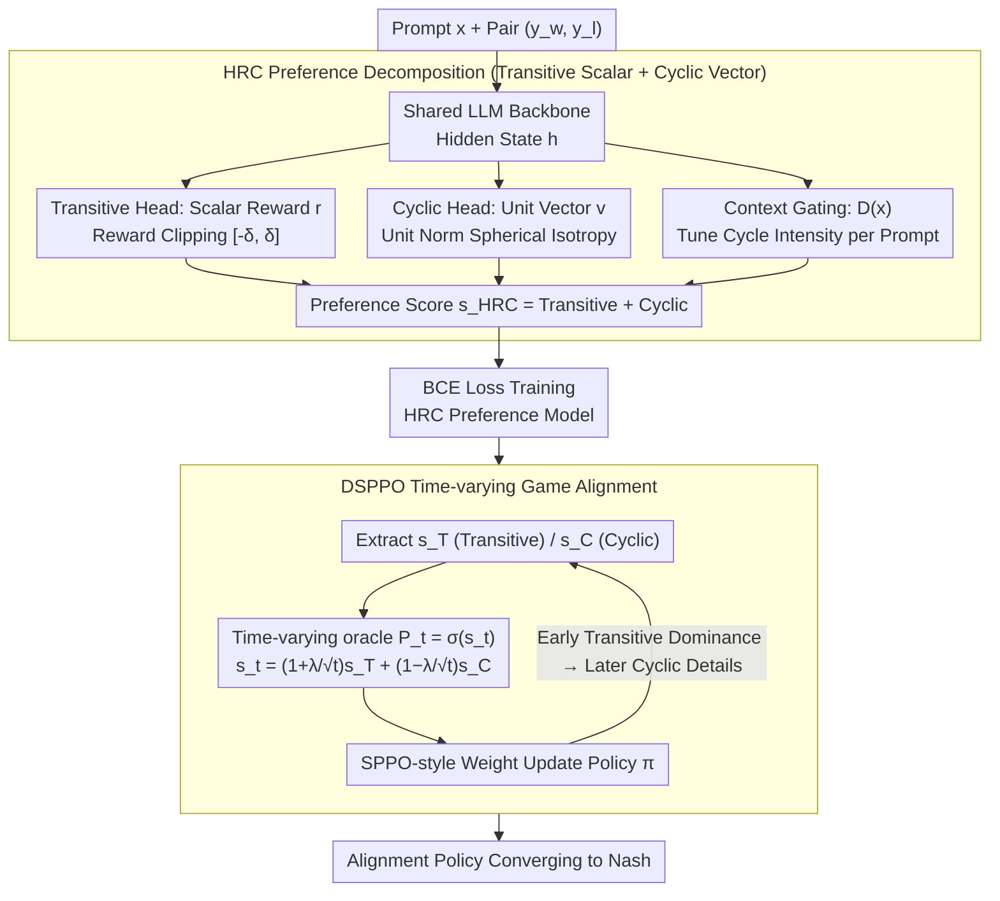

# HRC + DSPPO: Separating Transitive and Cyclic Preferences via Game-Theoretic Decomposition

**Conference**: ICML 2026  
**arXiv**: [2605.17342](https://arxiv.org/abs/2605.17342)  
**Code**: https://github.com/lab-klc/Hybrid-Reward-Cyclic  
**Area**: LLM Alignment / Preference Modeling / RLHF  
**Keywords**: Preference Modeling, Bradley-Terry, GPM, Cyclic Preferences, Time-varying Games, Self-play

## TL;DR
HRC explicitly decomposes human preferences into orthogonal "transitive scalar components" (BT model) + "cyclic vector components" (GPM). Using game-theoretic decomposition theorems, it proves this hybrid form preserves dominant candidates while modeling Rock-Paper-Scissors (RPS) style cycles. Complemented by the time-varying game DSPPO, the alignment process transitions from "stabilizing the transitive backbone" to "learning cyclic details" to reach a Nash equilibrium—achieving a 1.23% average gain for Gemma-2B-it on RewardBench 2 and reaching a 44.75% LC win-rate on AlpacaEval 2.0.

## Background & Motivation

**Background**: RLHF typically uses the Bradley-Terry (BT) model to represent preferences as scalar reward differences, $\mathbb{P}_{\mathrm{BT}}(\mathbf{y} \succ \mathbf{y}') = \sigma(r(\mathbf{y}) - r(\mathbf{y}'))$, assuming preferences satisfy transitivity: $A \succ B \land B \succ C \Rightarrow A \succ C$. However, Tversky 1969 and Munos et al. 2024 highlight that human preferences often exhibit cyclic patterns (e.g., RPS dynamics). While PairRM/PairPM directly learn pairwise functions to express cycles, their inference complexity is $O(K^2)$; the General Preference Model (GPM) uses a skew-symmetric bilinear form $s_{\mathrm{GPM}} = \mathbf{v}_y^\top \mathbf{W} \mathbf{v}_{y'}$ to reduce complexity to $O(2dK)$ while modeling cycles.

**Limitations of Prior Work**: GPM entangles transitivity and cyclicity in a single skew-symmetric form. This paper proves (Theorem 4.7) that GPM with $d=1$ cannot express "dominant candidate + internal cycles" hybrid structures. Even with $d > 1$, there is no guarantee that embeddings can accommodate dominant candidates alongside complex cycles. In other words, GPM's capacity to model local cycles "crowds out" the geometric capacity for global dominance—a structural defect.

**Key Challenge**: Real preferences possess a dual structure: clear global rankings (e.g., "helpful + harmless" as a universal priority) and local cycles (e.g., responses with different styles but similar helpfully-ness having no strict winner). Modeling both with a single skew-symmetric matrix forces the model to learn hierarchy and rotation simultaneously, which is geometrically incompatible.

**Goal**: To design a preference model that ensures "dominant candidates are representable and not crowded out by cycles," while retaining GPM's cyclic modeling capability and $O(K)$ inference complexity.

**Key Insight**: The decomposition theorem for Symmetric Zero-Sum Functional-Form Games from Balduzzi et al. 2019 states that any zero-sum game can be uniquely decomposed into the sum of "transitive components + cyclic components." Treating preference modeling as a zero-sum FFG provides theoretical legitimacy for a hybrid form.

**Core Idea**: HRC = BT (transitive) + GPM (cyclic) via explicit addition: $s_{\mathrm{HRC}} = (r(\mathbf{y}_i) - r(\mathbf{y}_j)) + (\mathbf{v}_i^\top \mathbf{W} \mathbf{v}_j)$. This is paired with DSPPO—viewing alignment as a time-varying game where $\mathbb{P}_t$ transitions from "transitive-dominant" to "transitive + cyclic equality," establishing a global quality baseline before learning local details to converge to a Nash equilibrium in a curriculum-style manner.

## Method

### Overall Architecture

The methodology aims to separate global ranking ("who is better") from local cycles ("mutual counter-relationships") and push the policy to equilibrium via a time-varying self-play alignment. It involves two stages: first, training an HRC preference model on Skywork-Reward-Preference-80K-v0.2 with three projection heads sharing a single LLM backbone (Gemma-2B-it or Llama-3.1-8B-Instruct); second, performing DSPPO alignment on UltraFeedback prompts. During alignment, preference signals from the HRC model drive SPPO-style multiplicative weight updates, where weights for the transitive score $s_T$ and cyclic score $s_C$ are dynamically scheduled as $1 \pm \lambda/\sqrt{t}$.

The HRC model architecture uses shared LLM hidden states $\mathbf{h}_{\mathbf{y}|\mathbf{x}}$ passed through three heads: a transitive head giving scalar reward $r_\phi(\mathbf{y}|\mathbf{x}) = \mathrm{clip}(\mathbf{w}_r^\top \mathbf{h}, -\delta, \delta)$, a cyclic head giving unit vectors $\mathbf{v}(\mathbf{y}|\mathbf{x}) = \mathbf{W}_c \mathbf{h} / \|\mathbf{W}_c \mathbf{h}\|_2$, and a context gating head giving $\mathbf{D}(\mathbf{x}) = \mathrm{diag}(\lambda(\mathbf{x})) \otimes \mathbf{I}_2$. The final preference score $s_{\mathrm{HRC}} = C_1(r(\mathbf{y}_w) - r(\mathbf{y}_l)) + C_2(\mathbf{v}_w^\top \mathbf{D}(\mathbf{x}) \mathbf{R}^{\succ} \mathbf{D}(\mathbf{x}) \mathbf{v}_l)$ is trained end-to-end using BCE loss.

### Key Designs

**1. HRC Preference Decomposition: Explicit Additive Separation**

The structural flaw of GPM lies in using one skew-symmetric form for both hierarchy and rotation, which is geometrically incompatible—Theorem 4.7 proves GPM cannot guarantee that dominant candidates remain representable without being squeezed by local cycles. HRC solves this by learning two paths in parallel: $s_{\mathrm{HRC}} = (r(\mathbf{y}_i) - r(\mathbf{y}_j)) + \mathbf{v}_i^\top \mathbf{W} \mathbf{v}_j$. The first term is a standard BT scalar reward difference for global ranking, while the second is a GPM skew-symmetric bilinear form for local cycles. This hybrid form is theoretically grounded by Balduzzi et al. 2019's theorem: any zero-sum game can be uniquely decomposed into a transitive component $\phi_T(\mathbf{v}, \mathbf{w}) = f(\mathbf{v}) - f(\mathbf{w})$ and a cyclic component $\phi_C(\mathbf{v}, \mathbf{w})$ satisfying $\int \phi_C(\mathbf{v}, \mathbf{w}) d\mathbf{w} = 0$. Theorem 4.6 further proves that under zero-mean embedding conditions, BT and GPM correspond exactly to $\phi_T$ and $\phi_C$, making HRC a standard instantiation of this decomposition.

HRC bypasses Theorem 4.7 by routing dominant signals to an independent BT scalar head, preventing them from competing with cyclic modeling for the geometric capacity of the embedding sphere. Effectively, HRC is a constrained GPM with dim=$2d+1$, where the extra dimension acts as a "shortcut" for global ranking, maintaining $O((2d+1)K)$ inference complexity.

**2. Context gating + Reward clipping + Unit norm: Geometric Constraints**

To ensure the decomposition holds, specific constraints are applied. Reward clipping limits $r_\phi$ to $[-\delta, \delta]$ for numerical stability of the sigmoid. Unit norm forces the cyclic head to output unit vectors, ensuring embeddings are isotropic on the sphere ($\mathbb{E}[\mathbf{v}] = \mathbf{0}$), a prerequisite for Theorem 4.6. Context gating $\lambda(\mathbf{x}) \ge 0$ allows the model to adjust cycle intensity per prompt—activating cycles for "which RPS move is best" while deactivating them for "which answer is safer." Context gating is the most critical; original GPM shared one matrix across all prompts, introducing noise. HRC's gating handles prompt heterogeneity, contributing ~1% to average accuracy (Table 2).

**3. DSPPO Time-varying Game: Curriculum Alignment**

Directly aligning with full HRC signals causes early oscillations between reward and cyclic signals. DSPPO replaces the fixed oracle $\mathbb{P}$ of SPPO with a time-varying oracle $\mathbb{P}_t = \sigma(s_t)$, where $s_t = (1 + \lambda/\sqrt{t}) s_T + (1 - \lambda/\sqrt{t}) s_C$. Early in training ($t$ small), the transitive component dominates, helping the policy stabilize on global directions. As $t$ increases, the weights converge, restoring the full HRC signal to learn local cyclic details—a form of curriculum learning. Theorem 5.3 guarantees that for a learning rate $\eta = \Theta(1/\sqrt{T})$, the duality gap of the mixture policy $\bar{\pi}_T$ relative to the Nash equilibrium converges at $O(1/\sqrt{T})$.

### Loss & Training

The HRC model is trained using BCE loss: $\mathcal{L}(\theta) = -\mathbb{E}[\log \sigma(C_1(r(\mathbf{y}_w) - r(\mathbf{y}_l)) + C_2 \mathbf{v}_w^\top \mathbf{D}(\mathbf{x}) \mathbf{R}^{\succ} \mathbf{D}(\mathbf{x}) \mathbf{v}_l)]$. DSPPO follows the SPPO MSE loss but calculates $\mathbb{P}_t$ based on $s_t$, with $\eta = \Theta(1/\sqrt{T})$, where the KL term disappears under the uniform behavior policy assumption.

## Key Experimental Results

### Main Results: RewardBench 2

| Base + Method | Factuality | Precise IF | Math | Safety | Focus | Ties | Average |
|------|---|---|---|---|---|---|---|
| Gemma-2B-it + BT (d=1) | 45.68 | 32.50 | 62.30 | 80.67 | 77.17 | 37.25 | 55.93 |
| Gemma-2B-it + GPM (d=2) | 47.16 | 33.75 | 62.84 | 78.00 | 71.92 | 38.24 | 55.32 |
| Gemma-2B-it + GPM (d=4) | 43.16 | **36.25** | **64.48** | 81.11 | 76.16 | 37.25 | 56.40 |
| **Gemma-2B-it + HRC (2+1)** | **47.58** | 35.63 | 61.75 | 82.00 | **79.60** | **39.22** | **57.63 (+1.23)** |
| **Gemma-2B-it + HRC (4+1)** | 45.89 | 33.75 | 62.30 | **83.78** | 77.78 | 39.22 | 57.12 |
| Llama-3.1-8B + BT (d=1) | 64.63 | 34.38 | **64.48** | 92.67 | 90.91 | 73.53 | 70.10 |
| Llama-3.1-8B + GPM (d=4) | 67.58 | 33.12 | 57.92 | 92.22 | 93.74 | 73.53 | 69.69 |
| **Llama-3.1-8B + HRC (2+1)** | **68.42** | **35.00** | 60.11 | **92.89** | 94.75 | **74.51** | **70.95 (+0.85)** |

HRC consistently leads in the Ties domain (39.22 vs GPM 38.24, BT 37.25), confirming its robustness for non-strict preferences. It also gains in Safety and Focus—domains requiring dominant signals—validating Theorem 4.7's prediction that pure cyclic modeling crowds out dominant capacity.

### Main Results: AlpacaEval 2.0 LC win-rate (Gemma-2B-it base)

| Preference Model | Alignment Algorithm | LC win-rate (%) |
|---|---|---|
| BT | SPPO | ~35 |
| GPM | SPPO | ~38 |
| HRC | SPPO | ~42 |
| **HRC** | **DSPPO** | **44.75** |

On Arena-Hard-v0.1, HRC+DSPPO reaches 46.8%, outperforming SPPO+BT/GPM baselines.

### Ablation Study (Gemma-2B-it + HRC dim 2+1)

| Configuration | Factuality | Safety | Focus | Ties | Average | $\Delta$ |
|------|------------|--------|-------|------|------|----------|
| HRC (Full) | 47.58 | 82.00 | 79.60 | 39.22 | 57.63 | — |
| w/o Context Gating | 45.89 | 83.11 | 74.95 | 38.24 | 56.49 | -1.14 |
| w/o Reward Clipping | 47.79 | 81.33 | 75.96 | 40.20 | 57.11 | -0.52 |
| w/o Unit Norm | 46.95 | 81.11 | 76.97 | 38.24 | 56.84 | -0.79 |

### Key Findings

- **Ties Domain is HRC's Strength**: In scenarios with multiple equivalent correct answers and incorrect distractors (typical cyclic preference), HRC ranks first on both base models.
- **GPM Regresses in Specific Domains**: On Llama-3.1-8B, GPM (d=4) performed worse than BT (d=1) (69.69 vs 70.10), echoing Theorem 4.7.
- **HRC dim 2+1 vs 4+1**: 2+1 slightly outperformed 4+1 on Gemma, suggesting cyclic capacity should be controlled for smaller models to avoid overfitting.
- **DSPPO Gain**: Adding time-varying scheduling (DSPPO) over SPPO provided a ~3% win-rate boost (42 to 44.75), validating the curriculum approach.

## Highlights & Insights

- **Theory-Driven Model Design**: The paper utilizes the FFG decomposition theorem to prove GPM's structural flaws (Theorem 4.7) and derive a hybrid solution—a prime example of theory guiding architecture.
- **Geometric Analysis of Dominance**: Dominance is clearly described as a geometric issue where embedding capacity is crowded out by local rotations, making the intuition reproducible.
- **Alignment as Time-varying Game**: DSPPO moves beyond the fixed oracle assumption in SPPO/INPO, opening a design space for evolving oracles and multi-stage curriculum alignment.
- **Modeling Prompt Heterogeneity**: By recognizing "not all prompts need cycles" via context gating, the model effectively engineers around real-world data variance.

## Limitations & Future Work

- **Geometric Assumption GAP**: Theorem 4.6 assumes $\mathbb{E}[\mathbf{v}] = \mathbf{0}$. While unit norm approximates this via spherical isotropy, the actual post-training distribution was not verified.
- **Prevalence of Cyclic Preferences**: While synthetic experiments use loops, the actual proportion of cyclic preferences in human data remains unquantified.
- **DSPPO Schedule**: Only one schedule ($\lambda/\sqrt{t}$) was tested; explorations of exponential or step schedules are missing.
- **Performance in Math**: HRC (2+1) lagged behind GPM (4+1) in the Math domain, indicating potential gaps in prompts requiring long-chain reasoning.
- **Scale Constraints**: Base models were limited to <10B; scalability for 70B+ models is unverified.

## Related Work & Insights

- **vs BT**: HRC includes BT but breaks the transitivity assumption; it remains functional on RPS-style prompts where BT fails.
- **vs GPM**: HRC identifies structural defects in GPM and provides a hybrid fix, serving as a strict extension of GPM.
- **vs PairRM/PairPM**: HRC trades the arbitrary expressiveness of $O(K^2)$ functions for the $O(K)$ scalability of bilinear forms.
- **vs SPPO/GPO**: HRC acts at the preference model layer, while DSPPO extends alignment algorithms to time-varying settings; they are orthogonal and stackable.
- **Insight**: The "explicit decomposition of adversarial structures" can be generalized to visual similarity or recommendation systems where local conflicts exist.

## Rating

- Novelty: ⭐⭐⭐⭐⭐ First to use FFG decomposition to prove GPM flaws and design a hybrid fix; DSPPO is a novel scheduling approach.
- Experimental Thoroughness: ⭐⭐⭐⭐ Strong benchmarks (RewardBench 2, AlpacaEval) and ablations, though lacking 70B+ scale validation.
- Writing Quality: ⭐⭐⭐⭐⭐ Excellent logical flow from theory to architecture to experiments; theorems are rigorous yet accessible.
- Value: ⭐⭐⭐⭐ Provides both theoretical and empirical contributions for RLHF pipelines; code is open-source.

<!-- RELATED:START -->

## Related Papers

- [\[ICML 2026\] F-TIS: Harnessing Diverse Models in Collaborative GRPO](f-tis_harnessing_diverse_models_in_collaborative_grpo.md)
- [\[ICML 2026\] PICACO: Pluralistic In-Context Value Alignment of LLMs via Total Correlation Optimization](picaco_pluralistic_in-context_value_alignment_of_llms_via_total_correlation_opti.md)
- [\[ICML 2026\] Efficient Preference Poisoning Attack on Offline RLHF](efficient_preference_poisoning_attack_on_offline_rlhf.md)
- [\[ICML 2026\] Decoupling Reasoning and Confidence: Resurrecting Calibration in Reinforcement Learning from Verifiable Rewards](decoupling_reasoning_and_confidence_resurrecting_calibration_in_reinforcement_le.md)
- [\[ICML 2026\] Curriculum Learning for Safety Alignment](curriculum_learning_for_safety_alignment.md)

<!-- RELATED:END -->
