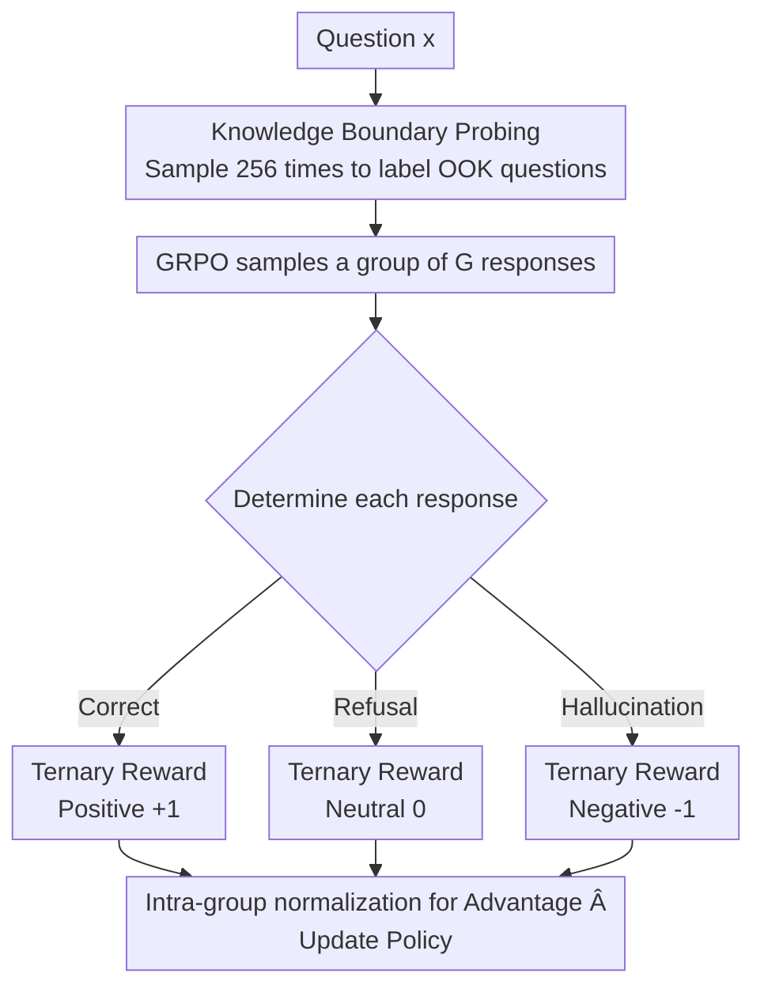

# TruthRL: Incentivizing Truthful LLMs via Reinforcement Learning

**Conference**: ICML2026  
**arXiv**: [2509.25760](https://arxiv.org/abs/2509.25760)  
**Code**: https://github.com/facebookresearch/TruthRL  
**Area**: Alignment RLHF / LLM Truthfulness  
**Keywords**: Truthfulness, Hallucination Suppression, Refusal, GRPO, Ternary Reward

## TL;DR
Aiming to resolve the dilemma where optimizing solely for accuracy encourages blind guessing while forcing refusal leads to over-conservatism, TruthRL directly optimizes truthfulness using a ternary reward ("Correct / Hallucination / Refusal") via GRPO. It reduces hallucination rates from 43.5% to 19.4% and increases truthfulness scores from 5.3% to 37.2%.

## Background & Motivation

**Background**: To reduce factual errors in LLMs, two main paths are currently followed: optimizing answer accuracy via SFT/RL, or expanding knowledge coverage through RAG/fine-tuning. Another line of research focuses on teaching models to "admit ignorance" (e.g., R-Tuning, which labels unanswerable questions as "I don't know" for SFT).

**Limitations of Prior Work**: These methods have inherent flaws. Pure accuracy-oriented SFT/RL makes "guessing" the optimal strategy—since the expected utility of a blind guess is higher than refusal (guessing has a chance of being right, while refusal is always 0), resulting in models that rarely refuse but continue to hallucinate. Conversely, methods like R-Tuning either require expensive re-labeling for each model or result in over-conservatism, where the model refuses even when it knows the answer, sacrificing accuracy.

**Key Challenge**: Truthfulness is not equivalent to accuracy. A model that "answers less but stays silent when uncertain" is more trustworthy than one with higher accuracy that frequently hallucinates, especially in high-risk scenarios like law or medicine. However, existing objective functions either focus solely on accuracy (encouraging hallucination) or rigidly teach refusal (sacrificing accuracy); no single objective enables the model to **answer when appropriate, refuse when uncertain, and never hallucinate**.

**Goal**: Design a learning objective that directly optimizes "truthfulness" rather than just "accuracy," allowing the model to simultaneously learn three behaviors: maximizing correct answers, refusing appropriately, and minimizing hallucinations.

**Key Insight**: The authors first make a critical observation (Figure 2, CRAG + Llama3.1-8B): when un-tuned base models use majority@$k$ voting, accuracy increases, hallucinations decrease, and refusal increases reasonably as the number of samples grows. This suggests that base models possess the latent potential to "recognize knowledge boundaries." This potential is flattened by vanilla SFT/RL, which pushes the refusal rate to nearly zero. The missing piece is an alignment reward signal to elicit this potential.

**Core Idea**: Replace the binary "correct/incorrect" reward with a **ternary reward**—positive for correct answers, negative for hallucinations, and a neutral 0 for refusal—and optimize directly using GRPO. In short: directly optimize truthfulness by "explicitly punishing hallucinations and treating refusal neutrally" instead of "only rewarding accuracy."

## Method

### Overall Architecture

The goal of TruthRL is to embed truthfulness into the optimization objective itself. The paper formalizes truthfulness as a weighted combination of three dimensions: given a prediction $\hat{y}_i=f_\theta(x_i)$, the statistics for accuracy $\mathrm{Acc}$, uncertainty (refusal) rate $\mathrm{Unc}$, and hallucination rate $\mathrm{Hall}$ define:

$$\text{Truthfulness}=w_1\cdot\mathrm{Acc}+w_2\cdot\mathrm{Unc}-w_3\cdot\mathrm{Hall}$$

Where $w_1, w_3 \ge 0$ indicates that "correct answers are always rewarded and hallucinations are always punished," while $w_2$ is determined by deployment needs (default $w_1{=}1, w_2{=}0, w_3{=}1$, meaning refusal is neutral). The objective is to maximize the expected truthfulness: $\max_\theta\mathbb{E}_{\mathcal{D}}[\text{Truthfulness}(f_\theta)]$.

The pipeline consists of two steps: first (optionally) probing knowledge boundaries to construct a strong baseline capable of expressing "uncertainty," followed by online RL using GRPO with a ternary reward aligned with the truthfulness objective. The following mermaid diagram illustrates the reward determination and optimization flow for a single sample during training.

### Key Designs

**1. Truthful Ternary Reward: Making refusal more profitable than guessing**

This is the core of the paper, directly addressing the root cause: "accuracy-oriented pressure forcing models to guess." Traditional RL uses binary rewards (1 for correct, 0 for incorrect/hallucination/refusal), making refusal and hallucination equally valued. Since hallucination has a non-zero expected reward from potentially guessing right, the model naturally chooses to guess. TruthRL changes the reward to three tiers: $r{=}+1$ for correct, $r{=}0$ for refusal (neutral), and $r{=}-1$ for hallucination (explicit penalty). Consequently, when the model is uncertain, the expected utility of refusal (0) becomes higher than "blind guessing" (which risks a penalty). Note that the only difference from binary rewards is shifting "hallucination" from 0 to negative—but this change shifts the Nash equilibrium. The authors compared this with TruthRL$_{\text{Binary}}$ (a degraded version without the hallucination penalty) to prove that without this negative score, truthfulness collapses significantly.

**2. GRPO Online Optimization + Group Advantage Normalization: Stably converting ternary rewards to gradients**

Ternary rewards require an RL framework capable of training with sparse scalar rewards. The authors chose GRPO (Group Relative Policy Optimization), which requires no separate value network and estimates advantage via group sampling. For each question, $G$ responses are sampled from the old policy $\pi_{\theta_{\text{old}}}$, each receiving a ternary reward $\{r_1,\dots,r_G\}$. The advantage is calculated by normalizing using the group mean and standard deviation:

$$\hat{A}_i=\frac{r(x,y_i)-\text{mean}(\{r(x,y_j)\}_{j=1}^G)}{\text{std}(\{r(x,y_j)\}_{j=1}^G)}$$

A clipped PPO objective $\ell_{i,t}(\theta)=\min(w_{i,t}\hat{A}_i,\ \mathrm{clip}(w_{i,t},1-\epsilon,1+\epsilon)\hat{A}_i)$ is applied, with KL regularization $\beta\mathbb{D}_{KL}(\pi_\theta\|\pi_{\text{ref}})$. Group normalization ensures that "more truthful responses within the group" receive positive advantage, increasing the probability of correct answers, decreasing hallucinations, and keeping refusal in the middle.

**3. Knowledge Boundary Probing + Strong Baseline: Enabling the model to express "uncertainty"**

For RL to learn refusal, the model must first be capable of generating "I don't know" expressions. The authors use knowledge boundary probing to construct a strong baseline: for each training question, they sample 256 responses (temp 0.6, top-p 0.9). If **none are correct**, the question is labeled OOK (out-of-knowledge), and the target is changed to "I don't know" for standard SFT (R-Tuning baseline). They further extend this with RFT (rejection sampling fine-tuning): for OOK questions, they select a reasoning trajectory ending in "I don't know," and for non-OOK questions, they select one leading to the correct answer. This provides a baseline and allows TruthRL to function with or without knowledge boundary information.

### Loss & Training

The training objective is the GRPO loss plus KL regularization mentioned above. The default reward settings are $+1$ (Correct) / $0$ (Refusal) / $-1$ (Hallucination), corresponding to truthfulness weights $w_1{=}1, w_2{=}0, w_3{=}1$. Correctness/refusal/hallucination classification is performed by a verifier. Experiments were conducted on multiple backbones including Qwen2.5-7B-Instruct and Llama3.1-8B-Instruct, covering both "with" and "without" retrieval settings.

## Key Experimental Results

### Main Results

Four knowledge-intensive benchmarks (CRAG / NQ / HotpotQA / MuSiQue) were used, reporting Truthfulness score (T), Hallucination rate (H), and Accuracy (A). The table below shows average results for Llama3.1-8B-Instruct (excerpt from Table 1):

| Setting | Method | Truthfulness T ↑ | Hallucination H ↓ | Accuracy A ↑ |
|------|------|-----------|-----------|-----------|
| No Retrieval | Prompting | -20.9 | 53.1 | 32.1 |
| No Retrieval | SFT | -50.3 | 75.2 | 24.8 |
| No Retrieval | R-Tuning | -13.6 | 33.5 | 19.9 |
| No Retrieval | RLKF | -9.8 | 34.7 | 24.9 |
| No Retrieval | TruthRL$_{\text{Binary}}$ | -26.7 | 63.3 | 36.7 |
| No Retrieval | **Ours** | **~10.5** | **20.5** | 31.0 |
| With Retrieval | Prompting | -7.9 | 46.5 | 38.6 |
| With Retrieval | TruthRL$_{\text{Binary}}$ | -2.3 | 50.1 | 47.9 |

On Qwen2.5-7B without retrieval, TruthRL reduced the hallucination rate from ~43.5% (Prompting) to around 19.4%, and increased truthfulness from 5.3% to 37.2%. A key comparison is TruthRL vs TruthRL$_{\text{Binary}}$: when the hallucination penalty is removed, the model pursues accuracy (reaching a higher A of 36.7), pushing the hallucination rate to 63% and causing truthfulness to collapse—proving that **the hallucination penalty is indispensable**.

### Ablation Study

| Configuration | Key Change | Description |
|------|---------|------|
| TruthRL (Full) | Ternary Reward (+1/0/-1) | Full method; achieves highest truthfulness. |
| TruthRL$_{\text{Binary}}$ | No negative hallucination penalty | Degenerates to accuracy-oriented; hallucinations spike. |
| SFT / RFT | Supervised Fine-Tuning | Almost never refuses; highest hallucination rates. |
| R-Tuning | SFT teaching refusal | Increases refusal but over-conservative; accuracy drops to ~20%. |

### Key Findings
- **Hallucination penalty is the switch for truthfulness**: The only difference between TruthRL and its binary variant is whether hallucinations are punished. The resulting truthfulness gap is several dozen points—proving gains come from "converting hallucinations into refusals," not just better accuracy.
- **Refusal stems from knowledge boundary recognition, not conservatism**: Analysis shows TruthRL refuses most when knowledge is insufficient and answers normally when certain, whereas baselines tend to guess (hallucinate) when knowledge is lacking.
- **Higher gains in retrieval settings**: With RAG, the model accesses external information. The ternary reward encourages using the retrieved info to answer correctly while also encouraging refusal when info is insufficient, improving both accuracy and truthfulness simultaneously.

## Highlights & Insights
- The most "Aha!" moment is modeling truthfulness as a game theory problem: under traditional binary rewards, "blind guessing" is a dominant strategy. Merely changing the hallucination score from 0 to negative shifts the equilibrium from "always guess" to "refuse if uncertain."
- The ternary rewards $+1/0/-1$ correspond directly to the truthfulness objective $w_1\mathrm{Acc}+w_2\mathrm{Unc}-w_3\mathrm{Hall}$, providing a theoretical basis rather than just heuristic tuning.
- This logic of "redefining reward semantics" can be transferred to any alignment task where accuracy conflicts with safety or conservatism, such as harmful content refusal or "abstain" decisions in tool use.

## Limitations & Future Work
- Reward determination relies on a verifier to reliably distinguish between "Correct/Hallucination/Refusal," which is challenging in open-generation or long-form answer scenarios and may introduce noise.
- Experiments focus on knowledge-intensive QA. Whether ternary rewards remain effective for tasks with long reasoning chains where errors occur in "intermediate steps" rather than "fact retrieval" is not fully verified.
- Neutral refusal ($w_2{=}0$) is a compromise: some deployments might prefer slight rewards or penalties for refusal. The paper leaves a hook for $w_2$ but does not systematically scan its impact.

## Related Work & Insights
- **vs R-Tuning**: R-Tuning labels unanswerable questions as "I don't know" for SFT, requiring model-specific data and leading to conservatism; TruthRL uses rewards to let the model learn boundaries itself, offering better generalization.
- **vs vanilla RL (RLHF/RLKF)**: These use binary accuracy rewards, implicitly favoring hallucination over refusal. TruthRL explicitly punishes hallucination to align with truthfulness.
- **vs RAG**: RAG supplements knowledge but noisy documents can mislead the model. TruthRL is behavioral alignment, orthogonal to RAG. Experiments show the combination (retrieval setting) yields the greatest gains.

## Rating
- Novelty: ⭐⭐⭐⭐ Simple reward design that targets the root cause of "guessing dominance."
- Experimental Thoroughness: ⭐⭐⭐⭐⭐ 4 benchmarks × multiple backbones × with/without retrieval, plus critical binary control groups.
- Writing Quality: ⭐⭐⭐⭐ Clear motivation and convincing preliminary observations.
- Value: ⭐⭐⭐⭐⭐ Trustworthy LLMs that "know when to remain silent" are essential for high-risk domains.

<!-- RELATED:START -->

## Related Papers

- [\[ICLR 2026\] AlphaAlign: Incentivizing Safety Alignment with Extremely Simplified Reinforcement Learning](../../ICLR2026/llm_alignment/alphaalign_incentivizing_safety_alignment_with_extremely_simplified_reinforcemen.md)
- [\[ICML 2026\] Decoupling Reasoning and Confidence: Resurrecting Calibration in Reinforcement Learning from Verifiable Rewards](decoupling_reasoning_and_confidence_resurrecting_calibration_in_reinforcement_le.md)
- [\[ACL 2026\] PERSA: Reinforcement Learning for Professor-Style Personalized Feedback with LLMs](../../ACL2026/llm_alignment/persa_reinforcement_learning_for_professor-style_personalized_feedback_with_llms.md)
- [\[ACL 2026\] Too Correct to Learn: Reinforcement Learning on Saturated Reasoning Data](../../ACL2026/llm_alignment/too_correct_to_learn_reinforcement_learning_on_saturated_reasoning_data.md)
- [\[ICLR 2026\] Inverse Reinforcement Learning with Dynamic Reward Scaling for LLM Alignment](../../ICLR2026/llm_alignment/inverse_reinforcement_learning_with_dynamic_reward_scaling_for_llm_alignment.md)

<!-- RELATED:END -->
