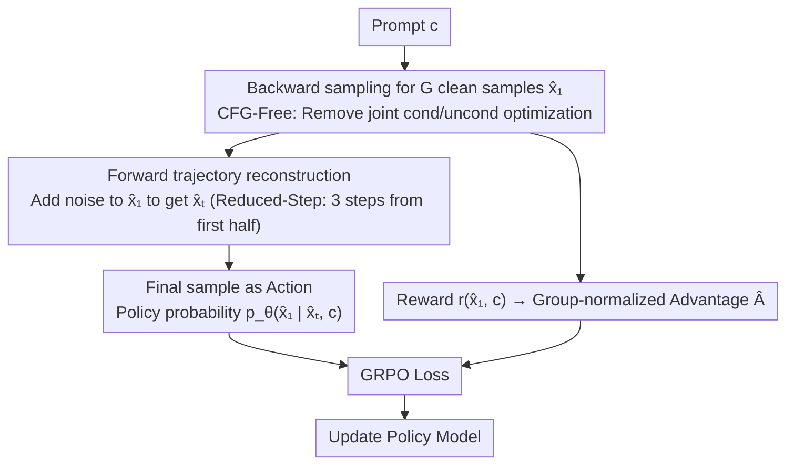

# UDM-GRPO: Stable and Efficient GRPO for Unified Discrete Diffusion Models

**Conference**: ICML 2026 Spotlight  
**arXiv**: [2604.18518](https://arxiv.org/abs/2604.18518)  
**Code**: https://github.com/Yovecent/UDM-GRPO  
**Area**: Diffusion Models / Text-to-Image Generation / RL Alignment  
**Keywords**: Discrete Diffusion Models, Policy Optimization, Text-to-Image, Training Stability

## TL;DR
The first successful integration of GRPO into discrete diffusion models (UDM) is achieved by defining the final clean sample as the action and reconstructing trajectories via the forward process, addressing training instability and reaching SOTA on benchmarks like GenEval.

## Background & Motivation

**Background**: Diffusion models excel in text-to-image generation. GRPO has proven efficient in enhancing LLM reasoning, and recently, Flow-GRPO successfully applied it to continuous diffusion models.

**Limitations of Prior Work**: Directly applying GRPO to Uniform Discrete Diffusion (UDM) models leads to severe instability—rewards fluctuate wildly after an initial rise in the first 500 steps, and KL divergence explodes, leading to complete collapse.

**Key Challenge**: First, prediction signals at intermediate timesteps are noisy and unreliable, making them unsuitable as RL optimization targets. Second, the discrepancy between model-generated backward trajectories and the forward distribution during pre-training causes severe Out-Of-Distribution (OOD) training.

**Goal**: To develop the first UDM-GRPO framework that enables stable and efficient RL optimization for discrete diffusion models.

**Key Insight**: Leveraging the specific structure of the UDM sampling process, these issues are addressed by uniformly defining the final clean sample as the action and reconstructing trajectories using the forward process.

**Core Idea**: Replace intermediate noisy predictions with the final clean sample as the RL action, and construct training trajectories using the forward process applied to generated clean samples rather than the backward process.

## Method

### Overall Architecture
This method addresses the collapse seen when directly applying GRPO to Uniform Discrete Diffusion (UDM). UDM-GRPO retains the intra-group relative advantage framework of GRPO but modifies two critical components: it changes the "action" at each timestep from the noisy intermediate prediction $x_1^t$ to the final clean sample $\hat{x}_1$, and replaces the training "trajectory" from the model-generated backward process $\mathcal{X}_{\text{backward}}$ with a forward process $\mathcal{X}_{\text{forward}}$ derived from $\hat{x}_1$. These changes eliminate noisy optimization targets and OOD training states, supplemented by Reduced-Step and CFG-Free engineering optimizations.

### Key Designs

**1. Final Sample as Action: Aligning RL Optimization with Pre-training Objectives**

The first source of collapse is the unreliable prediction signal at intermediate timesteps. Early timesteps have high prediction entropy; optimizing these as RL actions forces the model to learn from incorrect signals. UDM-GRPO defines the action at all timesteps as the final clean sample $a_t \triangleq \hat{x}_1$, maximizing $p_\theta(\hat{x}_1|\hat{x}_t,c)$. Stability is improved because the standard diffusion pre-training objective is the clean image, and the reward also scores the clean image—aligning the action, reward, and pre-training objectives on the same target.

**2. Forward Process Trajectory Reconstruction: Returning Training States to the Pre-training Distribution**

The second source of instability is distribution shift: model-generated backward trajectories accumulate errors, creating intermediate states that deviate from the forward distribution seen during pre-training. UDM-GRPO avoids using backward intermediate states. Instead, after obtaining a clean sample $\hat{x}_1$, it reconstructs the training trajectory by re-sampling $\hat{x}_t \sim p_t(x|\hat{x}_1)$ for any noise timestep $t$. Since $\hat{x}_t$ is derived from the forward process, the trajectory distribution strictly follows the pre-training distribution, eliminating OOD issues.

**3. Reduced-Step Optimization: Concentrating Gradients on High-Noise Timesteps**

While the first two designs ensure stability, the next two address efficiency. To avoid thinning gradients across the entire denoising trajectory, the authors observe that stochasticity decreases over time. Early high-noise steps exhibit the highest entropy and prediction error, offering the highest optimization returns. Consequently, the strategy updates only 3 consecutive timesteps randomly selected from the first half of the diffusion process, significantly accelerating convergence.

**4. CFG-Free Training: Reducing Computational Overhead**

Standard Diffusion-RL methods often optimize both conditional and unconditional models during training via classifier-free guidance (CFG), doubling overhead. UDM-GRPO removes CFG during the training phase, optimizing only the conditional objective. Although generation quality initially drops, the model recovers as training progresses, eventually outperforming traditional CFG-based training.

## Key Experimental Results

### Main Results

| Model | GenEval | PickScore | OCR |
|------|---------|-----------|-----|
| URSA (Base) | 0.69 | 21.79 | 0.08 |
| SD3.5-L | 0.71 | 22.91 | 0.68 |
| FLUX.1-Dev | 0.66 | 22.84 | 0.59 |
| URSA + UDM-GRPO | **0.96** | **23.81** | **0.57** |

### Ablation Study

| Model | Action Definition | Trajectory Source | GenEval | PickScore | OCR |
|------|---------|---------|---------|-----------|-----|
| Base URSA | - | - | 0.69 | 21.79 | 0.08 |
| Direct Adaptation | $x_1^t$ | backward | 0.84 | 21.99 | 0.23 |
| Improved Action | $\hat{x}_1$ | backward | 0.89 | 23.10 | 0.23 |
| Improved Trajectory | $\hat{x}_1$ | forward | 0.94 | 23.51 | 0.34 |
| Full Method | $\hat{x}_1$ | forward+CFG-Free | 0.96 | 23.81 | 0.57 |

### Key Findings
- The FID of forward trajectories is consistently lower than backward trajectories relative to the pre-training distribution, verifying the distribution alignment hypothesis.
- GenEval scores across all six sub-metrics exceed 0.95.
- OCR accuracy improved from 8% to 57%.

## Highlights & Insights
- **Deep Diagnosis of Problem Roots**: Precise identification of instability sources through entropy visualization and FID quantitative analysis.
- **Elegant Unified Design**: Using the final clean sample as a unified action definition solves both intermediate prediction noise and aligns RL goals with pre-training objectives naturally.

## Limitations & Future Work
- The method requires 32 A100 GPUs for training, entailing high computational costs.
- While CFG-Free improves stability, it causes a noticeable drop in performance during early training stages.
- Evaluation is limited to T2I tasks; applicability to other discrete generation tasks (text, audio) remains to be verified.

## Related Work & Insights
- **vs Flow-GRPO**: Designed for continuous diffusion; direct application to discrete models causes instability.
- **vs DDPO**: DDPO operates on the entire backward trajectory in a multi-step MDP setting; this work unifies actions as final samples.

## Rating
- Novelty: ⭐⭐⭐⭐⭐ First successful solution to the UDM-GRPO integration challenge.
- Experimental Thoroughness: ⭐⭐⭐⭐⭐ Three tasks, multiple benchmarks, and comprehensive ablations.
- Writing Quality: ⭐⭐⭐⭐ Clear problem diagnosis and reproducible experiments.
- Value: ⭐⭐⭐⭐⭐ Establishes a new paradigm for combining discrete generation with RL.

<!-- RELATED:START -->

## Related Papers

- [\[ICML 2026\] F-TIS: Harnessing Diverse Models in Collaborative GRPO](f-tis_harnessing_diverse_models_in_collaborative_grpo.md)
- [\[AAAI 2026\] LaF-GRPO: In-Situ Navigation Instruction Generation for the Visually Impaired via GRPO with LLM-as-Follower Reward](../../AAAI2026/llm_alignment/laf-grpo_in-situ_navigation_instruction_generation_for_the_visually_impaired_via.md)
- [\[ACL 2026\] Mitigating Selection Bias in Large Language Models via Permutation-Aware GRPO](../../ACL2026/llm_alignment/mitigating_selection_bias_in_large_language_models_via_permutation-aware_grpo.md)
- [\[ICML 2026\] Toward Stable Value Alignment: Introducing Independent Modules for Consistent Value Guidance](toward_stable_value_alignment_introducing_independent_modules_for_consistent_val.md)
- [\[ICLR 2026\] Group-Relative REINFORCE Is Secretly an Off-Policy Algorithm: Demystifying Some Myths About GRPO and Its Friends](../../ICLR2026/llm_alignment/group-relative_reinforce_is_secretly_an_off-policy_algorithm_demystifying_some_m.md)

<!-- RELATED:END -->
