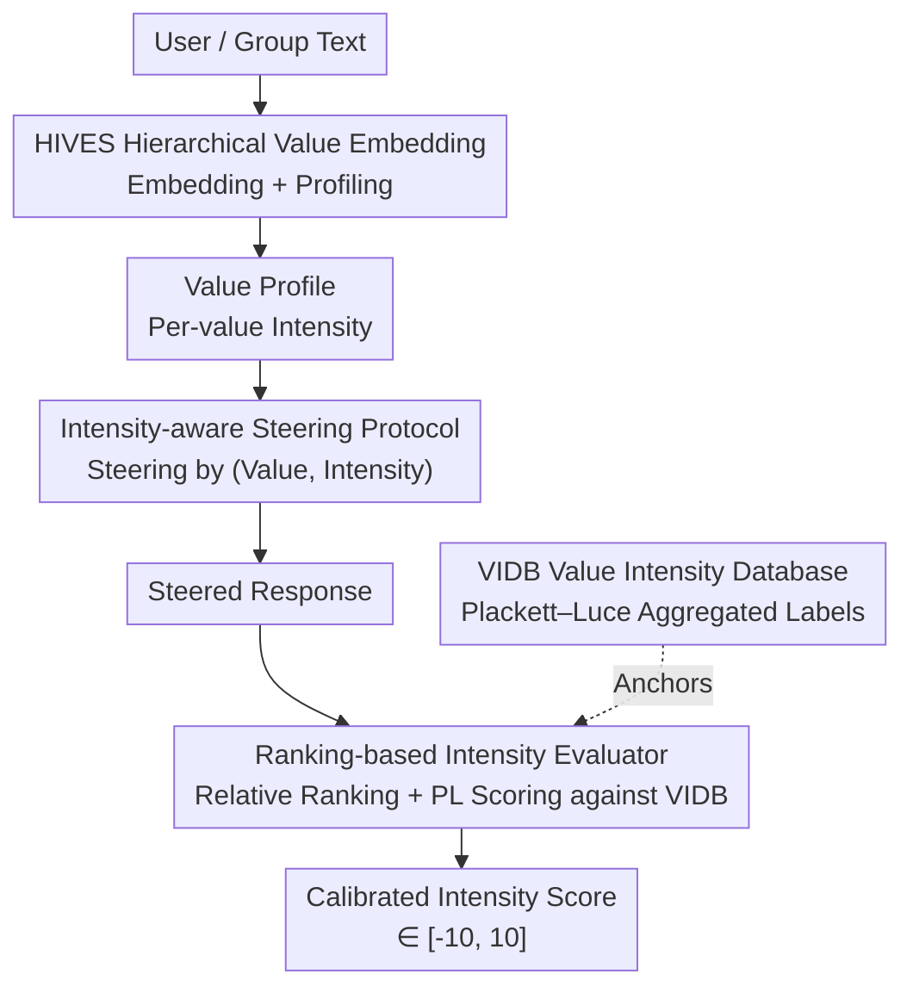

# VALUEFLOW: Toward Pluralistic and Steerable Value-based Alignment in Large Language Models

**Conference**: ICML 2026  
**arXiv**: [2602.03160](https://arxiv.org/abs/2602.03160)  
**Code**: TBD  
**Area**: RLHF / Value Alignment  
**Keywords**: Value Alignment, Pluralism, Steerable Intensity, Ranking-based Evaluation, Hierarchical Embedding  

## TL;DR
To address the challenges of LLMs being highly unstable at scoring absolute value intensities and unable to control the strength of value expression, this paper proposes VALUEFLOW—a unified framework connecting "extraction-evaluation-steering." Its core consists of a hierarchical value embedding space (HIVES), a value intensity database (VIDB) aggregated via Plackett–Luce ranking, and an anchor-ranking-based intensity evaluator. The study systematically characterizes the steerability of LLMs across 10 models and 4 value theories.

## Background & Motivation
**Background**: Aligning LLMs with pluralistic human values is a core challenge. Mainstream preference-based alignment methods capture surface-level, context-dependent choices rather than the deep motivational principles underlying consistent human behavior. Values, as stable across contexts, explain "why people choose" better than preferences, making "value-based alignment" a more principled path toward pluralistic and accountable alignment.

**Limitations of Prior Work**: For value alignment to be "steerable," an end-to-end pipeline is required—from extracting value representations from users/groups and steering generation with specified values and intensities, to evaluating whether the output faithfully reflects the target configuration. Existing works operate in isolation with significant flaws: (1) **Extraction** often relies on static questionnaires or simple binary judgments, failing to capture open-ended dialog signals or encode the hierarchical structure of values (abstract principles → mid-level dimensions → specific instances), often conflating similar values like "fairness" and "equality." (2) **Evaluation** mostly measures whether a value is "present" rather than "how strong" it is, using dictionaries or coarse scoring which are highly unstable across models. (3) **Steering**—the extent to which LLMs can be reliably guided to a "specified value at a specified intensity"—has rarely been systematically characterized.

**Key Challenge**: Using an LLM judge to assign an absolute scalar score for value intensity seems natural but is unreliable in practice. The same text and value can receive scores ranging from strongly negative to strongly positive across different models, and minor prompt changes can alter the magnitude (quantified in Figure 2 and Table 1: scoring variance as high as 12.6, sign flip rate of 48%). **Absolute scoring drifts with models and contexts, while relative preferences (which text better embodies a value) remain highly consistent.** This is the key observation of the paper.

**Goal**: To unify value extraction, evaluation, and steering into a shared backbone, and to extend "steerability" from "directional alignment" to "calibrated intensity control" for the first time.

**Key Insight**: Replace "scoring" with "ranking" since relative orders are stable; train a hierarchical, cross-theory unified embedding space as a universal representation.

**Core Idea**: Use "relative ranking against a fixed anchor library + Plackett–Luce aggregation" instead of "LLM absolute scoring" to quantify value intensity, supporting extraction, steering, and evaluation with a single backbone.

## Method

### Overall Architecture
VALUEFLOW is an end-to-end pipeline: input consists of user/group text, and output includes steerable responses with每 value intensities and calibrated intensity scores. The three stages are—**Value Extraction**: Using HIVES to embed and profile text into a value profile with intensities; **Intensity-Aware Steering**: Generating responses given a query and a profile, ensuring the output reaches target intensities; **Intensity Evaluation**: Ranking each steered response against labeled anchors in the VIDB to produce calibrated intensity scores. HIVES serves as the unified representer, VIDB as the reference anchor library, and the Ranking Evaluator connects them. The framework covers 32 values across four theories: Schwartz Values Theory (SVT), Moral Foundations Theory (MFT), Duties, and Rights.

### Key Designs

**1. HIVES: Hierarchical and Cross-Theory Unified Value Embedding Space**

To address the issue of ignoring hierarchies and conflating similar values, HIVES maps text into theory-specific hierarchical structures (Abstract Dimension → Sub-dimension → Leaf Node) before integrating heterogeneous theories into a unified space. Hierarchical mapping uses "Human–LLM Collaboration" iterative classification: 7 LLMs vote, adopting a class with ≥5 votes or a lead of ≥2; otherwise, it is re-asked with a Neutral option, and unresolved cases go to human adjudication. Cross-theory integration uses CLAVE-style concept pooling to obtain 274 cross-theory anchors with user-friendly examples. Training follows two stages: **Stage 1 Intra-theory Alignment** uses hierarchical contrastive loss, pulling samples with the same hierarchical prefix and direction (pro/con). $\mathcal{L}_{\mathrm{hier}}=\frac{1}{V}\sum_{v=1}^{V}\mathcal{L}_v$, where $\mathcal{L}_v$ defines positive samples by level-$v$ prefixes. **Stage 2 Cross-theory + Anchor Alignment** uses InfoNCE to pull embeddings toward assigned anchors. Total objective $\mathcal{L}=\mathcal{L}_{\mathrm{hier}}+\lambda_{\mathrm{ind}}\mathcal{L}_{\mathrm{ind}}+\lambda_{\mathrm{theory}}\mathcal{L}_{\mathrm{theory}}$.

**2. VIDB: Building a Intensity Database with Ranking Aggregation**

This translates the observation that "relative order is more stable than absolute scoring" into a data asset. For each value, 10K texts are sampled. For each text, a window of $k$ items is formed, and LLMs rank them according to the value definition. Pairwise comparison ($k=2$) is primarily used for reliability. All rankings are aggregated using the **Plackett–Luce (PL) model** to estimate latent intensity utility: given a ranking $\pi=(\pi_1,\ldots,\pi_k)$, $P(\pi\mid\theta)=\prod_{j=1}^{k}\frac{\exp(\theta_{\pi_j})}{\sum_{l=j}^{k}\exp(\theta_{\pi_l})}$. Maximizing the likelihood provides intensity estimates robust to model scoring bias, normalized to $[-10, 10]$. Since PL is computed **separately** for each value, VIDB scores represent conditional intensity along a specific semantic axis.

**3. Ranking-based Intensity Evaluator**

With VIDB anchors, evaluating the intensity $I_v(x)$ of a new response $x$ for value $v$ involves "inserting it into a ranked queue": in each round, $k-1$ anchors are sampled from $D_v$ (using Bucketed sampling to cover $[-10,10]$), and a judge LLM provides a full ordering from "most supportive" to "most opposing." PL is reused: anchor utilities are fixed to their DB scores, and only the response utility is estimated, followed by bounded monotonic calibration mapping to $[-10,10]$. This approach converts "drift across models and prompts" into a "position relative to a stable anchor library," significantly improving stability (Table 1).

**4. Intensity-aware Steering Protocol and Profile Steering**

"Steerability" is formally defined as the intensity-aware version: Model $M$ is steerable if, given query $x$ and value-intensity pairs $\{(a_i,\lambda_i)\}$, the response satisfies $I(y\mid x, a_i)\approx\lambda_i$. Steering is primarily prompt-based using two types: (1) **Intensity Anchors**—adding explicit intensity prompts (e.g., "+2: Strongly Agree / -1: Slightly Reject") to value-anchor prompts; (2) **User Exemplars with Intensity**—sampling representative texts from VIDB where LLM and human scores align. In group alignment scenarios, HIVES profiles 5% of a population's data into a value profile, which then guides the model to predict the group's most likely responses (**profile steering**).

## Key Experimental Results

### Main Results
**Ranking vs. Scoring (Stability and Human Agreement)**: Comparing absolute scoring with ranking-based evaluation across Multiple LLMs.

| Metric | Scoring | Ranking |
|------|--------|--------|
| Mean Variance (↓) | 12.6 | **2.1** |
| Max Range (↓) | 7.1 | **2.8** |
| Sign Flip Rate % (↓) | 48 | **29** |
| Prompt Sensitivity (↓) | 3.6 | **2.3** |
| Sign Accuracy % (↑) | 82.5 | **86.8** |
| Pairwise Accuracy % (↑) | 77.4 | **84.2** |

Ranking-based evaluation slashed variance from 12.6 to 2.1 and sign flips from 48% to 29%, while actually increasing agreement with ValueNet human labels.

**Group Alignment (OpinionQA Prediction Accuracy)**:

| Model | Method | Avg Accuracy % |
|------|------|--------------|
| Qwen3-32B | Default | 56.6 |
| Qwen3-32B | Modular Pluralism | 39.3 |
| Qwen3-32B | **Profile (Ours)** | **59.1** |
| Phi-4-14B | Default | 51.2 |
| Phi-4-14B | **Profile (Ours)** | **55.7** |

Profile steering outperformed the "attribute-only" default and Modular Pluralism in most dimensions; gains in certain attributes exceeded 10% (e.g., Phi-4 Religion 44.5%→57.4%) and were robust to decoding temperature $T\in[0,0.8]$.

### Key Findings
- **Ranking-based Evaluation is the Foundation**: Transitioning from absolute scoring to relative ranking against VIDB anchors reduced variance and prompt sensitivity while aligning better with humans, providing a credible scale for steerability analysis.
- **Steerability Exhibits "Dose-Response Asymmetry" and "Strong Anchor Dominance"**: Negative steering is generally weaker than positive steering. In multi-value steering, $+2$ targets dominate the distribution, while negative targets are often "attenuated" rather than "inverted." Similar value pairs show linear superposition, while opposing pairs exhibit trade-offs.
- **Steerability Heavily Depends on Default Tendencies**: If a model's default agreement for a value is already high (e.g., Security), steering primarily acts downward due to the "ceiling effect."
- **Hierarchical Compositional Steering is Feasible**: Indirect steering through constituent values (e.g., using caring + dependability to induce benevolence) matches the direction and magnitude of direct steering.

## Highlights & Insights
- **"Ranking Instead of Scoring" is a Powerful Paradigm Shift**: It directly addresses the absolute score drift of LLM-as-judge. By optimizing PL for each value individually, the method honors the "cross-value non-comparability" constraint rather than pretending a unified scale exists.
- **Unified Backbone Reuse (HIVES→VIDB→Evaluator)**: Ensuring extraction, steering, and evaluation share semantic coordinates prevents inconsistencies caused by different representations at each stage.
- **Quantifying Steerability as a Calibrated Scientific Question**: By systematically mapping "weak/medium/strong steerability" across 10 models and 32 values, the paper provides a reusable infrastructure and a set of falsifiable empirical laws for value alignment research.

## Limitations & Future Work
- **Heavy Reliance on LLM Voting and Human-LLM Collaboration**: Hierarchical mapping and VIDB ranking involve model biases, and while human adjudication is used, cost and reproducibility remain concerns.
- **Cross-value VIDB Scores are Non-comparable**: Optimizing PL per value means "Kindness +8" and "Justice +8" cannot be directly compared in absolute strength, limiting multi-value aggregation.
- **Steering is Primarily Prompt-based**: Controlling models via activation-based steering remains limited. Strong negative steering of pro-social values (Universalism, Benevolence) highlights a safety double-edged sword.
- **Future Directions**: Making intensity scales cross-value comparable, reducing reliance on expensive LLM voting, and incorporating steering laws (like "anchor dominance") back into training-time alignment.

## Related Work & Insights
- **vs. Preference-based Alignment (RLHF)**: Preference methods optimize for average preferences, often erasing diversity. This work anchors alignment in a pluralistic value coordinate system for steerable, accountable alignment.
- **vs. Modular Pluralism (Feng et al., 2024)**: Modular Pluralism trains separate models; Ours uses value profiles from HIVES for profile steering, achieving higher accuracy on OpinionQA without retraining.
- **vs. Scoring/Dictionary-based Evaluation**: Those measure "value presence" via absolute scores (unstable); Ours measures "how strong" via ranking + PL aggregation, improving stability and human agreement.

## Rating
- Novelty: ⭐⭐⭐⭐⭐ First to unify extraction, intensity evaluation, and steerable alignment into a single backbone.
- Experimental Thoroughness: ⭐⭐⭐⭐⭐ Massive empirical study across 10 models, 4 theories, and 32 values, complemented by human studies.
- Writing Quality: ⭐⭐⭐⭐ Clear framework and motivation, though component-heavy with high reliance on appendices.
- Value: ⭐⭐⭐⭐⭐ Provides reusable infrastructure (HIVES, VIDB) and falsifiable laws, significantly advancing pluralistic alignment.

<!-- RELATED:START -->

## Related Papers

- [\[ICML 2026\] PICACO: Pluralistic In-Context Value Alignment of LLMs via Total Correlation Optimization](picaco_pluralistic_in-context_value_alignment_of_llms_via_total_correlation_opti.md)
- [\[ACL 2025\] Internal Value Alignment in Large Language Models through Controlled Value Vector Activation](../../ACL2025/llm_alignment/internal_value_alignment_in_large_language_models_through_controlled_value_vecto.md)
- [\[ICML 2026\] Towards Context-Invariant Safety Alignment for Large Language Models](towards_context-invariant_safety_alignment_for_large_language_models.md)
- [\[ICML 2026\] Steerable Cultural Preference Optimization of Reward Models](steerable_cultural_preference_optimization_of_reward_models.md)
- [\[ICML 2026\] Toward Stable Value Alignment: Introducing Independent Modules for Consistent Value Guidance](toward_stable_value_alignment_introducing_independent_modules_for_consistent_val.md)

<!-- RELATED:END -->
