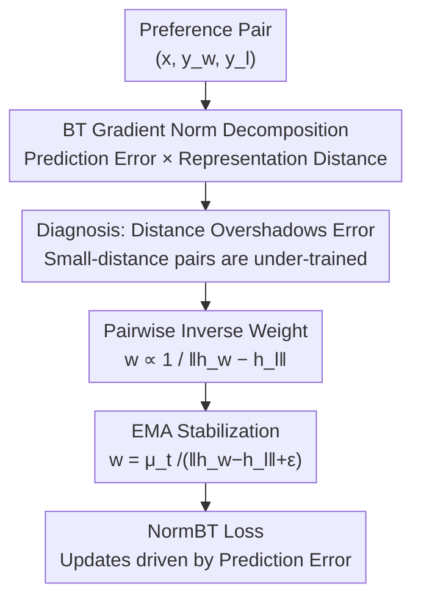

# When Distance Distracts: Representation Distance Bias in BT-Loss for Reward Models

**Conference**: ICML 2026  
**arXiv**: [2512.06343](https://arxiv.org/abs/2512.06343)  
**Code**: To be confirmed  
**Area**: Alignment RLHF / Reward Models  
**Keywords**: Reward Models, Bradley-Terry Loss, Gradient Analysis, Representation Distance, RLHF

## TL;DR
This paper decomposes the gradient norm of the Bradley-Terry (BT) reward model loss into two terms: "prediction error × representation distance." It points out that representation distance can overshadow the prediction error—hard-to-distinguish pairs with similar representations receive only weak updates even if misranked. Consequently, the authors propose NormBT, which uses a pairwise weight inversely proportional to the representation distance to restore update intensity to the prediction error, leading to an average improvement of over 5% in the Reasoning category of RewardBench.

## Background & Motivation

**Background**: RLHF is the current mainstream framework for aligning large language models, where the Reward Model (RM) serves as a proxy for human preferences. In the first stage, the RM is trained on "chosen / rejected" paired preference data; in the second stage, it scores the policy model's output to provide RL signals. The standard objective for training an RM is almost exclusively the BT loss $\mathcal{L}_{\text{BT}}=-\mathbb{E}[\log\sigma(r_w-r_l)]$ due to its simplicity and probabilistic interpretation.

**Limitations of Prior Work**: It is generally assumed that the intensity of BT updates should be determined by "how severe the model's error is" (prediction error)—significant misranking should trigger strong corrections, while correct ranking should lead to minimal changes. However, the authors discover that BT does not function this way: two preference pairs with identical prediction errors might receive significantly different update magnitudes depending on a quantity unrelated to correctness.

**Key Challenge**: The BT gradient norm is simultaneously determined by two factors—prediction error and the "distance between the responses in the final layer representation space." The multiplication of these two means that pairs with similar representations naturally receive weak updates, while pairs with distant representations naturally receive strong updates, even if the former is misranked and the latter is correct. This is particularly problematic for fine-grained differentiation: in the Reasoning category, chosen and rejected answers often differ by only one logical error and appear nearly identical, resulting in minimal representation distance and systematic under-training.

**Goal**: To quantitatively characterize the severity and prevalence of representation distance bias in real preference data and to design a lightweight, plug-and-play modification that requires no architectural changes and carries near-zero overhead, ensuring that update intensity is primarily driven by prediction error.

**Core Idea**: Since the issue stems from the multiplicative factor of representation distance, the authors propose to "cancel it out" by multiplying the loss with a pairwise weight inversely proportional to the representation distance—this is NormBT.

## Method

### Overall Architecture
NormBT is not a new model architecture but a gradient-level modification to the BT loss. The authors first perform a diagnosis (decomposing the gradient norm and verifying the bias using RewardBench) and then provide a remedy (using final layer representation distance as a proxy, stabilized with EMA, for pairwise reweighting). The logic follows: "prove the cause is representation distance, then cancel out the cause with an inverse weight."

### Key Designs

**1. BT Gradient Norm Decomposition: Splitting Update Intensity into "Prediction Error × Representation Distance"**

This serves as the diagnostic foundation of the study and provides legitimacy for the method. Letting $d=r_w-r_l$ be the reward difference between chosen and rejected samples, the single-sample BT gradient is $\nabla_\theta\mathcal{L}_{\text{BT}}=(\sigma(d)-1)\nabla_\theta(r_w-r_l)$. Under the standard parameterization $r_\theta(x,y)=\mathbf{w}_s^\top h_\phi(x,y)+b_s$ (LLM backbone $\phi$ + linear scoring head $\mathbf{w}_s$), the authors derive the gradient norms for the backbone and the head: the scoring head portion is exactly $|\sigma(d)-1|\cdot\|h_w-h_l\|$, while the backbone portion is bounded by $\|h_w-h_l\|$ under a local $L_g$-Lipschitz assumption. Combined, the key decomposition is obtained:

$$\|\nabla_\theta\mathcal{L}\|=\underbrace{|\sigma(d)-1|}_{\text{Prediction Error}}\cdot\underbrace{\big(k\,\|h_w-h_l\|\big)}_{\text{Representation Distance}},\quad k=\sqrt{1+(L_g\|\mathbf{w}_s\|)^2}.$$

This formula clearly demonstrates that the update magnitude is the product of two terms. For two pairs with the same prediction error $|\sigma(d)-1|$, the pair with a small representation distance $\|h_w-h_l\|$ will have gradients that nearly cancel out, resulting in a weak update, whereas a large distance results in a strong update. This contradicts the intuition that updates should be determined by correctness and constitutes the root of the bias.

**2. Empirical Bias: Proving Prevalence on Hard Pairs via RewardBench**

Beyond formulas, the authors provide quantitative evidence. First, by binning preference pairs by prediction error $d$, they **control for prediction error** and observe that the gradient norm within each bin still increases systematically with representation distance. Second, across four RewardBench categories (Chat / Chat-Hard / Safety / Reasoning), the Reasoning category shows the smallest gradient norms and the smallest representation distances, showing high correlation. This confirms that Reasoning tasks—where fine-grained judgment is crucial as chosen and rejected answers are often surface-similar—are provided with the weakest learning signals by BT.

**3. Representation Distance Proxy + Pairwise Inverse Weighting: Returning Update Intensity to Prediction Error**

The ideal weight would be $w_i=\text{sg}(1/\|\nabla_\theta(r_w-r_l)\|)$ (where $\text{sg}$ is stop-gradient), which simplifies the gradient norm to $|\sigma(d)-1|$. However, per-sample gradient norms require extra backpropagation and are not scalable. The decomposition in Design 1 provides a workaround: since $\|\nabla_\theta(r_w-r_l)\|\propto\|h_w-h_l\|$, the authors use the final layer representation distance obtained during the forward pass as a proxy, defining $\tilde{w}_i=\text{sg}(1/\|h_w-h_l\|)$. This proxy is efficient (zero extra computation), grounded (exact for the linear head), and interpretable (up-weighting represents similar, fine-grained hard pairs to compensate for under-training).

**4. EMA Scale Stabilization: Making Weights Immune to Representation Scale Drift**

Directly using $1/\|h_w-h_l\|$ poses a risk as the global scale of embeddings might drift during training, causing weight values to fluctuate. The authors use an Exponential Moving Average (EMA) of batch statistics for normalization: let $\mu_t$ be the EMA of the mean representation norm difference. The weight is defined as $\tilde{w}_t(y_w,y_l)=\mu_t/(\|h_w-h_l\|+\epsilon)$, where $\mu_{t+1}\leftarrow\beta\mu_t+(1-\beta)\hat{\mu}_t$ (default $\beta=0.9$). This does not eliminate the distance component but rescales each pair relative to the current batch mean, keeping the effective loss scale stable. The final objective is:

$$\mathcal{L}_{\text{NormBT}}(\theta)=-\mathbb{E}_{s\sim D}\big[\tilde{w}(y_w,y_l)\cdot\log\sigma(r_w-r_l)\big].$$

### Loss & Training
NormBT is a drop-in modification for BT: it retains the probabilistic foundation, requires no architectural changes, and needs no external labels (unlike margin-based methods). The only additions are the pairwise weight $\tilde{w}$ and an EMA scalar $\mu_t$, with negligible computational or memory overhead. Experiments include grid searches for hyperparameters like learning rate for all baselines to ensure fairness.

## Key Experimental Results

### Main Results
Evaluated on RewardBench using two backbones (gemma-2b-it, Llama-3.2-3B-Instruct) across two datasets (Unified-Feedback 80K, Skywork-Reward-80K). NormBT consistently outperforms the BT baseline across all settings, with gains concentrated in the Reasoning category (+5% on average).

| Setting (Backbone / Dataset) | Method | Reasoning | Average |
|------|------|-----------|---------|
| gemma-2b / Unified-Feedback | BT Baseline | 75.41 | 72.25 |
| gemma-2b / Unified-Feedback | **NormBT** | **80.71** | **73.57** |
| Llama-3.2-3B / Unified-Feedback | BT Baseline | 71.70 | 75.24 |
| Llama-3.2-3B / Unified-Feedback | **NormBT** | **76.93** | **76.96** |
| gemma-2b / Skywork-80K | BT Baseline | 77.46 | 78.63 |
| gemma-2b / Skywork-80K | **NormBT** | **80.71** | **80.12** |
| Llama-3.2-3B / Skywork-80K | BT Baseline | 67.05 | 80.31 |
| Llama-3.2-3B / Skywork-80K | **NormBT** | **74.60** | **81.48** |

### Ablation Study

| Comparison | Key Finding | Note |
|------|---------|------|
| vs BT+Margin / Margin-out | Unstable, did not consistently beat BT | Only modifies the prediction error term without fixing the distance bias; relies on high-quality ground truth margins. |
| vs BT+Label Smoothing | Performance dropped, most significantly in Reasoning | Uniformly lowers the prediction error term, further weakening the already weak updates for small-distance pairs. |
| Best-of-N (Downstream RLHF) | NormBT gold score is consistently highest | Shows the largest improvement over label smoothing, as NormBT restores the small-distance updates that smoothing suppresses. |
| Gain Source (by distance bin) | Most significant gains in "small distance" bins | Consistent with theory: BT is under-trained here, and NormBT returns update strength to prediction error. |

### Key Findings
- The gains of NormBT correspond highly with "categories with the smallest representation distance"—Reasoning sees the largest improvement, validating the "under-training of small distances" diagnosis.
- Margin-based methods only affect the prediction error term and do not address the representation distance, failing to fix the structural bias; NormBT is more reliable and universal as it requires no external signals.
- In categories with large distances like Safety, slight decreases occur occasionally (e.g., 78.65→77.97), suggesting that down-weighting large-distance pairs has a cost, but the net benefit remains positive.

## Highlights & Insights
- **Isolating an interpretable "distraction term" from optimization**: The decomposition "Gradient Norm = Prediction Error × Representation Distance" serves as both the diagnosis and the remedy. This perspective can be migrated to the analysis of any pairwise/contrastive loss.
- **Clever Proxy Choice**: Using the final layer representation distance from the forward pass approximates the per-sample gradient norm efficiently, and is an exact equality for the linear scoring head.
- **The Causal Chain**: "Hard pairs = small representation distance = most important yet suppressed" is a powerful intuition. Reasoning pairs differ only by logical errors and are surface-similar, making them exactly what BT ignores and what NormBT successfully targets.

## Limitations & Future Work
- The decomposition relies on a local $L_g$-Lipschitz-smooth assumption for the backbone term; the Lipschitz constant of deep networks is difficult to characterize precisely, and the tightness of the bound is a subject for further study.
- Slight performance drops in large-distance categories (e.g., Safety) indicate that down-weighting these pairs is not entirely harmless. How to augment small-distance pairs without sacrificing others remains an open question.
- Experiments utilized smaller backbones (2B / 3B). Validation on larger models and more diverse preference distributions is needed.

## Related Work & Insights
- **vs BT + Margin / Margin-out**: These inject ground truth reward margins into the prediction error term. NormBT instead normalizes the representation distance multiplicative factor. The former depends on external labels and fixes the "error side," while the latter fixes a "distance side" structural bias.
- **vs BT + Label Smoothing**: Label smoothing uniformly suppresses the prediction error term via soft labels, which further weakens the already minimal updates for small-distance pairs. NormBT does the opposite by specifically up-weighting them.
- **vs General Contrastive/Preference Learning**: This paper reveals that updates can be dominated by representation geometry rather than task correctness—a common issue in pairwise objectives. This encourages a re-examination of the gradient dynamics of other objectives like DPO.

## Rating
- Novelty: ⭐⭐⭐⭐ The decomposition of BT gradients into a "representation distance" distraction term and the resulting inverse normalization is a clear and targeted insight.
- Experimental Thoroughness: ⭐⭐⭐⭐ Multiple backbones and datasets, RewardBench, and downstream Best-of-N analysis provide a complete chain of evidence, though model scales are relatively small.
- Writing Quality: ⭐⭐⭐⭐ The logic of diagnosis-validation-remedy is smooth, with formulas and intuition well-integrated.
- Value: ⭐⭐⭐⭐ Plug-and-play, zero extra labels, and near-zero overhead make it highly practical for RLHF reward modeling.

<!-- RELATED:START -->

## Related Papers

- [\[ICLR 2026\] Eliminating Inductive Bias in Reward Models with Information-Theoretic Guidance](../../ICLR2026/llm_alignment/eliminating_inductive_bias_in_reward_models_with_information-theoretic_guidance.md)
- [\[AAAI 2026\] When Human Preferences Flip: An Instance-Dependent Robust Loss for RLHF](../../AAAI2026/llm_alignment/when_human_preferences_flip_an_instance-dependent_robust_loss_for_rlhf.md)
- [\[ICML 2026\] The Realignment Problem: When Right becomes Wrong in LLMs](the_realignment_problem_when_right_becomes_wrong_in_llms.md)
- [\[ICML 2026\] Steerable Cultural Preference Optimization of Reward Models](steerable_cultural_preference_optimization_of_reward_models.md)
- [\[ACL 2026\] Pref-CTRL: Preference Driven LLM Alignment using Representation Editing](../../ACL2026/llm_alignment/pref-ctrl_preference_driven_llm_alignment_using_representation_editing.md)

<!-- RELATED:END -->
