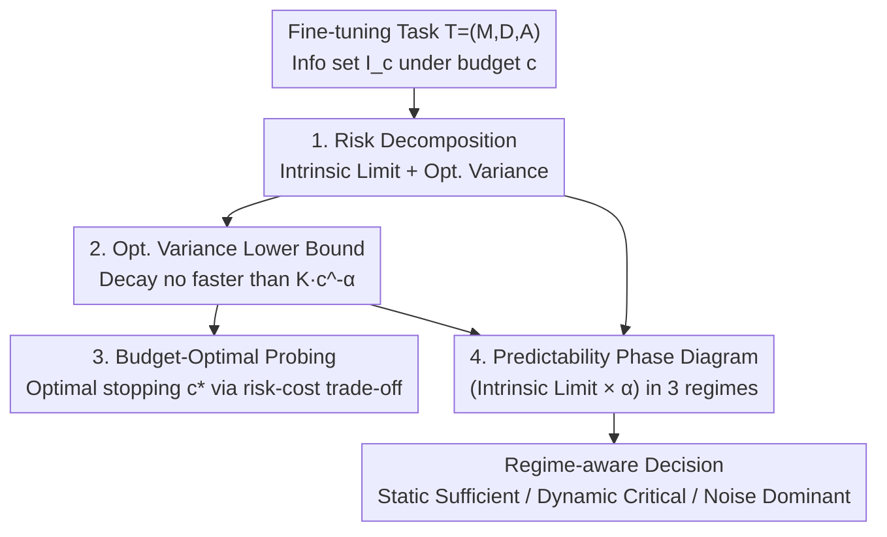

# A Risk Decomposition Framework for Pre-Hoc Fine-Tuning Prediction

**Conference**: ICML2026  
**arXiv**: [2606.17649](https://arxiv.org/abs/2606.17649)  
**Code**: Not public  
**Area**: LLM Efficiency / Fine-tuning Cost Prediction / Uncertainty Quantification  
**Keywords**: pre-hoc prediction, risk decomposition, optimization variance, power-law decay, optimal stopping  

## TL;DR
Fine-tuning LLMs is expensive and hard to predict. This paper formalizes "predicting final fine-tuning performance before or during early training" as a stochastic estimation problem under information constraints. It decomposes prediction risk into an **irreducible intrinsic limit (static data-model compatibility) + reducible optimization variance**. It proves a mandatory lower bound of $c^{-\alpha}$ for the decay rate of optimization variance (no predictor can exceed this speed), derives budget-optimal stopping conditions, and organizes tasks into three predictability regimes—Static-Sufficient, Dynamic-Critical, and Noise-Dominant—using the "intrinsic limit × decay rate" axes, explaining why shallow probing suffices for SST-2 but fails for GSM8K.

## Background & Motivation

**Background**: Fine-tuning large language models has become the mainstream paradigm for adapting base models to downstream tasks. However, it is costly and uncertain—identical configurations can yield vastly different results due to the interaction of pre-training priors, data characteristics, and stochastic optimization. Decisions often lead to marginal gains, performance degradation, or catastrophic forgetting. This gives rise to **pre-hoc fine-tuning prediction**: using information from before or during the very early stages of training to predict final performance, helping decide whether to proceed, which configuration to select, and how much budget to allocate.

**Limitations of Prior Work**: Existing methods are largely heuristic. Proxy-based methods rely on static correlations that fail under distribution shifts; early-stage probing treats "probing depth" as a discrete, arbitrarily chosen hyperparameter. Furthermore, most predictors are black-box regressions that treat prediction error as an **indivisible aggregate**, offering no structural insight into how uncertainty evolves with compute or the specific sources of error, precluding principled resource allocation.

**Key Challenge**: The unpredictability of fine-tuning arises from **two fundamentally different sources**: the **intrinsic limit** determined by static data-model compatibility (which cannot be eliminated even with full training trajectories), and the **optimization variance** introduced by stochastic optimization (which can be resolved by observing trajectories). Black-box regression conflates these two, making it impossible to determine if probing is worthwhile or what depth is cost-effective.

**Goal**: To upgrade pre-hoc prediction from "black-box regression" to a "risk decomposition" perspective (the perspective shift in Fig. 1) and answer three questions: What is the structure of prediction error? How fast can optimization variance decay? Given a compute budget, where is the optimal stopping point for probing?

**Core Idea**: Reinterpret probing as "**resolving optimization-induced uncertainty**" rather than merely "extracting features." Using the Law of Total Variance, the Bayes optimal risk is decomposed into intrinsic limit + optimization variance. Stochastic approximation theory is then used to impose a power-law lower bound on variance decay, transforming the "probing budget" into a principled optimal stopping problem.

## Method

> This is a **theory-pure + structural validation** paper: it proposes no new architectures or training objectives. Its core outputs are a decomposition, a lower bound, a stopping condition, and a phase diagram.

### Overall Architecture
The authors denote a fine-tuning task as a triplet $\mathcal{T}=(M,D,\mathcal{A})$ (pre-trained model, downstream data, stochastic optimization algorithm), which yields a stochastic scalar performance $R$. Under a compute budget $c$, a predictor $f$ only sees the information set $\mathcal{I}_c=\{X_s, X_d^{(c)}\}$ (static information $X_s$ with zero marginal cost + dynamic trajectory $X_d^{(c)}$ revealed up to step $c$), where information grows monotonically $\mathcal{I}_c\subseteq\mathcal{I}_{c'}$. The logic follows: decompose Bayes optimal risk via total variance; prove the decay is **no faster than** $c^{-\alpha}$; solve for optimal stopping depth via risk-cost trade-off; and map tasks onto a **predictability phase diagram** across three regimes.

### Key Designs

**1. Risk Decomposition: Splitting Error into "Irreducible Intrinsic Limit" and "Reducible Optimization Variance"**

For the Bayes optimal predictor $f^*(\mathcal{I}_c)=\mathbb{E}[R\mid\mathcal{I}_c]$, the Law of Total Variance implies (Proposition 4.1):

$$\mathcal{L}(c)=\underbrace{\mathbb{E}[\mathrm{Var}(R\mid\mathcal{I}_\infty)]}_{\mathcal{L}_{int}}+\underbrace{\mathbb{E}[\mathrm{Var}(R\mid\mathcal{I}_c)-\mathrm{Var}(R\mid\mathcal{I}_\infty)]}_{\mathcal{V}_{opt}(c)}.$$

Where $\mathcal{L}_{int}$ is the **intrinsic limit**—the residual uncertainty even with the full trajectory $\mathcal{I}_\infty$, stemming from static data-model mismatch and inherent task stochasticity. It is independent of budget $c$. $\mathcal{V}_{opt}(c)$ is the **optimization variance**—the excess uncertainty from seeing only a finite prefix, which decreases monotonically. Probing reduces $\mathcal{V}_{opt}(c)$ if and only if conditional mutual information $I(R;X_d^{(c)}\mid X_s)>0$. This clarifies that probing resolves reducible variance rather than just extracting black-box features.

**2. Power-law Decay Bound: No Predictor Outruns $c^{-\alpha}$**

How fast can $\mathcal{V}_{opt}(c)$ be eliminated? Instead of modeling the complex non-convex trajectory, the authors derive a **conservative rate-limiting envelope**. Once optimization enters a "locally regular" regime (starting from high-quality pre-trained solutions with informative gradients), stochastic approximation theory (Proposition 5.1) yields:

$$\mathcal{V}_{opt}(c)\;\gtrsim\;K\,c^{-\alpha}\quad (c\to\infty),$$

for constants $K>0, \alpha>0$. In the stable region, parameter uncertainty contraction is governed by step-size decay and gradient noise. For polynomial decay $\eta_c\propto c^{-\rho}$, the parameter covariance is $\Omega(c^{-(2\rho-1)})$. Smoothness of $R(\theta)$ propagates this to the performance metric. The implication: **Noise in typical stochastic optimization is suppressed only polynomially; once rate-limited, uncertainty cannot collapse arbitrarily fast.** Here, $\alpha$ is the **effective information revelation rate** of the task-optimizer pair.

**3. Budget-Optimal Probing: Closed-form Optimal Stopping**

Probing is modeled as an optimal stopping problem with risk-cost trade-off: $\min_{c\ge0}\mathcal{L}_\mathcal{T}(c)+\gamma C(c)$. Under linear cost $C(c)=C_s+\lambda c$ and the power-law envelope, the condition $|d\mathcal{V}_{opt}/dc|_{c^\star}=\gamma C'(c^\star)$ (Theorem 6.1) gives:

$$c^\star=\left(\frac{\alpha K}{\gamma\lambda}\right)^{\frac{1}{\alpha+1}}.$$

Since $\mathcal{L}_{int}$ is constant, the **optimal probing depth depends solely on optimization dynamics $(\alpha, K)$ and cost parameters**. Algorithm 1 provides offline calibration: run light probing at depths $\{c_i\}$, compute an uncertainty proxy $\widehat{U}(c_i)$, and perform log-log regression to fit $\widehat{U}(c)\approx\mathcal{L}_{int}+Kc^{-\alpha}$.

**4. Predictability Phase Diagram: Organizing Tasks by Intrinsic Limit and Decay Rate**

Tasks are mapped onto a 2D space $(\mathcal{L}_{int}, \alpha)$, revealing three regimes:
- **Static-Sufficient (Bias-dominant)**: High $\alpha$ or dominant intrinsic limit. Outcomes are determined by static properties; probing yields negligible gain (e.g., SST-2, GLUE classification).
- **Dynamic-Critical (Variance-dominant)**: Low intrinsic blur but small $\alpha$. Information reveals slowly; outcomes are sensitive to trajectories (e.g., GSM8K, grokking). These warrant deep probing ($c^\star$ is large).
- **Noise-Dominant (Intrinsic-limited)**: High $\mathcal{L}_{int}$. Total risk remains high regardless of probing (e.g., high label noise, severe domain shift).

## Key Experimental Results

The goal is to verify structural predictions: (i) optimization variance follows a task-specific $\alpha$; (ii) tasks organize into three regimes; (iii) optimal stopping is regime-dependent. Protocol: $N=1500$ independent fine-tuning runs per task/depth with different seeds to compute run-to-run variance as an uncertainty proxy.

### Main Results: Power-law Decay and Regime Separation

| Regime | Uncertainty Decay Behavior (log-log) | Representative Tasks |
|---|---|---|
| Static-Sufficient | Extremely fast contraction, large $\alpha$ | SST-2, GLUE |
| Dynamic-Critical | Significantly slower decay, small $\alpha$ | GSM8K, Code Gen |
| Noise-Dominant | Dominated by intrinsic floor; flat decay | High-noise tasks |

Fig. 2 shows linear log-log relationships, confirming power-law predictions. Fig. 3's empirical phase diagram shows structural separation of regimes on the $(\mathcal{L}_{int}, \alpha)$ plane.

### Key Findings
- **$\alpha$ as Dynamic Difficulty**: Explains why fixed-step probing is inconsistent across tasks—tasks with different decay rates reveal vastly different information at the same depth.
- **Failure as Regime Mismatch**: Failure on GSM8K with shallow probing is not a predictor flaw, but a depth mismatch with its slow dynamics.
- **Signal Complementarity**: Static proxies are most useful in the Static-Sufficient regime; early trajectory signals are valuable only when reducible optimization variance remains large.

## Highlights & Insights
- **Perspective Shift**: Moving from "predicting scores" to "decomposing risk" allows separate answers for error source, reducibility, and budget allocation.
- **Utility of Lower Bounds**: Proving that variance decays **no faster than** $c^{-\alpha}$ sets a hard physical limit on any pre-hoc predictor.
- **Unifying Observations**: Explains varying success of probing across tasks (e.g., SST-2 vs. GSM8K) as task-regime properties rather than estimator quality.

## Limitations & Future Work
- **Local Dynamics**: The power-law bound assumes a "locally regular" regime; early transients or loss spikes are not captured.
- **Offline Descriptors**: $(\alpha, K, \mathcal{L}_{int})$ are task-level dynamics, not necessarily recoverable for every individual instance at runtime.
- **Uncertainty Proxies**: Experiments rely on run-to-run variance rather than true Bayes risk.
- **End-to-End Accuracy**: The paper focuses on structural verification; direct accuracy comparisons with heuristic predictors are secondary.

## Related Work & Insights
- **vs. Proxy/Early-Probing (Anugraha 2024)**: These treat depth as a fixed hyperparameter. This framework provides a closed-form condition for optimal depth.
- **vs. Scaling Laws (Kaplan 2020)**: While scaling laws model the **first moment** (expected performance), this work models the **second moment** (variance and its resolution).
- **vs. Training Dynamics**: Shifts from descriptive analysis (e.g., critical learning periods) to normative budget allocation.

## Rating
- Novelty: ⭐⭐⭐⭐⭐ 
- Experimental Thoroughness: ⭐⭐⭐ 
- Writing Quality: ⭐⭐⭐⭐ 
- Value: ⭐⭐⭐⭐

<!-- RELATED:START -->

## Related Papers

- [\[ICML 2026\] TuneAhead: Predicting Fine-tuning Performance Before Full Training Begins](tuneahead_predicting_fine-tuning_performance_before_full_training_begins.md)
- [\[ICLR 2026\] When Does Divide and Conquer Work for Long Context LLM? A Noise Decomposition Framework](../../ICLR2026/llm_efficiency/when_does_divide_and_conquer_work_for_long_context_llm_a_noise_decomposition_fra.md)
- [\[ICLR 2026\] CPQS-Tuning: A Model Self-Perception-Based Data Filtering Algorithm for Efficient Instruction Fine-Tuning](../../ICLR2026/llm_efficiency/cpqs-tuning_a_model_self-perception-based_data_filtering_algorithm_for_efficient.md)
- [\[ICLR 2026\] Explainable Token-level Noise Filtering for LLM Fine-tuning Datasets](../../ICLR2026/llm_efficiency/explainable_token-level_noise_filtering_for_llm_fine-tuning_datasets.md)
- [\[ICML 2026\] ReMoE: Boosting Expert Reuse through Router Fine-Tuning in Memory-Constrained MoE LLM Inference](remoe_boosting_expert_reuse_through_router_fine-tuning_in_memory-constrained_moe.md)

<!-- RELATED:END -->
