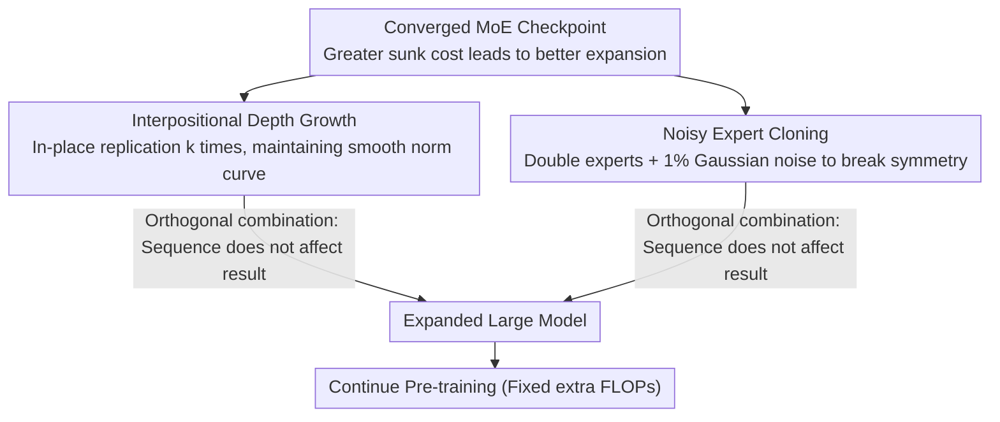

# Beyond Sunk Costs: Boosting LLM Pre-training Efficiency via Orthogonal Growth of Mixture-of-Experts

**Conference**: ICML 2026  
**arXiv**: [2510.08008](https://arxiv.org/abs/2510.08008)  
**Code**: None  
**Area**: LLM Pre-training  
**Keywords**: MoE Model Growth, Checkpoint Recycling, Efficient Pre-training, Orthogonal Expansion, Sunk Costs  

## TL;DR

The authors propose an "orthogonal growth" strategy for converged MoE models—using interpositional layer replication for depth and noisy expert cloning for width—scaling a 17B model to 70B. This achieve a 10.6% accuracy improvement over training from scratch under the same additional compute budget.

## Background & Motivation

**Background**: LLM pre-training follows scaling laws, continuously increasing model size and data volume to improve performance, but the computational cost of training from scratch is enormous. In industry, training processes generate numerous intermediate checkpoints and smaller models, which are typically discarded after training.

**Limitations of Prior Work**: Most existing model growth research conducts expansion only after brief training in the early stages, failing to fully utilize the "sunk costs" accumulated by the model. Furthermore, with the proliferation of Mixture-of-Experts (MoE) architectures, there lacks a systematic study of growth strategies specifically for MoE models.

**Key Challenge**: Pre-training checkpoints contain significant computational investment but cannot be directly reused for larger models due to architectural constraints. Existing stacking methods for layer replication disrupt the learned inter-layer structures once the model has fully converged, leading to performance loss.

**Goal**: Design a parameter expansion framework suitable for fully converged MoE models to efficiently scale them in both depth and width dimensions, maximizing the recovery of sunk costs.

**Key Insight**: The authors discovered that fully converged LLMs exhibit a characteristic layer-wise weight norm distribution—small and volatile in initial layers, monotonically increasing in middle layers, and slightly declining at the end. Stacking methods create a "norm cliff" at the concatenation points, whereas interpositional methods maintain this smooth structure.

**Core Idea**: Utilize interpositional layer replication to increase depth (maintaining weight norm continuity) and noisy expert cloning to increase width (breaking symmetry to promote expert differentiation). These two dimensions are orthogonal and can be combined freely.

## Method

### Overall Architecture

Given a fully converged MoE model checkpoint, it "grows" along two orthogonal dimensions: in the depth direction, each layer is replicated $k$ times in-place; in the width direction, the number of experts in each MoE layer is doubled and infused with a trace amount of noise. These two operations do not interfere with each other, and the sequence of operations does not affect the final result. The expanded large model then continues pre-training.

### Key Designs

**1. Interpositional Depth Growth: Replicating layers in-place rather than end-to-end stacking**

To deepen $n$ layers to $kn$ layers, the most intuitive method is stacking—concatenating the entire layer sequence $k$ times ($l_1,...,l_n, l_1,...,l_n$). However, this paper finds this problematic for fully converged models: the layer-wise weight norms of converged LLMs follow a monotonically increasing distribution. Stacking forces the $n$-th layer to connect back to the 1st layer, creating a "norm cliff" (e.g., a drop from 0.0356 to 0.0323, approximately $10\times$ the average inter-layer difference). This acts as a structural fracture in the middle of the network, requiring extra compute to repair the discontinuity. Interpositional growth replicates each layer in-place ($l_1,l_1,..., l_2,l_2,..., l_n,l_n$), where adjacent replicated layers have nearly identical norms, maintaining a smooth transition across the curve. This advantage is triggered when training FLOPs exceed the Chinchilla optimal value $F_c \approx 6 \cdot N_a \cdot 20N_a$, as the layer-wise norms only stabilize into an increasing pattern at that point.

**2. Noisy Expert Cloning: Replicating experts and adding 1% noise to break symmetry**

In the width dimension, the number of experts in MoE layers is increased from $E$ to $2E$ and the number of active experts from $k$ to $2k$. This is achieved by cloning existing experts (including router weights) and adding a trace amount of Gaussian noise $\epsilon \sim \mathcal{N}(0, (\alpha \sigma_{\text{orig}})^2)$, where $\alpha = 0.01$. The noise scale is critical: direct copying ($\alpha=0$) results in perfect symmetry where clones receive identical gradients and never differentiate; conversely, adding large noise ($\geq 50\%$) as in dense-to-MoE upcycling destroys learned knowledge. The 1% magnitude is the "sweet spot"—it preserves almost all knowledge while allowing clones to follow different trajectories as the router gradually differentiates them. This small noise suffices because the task is MoE-to-MoE expansion rather than dense-to-MoE; the original model already has trained routers that can be reused.

**3. Orthogonal Combination and Growth Timing: Two dimensions can be ordered arbitrarily; higher sunk costs yield higher returns**

Depth and width growth are nearly orthogonal in the optimization space—final performance of depth-then-width is consistent with width-then-depth. The cosine similarity of Adam's first moment along these two paths is $|\cos| < 0.04$, indicating they update nearly non-overlapping directions. Growth timing follows a clear pattern: the greater the sunk cost of the starting checkpoint, the better the final expanded model (positive correlation), with the sole exception being the marginal returns diminishing after entering the learning rate annealing phase. Under a fair comparison of fixed total FLOPs, this growth method matches or exceeds training from scratch—meaning checkpoint recycling is essentially "free gain."

## Key Experimental Results

### Main Results (17B → 70B Expansion, 1T tokens)

| Model | Parameters | Extra FLOPs | Avg Accuracy | Gain |
|------|--------|-----------|-----------|---------|
| 17B Baseline (Fully Trained) | 17B | — | 58.55 | — |
| 70B From Scratch (Equal compute) | 70B | Equivalent | 57.99 | -0.96% |
| 70B Orthogonal Growth (Ours) | 70B | Equivalent | 64.17 | **+10.6%** |
| 35B Intermediate Model (Post-depth) | 35B | — | 61.96 | +5.8% |

### Ablation Study: Depth Growth Strategy (3B → 6B)

| Growth Method | Post-convergence Training Loss | Downstream Avg Acc | Norm Continuity |
|---------|--------------|--------------|-----------|
| Stacking | Higher | Lower | L19→L20 Cliff (0.0356→0.0323) |
| Interpositional (Ours) | **Lower** | **Higher** | Smooth Transition |
| 6B From Scratch | Reference | Reference | — |

### Ablation Study: Width Growth Noise Scale

| Noise Scale $\alpha$ | Training Loss | Downstream Acc | Description |
|-------------------|---------|-----------|------|
| 0 (Direct Clone) | Comparable | Baseline | Symmetry cannot be broken |
| 0.01 (Ours) | Comparable | **+1%** | Optimal balance |
| Large Value | Higher | Decrease | Destroys learned knowledge |
| Random Init New Experts | Significantly Higher | Significantly Lower | Loss of knowledge inheritance |

### Relationship Between Sunk Cost and Final Performance

| Growth Start Step | Starting Acc | Final Acc | Trend |
|------------|-----------|-----------|------|
| 0k (Scratch) | 30.59 | 38.79 | Baseline |
| 16k | 37.66 | 44.65 | ↑ |
| 48k | 42.26 | 47.20 | ↑ |
| 88k | 46.43 | 48.99 | ↑ Optimal Range |
| 96k (Annealing) | 46.19 | 48.52 | Marginal Decrease |

## Highlights & Insights

- This is the first systematic study of growth strategies for fully converged MoE models, revealing why stacking fails on such models: the weight norm cliff.
- The proposed Chinchilla FLOPs boundary ($F_c$) provides a practical criterion for selecting growth strategies: use interpositional growth once beyond $1 \times F_c$.
- Orthogonality is verified not just by order-independence, but also through evidence from optimization dynamics, including Adam momentum cosine similarity and cumulative weight update analysis.
- The discovery of the positive correlation with sunk costs challenges the industry practice of "discarding checkpoints," providing a blueprint for sustainable LLM development.

## Limitations & Future Work

- The growth factor is fixed at $k=2$; more flexible, non-uniform growth ratios have not been explored.
- Width growth is less significant than depth growth in the short term and requires more training steps to be fully realized.
- When growing from checkpoints in the LR annealing phase, the learning rate for continued training requires additional tuning.
- Validated only on language models; not yet extended to multimodal or other modalities.

## Related Work & Insights

- **Stacking Your Transformers** (Du et al., 2024): Proposed stacking but primarily used it in early training stages; this paper reveals its limitations on converged models.
- **LLaMA Pro** (Wu et al., 2024): Expands LLaMA by adding new layers but lacks systematic analysis.
- **MoE Upcycling** (Komatsuzaki et al., 2023): Dense → MoE conversion requires 50%+ noise, whereas this paper's MoE → MoE requires only 1%.

## Rating

- Novelty: ⭐⭐⭐⭐ — First systematic study of converged MoE growth; weight norm analysis and orthogonality validation have original value.
- Experimental Thoroughness: ⭐⭐⭐⭐⭐ — Multi-scale validation from 3B to 70B, including scaling law analysis and extensive ablation studies.
- Writing Quality: ⭐⭐⭐⭐ — Clear logic and rich visualizations.
- Value: ⭐⭐⭐⭐ — Provides a practical methodology for the sustainable development of LLM pre-training.

<!-- RELATED:START -->

## Related Papers

- [\[ICML 2026\] Hyperparameter Transfer with Mixture-of-Experts Layers](hyperparameter_transfer_with_mixture-of-expert_layers.md)
- [\[ICML 2026\] ProbMoE: Differentiable Probabilistic Routing for Mixture-of-Experts](probmoe_differentiable_probabilistic_routing_for_mixture-of-experts.md)
- [\[ICML 2026\] ReMoE: Boosting Expert Reuse through Router Fine-Tuning in Memory-Constrained MoE LLM Inference](remoe_boosting_expert_reuse_through_router_fine-tuning_in_memory-constrained_moe.md)
- [\[ICML 2026\] SiameseNorm: Breaking the Barrier to Reconciling Pre/Post-Norm](siamesenorm_breaking_the_barrier_to_reconciling_prepost-norm.md)
- [\[ACL 2025\] Decoding Knowledge Attribution in Mixture-of-Experts: A Framework of Basic-Refinement Collaboration and Efficiency Analysis](../../ACL2025/llm_efficiency/decoding_knowledge_attribution_in_mixture-of-experts_a_framework_of_basic-refine.md)

<!-- RELATED:END -->
