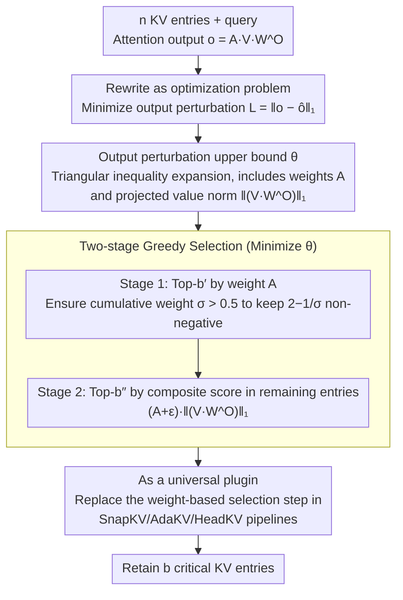

# CriticalKV: Optimizing KV Cache Eviction from an Output Perturbation Perspective

**Conference**: ICML 2026  
**arXiv**: [2502.03805](https://arxiv.org/abs/2502.03805)  
**Code**: https://github.com/FFY0/DefensiveKV (Available)  
**Area**: LLM Efficiency / KV Cache Compression / Inference Optimization  
**Keywords**: KV cache eviction, output perturbation upper bound, long-context inference, attention weights, projected value norm  

## TL;DR
The authors reframe the heuristic-based problem of "identifying critical KV cache entries" as an optimization problem of "minimizing attention output perturbation." They derive an analytical upper bound for perturbation (weighted by both attention weights and value norms projected via $W^O$) and design a plug-and-play two-stage greedy selection algorithm. This method reduces the compression loss of SOTA eviction approaches like SnapKV, AdaKV, and HeadKV by more than half on average across 29 long-context datasets.

## Background & Motivation

**Background**: As context length grows, the KV cache of Transformer self-attention expands linearly, becoming a bottleneck for memory and I/O in long-sequence inference. The mainstream mitigation is KV cache eviction: selecting $b$ "critical" KV entries to retain under a fixed budget $b$ while discarding the rest. Methods like H2O and Scissorhands observe a power-law distribution in attention weights. SnapKV further introduced "observation windows + max pooling" for stable weight accumulation, while AdaKV and HeadKV dynamically allocate budgets across different heads.

**Limitations of Prior Work**: All these methods essentially assume that "entries with high attention weights are critical." However, the definition of "critical" has never been formally established, relying instead on empirical observations like the power-law. This leaves two issues unclear: What is the exact criterion for criticality? Is looking at attention weights alone sufficient?

**Key Challenge**: Starting from the most basic objective—minimizing output perturbation after eviction—the authors found that perturbation is not determined solely by attention weights. From the structure of the output $o = AVW^O$, the impact of discarded entries on the final output depends on both the attention weight $A_i$ and the norm of the value projected by $W^O$, i.e., $\lVert (VW^O)_i \rVert$. Relying only on weights ignores half of the signal.

**Goal**: Formulate "critical entry identification" as an optimization problem to minimize output perturbation, derive a computable upper bound for this problem, and provide a selection algorithm that can be integrated into existing eviction pipelines without additional computational overhead.

**Key Insight**: In the field of pruning, Wanda has successfully used a similar "minimal impact on output" approach to guide weight pruning. This paper is the first to transfer the "perturbation analysis → selection metric" paradigm to the KV cache.

**Core Idea**: Select critical entries by minimizing the worst-case upper bound of output perturbation, using "attention weight × projected value norm" as the new importance metric to replace pure attention weight scoring.

## Method

### Overall Architecture
The output of single-head self-attention can be written as $o = AVW^O$ (where $A = \mathrm{softmax}(qK^\top/\sqrt{d})$). CriticalKV reformulates "selecting $b$ out of $n$ KV entries under budget $b$" as an optimization problem: minimizing the $L_1$ distance between the approximate output $\hat o$ and the original output $o$, $\mathcal{L} = \lVert o - \hat o \rVert_1$. It encodes "which entries to discard" as a multiplicative mask $\mathcal{N} \in \{0,1\}^n$, derives an analytical perturbation upper bound $\theta$ for $\mathcal{N}$, uses a two-stage greedy approach to minimize $\theta$ within each head, and finally uses this selection logic as a drop-in replacement for the "Top-K by weight" step in SnapKV/AdaKV/HeadKV.

### Key Designs

**1. Analytical Output Perturbation Upper Bound $\theta$: Translating "What to Drop" into an Optimizable Scalar**

Directly optimizing $\mathcal{L} = \lVert o - \hat o \rVert_1$ is difficult as it involves the norm of the difference between two matrix products. The authors first noted that after discarding entries, the softmax requires renormalization, making the remaining weights $A' = (\mathcal{N} \odot A) / \sum_i \mathcal{N}_i A_i$. By applying the triangle inequality, $\mathcal{L}$ is bounded by a closed-form upper bound $\theta$ that depends only on the mask $\mathcal{N}$, attention weights $A$, and projected value norms $\lVert \bm{\mathcal{V}}_{i,:} \rVert_1$:

$$\mathcal{L} \leq \theta = C - \Big(2 - \frac{1}{\sum_i \mathcal{N}_i A_i}\Big)\sum_i \mathcal{N}_i A_i \lVert \bm{\mathcal{V}}_{i,:} \rVert_1,$$

where $\bm{\mathcal{V}} = V W^O$ and $C$ is a constant independent of $\mathcal{N}$. Crucially, this bound integrates "attention weight" and "norm of the value after output projection $W^O$" into a single metric, theoretically demonstrating that $A_i$ alone is insufficient; it must be multiplied by $\lVert (VW^O)_i \rVert_1$ to reflect the true impact of discarding an entry.

**2. Two-stage Greedy Selection: Ensuring Cumulative Weight then Scoring by "Weight × Projected Norm"**

Global combinatorial search to minimize $\theta$ is exponential. The authors use greedy approximation divided into two stages. The budget is split into $b' = \alpha b$ and $b'' = (1-\alpha)b$ (typically $\alpha = 0.5$). Stage 1 selects the Top-$b'$ entries by pure attention weight $A$ primarily to ensure the cumulative weight $\sigma = \sum_{\text{selected}} A_i > 0.5$. Stage 2 then selects the Top-$b''$ from the remaining entries using a composite score $\mathcal{A}_i = (A_i + \epsilon)\cdot \lVert \bm{\mathcal{V}}_{i,:} \rVert_1$. Stage 1 is necessary because the coefficient $2 - 1/\sigma$ in the upper bound remains non-negative only when $\sigma > 0.5$, ensuring that the greedy selection in Stage 2 actually minimizes $\theta$. A fixed value of $\alpha = 0.5$ satisfies $\sigma > 0.5$ for over 99% of heads, avoiding the need for per-model hyperparameter tuning.

**3. Integration as a Universal Plugin: Replacing a Single Line in Pipelines**

The authors abstracted SnapKV/AdaKV/HeadKV into a unified template consisting of "budget allocation + observation window weight accumulation + selection." CriticalKV replaces only the "Top-K by accumulated weight" logic, leaving budget allocation and weight accumulation untouched. This design provides three benefits: it is strictly orthogonal to works focusing on budget allocation like AdaKV and HeadKV (allowing additive gains); the additional computation is negligible (simply taking norms of $VW^O$ rows); and it is plug-and-play at inference time without retraining or offline profiling.

### Loss & Training
The method is performed entirely at inference time with no training or fine-tuning required. The only additional runtime computation is the $L_1$ norm of rows in $\bm{\mathcal{V}} = V W^O$. The hyperparameter $\alpha$ is fixed at 0.5.

## Key Experimental Results

### Main Results
Evaluated on 29 datasets in Ruler (13 tasks) and LongBench (16 tasks), integrated with SnapKV, AdaKV, and HeadKV across Llama-3.1-8B, Mistral-7B, and Qwen2.5-32B at a 40% cache budget. Representative Ruler average scores are shown below (Full Cache = 100%; arrows indicate drop relative to Full Cache):

| Model | Method | Ruler Avg ↑ | Drop relative to Full Cache ↓ |
|------|------|------|------|
| Llama-3.1-8B | Full Cache | 91.05 | 0% |
| Llama-3.1-8B | SnapKV | 67.93 | 25.4% |
| Llama-3.1-8B | SnapKV + Ours | **76.89** | **15.6%** |
| Llama-3.1-8B | AdaKV | 78.38 | 13.9% |
| Llama-3.1-8B | AdaKV + Ours | **86.28** | **5.2%** |
| Llama-3.1-8B | HeadKV | 79.98 | 12.2% |
| Llama-3.1-8B | HeadKV + Ours | **89.29** | **1.9%** |
| Mistral-7B | AdaKV | 34.88 | 55.4% |
| Mistral-7B | AdaKV + Ours | **69.17** | **11.6%** |

Three findings: (1) Integrating Ours generally cuts the performance drop by more than half; HeadKV + Ours reduces losses on Llama to 1.9%, nearing Full Cache. (2) Models like Mistral, which previously crashed under SnapKV/AdaKV (55%+ drop), see massive recovery (34.88 to 69.17 with AdaKV). (3) Gains become more pronounced as the base method strengthens, confirming that the perturbation perspective is orthogonal to budget allocation.

### Ablation Study

| Configuration | Key Observation | Description |
|------|---------|------|
| Attention weight only (Original SnapKV) | Baseline drop | Confirms $A_i$ alone is insufficient in Stage 2 |
| Stage 1 $\alpha=0.5$ + Stage 2 Weight × Norm | Consistently optimal | The full two-stage approach |
| Varying $\alpha \in \{0.25, 0.5, 0.75\}$ | Stable performance | Insensitive to $\alpha$ (App. C.1) |
| Head-level perturbation stats | Perturbation decreased in >92% of Llama heads | Matches theoretical expectations |
| Layer-level perturbation accumulation | Final hidden state perturbation significantly reduced | Advantages stack across layers |
| Different cache budgets | Consistent win across all budgets | Benefits deployments under varying VRAM constraints |
| $L_2$ distance replacing $L_1$ | Similar gains | Framework is robust to distance metrics (App. C.3) |

### Key Findings
- The composite score $A_i \cdot \lVert (VW^O)_i \rVert_1$ in Stage 2 is the core driver of performance, confirming that the "projected value norm" is a critical signal missed by existing methods.
- The assumption $\sigma > 0.5$ is a very loose condition met by over 99% of heads in practical LLMs.
- Improvements are quantifiable at both head and layer levels: 92% of heads saw reduced perturbation, and final hidden state perturbation continued to decline, indicating the method truly optimizes the theoretical objective rather than overfitting datasets.

## Highlights & Insights
- **First-principles Re-evaluation of KV Eviction**: Elevates the identification of "critical entries" from empirical observations of power-laws to an optimization problem of "minimizing output perturbation," providing a new theoretical foundation for the field.
- **The Overlooked $W^O$ Projection**: While previous methods scored using only $K$ and $V$, this work points out that the norm of the value after the output projection $W^O$ is what truly determines output impact. This insight can be migrated to bit-width allocation in quantization or entry pre-screening in the prefill stage.
- **Orthogonal Plugin Design**: By abstracting the eviction process, the new method only modifies the "selection" phase, making it naturally complementary to methods focusing on "allocation" like AdaKV/HeadKV. It proves that compression loss stems primarily from selection strategy rather than allocation strategy.

## Limitations & Future Work
- The upper bound $\theta$ is derived and optimized per head; coupling between heads (e.g., perturbation in one head being compensated by another) is not yet modeled, leaving room for a tighter bound.
- A fixed $\alpha=0.5$ was used for Stage 1. While adaptive $\alpha$ per model/budget might yield better results, the search cost is high and left for future study.
- Experiments focused on ≥7B English long-context models. Whether the perturbation assumptions hold for smaller models, multilingual contexts, or vision-language long contexts remains to be verified.
- The method assumes the decoder sees the full KV at once. It does not yet address "how to re-select when new entries are added dynamically" in pure streaming or chunked prefill scenarios.

## Related Work & Insights
- **vs SnapKV/AdaKV/HeadKV**: These optimize "allocation + weight accumulation" but still use pure Top-K(A) for selection. This paper uses the same observation window weights to produce superior selection, yielding 5–40 point improvements when integrated.
- **vs H2O / Scissorhands**: H2O uses cumulative attention weights to select "heavy-hitters" empirically. This work is the first to provide a formal definition of "critical entries" and derive an optimizable bound.
- **vs Wanda (Weight Pruning)**: Shares the philosophy of "minimizing output shock." This paper migrates the perturbation metric from static weight pruning to dynamic KV cache selection and introduces the projected value norm as a new metric.

<!-- RELATED:START -->

## Related Papers

- [\[AAAI 2026\] Judge Q: Trainable Queries for Optimized Information Retention in KV Cache Eviction](../../AAAI2026/llm_efficiency/judge_q_trainable_queries_for_optimized_information_retention_in_kv_cache_evicti.md)
- [\[ICML 2026\] OBCache: Optimal Brain KV Cache Pruning for Efficient Long-Context LLM Inference](obcache_optimal_brain_kv_cache_pruning_for_efficient_long-context_llm_inference.md)
- [\[ICLR 2026\] Randomization Boosts KV Caching, Learning Balances Query Load: A Joint Perspective](../../ICLR2026/llm_efficiency/randomization_boosts_kv_caching_learning_balances_query_load_a_joint_perspective.md)
- [\[ICML 2026\] dLLM-Cache: Accelerating Diffusion Large Language Models with Adaptive Caching](dllm-cache_accelerating_diffusion_large_language_models_with_adaptive_caching.md)
- [\[ICLR 2026\] Cache What Lasts: Token Retention for Memory-Bounded KV Cache in LLMs](../../ICLR2026/llm_efficiency/cache_what_lasts_token_retention_for_memory-bounded_kv_cache_in_llms.md)

<!-- RELATED:END -->
