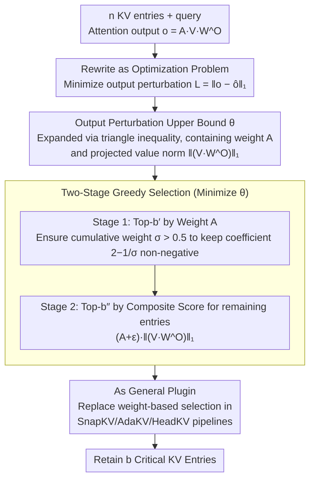

# CriticalKV: Optimizing KV Cache Eviction from an Output Perturbation Perspective

**Conference**: ICML 2026  
**arXiv**: [2502.03805](https://arxiv.org/abs/2502.03805)  
**Code**: https://github.com/FFY0/DefensiveKV (Available)  
**Area**: LLM Efficiency / KV Cache Compression / Model Inference Optimization  
**Keywords**: KV cache eviction, output perturbation bound, long-sequence inference, attention weights, projected value norm  

## TL;DR
The authors reformulate the empirical problem of "which KV cache entries are critical" as an optimization problem of "minimizing attention output perturbation." They derive an analytical upper bound for the perturbation (involving both attention weights and value norms projected by $W^O$) and design a plug-and-play two-stage greedy selection algorithm. This approach reduces the compression loss of three SOTA eviction methods (SnapKV/AdaKV/HeadKV) by more than half on average across 29 long-context datasets.

## Background & Motivation

**Background**: As context length increases, the KV cache of Transformer self-attention expands linearly, becoming a bottleneck for memory and I/O in long-sequence inference. The mainstream mitigation is KV cache eviction: selecting the $b$ most "critical" KV entries under a fixed budget $b$ and discarding the rest. H2O and Scissorhands observed power-law distributions in attention weights; SnapKV further introduced "observation windows + max pooling" to stably accumulate weights, while AdaKV/HeadKV dynamically allocate budgets across different heads.

**Limitations of Prior Work**: All these methods essentially assume that "entries with high attention weights are critical," but the definition of "critical" has never been formally established, relying instead on empirical observations like the power-law. This leads to ambiguity: what is the selection criterion, and are attention weights alone sufficient?

**Key Challenge**: Starting from the most basic objective—minimizing the perturbation of the attention output after eviction—the authors found that this perturbation is not determined solely by attention weights. From the structure of the output $o = AVW^O$, the impact of discarded entries on the final output depends simultaneously on the attention weight $A_i$ and the norm of the value projected onto $W^O$, $\lVert (VW^O)_i \rVert$. Considering only weights ignores half of the signal.

**Goal**: Formally define "critical entry identification" as an optimization problem to minimize output perturbation, derive a computable upper bound for this problem, and provide a selection algorithm that adds no extra computational overhead and fits into existing eviction pipelines.

**Key Insight**: Wanda in the pruning field has successfully used a similar "minimal impact on output" approach to guide weight pruning; this work is the first to transfer the "perturbation analysis $\rightarrow$ selection metric" paradigm to the KV cache.

**Core Idea**: Select critical entries by minimizing the worst-case upper bound of output perturbation, using "attention weight $\times$ projected value norm" as a new importance metric to replace pure attention weight scoring.

## Method

### Overall Architecture
The output of single-head self-attention is $o = AVW^O$ (where $A = \mathrm{softmax}(qK^\top/\sqrt{d})$). CriticalKV reformulates the selection of $b$ entries from $n$ KV entries under budget $b$ as an optimization problem: minimizing the $L_1$ distance $\mathcal{L} = \lVert o - \hat o \rVert_1$ between the approximate output $\hat o$ and the original output $o$. It encodes the discarded entries as a multiplicative mask $\mathcal{N} \in \{0,1\}^n$, derives an analytical perturbation upper bound $\theta$ with respect to $\mathcal{\mathcal{N}}$, uses two-stage greedy selection within each head to minimize $\theta$, and finally treats this selection logic as a drop-in replacement for the "Top-K by weight" step in SnapKV/AdaKV/HeadKV pipelines.

### Key Designs

**1. Analytical Upper Bound $\theta$ of Output Perturbation: Translating "what to drop" into a scalar for optimization**

Directly optimizing $\mathcal{L} = \lVert o - \hat o \rVert_1$ is difficult because it is the norm of the difference between two matrix products. The authors first noted that after dropping some entries, softmax requires re-normalization, and the remaining weights become $A' = (\mathcal{N} \odot A) / \sum_i \mathcal{N}_i A_i$. By applying the triangle inequality, $\mathcal{L}$ is bounded by a closed-form upper bound $\theta$ that depends only on the mask $\mathcal{N}$, attention weights $A$, and projected value norms $\lVert \bm{\mathcal{V}}_{i,:} \rVert_1$:

$$\mathcal{L} \leq \theta = C - \Big(2 - \frac{1}{\sum_i \mathcal{N}_i A_i}\Big)\sum_i \mathcal{N}_i A_i \lVert \bm{\mathcal{V}}_{i,:} \rVert_1,$$

where $\bm{\mathcal{V}} = V W^O$ and $C$ is a constant independent of $\mathcal{N}$. This bound is critical because it simultaneously incorporates "attention weight" and "value norm after output projection $W^O$" into a single metric for the first time—theoretically showing that $A_i$ alone is insufficient and must be multiplied by $\lVert (VW^O)_i \rVert_1$ to reflect the true impact of an entry's removal on the final output.

**2. Two-Stage Greedy Selection: Securing weight majority then scoring by "Weight $\times$ Projected Norm"**

Solving for $\theta$ via global combinatorial search is exponential, so the authors use a greedy approximation across two stages. The budget is split into $b' = \alpha b$ and $b'' = (1-\alpha)b$ (typically $\alpha = 0.5$): In Stage 1, entries are selected by pure attention weight $A$ to reach Top-$b'$. The purpose is to ensure the cumulative weight of the selected set $\sigma = \sum_{\text{selected}} A_i > 0.5$. In Stage 2, the remaining entries are selected by the composite score $\mathcal{A}_i = (A_i + \epsilon)\cdot \lVert \bm{\mathcal{V}}_{i,:} \rVert_1$ to reach Top-$b''$. Stage 1 is necessary because the coefficient $2 - 1/\sigma$ in the upper bound remains non-negative only when $\sigma > 0.5$, ensuring that greedy selection in Stage 2 truly reduces $\theta$. The fixed value $\alpha = 0.5$ satisfies $\sigma > 0.5$ for over 99% of heads, avoiding the need for per-model hyperparameter tuning.

**3. Integration as a General Plugin: Replacing only the "Selection" line**

The authors abstract SnapKV, AdaKV, and HeadKV into a unified template of "budget allocation + observation window weight accumulation + selection." CriticalKV only replaces the "Top-K by cumulative weight" selection logic, while budget allocation and weight accumulation remain unchanged. This design provides three benefits: it is strictly orthogonal to works like AdaKV/HeadKV that focus on inter-head budget allocation (allowing for additive gains); the extra computation involves only taking the norm of rows in $VW^O$, which is negligible; and it is plug-and-play for inference without re-training or offline profiling.

### Loss & Training
The method occurs entirely at inference time with no training or fine-tuning required. The only additional runtime computation is the $L_1$ norm of the rows of $\bm{\mathcal{V}} = V W^O$. The hyperparameter $\alpha$ is fixed at 0.5.

## Key Experimental Results

### Main Results
Testing was integrated with SnapKV, AdaKV, and HeadKV across 29 datasets in Ruler (13 tasks) and LongBench (16 tasks), covering LLMs like Llama-3.1-8B, Mistral-7B, and Qwen2.5-32B, with a fixed 40% cache budget. The representative Ruler average scores (where Full Cache is 100%) are shown below (arrows indicate performance drop relative to Full Cache):

| Model | Method | Ruler Avg ↑ | Drop vs Full Cache ↓ |
|------|------|------|------|
| Llama-3.1-8B | Full Cache | 91.05 | 0% |
| Llama-3.1-8B | SnapKV | 67.93 | 25.4% |
| Llama-3.1-8B | SnapKV + Ours | **76.89** | **15.6%** |
| Llama-3.1-8B | AdaKV | 78.38 | 13.9% |
| Llama-3.1-8B | AdaKV + Ours | **86.28** | **5.2%** |
| Llama-3.1-8B | HeadKV | 79.98 | 12.2% |
| Llama-3.1-8B | HeadKV + Ours | **89.29** | **1.9%** |
| Mistral-7B | AdaKV | 34.88 | 55.4% |
| Mistral-7B | AdaKV + Ours | **69.17** | **11.6%** |

Three findings: (1) Integrating this method generally halves the performance drop, with HeadKV + Ours reducing the loss on Llama to 1.9%, nearly approaching Full Cache. (2) Models like Mistral, which previously collapsed with SnapKV/AdaKV (55%+ drop), benefit most, with AdaKV+Ours pulling the score from 34.88 back to 69.17. (3) Gains become more pronounced as the base method becomes stronger, indicating that the perturbation perspective is truly orthogonal to budget allocation.

### Ablation Study

| Configuration | Key Observation | Description |
|------|---------|------|
| Attention weight only (Original SnapKV) | Baseline drop | Confirms using only $A_i$ is insufficient in Stage 2. |
| Stage 1 $\alpha=0.5$ + Stage 2 Weight $\times$ Norm | Consistently Optimal | Full two-stage approach. |
| Varying $\alpha \in \{0.25, 0.5, 0.75\}$ | Stable performance | Low sensitivity to $\alpha$ (Appendix C.1). |
| Head-level perturbation statistics | Perturbation reduction in >92% of Llama heads | Aligns with theory. |
| Layer-level perturbation accumulation | Significant reduction in final layer hidden state perturbation | Advantages accumulate across layers. |
| Different cache budgets | Consistent superiority across budgets | Benefits actual deployment under various memory constraints. |
| $L_2$ distance replacing $L_1$ | Similar gains | Robustness of the framework to distance metrics (Appendix C.3). |

### Key Findings
- The composite score $A_i \cdot \lVert (VW^O)_i \rVert_1$ in Stage 2 is the core driver of performance, confirming that "projected value norm" is a critical signal missed by existing methods.
- The assumption $\sigma > 0.5$ is a very loose condition, satisfied by over 99% of heads in practical LLMs.
- Improvements are quantifiable at both head and layer levels: 92% of heads show reduced perturbation, and final hidden state perturbation continues to decline, proving the method truly targets perturbation reduction rather than overfitting to datasets.

## Highlights & Insights
- **First-principles rewriting of KV eviction**: Elevates the question of "which entries are critical" from empirical power-law observations to an optimization problem of "minimizing output perturbation," providing a new theoretical starting point for the cache eviction roadmap.
- **The overlooked $W^O$ projection**: While all previous methods use $K$ and $V$ directly for scoring, this work points out that the norm of values after the output projection $W^O$ is what truly determines output impact. This insight can be migrated to quantization (allocating bit-widths for different tokens) or entry pre-screening during the prefill stage.
- **Orthogonal Plugin nature**: By abstracting a three-stage template (allocation + accumulation + selection), the new method only modifies the selection part. This makes it naturally compatible with methods like AdaKV/HeadKV that focus on allocation, proving that compression loss stems primarily from selection strategy rather than allocation strategy.

## Limitations & Future Work
- The upper bound $\theta$ is derived and optimized per head; inter-head coupling (e.g., perturbation in one head being compensated by another) is not part of the objective, leaving room for a tighter bound.
- Stage 1 uses a fixed $\alpha = 0.5$; the authors acknowledge that adaptive $\alpha$ per model/budget/head might yield better results, but the search cost is high and left for future work.
- Current experiments focus on English long-context models $\geq$ 7B; whether the perturbation assumptions hold for smaller models, multilingual contexts, or vision-language long contexts remains to be verified.
- The method assumes the full KV is visible during decoding; the strategy for "re-selection when new entries are added dynamically" in pure streaming or chunked prefill scenarios is not yet provided.

## Related Work & Insights
- **vs SnapKV/AdaKV/HeadKV**: Each optimizes "allocation + weight accumulation," while selection remains pure Top-K(A). This work uses the same observation window weights for superior selection, yielding 5–40 point improvements when integrated.
- **vs H2O / Scissorhands**: H2O uses cumulative attention weights to select heavy-hitters empirically; this work is the first to provide a formal definition (output perturbation minimization) and derive an optimizable upper bound for "critical entries."
- **vs Wanda weight pruning**: Shares the philosophy of "minimizing impact on output." This work moves this metric from static weight pruning to dynamic KV cache selection and introduces projected value norms as a new metric.

<!-- RELATED:START -->

## Related Papers

- [\[AAAI 2026\] Judge Q: Trainable Queries for Optimized Information Retention in KV Cache Eviction](../../AAAI2026/llm_efficiency/judge_q_trainable_queries_for_optimized_information_retention_in_kv_cache_evicti.md)
- [\[ICML 2026\] OBCache: Optimal Brain KV Cache Pruning for Efficient Long-Context LLM Inference](obcache_optimal_brain_kv_cache_pruning_for_efficient_long-context_llm_inference.md)
- [\[ICLR 2026\] Randomization Boosts KV Caching, Learning Balances Query Load: A Joint Perspective](../../ICLR2026/llm_efficiency/randomization_boosts_kv_caching_learning_balances_query_load_a_joint_perspective.md)
- [\[ICML 2026\] dLLM-Cache: Accelerating Diffusion Large Language Models with Adaptive Caching](dllm-cache_accelerating_diffusion_large_language_models_with_adaptive_caching.md)
- [\[ACL 2025\] KV-Latent: Dimensional-level KV Cache Reduction with Frequency-aware Rotary Positional Embedding](../../ACL2025/llm_efficiency/kv_latent_cache_reduction.md)

<!-- RELATED:END -->
