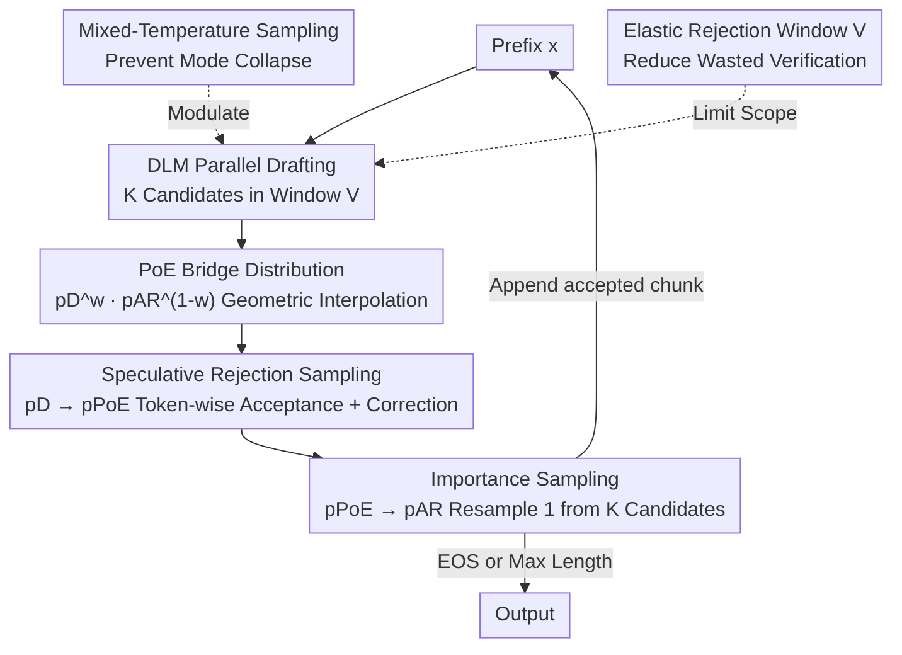

# Diffusion Language Model Parallel Decoding via Product-of-Experts Bridge

**Conference**: ICML2026  
**arXiv**: [2606.08048](https://arxiv.org/abs/2606.08048)  
**Code**: https://github.com/juntongshi48/poe-bridge  
**Area**: LLM Efficiency / Diffusion Language Model Parallel Decoding  
**Keywords**: Diffusion Language Models, Parallel Decoding, Product-of-Experts, Speculative Sampling, Importance Sampling

## TL;DR
Diffusion Language Models (DLMs) enable parallel decoding but suffer from poor quality. Directly using Monte Carlo methods to correct DLM drafts toward an Autoregressive (AR) target is computationally expensive due to the massive distribution gap. This paper proposes PoE-Bridge, which inserts a Product-of-Experts intermediate bridge distribution between the DLM and AR models. This decomposes the difficult "DLM $\to$ AR" correction into two easier "DLM $\to$ PoE $\to$ AR" steps. Combined with mixed-temperature sampling and elastic rejection windows, it accelerates standard DLM decoding by up to 5$\times$ on mathematical reasoning and coding tasks while recovering at least 95% of AR accuracy.

## Background & Motivation

**Background**: Autoregressive (AR) models generate tokens sequentially, providing high quality but suffering from high latency and poor parallelism. Diffusion Language Models (DLMs) achieve parallel decoding by iteratively refreshing multiple tokens simultaneously; while promising in speed, their quality lags significantly behind strong AR models.

**Limitations of Prior Work**: The root cause of DLM quality issues is the **conditional independence assumption** required for parallel decoding—multiple tokens generated in the same step are modeled independently rather than jointly. Consequently, achieving parallel acceleration typically incurs a significant quality loss. A natural direction is "DLM as a fast proposal, strong AR as a target for verification/correction," but naive Monte Carlo approaches fail. Under **rejection sampling**, the distribution mismatch between DLM and AR is so large that frequent rejections cause decoding to degenerate into near-serial execution. Under **importance sampling**, a massive number of candidates is required to find a good sample; with a limited candidate budget, resampling often merely selects the "least unreasonable DLM continuation" rather than a sample truly faithful to the AR distribution.

**Key Challenge**: The failure of both naive methods stems from the same issue—the **distribution mismatch between the parallel DLM proposal and the strong AR target is too large**. Correcting this in a single large step leads to either high rejection rates or high weight variance.

**Goal**: Retain the parallel decoding advantages of DLMs while achieving generation quality faithful to AR decoding.

**Key Insight**: Rather than hard-correcting in one giant step, it is better to **insert an intermediate distribution** to break the process into two smaller steps. Notably, AR models are "slow to sample but fast to score given a prefix," making them ideal for evaluating parallel drafts from a DLM.

**Core Idea**: Use a **Product-of-Experts (PoE) geometric interpolation** $p_{\mathrm{PoE}}(\mathbf{x})\propto p_D(\mathbf{x})^{w}p_{\mathrm{AR}}(\mathbf{x})^{1-w}$ as a bridge. This decomposes the difficult $p_D \to p_{\mathrm{AR}}$ correction into two more manageable steps: $p_D \to p_{\mathrm{PoE}} \to p_{\mathrm{AR}}$.

## Method

### Overall Architecture

PoE-Bridge is an **inference-time framework** that modifies the sampling process without retraining models. It utilizes a DLM (Dream-7B) as the parallel proposal and a task-specialized AR model (Qwen2.5-Math/Coder-7B) as the target, sharing a tokenizer. To enable token-by-token comparison between DLM drafts and AR likelihoods, the DLM employs **semi-autoregressive left-to-right decoding** with "mean-field chunk parametrization" to predict an entire draft segment in a single forward pass—where every token in the chunk is conditioned on the same prefix $\mathbf{x}_{<c_t}$: $\tilde{p}_D(\mathbf{x}_i\mid\mathbf{x}_{<i})\coloneqq\boldsymbol{\mu}_\theta(\mathbf{x}_i\mid\mathbf{x}_{<c_t})$.

The core mechanism constructs a PoE bridge between $\tilde{p}_D$ and $p_{\mathrm{AR}}$, followed by a **two-stage correction**: first, speculative rejection sampling pushes the parallel draft to the bridge distribution $p_{\mathrm{PoE}}$ (maintaining high throughput due to the bridge's proximity to the DLM); second, importance sampling pushes the bridged candidates lightly to $p_{\mathrm{AR}}$ (stable weights due to the narrowed gap). This cycle repeats per block until an EOS or maximum length is reached.

### Key Designs

**1. PoE Bridge Distribution: Halving the Proposal–Target Gap**

Sequence-level PoE $p_{\mathrm{PoE}}(\mathbf{x}_{c:n})\propto \tilde{p}_D^{\,w}p_{\mathrm{AR}}^{\,1-w}$ is difficult to sample or use for next-token probabilities. The authors **autoregressively define token-level PoE**: $p_{\mathrm{PoE}}(\mathbf{x}_i\mid\mathbf{x}_{<i})=\frac{\tilde{p}_D(\mathbf{x}_i\mid\mathbf{x}_{<i})^{w}\,p_{\mathrm{AR}}(\mathbf{x}_i\mid\mathbf{x}_{<i})^{1-w}}{Z_i(\mathbf{x}_{<i})}$, where $Z_i$ is a local normalization constant. This has two benefits: first, since parallelizable $\tilde{p}_D$ is used, next-token probabilities and chunk likelihoods remain efficient to compute for verification and weighting; second, the weight $w\in[0,1]$ smoothly controls the bridge's location ($w=1$ returns to DLM, $w=0$ to AR). An experimental value of $w=0.3$ provides the best balance.

**2. Two-Stage Correction: Speculative Rejection (→PoE) + Importance Resampling (→AR)**

**Stage 1: Speculative Rejection Sampling ($\tilde{p}_D\to p_{\mathrm{PoE}}$)**: Continuations are sampled in parallel from $\tilde{p}_D$ and accepted token-wise with probability $\min\!\big(1,\frac{p_{\mathrm{PoE}}(\hat{\mathbf{x}}_i\mid\hat{\mathbf{x}}_{<i})}{\tilde{p}_D(\hat{\mathbf{x}}_i\mid\hat{\mathbf{x}}_{<i})}\big)$ until the first rejection. A correction token is then sampled from the residual distribution $\mathrm{norm}\big(\max(0,\,p_{\mathrm{PoE}}-\tilde{p}_D)\big)$. This **removes the need for a majorizing constant $M$** while ensuring every verified token follows $p_{\mathrm{PoE}}$. **Stage 2: Importance Sampling ($p_{\mathrm{PoE}}\to p_{\mathrm{AR}}$)**: $K$ candidates are generated in parallel, assigned weights $w_k\propto\frac{p_{\mathrm{AR}}(\hat{\mathbf{x}}^{(k)}\mid\mathbf{x}_{<c})}{p_{\mathrm{PoE}}(\hat{\mathbf{x}}^{(k)}\mid\mathbf{x}_{<c})}$, and one is resampled. Because Stage 1 already shifted candidates toward $p_{\mathrm{AR}}$, the importance weights are significantly more stable than direct sampling from $\tilde{p}_D$.

**3. Mixed-Temperature Sampling: Preventing Mode Collapse**

LLM inference often uses low temperatures for stability, but with a finite budget $K$, a uniform low temperature makes the $K$ candidates nearly identical (mode collapse), rendering importance sampling useless. This method samples candidates from a **family of PoE distributions with different temperatures**: $\mathbf{x}^{(k)}\sim q_{\tau_k}$ where $q_{\tau_k}(\mathbf{x})\propto p_{\mathrm{PoE}}(\mathbf{x})^{1/\tau_k}$, with temperatures $\{\tau_k\}$ linearly spread across $[\tau_{\text{low}},\tau_{\text{high}}]$. This encourages diversity while maintaining high-probability regions.

**4. Elastic Rejection Window: Optimizing Verification Compute**

DLM inference usually requires long masked suffixes to prevent distribution drift, but rejection-based verification often only accepts short prefixes. The **Elastic Rejection Window** limits parallel drafting and verification to the next $V$ positions. If all $V$ tokens are accepted, the window advances; otherwise, it restarts from the rejection point. This **does not change the output distribution** but eliminates computation for tokens that would be discarded anyway.

### Mechanism

Assuming $K=4, V=32, w=0.3$: ① The DLM performs one forward pass to sample 4 candidates in parallel within window $V$, each with a different mixed temperature. ② Each candidate undergoes token-wise speculative rejection: if candidate $k$ is accepted for 9 tokens and rejected at the 10th, a correction token is sampled to form a bridge-distributed block of length 10. ③ Importance weights $w_k \propto p_{\mathrm{AR}}/p_{\mathrm{PoE}}$ are calculated for the 4 resulting blocks. ④ One block is resampled and appended to the prefix. The process repeats, advancing the prefix by multiple tokens per DLM forward pass.

## Key Experimental Results

### Main Results

Dream-7B-Instruct (DLM proposal) and Qwen2.5-Math/Coder-7B-Instruct (AR target) on a single A100, BF16. Parameters: $w=0.3, K=4, V=32$.

| Method | GSM8K Acc/Thrpt | MATH Acc/Thrpt | HumanEval Acc/Thrpt | MBPP Acc/Thrpt |
|------|------|------|------|------|
| Dream 7B (Entropy, 2 tok/step) | 72.00 / 26.25 | 27.91 / 29.13 | 47.56 / 17.44 | 55.93 / 8.26 |
| Qwen2.5 7B (AR target) | 95.53 / 49.26 | 76.28 / 46.50 | 83.54 / 45.83 | 75.87 / 47.09 |
| PoE-Bridge w/o IS (K=1) | 95.20 / **104.49** | 73.86 / **99.49** | **80.69** / 84.82 | 72.20 / 79.65 |
| **Ours (PoE-Bridge)** | **95.30** / 100.71 | **74.42** / 94.94 | 79.47 / 76.13 | **73.20** / 72.10 |

Compared to standard entropy-based DLM decoding, PoE-Bridge significantly improves accuracy and achieves up to **5$\times$ throughput**. Compared to the AR target, it recovers **$\geq$95%** accuracy while doubling throughput, breaking the conventional quality-efficiency trade-off of DLMs.

### Ablation Study

| Configuration | Key Metric | Description |
|------|---------|------|
| PoE Weight $w=0.0$ (Direct DLM $\to$ AR) | Acc 81.27 / Thrpt 56.55 | No bridge; short acceptance blocks and high rejection rates. |
| $w=0.3$ (Default) | Acc 80.69 / Thrpt 84.82 | Sweet spot for quality and efficiency. |
| $w=0.9$ | Acc 30.49 / Thrpt 168.35 | High throughput but accuracy collapses. |
| Elastic Window $V$ (MATH, K=4) | $V=32 \to 94.94$, $V=\infty \to 39.46$ | Infinite window wastes computation on tokens destined for rejection. |
| Mixed vs. Uniform Temp | Mixed temp improves with larger $K$; Uniform saturates early. | Mixed temp closes 1/3 of the remaining accuracy gap. |

### Key Findings
- **PoE Bridge ($w$) is an Efficiency-Quality Knob**: As $w$ increases from 0 to 0.9, accepted tokens per step increase from 4.91 to 15.61, and throughput skyrockets, but accuracy eventually collapses. $w=0.3$ offers the best compromise.
- **Mixed Temperature enables Scaling with $K$**: Under uniform temperatures, increasing $K$ provides minimal accuracy gains while hurting throughput. Mixed temperatures allow consistent accuracy improvements toward the AR limit.
- **Elastic Window is crucial for Parallel Efficiency**: On MATH with $K=4$, a fixed infinite window yields only 39.46 tokens/s, whereas $V=32$ reaches nearly 95 tokens/s.

## Highlights & Insights
- **"Inserting an intermediate distribution to decompose hard corrections" is a general paradigm**: This stabilizes Monte Carlo correction by reducing proposal-target mismatch and could be applied to any weak-proposal/strong-target scenario like sampling or distillation.
- **Token-level PoE yields tractability**: Sequence-level geometric interpolation is intractable, but the authors' autoregressive token-level approach enables efficient next-token probability calculation and temperature scaling.
- **Engineering designs solve real-world bottlenecks**: Mixed-temperature sampling prevents mode collapse, and elastic windows eliminate wasted verification compute, making the method viable on real hardware.

## Limitations & Future Work
- **Requires shared tokenizers**: Cross-tokenizer scenarios would require token alignment techniques, left for future work.
- **Memory Pressure**: Running both models simultaneously on a single card poses high VRAM demands; multi-query/batching performance was not explored.
- **Statistical Bias**: Importance sampling with finite $K$ introduces a slight bias, though results show it is minimal and decreases as $K$ grows.

## Related Work & Insights
- **vs. Vanilla Speculative Decoding**: Classical approaches use a small draft model to speed up a strong AR model; this work addresses the massive mismatch when using a large DLM as a parallel proposal.
- **vs. APD (Israel 2025)**: APD focuses on speed but is bounded by DLM quality; PoE-Bridge elevates quality to the AR level.
- **vs. Importance-based Corrections**: Previous methods were sensitive to mismatch; the bridge stabilizes weights, making IS feasible even with limited budgets.

## Rating
- Novelty: ⭐⭐⭐⭐
- Experimental Thoroughness: ⭐⭐⭐⭐
- Writing Quality: ⭐⭐⭐⭐
- Value: ⭐⭐⭐⭐⭐

<!-- RELATED:START -->

## Related Papers

- [\[ACL 2026\] CreditDecoding: Accelerating Parallel Decoding in Diffusion Large Language Models with Trace Credit](../../ACL2026/llm_efficiency/creditdecoding_accelerating_parallel_decoding_in_diffusion_large_language_models.md)
- [\[ICML 2026\] MineDraft: A Framework for Batch Parallel Speculative Decoding](minedraft_a_framework_for_batch_parallel_speculative_decoding.md)
- [\[ICML 2026\] TEAM: Temporal-Spatial Consistency Guided Expert Activation for MoE Diffusion Language Model Acceleration](team_temporal-spatial_consistency_guided_expert_activation_for_moe_diffusion_lan.md)
- [\[ICML 2026\] VIA-SD: Verification via Intra-Model Routing for Speculative Decoding](via-sd_verification_via_intra-model_routing_for_speculative_decoding.md)
- [\[ICML 2026\] Structuring The Future: Diffusion LLM Speculative Decoding via Calibrated Draft Graphs](structuring_the_future_diffusion_llm_speculative_decoding_via_calibrated_draft_g.md)

<!-- RELATED:END -->
