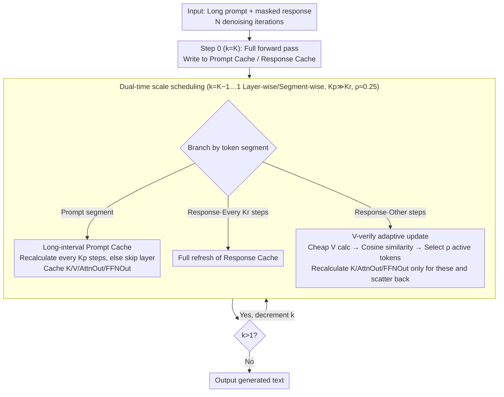

# dLLM-Cache: Accelerating Diffusion Large Language Models with Adaptive Caching

**Conference**: ICML 2026  
**arXiv**: [2506.06295](https://arxiv.org/abs/2506.06295)  
**Code**: https://github.com/maomaocun/dLLM-cache (Available)  
**Area**: LLM Efficiency  
**Keywords**: Diffusion Language Models, Inference Acceleration, Adaptive Caching, V-verify, LLaDA / Dream

## TL;DR
To address the significant inference slowdown in Diffusion Large Language Models (dLLMs) caused by the inability of bidirectional attention to reuse KV cache, this paper proposes dLLM-Cache—a training-free method. It employs long-interval caching for static prompts and short-interval refreshing for dynamic responses, utilizing Value cosine similarity to select the 25% most "active" tokens for local recomputation. On LLaDA 8B and Dream 7B, it achieves up to 9.1× FLOPs acceleration with minimal performance degradation.

## Background & Motivation

**Background**: Autoregressive Models (ARMs) have long dominated text generation. Their causal attention naturally supports Key-Value caching, reducing generation complexity from $O(N^3)$ to $O(N^2)$. Recently, diffusion language models (dLLMs) like LLaDA and Dream use mask-based bidirectional attention and multi-step denoising for text generation, overcoming the "reversal curse" and achieving performance comparable to Llama 3 8B.

**Limitations of Prior Work**: Actual dLLM inference is extremely slow. Generating a sequence of length $N$ requires $N$ denoising iterations, each recalculating bidirectional attention across all tokens, resulting in $O(N^3)$ complexity. Furthermore, because bidirectional masks are non-monotonic, **traditional KV cache is directly inapplicable**. Even on an RTX 4090, LLaDA 8B achieves only 7.3 TPS on GSM8K, significantly lower than the 47.7 TPS of a similar-sized Llama 3 8B.

**Key Challenge**: Bidirectional attention is both a performance advantage for dLLMs (allowing full context visibility) and an efficiency bottleneck (precluding causal pruning). Naive strategies, such as refreshing the cache every $K$ steps uniformly, either cause severe performance drops or offer limited savings.

**Goal**: To discover a caching strategy that accurately characterizes the computational redundancy of dLLMs without retraining, bringing dLLM inference speeds closer to ARMs.

**Key Insight**: Heatmaps of cosine similarity for Key/Value/AttnOut/FFNOut between adjacent denoising steps reveal two strong signals: (1) **Prompt regions** remain almost entirely identical across all steps (similarity near 1) since the input is static. (2) **Response regions** generally show high similarity, but **only a few tokens "change" significantly** at any given step, and changes in their Value correlate highly with changes in downstream AttnOut/FFNOut. Thus, prompts and responses should be treated differently, and responses further distinguished between "stable" and "active" tokens.

**Core Idea**: A three-stage adaptive caching mechanism featuring long-interval prompt caching, short-interval response full refreshes, and Value-similarity-guided local updates to eliminate dLLM redundancies.

## Method

### Overall Architecture
dLLM-Cache is a training-free plugin for the dLLM inference forward pass. It addresses redundancy by splitting computation into two categories: the prompt segment (largely invariant across steps) and the response segment (only a few active tokens). Specifically, for each Transformer layer $l$, it maintains a Prompt Cache $\mathcal{C}_p$ and a Response Cache $\mathcal{C}_r$, both storing $\mathbf{K}^{(l)}, \mathbf{V}^{(l)}, \mathbf{AttnOut}^{(l)}, \mathbf{FFNOut}^{(l)}$. The refresh rhythm is controlled by three hyperparameters: prompt refresh interval $K_p$, response full refresh interval $K_r$, and adaptive update ratio $\rho$.

At step 0 ($k=K$), a complete forward pass is performed, and features are written to both caches. For subsequent steps $k$ from $K-1$ to 1, the model performs selective computation: the prompt segment is skipped (reading from cache) unless $k \equiv 0 \pmod{K_p}$. For the response segment, a full refresh is triggered if $k \equiv 0 \pmod{K_r}$; otherwise, the V-verify local update is used to recompute only active tokens, while others reuse the previous cache.

### Key Designs

**1. Long-Interval Prompt Cache: Bypassing the Transformer for Static Prompts**

dLLMs often involve long prompts and short responses. The prompt segment is the primary source of computational waste as it is recalculated every step despite remaining nearly constant. Since dLLM training utilizes per-token independent random masks, prompt tokens receive constant inputs across all denoising steps. Per-layer $\mathbf{K}_p^{(l)}, \mathbf{V}_p^{(l)}, \mathbf{AttnOut}_p^{(l)}, \mathbf{FFNOut}_p^{(l)}$ are cached and recalculated only when $k \equiv 0 \pmod{K_p}$ (typically $K_p=50\text{--}100$). Crucially, caching Attention and FFN outputs allows the entire prompt segment to skip the Transformer layer, distinguishing this from dKV-Cache/Fast-dLLM, which only cache KV and still require step-wise FFN recomputation.

**2. V-verify-guided Adaptive Response Update: Using Cheap Values to Predict Expensive Feature Updates**

The response segment also exhibits high overall similarity, though specific tokens change at certain steps. The challenge is identifying these tokens without a full recomputation. Observations in Figure 2 show that changes in $\mathbf{V}$ (and $\mathbf{K}$) similarity correlate strongly with downstream AttnOut/FFNOut changes. Thus, $\mathbf{V}$ acts as a proxy signal: between full refreshes, the new $\mathbf{V}_r^{\text{new}}$ is calculated for all response tokens via a lightweight projection. For each token $j$, the cosine similarity with the cached value $\tilde{\mathbf{v}}_{r,j}^{(l)}$ is computed:

$$s_j = \frac{(\mathbf{v}_{r,j}^{(l)})^\top \tilde{\mathbf{v}}_{r,j}^{(l)}}{\|\mathbf{v}_{r,j}^{(l)}\|\, \|\tilde{\mathbf{v}}_{r,j}^{(l)}\|},$$

The tokens with the lowest $s_j$ (top $\lfloor \rho\,|\mathbf{y}^{(k)}| \rfloor$) are deemed "active." Only these tokens undergo full recomputation of $\mathbf{K}, \mathbf{AttnOut}, \mathbf{FFNOut}$, which are then scattered back into the cache; the full $\mathbf{V}_r$ is updated since it was already calculated.

**3. Dual-Time Scale Differential Scheduling ($K_p \gg K_r$, $\rho \approx 0.25$): Managing Two Types of Redundancy**

Combining the above, two distinct refresh frequencies manage the two redundancy structures: sparse updates for prompts ($K_p = 50\text{--}100$) and high-frequency but localized updates for the slowly evolving response ($K_r = 5\text{--}10$, updating only $\rho = 0.25$, or 1/4 of tokens). This scheduling introduces only three hyperparameters and requires minimal tuning across models. The memory overhead (caching four feature types) is approximately 1 GB (~5%) for LLaDA 8B. Ablations confirm that differentiating these segments is essential; uniform caching either yields limited savings or severe accuracy drops.

### Loss & Training
The method is completely training-free, requiring no model weight changes or cache-aware fine-tuning. It can be directly integrated into the inference forward pass of LLaDA / Dream.

## Key Experimental Results

### Main Results
Benchmarks were conducted on LLaDA 8B (Base/Instruct) and Dream 7B (Base/Instruct) across 8 benchmarks (GSM8K, GPQA, Math, MMLU-pro, MMLU, BBH, MBPP, HumanEval) on a single RTX 4090 with $\rho = 0.25$.

| Model | Task | TPS (baseline → +Cache) | FLOPs Accel. | Score Change |
|--------|------|------|----------|------|
| LLaDA Base | GSM8K | 7.32 → 23.19 | 5.02× | 69.06 → 70.66 (+1.60) |
| LLaDA Instruct | GPQA | 5.33 → 28.01 | **8.08×** | 29.01 → 29.01 (0) |
| LLaDA Instruct | BBH | 6.18 → 27.55 | 6.16× | 51.49 → 51.98 (+0.49) |
| Dream Base | GSM8K | 6.36 → 32.44 | 6.90× | 76.95 → 76.95 (0) |
| Dream Base | GPQA | 5.80 → 30.95 | 7.15× | 33.92 → 34.15 (+0.23) |
| Dream Instruct | MMLU | 8.45 → 38.01 | 6.10× | 73.40 → 73.42 (+0.02) |

Comparison with Llama 3 8B on GSM8K: The baseline LLaDA Base (256 steps) achieved 7.37 TPS / 69.06%. With dLLM-Cache, it reached 20.64 TPS / 70.66% (+5% memory cost). Combined with SlowFast Sampling, it reached 49.86 TPS / 67.17%, matching the throughput of Llama 3 8B (47.73 TPS) while providing an 18.12 percentage point lead in accuracy.

Comparison with concurrent works:

| Task | dKV-Cache | Fast-dLLM | **dLLM-Cache** |
|------|-----------|-----------|----------------|
| GPQA (Dream Base) | 1.74× / 32.83 | 3.83× / 31.31 | **5.33× / 34.15** |
| MMLU (LLaDA Inst) | 1.42× / 60.87 | 2.03× / 61.43 | **2.10× / 62.82** |
| HumanEval (LLaDA Inst) | 1.36× / 37.20 | 2.03× / 36.59 | **4.24× / 39.02** |

### Ablation Study

| Configuration | Key Observation |
|------|---------|
| Token Selection: V-verify vs K-verify vs random | Similarity-based strategies outperform random; V-verify at $\rho \approx 0.25$ provides the best Score/FLOPs trade-off. |
| $K_p$ Sweep ($K_r=1, \rho=0$) | Increasing $K_p$ to 100 significantly reduces FLOPs while accuracy remains stable, confirming prompt redundancy. |
| $K_r$ Sweep: Uniform vs Ours ($K_p=50, \rho=0.25$) | Uniform caching shows a sharp drop in accuracy as $K_r$ increases; our method maintains high scores with lower FLOPs. |
| 256-step vs 32-step baseline | 32-step achieves 53.55 TPS but GSM8K drops to 22.25%. dLLM-Cache (256 steps) provides 20.64 TPS / 70.66%. |
| $\rho$ vs TPS Curve | TPS initially drops at $\rho>0$ due to kernel/scatter overhead, then decreases slowly as $\rho$ increases. |
| Memory Overhead | Caching 4 feature types costs $T \cdot d \cdot 4 \cdot L$; LLaDA 8B uses only +1 GB (+5%). |

### Key Findings
- The core contribution stems from the differentiated scheduling: sparse prompt updates and localized response updates. Removing either, or using uniform caching, leads to significant accuracy drops or insufficient acceleration.
- V-verify's effectiveness rests on the empirical observation that Value similarity correlates with downstream feature similarity, enabling the proxy update mechanism.
- $\rho \approx 0.25$ is the "sweet spot": smaller values suffer from GPU kernel overhead, while larger values increase computation unnecessarily.
- dLLM-Cache is **orthogonal** to methods like SlowFast Sampling (step reduction). Their combination allows LLaDA to match Llama 3 8B throughput while maintaining superior accuracy.

## Highlights & Insights
- **Correct Decomposition of dLLM Redundancy**: Identifying "prompt as near-total redundancy" vs "response as sparse dynamics" is a cleaner and more natural fit for dLLMs than the standard ARM KV cache.
- **V as a Change Proxy**: This avoids the paradox of "computing everything to decide what to skip." This approach can generalize to any iterative refinement model (e.g., image diffusion, iterative detection) by finding early cheap signals correlated with late-stage features.
- **Cache Beyond KV**: Incorporating AttnOut and FFNOut essentially "skips the Transformer layer." This is why it outperforms dKV-Cache/Fast-dLLM. Insight: In dLLMs where FFN is heavy, **skipping the FFN is more valuable than skipping attention**.

## Limitations & Future Work
- Experiments focused on LLaDA 8B and Dream 7B; generalizability to other dLLM variants (e.g., multimodal MaskedDiff) is untested. Optimal $K_p/K_r$ values may require light tuning per model.
- At small $\rho$, TPS decreases due to fixed costs like V-verify and scatter operations. Future work could implement fused selective-recomputation at the operator level to smooth performance for $\rho \to 0$.
- The prompt-response boundary is static. Scenarios involving dynamic lengths, streaming prompt modifications, or Chain-of-Thought may require further extensions. Layer-wise active token sets might also be inconsistent; cross-layer consistency could further reduce computation.

## Related Work & Insights
- **vs dKV-Cache (Ma et al., 2026)**: Both use caching, but dKV-Cache is limited to K/V. Ours uses prompt/response bifurcation + V-verify + caching up to the FFN output, leading to 5.33× vs 1.74× speedups.
- **vs Fast-dLLM (Wu et al., 2026)**: Fast-dLLM uses block-level approximate KV cache + parallel decoding. Ours is "step-preserving + fine-grained adaptive caching," offering more stable quality and orthogonality for combination.
- **vs SlowFast Sampling (Wei et al., 2026)**: A step-reduction method. Combined, they allow LLaDA 8B to reach ~50 TPS, a Pareto-optimal solution for dLLM acceleration.
- **vs ARM KV-Cache (Pope et al., 2023)**: ARMs cache K/V losslessly due to causal masks. Ours translates "reusing historical tokens" into "reusing same tokens from the previous denoising step."

## Rating
- Novelty: ⭐⭐⭐⭐ First fine-grained adaptive caching for dLLM bidirectional attention; V-verify is a powerful, simple proxy.
- Experimental Thoroughness: ⭐⭐⭐⭐ High benchmark coverage, direct comparison with concurrent work, and cross-paradigm comparison with Llama 3 8B.
- Writing Quality: ⭐⭐⭐⭐ Strong analytical framework (Figure 1/2); well-paced technical explanation.
- Value: ⭐⭐⭐⭐⭐ Vital engineering contribution that resolves the primary barrier to dLLM production deployment by reaching ARM-level speeds.

<!-- RELATED:START -->

## Related Papers

- [\[ACL 2026\] CreditDecoding: Accelerating Parallel Decoding in Diffusion Large Language Models with Trace Credit](../../ACL2026/llm_efficiency/creditdecoding_accelerating_parallel_decoding_in_diffusion_large_language_models.md)
- [\[ACL 2026\] Breaking Block Boundaries: Anchor-based History-stable Decoding for Diffusion Large Language Models](../../ACL2026/llm_efficiency/breaking_block_boundaries_anchor-based_history-stable_decoding_for_diffusion_lar.md)
- [\[ICML 2026\] TEAM: Temporal-Spatial Consistency Guided Expert Activation for MoE Diffusion Language Model Acceleration](team_temporal-spatial_consistency_guided_expert_activation_for_moe_diffusion_lan.md)
- [\[ICML 2026\] Fast-dLLM++: Fréchet Profile Decoding for Faster Diffusion LLM Inference](fast-dllm_fréchet_profile_decoding_for_faster_diffusion_llm_inference.md)
- [\[ICML 2026\] ProactiveLLM: Learning Active Interaction for Streaming Large Language Models](proactivellm_learning_active_interaction_for_streaming_large_language_models.md)

<!-- RELATED:END -->
