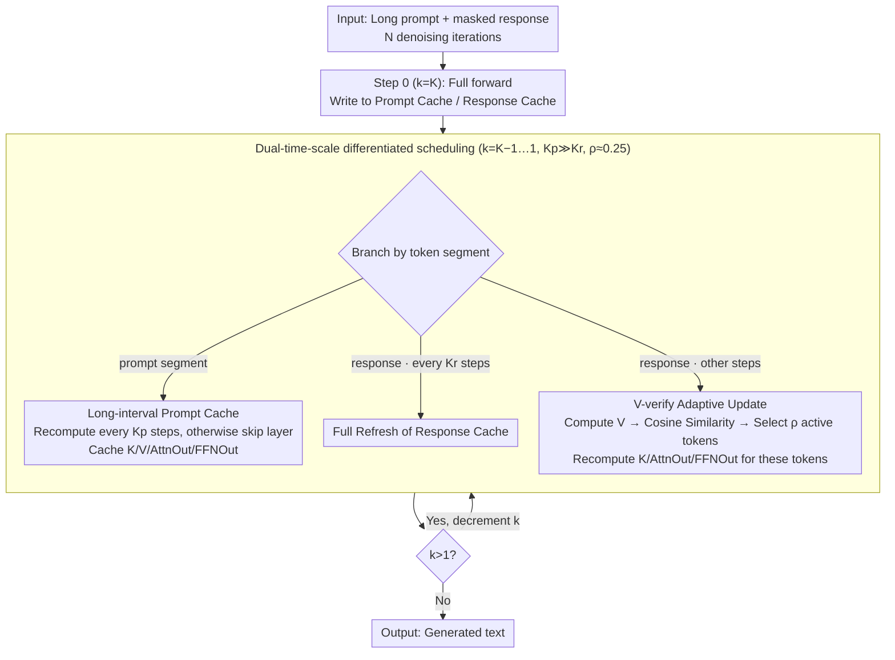

# dLLM-Cache: Accelerating Diffusion Large Language Models with Adaptive Caching

**Conference**: ICML 2026  
**arXiv**: [2506.06295](https://arxiv.org/abs/2506.06295)  
**Code**: https://github.com/maomaocun/dLLM-cache (Available)  
**Area**: LLM Efficiency  
**Keywords**: Diffusion Large Language Models, Inference Acceleration, Adaptive Caching, V-verify, LLaDA / Dream

## TL;DR
To address the bottleneck where diffusion Large Language Models (dLLMs) suffer from extremely slow inference due to bidirectional attention and the inability to reuse KV caches, this paper proposes dLLM-Cache. This training-free method applies long-interval caching for static prompts and short-interval refreshing for dynamic responses. By using Value cosine similarity (V-verify) to select and recompute the top 25% most "active" tokens, it achieves up to 9.1× FLOPs acceleration on LLaDA 8B / Dream 7B with almost no drop in performance.

## Background & Motivation

**Background**: Autoregressive LLMs (ARMs) have long dominated text generation, naturally supporting Key-Value caching via causal attention, which reduces generation complexity from $O(N^3)$ to $O(N^2)$. Recently, diffusion language models (dLLMs) such as LLaDA and Dream have utilized mask-based bidirectional attention and multi-step denoising paradigms to generate text, avoiding the "reversal curse" and achieving performance comparable to Llama 3 8B.

**Limitations of Prior Work**: Actual dLLM inference is prohibitively slow. Generating a sequence of length $N$ requires $N$ iterative denoising steps, with each step recalculating bidirectional attention across all tokens, resulting in $O(N^3)$ complexity. Furthermore, because bidirectional masks are not monotonic, **traditional KV caches are fundamentally unusable**. Even on an RTX 4090, LLaDA 8B only achieves 7.3 TPS on GSM8K, far below the 47.7 TPS of Llama 3 8B.

**Key Challenge**: Bidirectional attention is both a performance strength (allowing full context visibility) and an efficiency weakness (preventing causal pruning due to mutual dependencies). Naive periodic caching strategies (refreshing every K steps) either cause significant performance degradation or provide limited computational savings.

**Goal**: To find a caching strategy that accurately characterizes the computational redundancy in dLLMs without retraining, pushing dLLM inference speeds closer to those of ARMs.

**Key Insight**: Heatmaps of cosine similarity for Key/Value/AttnOut/FFNOut between adjacent denoising steps reveal two strong signals: (1) The **prompt region** remains almost entirely bright across all steps (similarity $\approx 1$) because the input does not change. (2) The **call-to-action/response region** shows high overall similarity, but only a few tokens "change" significantly at specific steps; these changes in Value are highly correlated with changes in downstream AttnOut/FFNOut. Therefore, prompts and responses should be treated differently, and responses should further distinguish between "stable tokens" and "active tokens."

**Core Idea**: A three-stage adaptive caching mechanism—long-interval prompt caching, short-interval full response refreshing, and Value-similarity-guided local updates—to eliminate the two types of redundancy in dLLMs.

## Method

### Overall Architecture
dLLM-Cache is a training-free plugin for the dLLM inference forward pass. It decomposes the redundancy of "recalculating bidirectional attention for all tokens at every step" into two categories: the prompt segment is nearly invariant across steps, while the response segment has only a few truly active tokens. Specifically, for each Transformer layer $l$, it maintains a Prompt Cache $\mathcal{C}_p$ and a Response Cache $\mathcal{C}_r$, storing four sets of features: $\mathbf{K}^{(l)}, \mathbf{V}^{(l)}, \mathbf{AttnOut}^{(l)}, \mathbf{FFNOut}^{(l)}$. Three hyperparameters control the refresh pace: prompt refresh interval $K_p$, response full refresh interval $K_r$, and adaptive update ratio $\rho$.

At step 0 ($k=K$), a complete forward pass is performed, and prompt/response features are written into their respective caches. Subsequently, as $k$ decrements from $K-1$ to 1, each layer makes a selection: the prompt segment is loaded from cache unless $k \equiv 0 \pmod{K_p}$, and the response segment undergoes a full refresh if $k \equiv 0 \pmod{K_r}$, otherwise proceeding with the V-verify local update. Remaining tokens reuse the previous step's cache.

### Key Designs

**1. Long-Interval Prompt Cache: Bypassing the Transformer for static prompts**

dLLMs often involve long prompts and short responses. The prompt segment is the largest source of redundancy because its input is constant across denoising steps due to the per-token independent random masking used in training. Cosine similarity for prompt K/V/AttnOut/FFNOut between steps is near 1. By caching $\mathbf{K}_p^{(l)}, \mathbf{V}_p^{(l)}, \mathbf{AttnOut}_p^{(l)}, \mathbf{FFNOut}_p^{(l)}$ and only recomputing when $k \equiv 0 \pmod{K_p}$ (where $K_p$ is typically 50–100), the prompt section essentially skips the entire Transformer layer. Unlike dKV-Cache or Fast-dLLM which only cache KV, Ours caches Attention and FFN outputs as well.

**2. V-verify-guided Adaptive Response Update: Using cheap Values to predict expensive feature recomputation**

While the response segment is generally similar across steps, a few tokens change abruptly. To avoid the paradox of "calculating everything to decide what to save," Ours uses $\mathbf{V}$ as a proxy signal. Between full refreshes, a lightweight projection calculates the new $\mathbf{V}_r^{\text{new}}$ for all response tokens. The cosine similarity $s_j$ of each token $j$ relative to its cached value $\tilde{\mathbf{v}}_{r,j}^{(l)}$ is computed:

$$s_j = \frac{(\mathbf{v}_{r,j}^{(l)})^\top \tilde{\mathbf{v}}_{r,j}^{(l)}}{\|\mathbf{v}_{r,j}^{(l)}\|\, \|\tilde{\mathbf{v}}_{r,j}^{(l)}\|},$$

The $\lfloor \rho\,|\mathbf{y}^{(k)}| \rfloor$ tokens with the lowest $s_j$ are deemed "active." Only these tokens undergo full recomputation of $\mathbf{K}, \mathbf{AttnOut}, \text{ and } \mathbf{FFNOut}$, which are then scattered back into the cache. Since $\mathbf{V}_r$ is already computed for the segment, it is fully updated.

**3. Dual-time-scale Differentiated Scheduling ($K_p \gg K_r$, $\rho \approx 0.25$)**

This strategy manages two redundancy structures with different frequencies: extremely sparse refreshes for the prompt ($K_p = 50\text{--}100$) and high-frequency but local refreshes for the response ($K_r = 5\text{--}10$, updating only $\rho = 0.25$ tokens). This scheduling introduces only three hyperparameters that rarely need tuning across tasks. The memory trade-off is storing four types of features ($T \times d \times 4 \times L$), which for LLaDA 8B results in only a +1 GB (~5%) increase in VRAM.

### Loss & Training
Ours is entirely training-free. It does not modify model weights or require cache-aware fine-tuning; it is applied directly to the LLaDA / Dream inference forward pass.

## Key Experimental Results

### Main Results
Evaluation was conducted on LLaDA 8B Base/Instruct and Dream 7B Base/Instruct across 8 benchmarks (GSM8K, GPQA, Math, MMLU-pro, MMLU, BBH, MBPP, HumanEval) using a single RTX 4090 with $\rho = 0.25$.

| Model | Task | TPS (baseline → +Cache) | FLOPs Speedup | Accuracy Change |
|--------|------|------|----------|------|
| LLaDA Base | GSM8K | 7.32 → 23.19 | 5.02× | 69.06 → 70.66 (+1.60) |
| LLaDA Instruct | GPQA | 5.33 → 28.01 | **8.08×** | 29.01 → 29.01 (0) |
| LLaDA Instruct | BBH | 6.18 → 27.55 | 6.16× | 51.49 → 51.98 (+0.49) |
| Dream Base | GSM8K | 6.36 → 32.44 | 6.90× | 76.95 → 76.95 (0) |
| Dream Base | GPQA | 5.80 → 30.95 | 7.15× | 33.92 → 34.15 (+0.23) |
| Dream Instruct | MMLU | 8.45 → 38.01 | 6.10× | 73.40 → 73.42 (+0.02) |

Comparison with Llama 3 8B on GSM8K: LLaDA Base originally achieved 7.37 TPS / 69.06% accuracy. With dLLM-Cache, it reaches 20.64 TPS / 70.66%. Combined with SlowFast Sampling, it achieves 49.86 TPS / 67.17%, nearly equal to Llama 3 8B's throughput (47.73 TPS) while maintaining an 18.12 percentage point lead in accuracy.

### Ablation Study

| Configuration | Key Observation |
|------|---------|
| Selection Strategy: V-verify vs K-verify vs random | Similarity-based strategies outperform random; V-verify with $\rho \approx 0.25$ provides the best trade-off. |
| $K_p$ Sweep ($K_r=1, \rho=0$) | Increasing $K_p$ to 100 significantly reduces FLOPs while accuracy remains stable. |
| $K_r$ Sweep: Uniform vs Differentiated | Uniform caching leads to a sharp accuracy drop as $K_r$ increases; Ours maintains high scores at lower FLOPs. |
| Step reduction (Baseline 256 to 32) | Simple step reduction to 32 steps (53.55 TPS) causes GSM8K accuracy to crater (22.25%). |

### Key Findings
- The primary contribution comes from the differentiated scheduling of prompt and response caching. Removing either part results in performance drops or insufficient speedup.
- V-verify validity is based on the finding that response V-similarity correlates with downstream AttnOut/FFNOut similarity, allowing "cheap" features to dictate recomputation.
- $\rho \approx 0.25$ is a universal sweet spot: too small, and GPU kernel launch overheads dominate; too large, and computational savings diminish.
- dLLM-Cache is **orthogonal** to step-reduction methods like SlowFast Sampling.

## Highlights & Insights
- **Optimal Redundancy Decomposition**: Identifying that prompts are nearly step-invariant while responses evolve non-uniformly is more precise than ARM's KV cache and fits the bidirectional nature of dLLMs.
- **V as a Change Proxy**: This avoids the infinite loop of "calculating to decide whether to calculate." This approach could be transferred to any iterative refinement model (e.g., image diffusion, iterative detectors).
- **Extending Cache Beyond KV**: By caching AttnOut and FFNOut, the method allows skipping the entire Transformer layer. This highlights that in dLLMs, **the FFN is the primary component worth skipping**, not just Attention.

## Limitations & Future Work
- Experiments focused on LLaDA and Dream; generalization to other dLLM variants (e.g., multi-modal MaskedDiff) remains to be verified.
- At small $\rho$, TPS gains are limited by GPU kernel launch and scatter overheads. Future work could implement fused selective recomputation to reduce fixed costs.
- The prompt-response boundary is currently static, which may require adaptations for dynamic prompts or Chain-of-Thought scenarios.

## Related Work & Insights
- **vs dKV-Cache**: Both implement caching, but dKV-Cache only reuses KV after decoding. Ours differentiates prompt/response, uses V-verify, and caches up to FFN outputs, yielding a 5.33× vs 1.74× speedup on GPQA.
- **vs Fast-dLLM**: Fast-dLLM uses block-level approximate KV cache and parallel decoding. Ours is a fine-grained adaptive caching route that maintains better result quality and is orthogonal to parallel decoding.
- **vs ARM KV-Cache**: ARM allows lossless caching due to causal masks. Ours adapts the "feature reuse" idea to bidirectional attention, changing the reuse dimension from "past tokens" to "previous denoising steps of the same token."

## Rating
- Novelty: ⭐⭐⭐⭐ First to propose training-free, fine-grained adaptive caching for dLLM bidirectional attention; V-verify is a powerful, simple heuristic.
- Experimental Thoroughness: ⭐⭐⭐⭐ Covers multiple dLLM families, 8 benchmarks, and direct comparisons with contemporary works and ARM baselines.
- Writing Quality: ⭐⭐⭐⭐ The redundancy analysis in Figures 1/2 is clear; the technical flow is well-paced.
- Value: ⭐⭐⭐⭐⭐ Pulls dLLM inference speed into the same range as ARMs, addressing the biggest obstacle to dLLM deployment.

<!-- RELATED:START -->

## Related Papers

- [\[ACL 2026\] CreditDecoding: Accelerating Parallel Decoding in Diffusion Large Language Models with Trace Credit](../../ACL2026/llm_efficiency/creditdecoding_accelerating_parallel_decoding_in_diffusion_large_language_models.md)
- [\[ICLR 2026\] Learning to Parallel: Accelerating Diffusion Large Language Models via Learnable Parallel Decoding](../../ICLR2026/llm_efficiency/learning_to_parallel_accelerating_diffusion_large_language_models_via_learnable_.md)
- [\[ICLR 2026\] FlashDLM: Accelerating Diffusion Language Model Inference via Efficient KV Caching and Guided Diffusion](../../ICLR2026/llm_efficiency/flashdlm_accelerating_diffusion_language_model_inference_via_efficient_kv_cachin.md)
- [\[ICLR 2026\] Accelerating Diffusion Large Language Models with SlowFast Sampling: The Three Golden Principles](../../ICLR2026/llm_efficiency/accelerating_diffusion_large_language_models_with_slowfast_sampling_the_three_go.md)
- [\[ICLR 2026\] Dynamic-dLLM: Dynamic Cache-Budget and Adaptive Parallel Decoding for Training-Free Acceleration of Diffusion LLM](../../ICLR2026/llm_efficiency/dynamic-dllm_dynamic_cache-budget_and_adaptive_parallel_decoding_for_training-fr.md)

<!-- RELATED:END -->
