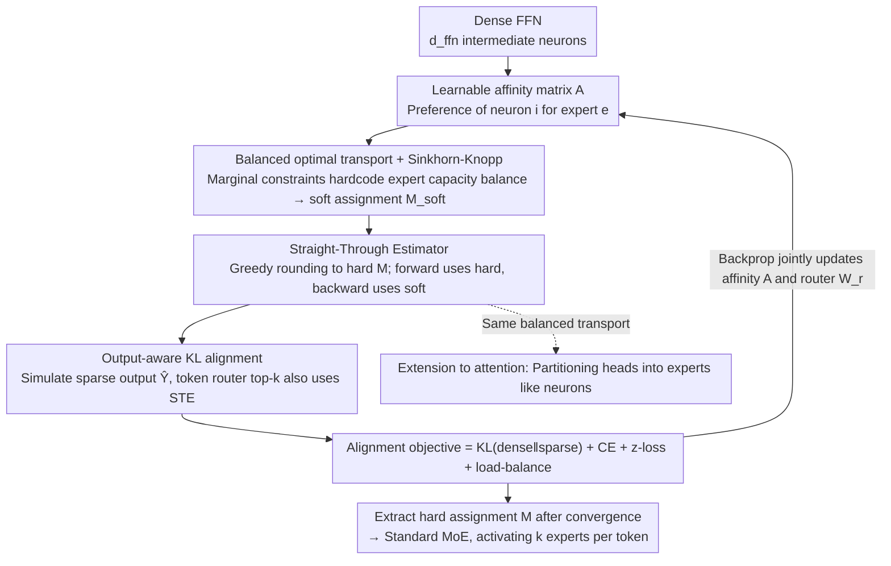

# DOT-MoE: Transforming Dense LLMs into MoE with Differentiable Optimal Transport

**Conference**: ICML 2026  
**arXiv**: [2606.01666](https://arxiv.org/abs/2606.01666)  
**Code**: Paper not provided  
**Area**: Model Compression / MoE / Optimal Transport  
**Keywords**: MoEfication, Neuron Allocation, Sinkhorn-Knopp, Straight-Through Estimator, dense-to-MoE

## TL;DR
DOT-MoE models the "allocation of neurons to experts when converting a dense FFN to an MoE" as a differentiable optimal transport problem. It employs Sinkhorn-Knopp iterations to solve entropic-regularized balanced transport combined with a Straight-Through Estimator, allowing joint end-to-end learning of neuron-to-expert assignment and the router. It retains 90% of dense performance under 50% active parameters on LLaMA-2/3 and Qwen2.5, outperforming all baselines including structured pruning, random allocation, and clustering.

## Background & Motivation

**Background**: Scaling LLMs leads to performance leaps but incurs massive inference costs. Dense Transformers activate all parameters per token, causing latency explosion. MoE (Switch, GShard, Mixtral, Qwen3-30B-A3B) decouples "model size" from "inference cost" through sparse routing—Qwen3-30B-A3B has 30.5B total parameters but activates only 3.3B per token. However, training MoE from scratch is data-hungry and requires complex load balancing. MoEfication (Zhang 2022) follows a "dense-to-MoE" route to leverage existing dense checkpoints.

**Limitations of Prior Work**: Existing MoEfication neuron allocation strategies are heuristic: (1) Random (LLaMA-MoE) relies on heavy continued pretraining; (2) Weight-based clustering (LTE/MoEfication) uses weight similarity of $W_{\text{gate}}/W_{\text{up}}$; (3) Activation-based clustering (LLaMA-MoE-v2, CMoE) uses activation or gradient importance. A shared limitation is that they optimize for proxies of intermediate representations (input weights / activations / co-activation) rather than the actual FFN output. Given $\text{FFN}(\mathbf{x}) = \mathbf{H} \mathbf{W}_{\text{down}}$, the output depends on the interaction between the intermediate $\mathbf{H}$ and $\mathbf{W}_{\text{down}}$, which proxy methods fail to capture.

**Key Challenge**: Neuron allocation and router training must be jointly optimized (changing neuron assignment affects which tokens should route to an expert, requiring router updates). However, discrete assignment is non-differentiable, forcing existing methods to use frozen assignments while training the router—a two-stage process that fails to optimize overall output reconstruction.

**Goal**: Establish a framework that (a) jointly optimizes neuron assignment and the router, (b) guarantees expert capacity balance, and (c) is output-aware rather than proxy-aware.

**Key Insight**: Neuron allocation equals mass transport (each neuron carries unit mass to an expert, each expert receives $s$ units of mass)—this is precisely an optimal transport (OT) problem. OT has a Sinkhorn analytical solution (differentiable), and entropic regularization ensures a unique, closed-form solution. The Straight-Through Estimator allows backpropagation through discrete decisions.

**Core Idea**: (1) Frame neuron allocation as balanced OT: source $\mathbf{r} = \mathbf{1}_{d_{\text{ffn}}}$ (one per neuron), target $\mathbf{c} = s \cdot \mathbf{1}_E$ ($s$ per expert), and a learnable cost matrix; (2) Solve entropic-regularized OT via Sinkhorn-Knopp for soft assignment; (3) Convert to hard assignment via greedy rounding, with STE for gradient flow; (4) Jointly train assignment and the router using a KL divergence loss to reconstruct the dense output.

## Method

### Overall Architecture

DOT-MoE takes an FFN from a pretrained dense LLM $\text{FFN}(\mathbf{x}) = (\sigma(\mathbf{x} \mathbf{W}_{\text{gate}}) \odot (\mathbf{x} \mathbf{W}_{\text{up}})) \mathbf{W}_{\text{down}}$ (containing $d_{\text{ffn}}$ intermediate neurons). The goal is to partition these neurons into $E$ experts (each with $s = d_{\text{ffn}}/E$ neurons) and route each token to only $k < E$ experts, halving active parameters while maintaining quality. It models "which neuron belongs to which expert" as a balanced optimal transport problem. Sinkhorn yields a differentiable soft assignment, and the Straight-Through Estimator integrates this assignment and the token router into end-to-end training. The training objective directly aligns the sparse output with the dense output rather than intermediate representations. Post-convergence, the learned hard assignment $\mathbf{M}$ is extracted for a standard MoE architecture.

### Key Designs

**1. Framing neuron allocation as balanced optimal transport: Marginal constraints for expert balance**

Prior MoEfication methods used random allocation or clustering, which could not guarantee each expert received exactly $s$ neurons, leading to expert collapse. DOT-MoE treats allocation as mass transport: each neuron carries unit mass, and each expert receives $s$ units. The problem is formulated as $\mathbf{M}^* = \arg\max_{\mathbf{M} \in \mathcal{U}(\mathbf{r}, \mathbf{c})} \langle \mathbf{A}, \mathbf{M} \rangle$, where $\mathbf{A} \in \mathbb{R}^{d_{\text{ffn}} \times E}$ is the learnable affinity and $\mathcal{U}$ is the transportation polytope. The marginals $\mathbf{r} = \mathbf{1}_{d_{\text{ffn}}}$ and $\mathbf{c} = s \cdot \mathbf{1}_E$ hardcode capacity balance. Adding entropic regularization $-\tau H(\mathbf{M})$ yields a unique closed-form solution $M_{i,e}^* = u_i \cdot \exp(A_{i,e}/\tau) \cdot v_e$. Sinkhorn-Knopp solves for $\mathbf{u}, \mathbf{v}$ via alternating normalization, turning an intractable integer program into a sequence of differentiable iterations.

**2. Straight-Through Estimator: Forward hard, backward soft for joint training**

During deployment, neurons must have hard assignments to experts, and tokens must select a hard top-$k$. However, using hard selections in training truncates gradients. DOT-MoE applies STE: Sinkhorn provides the soft assignment $\mathbf{M}_{\text{soft}}$, while greedy rounding produces the hard $\mathbf{M} \in \{0,1\}^{d_{\text{ffn}} \times E}$. The matrix $\mathbf{M}_{\text{STE}} = \mathbf{M} + (\mathbf{M}_{\text{soft}} - \text{sg}(\mathbf{M}_{\text{soft}}))$ is used, where the forward pass uses the hard $\mathbf{M}$ and the backward pass uses the gradient of $\mathbf{M}_{\text{soft}}$. Token router top-$k$ selection uses a similar $\mathbf{R}_{\text{STE}} = \mathbf{R} + (\mathbf{P} - \text{sg}(\mathbf{P}))$.

**3. Output-aware KL alignment: Direct alignment of dense and sparse outputs**

Old methods optimized proxies like input weight similarity or activation co-occurrence. However, the true FFN output is the result of the interaction between $\mathbf{H}$ and $\mathbf{W}_{\text{down}}$, which proxies fail to capture. Appendix experiments show that proxy methods have output MSE $2\times$ to $41\times$ higher than DOT-MoE. In the forward pass, DOT-MoE directly simulates sparse MoE computation $\hat{\mathbf{Y}} = (\mathbf{H} \odot (\mathbf{R} \mathbf{M}^\top)) \mathbf{W}_{\text{down}}$ (where only $k \cdot s$ neurons contribute). The objective is to minimize the KL divergence between the dense $\mathbf{Y}$ and sparse $\hat{\mathbf{Y}}$, combined with LM cross-entropy, router z-loss, and load balancing loss.

**4. Extension to attention heads: Balanced transport for attention partitioning**

By treating each attention head as a "neuron" and applying the same marginal constraints, the OT framework seamlessly transfers to compressing attention mechanisms (details in Appendix G).

## Key Experimental Results

### Perplexity & HellaSwag at 50% Parametric Budget (LLaMA-2 7B)

| Method | WikiText PPL ↓ | HellaSwag acc-n ↑ |
|--------|----------------|---------------------|
| **Structured Pruning** | | |
| LLM-Pruner | 31.05 | – |
| LLM Surgeon | 15.38 | 40.3 |
| ShortGPT | 268.11 | 43.7 |
| SliceGPT | 24.82 | 33.0 |
| ModeGPT | 11.88 | – |
| DISP-LLM | 9.84 | 46.3 |
| **Semi-Structured Pruning (2:4)** | | |
| SparseGPT | 10.17 | 43.3 |
| Wanda | 11.02 | 40.9 |
| Pruner-Zero | 10.52 | 54.7 |
| **DOT-MoE** | **7.99** | 53.9 |

DOT-MoE achieves a WikiText PPL of 7.99, the lowest in the field, surpassing the strongest structured pruning baseline (DISP-LLM 9.84) by 1.85.

### Common-Sense Reasoning

| Method | Active Params | FT Tokens | BoolQ | SciQ | PIQA | WinoG. | ARC-C | HellaS. | Avg. |
|---|---|---|---|---|---|---|---|---|---|
| **LLaMA-2 7B** | | | | | | | | | |
| Dense | 6.74B | 2T* | 82.0 | 94.0 | 78.1 | 74.3 | 52.5 | 78.9 | 76.6 |
| LLaMA-MoE (Random) | 3.49B | 1.2B | 37.8 | 20.0 | 49.7 | 50.1 | 25.8 | 26.2 | 34.9 |
| LLaMA-MoE-v2 | 3.49B | 1.2B | 51.3 | 67.0 | 56.6 | 52.9 | 25.7 | 35.1 | 48.1 |
| CMoE | 3.49B | 1.2B | 55.0 | 77.5 | 57.1 | 54.1 | 27.6 | 38.8 | 51.7 |
| **DOT-MoE** | 3.49B | 1.2B | **72.5** | **94.3** | **69.3** | **62.5** | **40.9** | **60.2** | **66.6** |
| **LLaMA-3 8B** | | | | | | | | | |
| Dense | 8.03B | 15T* | 83.2 | 96.2 | 79.6 | 77.3 | 58.3 | 82.1 | 79.4 |
| CMoE | 3.80B | 1.2B | 71.1 | 94.4 | 69.5 | 59.5 | 38.2 | 55.3 | 64.7 |
| **DOT-MoE** | 3.80B | 1.2B | **75.0** | 94.2 | **70.2** | **63.8** | **42.4** | **61.1** | **67.8** |
| **DOT-MoE (7B FT)** | 3.80B | 7B | 75.4 | **96.2** | **73.3** | **66.1** | **49.1** | **66.0** | **71.0** |

Under 50% active parameters, DOT-MoE retains ~87% of dense performance on LLaMA-2 7B (76.6 → 66.6), outperforming the next best, CMoE, by +14.9 points.

### Key Findings

- **Retains 90% dense performance at 50% active parameters**: DOT-MoE pushes the dense-to-MoE quality-efficiency tradeoff near the Pareto optimal.
- **OT-based >> heuristic clustering**: DOT-MoE improves benchmarks by 14.9-30.7 points over LLaMA-MoE-v2 and CMoE, proving the superiority of joint optimization.
- **Small-data FT effectiveness**: Recovery to 87% performance requires only 1.2B tokens (0.06% of dense pretraining), suggesting OT-based assignment provides an excellent initialization.
- **MSE validation of output-awareness**: Proxy-based methods exhibit MSEs $2\times$-$41\times$ higher than DOT-MoE, confirming that the output reconstruction objective is more accurate.
- **Superiority over structured pruning**: PPL 7.99 vs. DISP-LLM 9.84 demonstrates that the MoEfication route is superior to static pruning at a 50% budget.

## Highlights & Insights

- **OT framing as elegant methodology**: Viewing neuron allocation as mass transport is both intuitive and mathematically rigorous, naturally ensuring capacity balance.
- **Synergy of Sinkhorn + STE**: Sinkhorn makes discrete OT differentiable, while STE makes discrete deployment backpropagatable; their combination enables end-to-end joint training.
- **Output-aware KL > proxy alignment**: Identifies "optimizing proxies" as a fundamental limitation of existing methods, validated by reconstruction experiments.
- **Joint vs. Sequential paradigms**: Shifting from "frozen heuristic assignment then router training" to "co-adaptation" provides order-of-magnitude improvements.
- **Perspective of dynamic structural pruning**: MoEfication can be viewed as dynamic pruning (retaining all parameters but activating conditionally), offering capacity advantages over static pruning.

## Limitations & Future Work

- **Computational cost of OT + Sinkhorn**: Sinkhorn iterations and STE backpropagation per FFN layer are more expensive than simple clustering, especially for 70B+ models.
- **Greedy rounding mismatch**: Using greedy rounding instead of the OT optimal vertex might introduce a theoretical gap that remains unquantified.
- **Dependency on FT data**: DOT-MoE still requires 1.2B-7B FT tokens; performance under zero-shot FT was not isolated.
- **Scaling to 70B+**: Largest model tested was 8B. For 70B+ models ($d_{\text{ffn}} \approx 28K$), Sinkhorn convergence speed and large $E$ require more measurement.
- **Inference Latency missing**: While FLOPs are halved, actual GPU wall-clock speedup depends on MoE kernel implementations.

## Related Work & Insights

- **vs. MoEfication / LTE**: They use weight-based clustering; DOT-MoE proves weight similarity is not equivalent to output contribution.
- **vs. LLaMA-MoE (Random)**: Random allocation requires excessive continued pretraining; DOT-MoE provides superior initialization and joint training (66.6 vs. 34.9 score).
- **vs. LLaMA-MoE-v2 / CMoE (Activation Clustering)**: These use proxies; DOT-MoE's output-aware alignment improves scores by 12-15 points.
- **vs. Structured Pruning**: Pruning permanently loses long-tail knowledge; DOT-MoE maintains full capacity via sparse activation, leading to a 1.85+ lower PPL.
- **Insights**: (1) Any "discrete assignment + balanced capacity" problem can benefit from the OT + Sinkhorn + STE framework. (2) The output-aware vs. proxy-aware distinction applies to other compression tasks. (3) Joint training is crucial for discrete-continuous optimization.

## Rating

- **Novelty**: ⭐⭐⭐⭐⭐ The combination of OT framing, Sinkhorn, STE, and output-aware objectives transforms MoEfication from heuristic to principled.
- **Experimental Thoroughness**: ⭐⭐⭐⭐⭐ 3 model families, 6 benchmarks, superiority over pruning, and detailed ablations; misses 70B scale and real latency tests.
- **Writing Quality**: ⭐⭐⭐⭐ Identifies the "proxy vs. output" insight clearly; OT formulations are rigorous yet readable.
- **Value**: ⭐⭐⭐⭐⭐ Directly addresses LLM deployment pain points; robust across architectures and offers a cost-effective recipe for industry.

<!-- RELATED:START -->

## Related Papers

- [\[ICML 2026\] Variational Routing: 校准 MoE Transformer 的可扩展贝叶斯框架](variational_routing_a_scalable_bayesian_framework_for_calibrated_mixture-of-expe.md)
- [\[ICML 2026\] ReMoE: Boosting Expert Reuse through Router Fine-Tuning in Memory-Constrained MoE LLM Inference](remoe_boosting_expert_reuse_through_router_fine-tuning_in_memory-constrained_moe.md)
- [\[ICML 2026\] Optimal Bayesian Stopping for Efficient Inference of Consistent LLM Answers](optimal_bayesian_stopping_for_efficient_inference_of_consistent_llm_answers.md)
- [\[ICML 2026\] Theoretically Optimal Attention/FFN Ratios in Disaggregated LLM Serving](theoretically_optimal_attentionffn_ratios_in_disaggregated_llm_serving.md)
- [\[ACL 2025\] DIVE into MoE: Diversity-Enhanced Reconstruction of Large Language Models from Dense into Mixture-of-Experts](../../ACL2025/llm_efficiency/dive_moe_reconstruction.md)

<!-- RELATED:END -->
