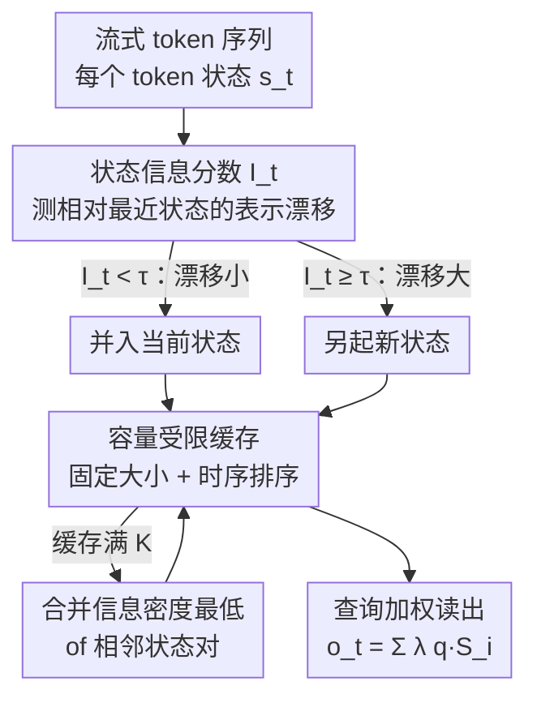

# Dynamic Linear Attention

**Conference**: ICML2026  
**arXiv**: [2606.10650](https://arxiv.org/abs/2606.10650)  
**Code**: To be confirmed  
**Area**: LLM Efficiency / Linear Attention / Long Context Modeling  
**Keywords**: Linear Attention, Multi-state Memory, Dynamic State Merging, Capacity-constrained Cache, Long Context

## TL;DR
Addressing the issue where existing "multi-state linear attention" mechanisms merge memory using fixed rules, causing critical tokens to be compressed into coarse summaries prematurely and accumulating errors, DLA proposes an **information-aware + capacity-constrained** dynamic memory framework. By using a lightweight "state information score" to adaptively determine when to create or merge memory states based on token-level information changes, and employing a fixed-size temporal cache to suppress state explosion, DLA consistently outperforms SOTA Log-Linear Attention across 16 datasets. Furthermore, the DLA version of Mamba-2 matches the performance of a full-attention Transformer with an equivalent number of parameters.

## Background & Motivation

**Background**: Standard self-attention exhibits quadratic complexity relative to sequence length, which is unsustainable for long contexts. Linear attention is a promising direction that reduces complexity to sub-quadratic by removing softmax and reordering computations via the associative property. To enhance expressivity in long sequences, recent works organize history into **multi-state** forms: cutting long token histories into blocks and summarizing each into compact memory states. For instance, Log-Linear Attention uses Fenwick trees to decompose causal prefixes into a logarithmic number of multi-scale states (fine-grained for proximal tokens, coarse-grained for distant ones), achieving $O(T\log T)$ training and $O(\log T)$ per-step decoding.

**Limitations of Prior Work**: These multi-state methods still suffer significant performance degradation as the context lengthens. The root cause is a fundamental mismatch between **fixed memory construction strategies** and the **non-uniform, dynamically evolving information structure** of sequences. Existing methods use fixed block sizes or rule-based merging schedules, implicitly assuming that "information density is uniform along the sequence"—which is not the case in practice: semantic transitions may occur suddenly, while long segments of tokens might be locally redundant.

**Key Challenge**: Fixed strategies suffer from two flaws. First, they **cannot adapt to dynamically emerging semantic changes**, often absorbing important transitions into coarse summaries prematurely just because a predefined boundary is reached. Second, **merging decisions are irreversible**—once heterogeneous tokens are compressed into the same state, their individual contributions cannot be retrieved even if subsequent context reveals their importance, leading to error accumulation along long sequences.

**Goal**: To design a memory modeling mechanism that is both **information-aware** (state construction follows local representation changes, allocating high resolution to semantically volatile regions and aggressively summarizing stable segments) and **capacity-controlled** (explicitly limiting the total number of states to ensure predictable computation and memory usage during inference).

**Core Idea**: Use "representation drift of a token relative to the current memory state" to decide state boundaries online—merge if the drift is small, or start a new state if it is large. This is paired with a fixed-capacity temporal cache where, once full, the adjacent pair of states with the lowest information density is merged.

## Method

### Overall Architecture

DLA processes tokens in a streaming fashion. For each new token, it first calculates a lightweight **state information score** to measure its representation change relative to the most recent memory state: tokens with small changes are merged into the current state, while those with large changes initiate a new state. This maintains high resolution at semantic transitions while aggressively summarizing stable segments. To constrain memory and computation, DLA maintains a **capacity-constrained state cache**. When the cache is full, it merges the adjacent pair of states with the lowest information density to free a slot, resulting in a memory consisting of a **fixed-size, temporally-ordered** set of summary states. During decoding, the output is obtained by attending to all memory states using query-dependent weights. Together, these designs allow DLA to achieve adaptive resolution, stable inference costs, and efficient long-context representations.

### Key Designs

**1. Information-aware dynamic state merging: Aligning state boundaries with semantic changes**

Fixed partitioning (e.g., cutting every $K$ tokens) or hard rule-based boundaries are "blind" to the semantic evolution of a sequence, often prematurely compressing important transitions irreversibly. DLA's solution introduces a new metric—the **State Information Score** $I_t$, which measures how much new information the current token carries relative to the most recent memory state. Let the state of the new token be $s_t \triangleq \phi(k_t)v_t^\top$ and the most recent memory state be $S_{t-1}$. Then:

$$I_t = \frac{\|S_t - S_{t-1}\|_F}{\|S_{t-1}\|_F + \epsilon}$$

(In practice, RMSNorm is applied to $S_t$ and $S_{t-1}$ to stabilize scaling across layers and time steps.) A threshold $\tau$ is then used to obtain a boundary indicator $b_t \triangleq \mathbf{1}[I_t \ge \tau]$. The state update rule is: if $b_t=0$ (low drift), $s_t$ is accumulated into the current state; if $b_t=1$ (high drift), the current token starts a new state and is appended to the cache in temporal order. A key engineering detail is the use of **soft and hard gating**: during pre-training, soft gating makes boundary decisions differentiable (allowing gradients to flow through $\tau$), while during inference, it switches to hard partitioning to produce a set of discrete memory states aligned with semantic boundaries—ensuring both learnability during training and efficiency during inference.

**2. Capacity-constrained memory modeling: Suppressing state explosion with a fixed-size cache**

Relying solely on Design 1 would lead to unbounded growth in the number of states, which is unfriendly for long-context or high-throughput services due to irregular memory layouts and variable attention costs. Consequently, DLA maintains a state cache $\mathcal{M}=\{(S_i, n_i, \bar{I}_i)\}_{i=1}^m$ ($m\le K$), where $n_i$ is the number of tokens summarized in the state and $\bar{I}_i$ is the sum of per-token information scores within that state. Thus, $\bar{I}_i/n_i$ represents **information density**. When the cache is not full, new states are simply inserted. Once full ($m=K$), compression is triggered: the pair of adjacent states with the lowest combined information density is selected for merging:

$$(i^\star, i^\star{+}1) = \arg\min_{i\in\{1,\dots,K-1\}} \frac{\bar{I}_i + \bar{I}_{i+1}}{n_i + n_{i+1}}$$

During merging, the states, token counts, and information scores are summed respectively. **Merging only adjacent states** is intentional—it preserves temporal order and does not distort positional semantics. During readout, all states are weighted by query-dependent weights $\lambda_{t,i}$ learned during pre-training: $o_t = \sum_{i=1}^m \lambda_{t,i}\, q_t^\top S_i$. This achieves stable inference costs on a fixed-capacity cache while retaining the ability to emphasize high-information states during inference. In experiments, the capacity $K=30$ was used to align with the maximum number of states in Log-Linear Attention for fair comparison.

**3. Deviation upper bound theory: Proving the sub-optimality of fixed partitioning on non-stationary sequences**

To explain "why fixed strategies are inferior and dynamic merging is better," the authors provide theoretical support. Assuming the additive contribution of each token to the state is $u_t$, and the sequence is partitioned into $m$ continuous blocks where each block is summarized by a representative vector $\bar{u}_i$, the deviation of the summarized output from the exact output has an upper bound (Theorem 3.1):

$$\big|y(q) - \tilde{y}_\pi(q)\big| \le \|q\|_2 \cdot \sum_{i=1}^m \sqrt{|\mathcal{C}_i|}\sqrt{\sum_{t\in\mathcal{C}_i}\|u_t - \bar{u}_i\|_2^2}$$

This bound is dominated by **intra-block heterogeneity**. Corollary 3.2 further proves that for a class of non-stationary sequences, any fixed partitioning strategy $\pi_{\text{fix}}$ that has a block spanning a semantic change point will contribute a strictly positive heterogeneity term. Thus, its deviation upper bound is strictly greater than that of an adaptive strategy $\pi_{\text{dyn}}$ that aligns boundaries with change points (where intra-block heterogeneity can be reduced to 0). Consequently, DLA can be understood as a **greedy online strategy** that uses the information score $I_t$ to approximately minimize the dominant term in the deviation upper bound, which fixed strategies completely ignore.

## Key Experimental Results

### Setup
Ours was pre-trained from scratch on two linear attention backbones: Mamba-2-780M and Gated DeltaNet-1.3B, using 50B tokens from Long-Data-Collections with a sequence length of 16K on 4 A100 GPUs. The state cache capacity $K$ was set to 30. Evaluation was conducted on 16 datasets across three categories: 8 common sense reasoning, 6 context retrieval, and 2 long context (RULER, LongBench). Baselines included original linear attention models and their Log-Linear variants. The DLA version of Mamba-2 was also compared against a 24-layer, 778M full-attention Transformer.

### Main Results: Common Sense Reasoning (Accuracy, higher is better)

| Model | LAMBADA | PIQA | ARC-c | CSQA | Average |
|------|------|------|------|------|------|
| Transformer (778M) | 21.8 | 63.1 | 17.7 | 18.0 | 32.9 |
| Mamba-2 | 15.7 | 58.9 | 18.9 | 20.3 | 31.8 |
| Mamba-2 w/ Log-linear | 13.2 | 59.7 | 20.1 | 19.1 | 31.0 |
| **Mamba-2 w/ DLA** | **18.7** | **63.7** | **22.1** | **21.1** | **34.2** |
| Gated DeltaNet (1.3B) | 20.3 | 58.8 | 20.2 | 21.3 | 32.8 |
| GDN w/ Log-linear | 19.0 | 60.4 | 20.5 | 21.0 | 32.6 |
| **GDN w/ DLA** | **20.8** | **62.7** | **23.0** | **22.9** | **34.8** |

Two observations: ① DLA consistently outperforms the original models and Log-Linear variants across all tasks, achieving up to 52% and 22% relative accuracy gains over Log-Linear on Mamba-2 and GDN, respectively. ② The average score of DLA version Mamba-2 (34.2) surpasses the full-attention Transformer of similar parameter size (32.9), indicating it can close or even exceed the gap between linear and full attention.

### Context Retrieval (Accuracy, higher is better)

| Model | SQuAD | TriviaQA | SWDE | Average |
|------|------|------|------|------|
| Mamba-2 | 22.4 | 13.6 | 17.4 | 9.5 |
| Mamba-2 w/ Log-linear | 7.1 | 9.1 | 15.2 | 6.3 |
| **Mamba-2 w/ DLA** | **28.1** (↑25%) | **20.2** (↑49%) | **26.3** (↑51%) | **13.7** (↑44%) |

The improvement in retrieval tasks is particularly significant—averaging a 44% relative increase over the best baseline. Interestingly, Log-Linear actually hampered Mamba-2 in retrieval (9.5→6.3), confirming the drawback that "fixed multi-scale blocks prematurely discard critical tokens," which DLA's information-aware merging effectively addresses.

### Key Findings
- **Gains in retrieval tasks > Common sense reasoning**: Retrieval relies heavily on the precise recall of specific tokens and is susceptible to loss from coarse summarization, making information-aware dynamic boundaries most valuable here (SWDE +51%, TriviaQA +49%).
- **Log-Linear is not always superior to the original**: Its performance drop in retrieval suggests that "fixed multi-scale states" is a double-edged sword—empirical support for the DLA motivation.
- **Efficiency**: The paper claims DLA achieves the above precision with higher throughput and lower runtime memory (as the capacity-constrained cache ensures stable inference costs), balancing efficiency and accuracy.

## Highlights & Insights
- **"Information Score $I_t$" is a lightweight yet effective hook**: Using only the Frobenius norm ratio of adjacent states to judge semantic drift online avoids the need for massive additional modules. It turns the "to merge or not to merge" problem into a data-driven decision with nearly zero overhead—an idea transferable to any scenario requiring adaptive segmentation/compression (KV cache compression, streaming summarization, etc.).
- **Strong alignment between theory and method**: The deviation upper bound identifies "intra-block heterogeneity" as the bottleneck, and the method directly minimizes this term greedily. The motivation is grounded in mathematics rather than just intuition, utilizing a "identify bottleneck first, design solution after" paradigm.
- **Soft training / Hard inference gating switch** is practical: It allows for differentiable threshold learning during training while maintaining discrete efficiency during inference. DLA unifies these with a single information-aware criterion, avoiding traditional issues with non-differentiable hard thresholds.

## Limitations & Future Work
- **Dependence on threshold $\tau$ and capacity $K$**: State resolution is governed by these two hyperparameters. While the paper uses $K=30$ to align with baselines, the sensitivity of $\tau$ and whether it requires adjustment for different tasks or lengths were not fully explored.
- **Greedy online strategy is only approximately optimal**: DLA is positioned as a greedy approximation to minimize the deviation upper bound, not a globally optimal segmentation. Further analysis is needed to determine if greediness leads to sub-optimal segments in extremely non-stationary or long-range dependent sequences.
- **Limited scale and backbones**: Validated only at the 780M / 1.3B scale with two linear attention backbones on 50B tokens. Whether its advantages over full attention persist as model and data scales increase remains to be tested.
- **Merging as additive summarization**: State merging uses simple addition (preserving order), which still results in information loss when heterogeneous states are merged. Exploring superior summary operators (weighted, low-rank) is a potential direction for improvement.

## Related Work & Insights
- **vs Log-Linear Attention**: Log-Linear uses Fenwick trees for **fixed** logarithmic multi-scale partitioning (fine near, coarse far) regardless of content. DLA replaces the "partitioning schedule" with **content-driven** boundaries via information scores and adds a capacity-constrained cache. The essential difference is that "boundaries follow semantics" rather than "following position," leading to significant gains in retrieval tasks.
- **vs DeltaNet / Gated DeltaNet**: These introduce delta-style controlled forgetting in a single global state to improve state tracking, but **remain single-state**, unable to selectively retain fine-grained information along long sequences. DLA is multi-state with adaptive counts, arguably adding a layer of information-aware memory organization on top of them.
- **vs Standard Linear Attention**: The original compresses the entire history into a single $d\times d$ state matrix, limiting expressiveness in long contexts. DLA replaces the single state with a set of capacity-constrained multi-states, regaining resolution while maintaining sub-quadratic costs.

## Rating
- Novelty: ⭐⭐⭐⭐ Introducing "information-aware dynamic segmentation + capacity-constrained cache" to multi-state linear attention, supported by deviation upper bound theory, is novel and self-consistent.
- Experimental Thoroughness: ⭐⭐⭐⭐ Covering two backbones across 16 datasets and three task categories with sufficient SOTA comparisons; would be stronger with $\tau$/$K$ sensitivity and larger scale results.
- Writing Quality: ⭐⭐⭐⭐ Clear chain of logic from motivation to theory to method to experiments, with complete pseudocode and formulas.
- Value: ⭐⭐⭐⭐ A practical improvement for long-context linear attention with significant gains in retrieval tasks; the approach is transferable to contexts like KV compression.

<!-- RELATED:START -->

## Related Papers

- [\[ICLR 2026\] RACE Attention: A Strictly Linear-Time Attention for Long-Sequence Training](../../ICLR2026/llm_efficiency/race_attention_a_strictly_linear-time_attention_for_long-sequence_training.md)
- [\[ICML 2026\] Kalman Linear Attention: Parallel Bayesian Filtering For Efficient Language Modelling and State Tracking](kalman_linear_attention_parallel_bayesian_filtering_for_efficient_language_model.md)
- [\[NeurIPS 2025\] Tiled Flash Linear Attention: More Efficient Linear RNN and xLSTM Kernels](../../NeurIPS2025/llm_efficiency/tiled_flash_linear_attention_more_efficient_linear_rnn_and_xlstm_kernels.md)
- [\[NeurIPS 2025\] ZeroS: Zero-Sum Linear Attention for Efficient Transformers](../../NeurIPS2025/llm_efficiency/zeros_zero-sum_linear_attention_for_efficient_transformers.md)
- [\[ICML 2026\] IR3DE: A Linear Router for Large Language Models](ir3de_a_linear_router_for_large_language_models.md)

<!-- RELATED:END -->
