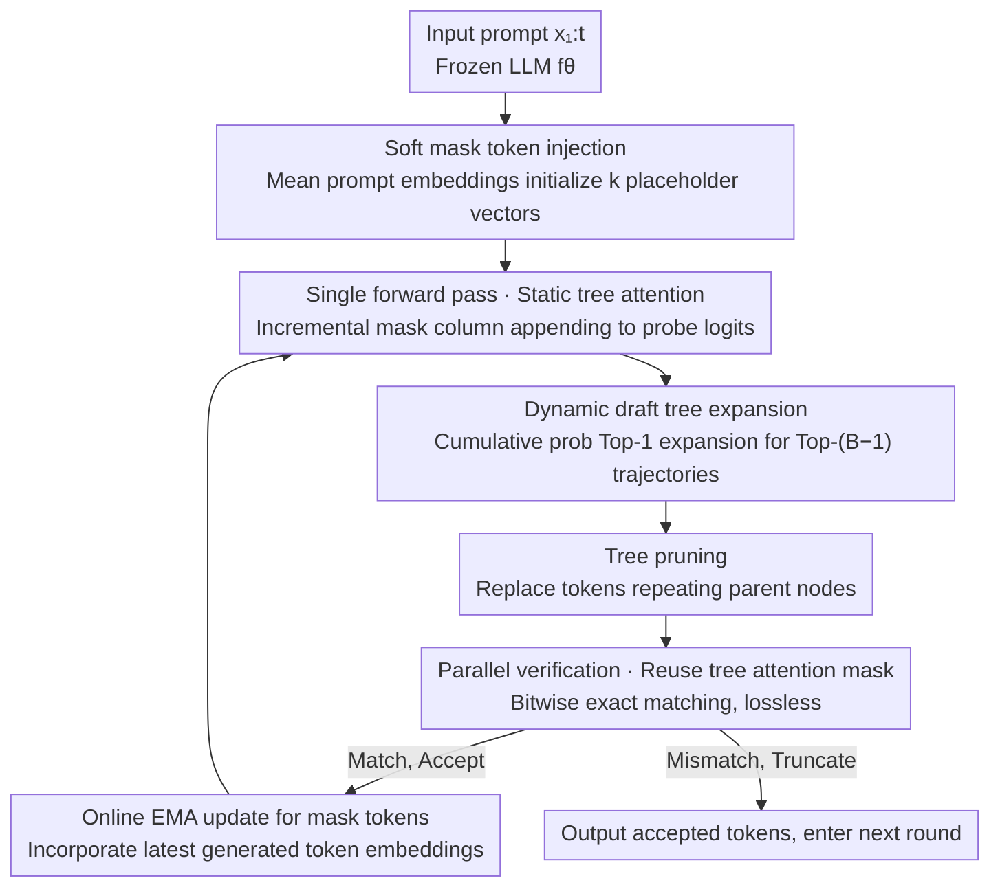

# Efficient Training-Free Multi-Token Prediction via Embedding-Space Probing

**Conference**: ICML 2026  
**arXiv**: [2603.17942](https://arxiv.org/abs/2603.17942)  
**Code**: TBD  
**Area**: LLM Efficiency / Speculative Decoding / Multi-token Prediction  
**Keywords**: Multi-token prediction, training-free, embedding-space probing, speculative decoding, dynamic draft tree

## TL;DR
This paper proposes ESP (Embedding-Space Probing): without modifying any weights or training auxiliary models, it injects "mean prompt embeddings" as mask tokens into the input sequence of a frozen LLM. It probes multiple future tokens simultaneously in a single forward pass and uses the base model itself for lossless speculative verification. On LLaMA3 / Qwen3, it achieves 7–11% higher average acceptance length and 15–19% higher throughput than similar training-free baselines (LADE / STAND / PLD).

## Background & Motivation

**Background**: Autoregressive decoding generates only one token per step, resulting in significant waste of GPU parallelism. Mainstream multi-token prediction (MTP) and speculative decoding solutions fall into two categories: (i) adding MTP heads to the main model and retraining (Medusa, Gloeckle et al.), or (ii) introducing an independent small draft model for speculation (Leviathan, Cai et al.). Both require dataset construction, architectural tuning, and expensive GPU training, adding ~400M extra parameters during deployment, which is unfriendly to edge devices.

**Limitations of Prior Work**: Truly "training-free" baselines are scarce—PLD relies on n-gram copying from prompts, STAND uses adaptive n-gram caching, and LADE generates drafts via Jacobi iteration. These perform reasonably well on tasks with high n-gram repetition (e.g., coding, RAG) but suffer significant drops in acceptance rates on open-ended tasks like writing or math/reasoning, and require online maintenance of n-gram caches. Probing works like Future Lens observe that "future token information is already latent within LLMs," but treat it only as a diagnostic phenomenon rather than a decoding algorithm.

**Key Challenge**: To achieve "no retraining + no auxiliary model + lossless," one must use the frozen model itself to predict multiple future tokens in a single forward pass. However, LLMs are trained for next-token prediction—how can they be "tricked" into outputting $k$ tokens at once?

**Goal**: (1) Find a token representation that, when inserted into a sequence, enables the LLM to output the distribution of the "i-th future step" at that position; (2) Organize multiple candidates into a tree and design budget-controlled expansion/pruning strategies; (3) Ensure losslessness via verification by the base model; (4) Provide a theoretical explanation for why such a probe works.

**Key Insight**: The authors observe that while computing, decoder layers **gradually pull the hidden states of "placeholder tokens" toward the hidden states of actual future tokens**. If a vector that is "semantically neutral but follows the prompt distribution" is used as a mask token, deep layers automatically align it with the representation of the real future token, allowing the LM head to naturally rank the correct future token in its Top-K.

**Core Idea**: Use the "mean prompt embedding" as a soft mask token to probe the logits of future $k$ tokens directly in embedding space; organize candidates via dynamic tree expansion; and perform parallel verification with the main model. The entire pipeline is completely training-free, necessitates no draft model, and is lossless.

## Method

### Overall Architecture
After receiving prompt $x_{1:t}$, the frozen LLM $f_\theta$ does not perform direct next-token decoding in ESP. Instead: (1) It synthesizes $k$ mask tokens $m_1, \dots, m_k$ in embedding space and appends them to the sequence; (2) A single forward pass obtains logits for all mask positions, which are sampled according to dynamic tree expansion to form a "draft token tree"; (3) A simple pruning rule removes redundant branches that repeat parent nodes; (4) The entire draft tree is sent to the same $f_\theta$ for parallel verification (standard speculative decoding practice), where tokens are accepted via exact matching and truncated otherwise; (5) Each accepted token triggers an update of the corresponding mask token (using EMA-style fusion of the latest generated token embedding) for the next round. The entire process is executed in one forward pass through a customized "tree attention mask + position indices."

### Key Designs

**1. Soft mask token injection + Online EMA update: What vector to use as a "placeholder" to trick out future tokens**

To probe multiple future tokens in one pass, the "placeholder vectors" appended to the sequence must be pulled toward real future token representations by deep layers. The authors do not use the "last K prompt embeddings" (hard init) or sample from the global embedding distribution; instead, they use the mean prompt embedding $m_i = \frac{1}{t}\sum_{j=1}^t \mathbf{e}_j$ to initialize all mask tokens. This ensures the placeholder vector is statistically aligned with the current prompt, which is more stable than other initializations. During generation, for each accepted token $x_{t+s}$, an EMA update $m_i[s+1] = m_i[s] + \lambda(\mathbf{e}_{t+s} - m_i[s])$ ($\lambda = 0.1$) is performed to continuously seep new context into the mask representation. All future trajectories in the same tree share the same $m_i$ values; branch differences arise solely from position IDs and tree-attention paths.

The "prompt-aligned distribution" is key because the authors observed a clear phenomenon in Dolly-Databricks: for accepted tokens, the cosine similarity between hidden states of the mask token and the real future token increases steadily from layer 15 to ~0.45, while rejected tokens stall at ~0.35. Lemma 3.1 formalizes this—if $\cos(h_m, h_v) \geq \delta^*$, the real future token inevitably falls into the Top-K of the mask token logits. Mean-prompt initialization maximizes this "layer-wise alignment," which is **the theoretical foundation for why this training-free method works**.

**2. Cumulative probability-based dynamic draft tree expansion (Algorithm 1): Letting the model decide whether to go wide or deep**

Fixed Top-K draft trees have a flaw: the optimal width/depth for mask tokens varies greatly across prompts—open-ended tasks (writing/reasoning) suit "wide and shallow" exploration, while closed tasks (math/translation) suit "narrow and deep" focus. Any manual Top-K configuration will underperform on some tasks. ESP uses cumulative probability-driven Top-1 expansion: given a budget $B$ and $k$ mask tokens, for each layer $i$, $B-i$ candidates are sampled from current frontier nodes. Cumulative probabilities are updated as $P(c) = P(n) \cdot P(t_j \mid l_n)$, and the Top-$(B-i)$ trajectories are kept for the next layer. The layer-wise decay of $B-i$ naturally encourages branching early and focusing on high-confidence trajectories later, essentially letting the model decide "where to spend the budget."

Block complexity is explicitly abstracted as $\text{Block Complexity} = (k+1)(1 + \sum_{i=1}^k K_i)$, making different tree shapes comparable under the same budget. Experiments show that dynamic expansion matches or exceeds the best static $[K_1, K_2]$ configurations across LLaMA3 models, eliminating the need for offline grid searches.

**3. GPU-friendly static tree attention and position index implementation: Avoiding tree mask overhead**

Tree decoding has a hidden cost: traditional tree-attention often reconstructs masks by traversing tree nodes at each step; these CPU/serial operations can severely slow down the GPU. ESP caches the attention mask and only **incrementally appends columns** rather than recomputing the entire mask. Position IDs are reused via simple offsets. Combined with a layout that places mask tokens at the end of the sequence (Figure 3), a single forward pass covers the "last accepted token + all draft tree nodes + all mask tokens." This engineering optimization significantly impacts throughput.

Table 4 highlights this: with a naive implementation, LLaMA3.1-8B-Instruct achieves only 1.05–1.07× end-to-end speedup at BC=60, as tree search overhead cancels out the "reduced forward" gains. The efficient implementation jumps to 1.35–1.38×, an average Gain of ~21%, and up to 29–30% at BC=60. This serves as a reminder that the throughput bottleneck for training-free MTP is often attention mask construction rather than token acceptance rates.

### Loss & Training
**Completely training-free**. No trainable parameters are introduced, and LLM weights remain untouched. The only hyperparameters are the EMA coefficient $\lambda = 0.1$, the number of mask tokens $k$ (optimally $k = 1, 2$; $k = 3$ causes degradation as LLMs are only trained for next-token prediction), and the block complexity $B \in \{10, 30, 60\}$. The verification phase follows the exact sample matching of speculative decoding, ensuring the generation distribution is identical to original autoregression (lossless).

## Key Experimental Results

### Main Results
On SpecBench (covering writing, roleplay, coding, translation, summarization, math & reasoning, RAG, etc.), ESP is compared against PLD, STAND, and LADE. The average acceptance length $\tau$ (average tokens accepted per model call) and end-to-end wall-time speedup S/R are reported.

| Model | BC | PLD $\tau$ / S/R | STAND $\tau$ / S/R | LADE $\tau$ / S/R | **ESP $\tau$ / S/R** |
|------|----|---|---|---|---|
| LLaMA3.1-8B-Instruct | 30 | 1.44 / 1.23× | 1.58 / 1.10× | 1.45 / 1.06× | **1.63 / 1.35×** |
| LLaMA3.1-8B-Instruct | 60 | 1.44 / 1.23× | 1.64 / 1.14× | 1.60 / 1.14× | **1.71 / 1.38×** |
| Qwen3-8B | 60 | 1.31 / 1.12× | 1.48 / 1.06× | 1.73 / 1.21× | **1.74 / 1.43×** |
| Qwen3-32B | 60 | 1.29 / 1.09× | 1.48 / 1.13× | 1.69 / 1.31× | **1.70 / 1.48×** |
| LLaMA3.2-3B-Instruct | 60 | 1.43 / 1.19× | 1.62 / 1.07× | 1.57 / 1.10× | **1.63 / 1.22×** |

Ours (ESP) achieves the highest (or tied for highest) $\tau$ and S/R across 4 models and 2 BC settings. Compared to LADE on LLaMA3, $\tau$ is 7–12% higher; on Qwen3, it is 7–8% higher. Throughput is 15–19% higher relative to the strongest baseline. At BC=60, it reduces forward model calls by up to 42%.

### Ablation Study

| Configuration | LLaMA3.2-3B $\tau$ (BC=60) | LLaMA3.1-8B $\tau$ (BC=60) | Description |
|------|------|------|------|
| Mean (soft init) | **1.67** | **1.71** | Full method, initialized with mean prompt embedding |
| Sample (embedding dist) | 1.65 | 1.69 | Sampled from embedding table $\mathcal{N}(\mu, \sigma^2 I)$ |
| Last K (hard init) | 1.62 | 1.67 | Embeddings of the last K prompt tokens |
| 1 mask token $[29]$ | **1.65** | **1.73** | BC=60, single mask token |
| 2 mask tokens $[15,4]$ | 1.63 | 1.71 | Two mask tokens + dynamic branching |
| 3 mask tokens $[7,5,3]$ | 1.51 | 1.57 | Three mask tokens, **significant regression** |
| Efficient attention impl | 1.22× / 1.38× S/R | — | Extra speedup compared to naive implementation |
| Naive attention impl | 0.96× / 1.07× S/R | — | Per-node mask construction negates gains |

### Key Findings
- **Mean-prompt soft init > other initializations**: Consistently higher by 0.02–0.05 $\tau$, validating Lemma 3.1 regarding "inter-layer cosine alignment"—placeholder vectors following the prompt distribution are more easily pulled toward real future hidden states by deep layers.
- **More mask tokens are not always better**: $k=1$ is often optimal, while $k=3$ leads to a universal drop of 0.1+ $\tau$. This is because base LLMs are only trained for next-token prediction, causing alignment to break for deeper probes. Open-ended tasks prefer $k=1$ (broad exploration), while closed tasks prefer $k=2$ (deeper exploitation).
- **Dynamic trees match/beat static trees**: Dynamic expansion achieves 1.630 $\tau$ vs. 1.631 for the best static $[15,4]$ at BC=60, saving the effort of grid search.
- **Engineering acceleration $\approx$ Algorithmic acceleration**: Efficient attention implementation contributes ~21% to throughput, highlighting that construction overhead shouldn't be ignored in speculative decoding.
- **Task correlation**: STAND (n-gram copy) slightly wins on coding/RAG/summarization due to text repetition. ESP shows the most significant advantage on math/reasoning tasks that require "true generation" ($\tau=1.81$ on LLaMA3.1-8B).

## Highlights & Insights
- **"Probing as Decoding" Paradigm Shift**: Previous probing works (e.g., Future Lens) treated the presence of future token info as an interpretability phenomenon. This work is the first to engineer it into a practical decoding algorithm without training. This "phenomenon $\to$ algorithm" transition is inspiring for future work on frozen models.
- **Complete Circle of Theory and Phenomenon**: Empirical observations of hidden state convergence lead to Lemma 3.1, providing formal guarantees ($\cos$ similarity $\geq \delta^* \implies$ Top-K hit), which are kemudian validated by mean-prompt init experiments.
- **Block Complexity Abstraction**: Explicitly defining budget-comparable units $(k+1)(1 + \sum K_i)$ allows fair comparisons between different tree architectures.
- **Transferable Soft Mask + EMA**: The idea of using prompt statistics for placeholders and allowing them to drift via EMA can be applied to prompt-tuning, continuous prompt optimization, or filling "unobserved slots" in RAG.

## Limitations & Future Work
- Underperforms STAND on tasks with high n-gram repetition—in such cases, "copying the prompt" is more efficient than "probing the generation." Hybrid ESP + n-gram cache strategies could be explored.
- Acceptance rates drop significantly starting from $k=3$ because base LLMs are only trained for next-token prediction. Exceeding this horizon might require lightweight fine-tuning, which contradicts the training-free goal.
- Evaluation limited to max_len=100/256 and single-A100/H100; behavior in long generation (>1k), batch > 1, or multi-GPU pipeline is unreported.
- Robustness of mean-prompt init on extreme prompts (e.g., pure code, numerical strings) is not fully explored.
- Future directions: (1) Adaptive $\lambda$ across layers/positions; (2) Using alignment quality as an early-exit signal; (3) End-to-end throughput optimization with KV-cache quantization and continuous batching.

## Related Work & Insights
- **vs LADE (Lookahead Decoding)**: LADE uses Jacobi iteration across multiple positions; ESP uses mask tokens in embedding space. Both are training-free, but ESP leverages "inter-layer alignment," yielding 7–11% higher $\tau$ on LLaMA3 without needing n-gram pools.
- **vs Medusa / Cai et al.**: Medusa trains ~400M extra MTP head parameters. ESP has zero extra parameters/training/memory. ESP has a lower acceptance ceiling but dominates on edge devices.
- **vs PaSS / Future Lens**: PaSS introduces special marker tokens and requires fine-tuning. Future Lens analyzes but doesn't decode. ESP requires neither fine-tuning nor vocabulary changes.
- **vs STAND / PLD**: Both essentially "copy n-grams" from history/prompt, performing well on repetitive tasks but generalizing poorly. ESP excels at tasks requiring "true generation" like reasoning/writing.

## Rating
- Novelty: ⭐⭐⭐⭐ The "embedding-space probe $\to$ MTP decoding" paradigm shift is clean, with theory, phenomenon, and algorithm forming a complete loop.
- Experimental Thoroughness: ⭐⭐⭐⭐ Covers 4 models, 3 BC settings, and full SpecBench tasks. Includes 4D ablations. Deducted for lack of long-gen and batch > 1.
- Writing Quality: ⭐⭐⭐⭐ Clear progression from motivation to observation to lemma to algorithm. Intuitive.
- Value: ⭐⭐⭐⭐ A truly "plug-and-play" training-free MTP with direct utility for edge LLM inference and frozen model deployment.

<!-- RELATED:START -->

## Related Papers

- [\[NeurIPS 2025\] L-MTP: Leap Multi-Token Prediction Beyond Adjacent Context for Large Language Models](../../NeurIPS2025/llm_efficiency/l-mtp_leap_multi-token_prediction_beyond_adjacent_context_for_large_language_mod.md)
- [\[NeurIPS 2025\] Efficient Training-Free Online Routing for High-Volume Multi-LLM Serving](../../NeurIPS2025/llm_efficiency/efficient_training-free_online_routing_for_high-volume_multi-llm_serving.md)
- [\[ICLR 2026\] Training-Free Loosely Speculative Decoding: Accepting Semantically Correct Drafts Beyond Exact Match](../../ICLR2026/llm_efficiency/training-free_loosely_speculative_decoding_accepting_semantically_correct_drafts.md)
- [\[ICLR 2026\] TrimR: Validator-based, Training-free Thinking Trimming for Efficient Test-time Scaling](../../ICLR2026/llm_efficiency/trimr_verifier-based_training-free_thinking_trimming_for_efficient_test-time_sca.md)
- [\[ICML 2026\] Sparser Block-Sparse Attention via Token Permutation](sparser_block-sparse_attention_via_token_permutation.md)

<!-- RELATED:END -->
