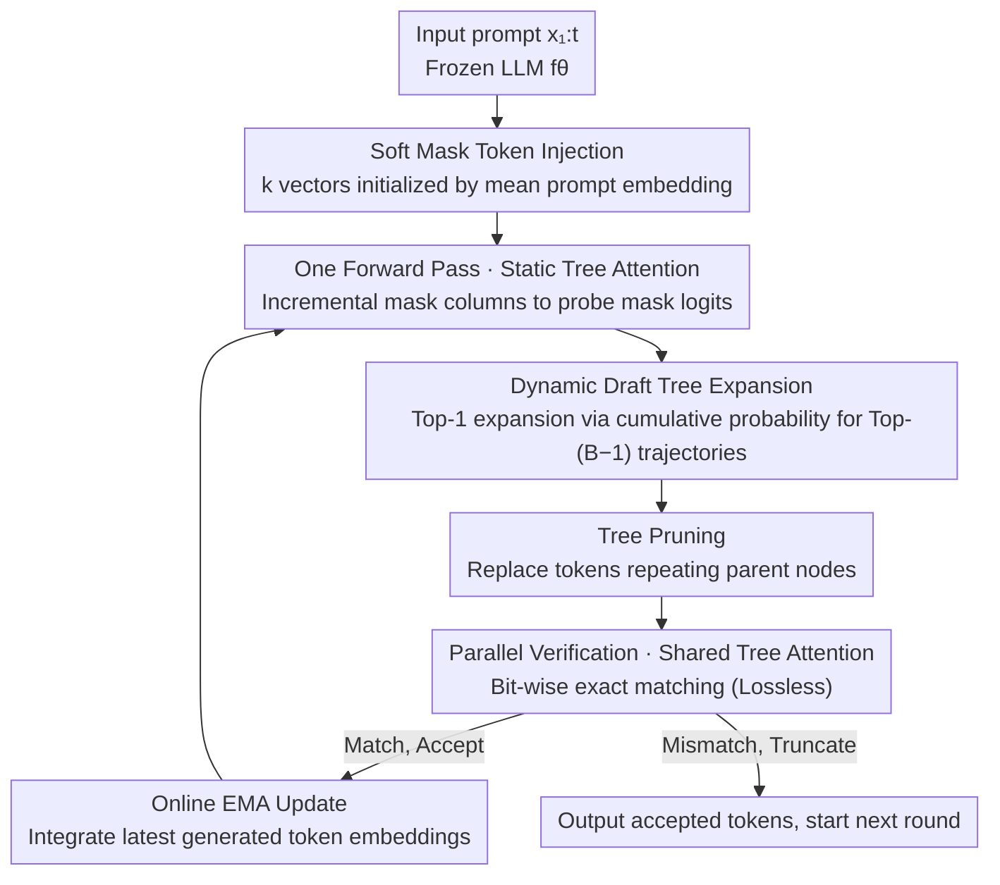

# Efficient Training-Free Multi-Token Prediction via Embedding-Space Probing

**Conference**: ICML 2026  
**arXiv**: [2603.17942](https://arxiv.org/abs/2603.17942)  
**Code**: TBD  
**Area**: LLM Efficiency / Speculative Decoding / Multi-Token Prediction  
**Keywords**: Multi-Token Prediction, Training-Free, Embedding-Space Probing, Speculative Decoding, Dynamic Draft Tree

## TL;DR
This paper proposes ESP (Embedding-Space Probing): without modifying weights or training auxiliary models, it injects "mean prompt embeddings" as mask tokens into the input sequence of a frozen LLM. This probes multiple future tokens in a single forward pass, followed by lossless speculative verification using the base model itself. On LLaMA3 / Qwen3, it achieves 7–11% higher average acceptance length and 15–19% higher throughput compared to training-free baselines like LADE, STAND, and PLD.

## Background & Motivation

**Background**: Autoregressive decoding generates one token per step, leading to significant GPU parallelism waste. Mainstream Multi-Token Prediction (MTP) or speculative decoding solutions fall into two categories: (i) adding MTP heads and retraining the main model (e.g., Medusa, Gloeckle et al.), or (ii) introducing an independent small draft model for speculation (e.g., Leviathan, Cai et al.). Both require dataset construction, architectural adjustments, and expensive GPU training, adding ~400M extra parameters that are unfriendly to edge devices.

**Limitations of Prior Work**: Truly "training-free" baselines are scarce. PLD relies on n-gram copying from prompts, STAND uses adaptive n-gram caches, and LADE generates drafts via Jacobi iteration. These perform well on tasks with high n-gram repetition (e.g., coding, RAG) but suffer in open-ended tasks like writing or reasoning and require online cache maintenance. Probing works like Future Lens observed that "future token information is latent within LLMs" but treated it as a diagnostic phenomenon rather than a decoding algorithm.

**Key Challenge**: To achieve "no retraining + no auxiliary model + lossless," one must predict multiple future tokens in a single forward pass using only the frozen model. However, LLMs are trained for next-token prediction; how can they be "tricked" into outputting $k$ tokens at once?

**Goal**: (1) Identify a token representation that, when inserted into a sequence, allows the LLM to output the distribution of the "i-th future step" at that position; (2) Organize candidates into a tree and design budget-controlled expansion/pruning strategies; (3) Ensure lossless verification using the main model; (4) Provide a theoretical explanation for why this probe works.

**Key Insight**: The authors observed that during computation, decoder layers **gradually pull the hidden states of "placeholder tokens" toward the hidden states of actual future tokens**. Using a "semantically neutral but prompt-aligned" vector as a mask token allows deep layers to align it with future token representations, naturally ranking correct future tokens in the Top-K of the LM head.

**Core Idea**: Use the "mean prompt embedding" as a soft mask token to probe future $k$ token logits directly in the embedding space. Organize candidates using dynamic tree expansion and perform parallel verification with the main model. The entire pipeline is training-free, draft-model-free, and lossless.

## Method

### Overall Architecture
Upon receiving prompt $x_{1:t}$, ESP bypasses direct next-token decoding by: (1) Synthesizing $k$ mask tokens $m_1, \dots, m_k$ in the embedding space and appending them to the sequence; (2) Obtaining logits for all mask positions in one forward pass and sampling Top-K candidates via dynamic tree expansion to form a "draft token tree"; (3) Removing redundant branches that repeat parent nodes using a simple pruning rule; (4) Feeding the entire draft tree into $f_\theta$ for parallel verification (standard speculative decoding practice), accepting matching tokens and truncating at the first mismatch; (5) Updating mask tokens via EMA fusion of newly generated tokens for the next round. This process is executed in a single forward pass using a customized "tree attention mask + position indices."

### Key Designs

**1. Soft Mask Token Injection + Online EMA Update: Placeholders for Probing**

ESP probes multiple future tokens by inserting "placeholder vectors" that deep layers pull toward true future representations. Instead of using "last K token embeddings" (hard init) or global embedding means, ESP initializes all mask tokens using the mean prompt embedding $m_i = \frac{1}{t}\sum_{j=1}^t \mathbf{e}_j$. This ensures the placeholders are statistically aligned with the current prompt distribution. As tokens $x_{t+s}$ are accepted, the mask tokens are updated via EMA: $m_i[s+1] = m_i[s] + \lambda(\mathbf{e}_{t+s} - m_i[s])$ (where $\lambda = 0.1$). All future trajectories in a tree share the same $m_i$, with branch differences emerging from position IDs and tree-attention paths.

As per Lemma 3.1, if $\cos(h_m, h_v) \geq \delta^*$, the true future token is guaranteed to fall into the mask token's Top-K logits. Mean-prompt initialization maximizes this "layer-wise alignment," which is the **theoretical foundation for this training-free method.**

**2. Cumulative Probability Based Dynamic Draft Tree Expansion (Algorithm 1)**

Fixed Top-K trees fail to adapt to varying prompt types (e.g., open-ended writing vs. closed-ended math). ESP uses cumulative probability-driven Top-1 expansion: given a budget $B$ and $k$ mask tokens, for each layer $i$, it samples $B-i$ candidates. Cumulative probabilities are updated as $P(c) = P(n) \cdot P(t_j \mid l_n)$, retaining the Top-$(B-i)$ trajectories. The $B-i$ decay encourages early branching and late focusing.

The "block complexity" $(k+1)(1 + \sum_{i=1}^k K_i)$ is used to normalize hardware costs. In practice, the dynamic strategy matches or exceeds the best static $[K_1, K_2]$ configurations without offline grid searches.

**3. GPU-Friendly Static Tree Attention and Position Indexing**

To avoid the CPU overhead of re-constructing tree-attention masks, ESP caches the attention mask and **incrementally appends columns** rather than recomputing. Mask tokens are placed at the end of the sequence (Figure 3), allowing the "last accepted token + all tree nodes + all mask tokens" to be handled in one forward pass. 

Table 4 shows that without this engineering optimization, LLaMA3.1-8B-Instruct (BC=60) only achieves 1.05–1.07× speedup; with it, speedup jumps to 1.35–1.38×, a ~21% gain.

### Loss & Training
**Entirely training-free**. No trainable parameters are introduced, and LLM weights remain unchanged. Hyperparameters include EMA coefficient $\lambda = 0.1$, mask token count $k$ (optimal at $k=1, 2$), and block complexity $B \in \{10, 30, 60\}$. Verification follows standard speculative decoding sample matching, ensuring the output distribution is identical to original autoregressive decoding (lossless).

## Key Experimental Results

### Main Results
ESP was compared against PLD, STAND, and LADE on SpecBench. Metrics include average acceptance length $\tau$ and end-to-end wall-time speedup S/R.

| Model | BC | PLD $\tau$ / S/R | STAND $\tau$ / S/R | LADE $\tau$ / S/R | **ESP $\tau$ / S/R** |
|------|----|---|---|---|---|
| LLaMA3.1-8B-I | 30 | 1.44 / 1.23× | 1.58 / 1.10× | 1.45 / 1.06× | **1.63 / 1.35×** |
| LLaMA3.1-8B-I | 60 | 1.44 / 1.23× | 1.64 / 1.14× | 1.60 / 1.14× | **1.71 / 1.38×** |
| Qwen3-8B | 60 | 1.31 / 1.12× | 1.48 / 1.06× | 1.73 / 1.21× | **1.74 / 1.43×** |
| Qwen3-32B | 60 | 1.29 / 1.09× | 1.48 / 1.13× | 1.69 / 1.31× | **1.70 / 1.48×** |

ESP consistently achieves the highest $\tau$ and S/R. Compared to LADE, ESP's $\tau$ is 7–12% higher on LLaMA3 and 7-8% higher on Qwen3, with throughput gains of 15–19% over the strongest baselines.

### Ablation Study
| Configuration | LLaMA3.2-3B $\tau$ (BC=60) | LLaMA3.1-8B $\tau$ (BC=60) | Description |
|------|------|------|------|
| Mean (soft init) | **1.67** | **1.71** | Full method, prompt mean init |
| Sample (embedding dist) | 1.65 | 1.69 | Sample from $\mathcal{N}(\mu, \sigma^2 I)$ |
| Last K (hard init) | 1.62 | 1.67 | Embeddings of last K tokens |
| 1 mask token $[29]$ | **1.65** | **1.73** | Single mask token at BC=60 |
| 2 mask tokens $[15,4]$ | 1.63 | 1.71 | Two mask tokens + dynamic |
| 3 mask tokens $[7,5,3]$ | 1.51 | 1.57 | Three mask tokens (**significant drop**) |

### Key Findings
- **Mean-prompt soft init > other initializations**: Higher $\tau$ by 0.02–0.05, validating the "layer-wise cosine alignment" theory.
- **Optimal mask token count**: $k=1$ is often optimal. $k \geq 3$ leads to a sharp drop because base LLMs are only trained for next-token prediction; deeper probes exceed the model's inherent alignment capability.
- **Dynamic tree vs. Static tree**: Dynamic strategies match or beat grid-searched static configurations across different budgets $B$.
- **Engineering vs. Algorithmic gains**: Efficient attention implementation alone contributes ~21% throughput.
- **Task correlation**: STAND performs slightly better in coding/RAG due to high n-gram repetition; ESP excels in math/reasoning where "generative" capabilities are required ($\tau=1.81$ on LLaMA3.1-8B math).

## Highlights & Insights
- **"Probing as Decoding" paradigm**: Unlike previous works that use probing for interpretability, ESP operationalizes internal future-token latent information into a practical decoding algorithm.
- **Tight coupling of theory and observation**: The layer-wise hidden state convergence observation, formal Lemma 3.1, and mean-prompt experimental validation form a robust logical loop.
- **Block complexity abstraction**: Providing a closed-form expression for hardware cost enables fair comparisons between varying tree architectures.

## Limitations & Future Work
- Underperforms STAND in tasks with excessive n-gram repetition (e.g., RAG); a hybrid ESP + n-gram cache strategy could be beneficial.
- Acceptance rates drop significantly for $k \geq 3$. Extending the horizon might require lightweight fine-tuning, which contradicts the training-free premise.
- Robustness of the mean-prompt initialization in extreme prompt distributions (e.g., pure digits) remains to be fully explored.

## Related Work & Insights
- **vs. LADE**: LADE uses Jacobi iteration; ESP uses embedding probes. ESP achieves higher $\tau$ on LLaMA3 (7–11%) without maintaining n-gram pools.
- **vs. Medusa**: Medusa requires ~400M parameters of training; ESP is zero-parameter and zero-training, making it superior for edge deployment despite a lower acceptance cap.
- **vs. STAND / PLD**: These rely on copying from context. ESP's generative nature makes it more versatile for reasoning and writing tasks.

## Rating
- **Novelty**: ⭐⭐⭐⭐ Transitioning "embedding-space probing" to MTP decoding is a clean, well-grounded paradigm shift.
- **Experimental Thoroughness**: ⭐⭐⭐⭐ Covers 4 models and various tasks; robust 4D ablation study (init, mask count, tree type, implementation).
- **Writing Quality**: ⭐⭐⭐⭐ Clear flow from observation to lemma to algorithm.
- **Value**: ⭐⭐⭐⭐ A true plug-and-play training-free MTP with high practical utility for frozen model deployment.

<!-- RELATED:START -->

## Related Papers

- [\[NeurIPS 2025\] L-MTP: Leap Multi-Token Prediction Beyond Adjacent Context for Large Language Models](../../NeurIPS2025/llm_efficiency/l-mtp_leap_multi-token_prediction_beyond_adjacent_context_for_large_language_mod.md)
- [\[NeurIPS 2025\] Efficient Training-Free Online Routing for High-Volume Multi-LLM Serving](../../NeurIPS2025/llm_efficiency/efficient_training-free_online_routing_for_high-volume_multi-llm_serving.md)
- [\[ICML 2026\] Sparser Block-Sparse Attention via Token Permutation](sparser_block-sparse_attention_via_token_permutation.md)
- [\[ICML 2026\] Training-Inference Consistent Segmented Execution for Long-Context LLMs](training-inference_consistent_segmented_execution_for_long-context_llms.md)
- [\[ICLR 2026\] TokenSeek: Memory Efficient Fine Tuning via Instance-Aware Token Selection](../../ICLR2026/llm_efficiency/tokenseek_memory_efficient_fine_tuning_via_instance-aware_token_selection.md)

<!-- RELATED:END -->
