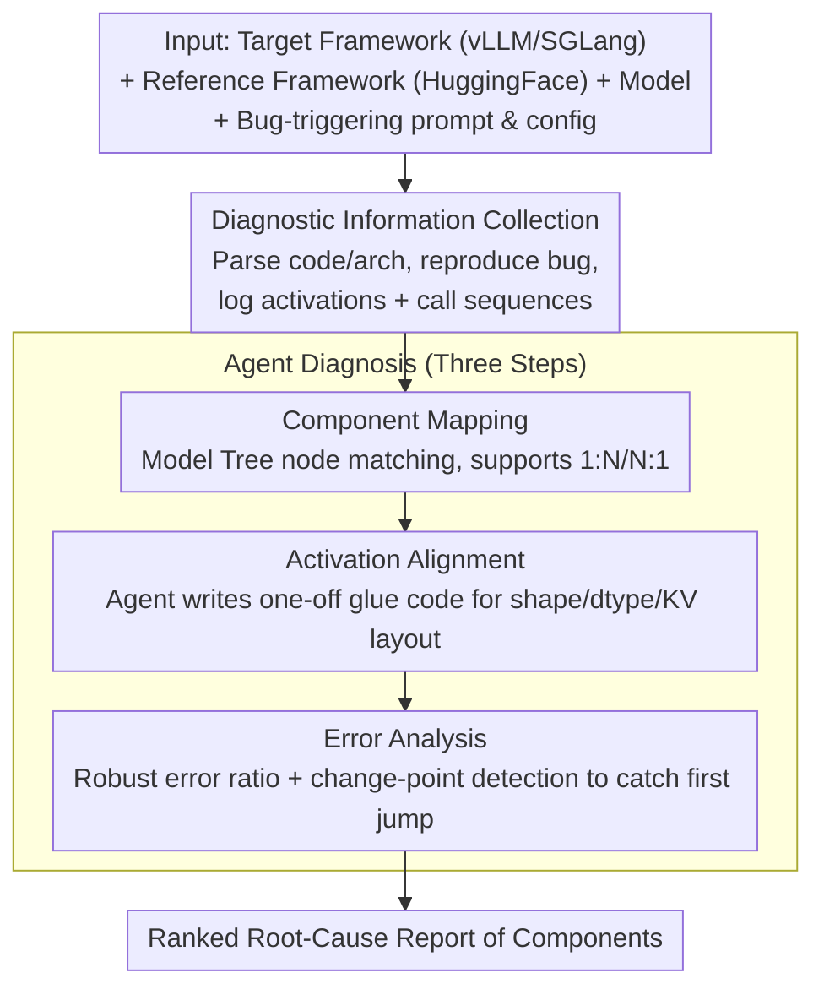

# Ekka: Automated Diagnosis of Silent Errors in LLM Inference

**Conference**: ICML 2026  
**arXiv**: [2606.04594](https://arxiv.org/abs/2606.04594)  
**Code**: TBD  
**Area**: LLM Efficiency / LLM Serving Systems / Automated Debugging  
**Keywords**: Silent Errors, Differential Debugging, LLM Inference Frameworks, Agentic Debugging, Activation Alignment

## TL;DR
Ekka models the diagnosis of silent errors in LLM serving frameworks—where outputs degrade without explicit errors—as a differential debugging task using reference implementations like HuggingFace as an oracle. By employing an agentic pipeline of "component mapping $\rightarrow$ activation alignment $\rightarrow$ change-point analysis," it automatically localizes problematic modules. Ekka achieves a diagnosis accuracy of 80% pass@1 / 88% pass@5 across 17 real-world vLLM/SGLang issues and discovered 4 hidden bugs confirmed by developers.

## Background & Motivation

**Background**: Specialized LLM serving frameworks such as vLLM, SGLang, NanoFlow, and KTransformers have become standard for production environments. These frameworks are heavily optimized with techniques like paged attention, radix attention, custom CUDA kernels, and CUDA graph compilation. The codebases are large and iterate rapidly, with releases occurring every few days.

**Limitations of Prior Work**: This combination of high optimization and rapid iteration breeds a particularly troublesome type of bug: **silent errors**. In these cases, the framework does not crash, raise alarms, or drop requests, but the output quality silently degrades. A representative case cited is vLLM's Gemma 3, which suddenly dropped nearly 30 points on HellaSwag; it took developers months to identify that sliding window attention was being used incorrectly. Among 90 real-world issues collected by the authors, 43.8% manifested as "accuracy regression," where outputs remained readable but the answers were incorrect.

**Key Challenge**: There is a massive semantic gap between the symptoms (end-to-end benchmark drops) and the root cause (implementation details of a specific kernel or module). Existing methods are ineffective:
- Traditional fault localization depends on pass/fail signals, which silent errors lack.
- Deep learning testing tools either treat models as black boxes or only compare API layers, failing to penetrate optimized serving engines.
- General agentic debuggers lack the "scaffolding" required for the LLM inference domain, leading to inefficient trial-and-error.

The empirical approach used by developers is **differential debugging** using HuggingFace Transformers as a reference implementation (used in approximately 50% of issues). However, manually aligning intermediate tensors across frameworks is extremely laborious—for instance, vLLM merges Q/K/V projections into a single `QKVProjection` class while HuggingFace uses three independent modules, requiring significant glue code to align them.

**Goal**: To automatically provide a ranked report of the most likely buggy components without requiring oracle-provided pass/fail labels, allowing humans to only review the top-K modules.

**Key Insight**: The authors observe that almost all mainstream models have a "slow but correct" reference implementation on HuggingFace, making differential debugging naturally feasible for LLM serving. The missing piece is an LLM agent to replace human effort in "finding corresponding modules + writing alignment code + determining the point of divergence."

**Core Idea**: Reformulate silent error diagnosis as differential debugging between two implementations. Use an agent to automate component mapping and activation alignment, followed by change-point detection on a noise-robust error ratio to localize the divergence point.

## Method

### Overall Architecture
Ekka takes as input a suspected target framework (vLLM or SGLang), a reference framework (HuggingFace Transformers), the model, and a bug-triggering prompt and configuration. It outputs a root-cause report ranked by suspiciousness. It first performs **diagnostic information collection**—parsing code and model architectures from both frameworks, reproducing the bug, and logging the execution trace (activations and calling sequences). This provides the "comparable facts" for the subsequent **three-step agent diagnosis**: component mapping $\rightarrow$ activation alignment $\rightarrow$ error analysis. This pipeline automates the most tedious tasks in manual differential debugging.

Notably, Ekka focuses its diagnosis on the **model stack layer (model implementation + kernel backend)** and excludes high-level orchestration like schedulers or async engines, as silent errors in the latter are better suited for traditional logging/tracing.

### Key Designs

**1. Component Mapping: Aligning frameworks using Model Trees**
Differential debugging first stalls on "which module corresponds to which." Frameworks fuse or split modules for performance. Ekka uses static analysis to compress each framework's `nn.Module` structure into a concise **Model Tree** (preserving hierarchy and naming while stripping redundant wrappers). An agent matches nodes across these trees, allowing one-to-many or many-to-one mappings (e.g., QKV fusion). For naming ambiguities, the agent uses a `get_class_definition` tool to inspect source code. Unmapped modules are explicitly labeled with reasons, ensuring both correctness and completeness.

**2. Activation Alignment: Generating one-off translators**
Even when modules are matched, dumped tensors often differ in shape, dtype, and memory layout. Since layout differences are combinatorially diverse (attention backend $\times$ dtype $\times$ KV layout, etc.), manual rules are insufficient. Ekka has the agent **generate one-off Python glue code** for each mapping. This code handles tasks like rearranging paged KV-caches into dense tensors, reverting BF16 to FP32, and reordering tokens. Self-checking code ensures shape consistency before comparison, preventing alignment failures from misleading the diagnosis.

**3. Error Analysis: Robust error ratio + change-point detection**
To distinguish between logic bugs and floating-point noise (found in 19.4% of cases), Ekka uses a **robust error ratio** metric. This measures the relative magnitude of anomalies, tolerating small drifts from BF16 accumulation while surging during true logical deviations. It then treats the error ratio across layers/tokens as a time series and applies **change-point detection** to identify the first significant jump. The component preceding this jump is identified as the root cause. This approach is superior to finding the maximum error, as errors accumulate and propagate once a bug occurs.

### Loss & Training
Ekka is an LLM-agent-based diagnostic system and does not require training. It uses general-purpose closed-source LLMs as agents. The average cost per case is approximately \$30 (primarily token costs and reproduction execution).

## Key Experimental Results

### Main Results

Dataset: A self-constructed silent-error benchmark consisting of 90 real-world issues from vLLM and SGLang (70 fixed for empirical study, 20 open for evaluation), plus 4 undisclosed new bugs for discovery testing.

| Dataset | Metric | Ours (Ekka) | Best Baseline | Gain |
|--------|------|------|---------------|------|
| 17 Real vLLM/SGLang silent errors | pass@1 Diagnosis Accuracy | 80% | ~46-56% (SOTA agentic debug) | +24%~+34% |
| Same as above | pass@5 Diagnosis Accuracy | 88% | Lower than Ekka | Significant |
| New Bug Discovery | Confirmed new silent errors | 4 | — | All New |
| Cost per Case | Average USD | ~\$30 | — | Feasible for agents |

Main Conclusion: Given an oracle reference, automated differential debugging via agents improves diagnosis accuracy from ~50% to 80% (pass@1) and can proactively discover new bugs missed by developers.

### Ablation Study

| Configuration | Metric Trend | Description |
|------|---------------|------|
| Full Ekka | 80% pass@1 | Full three-step pipeline |
| w/o Model Tree (Matching by name) | Significant Drop | Fails on QKV fusion and other structural differences |
| w/o Agent-generated Alignment | Significant Drop | Layout/dtype mismatches cause errors or false positives |
| w/o Robust Error Ratio (Using MSE/Fixed Threshold) | Significant Decrease | High false positives due to BF16 noise |
| w/o Change-point Analysis (Using Max Error) | Decrease | Max error often occurs late due to error propagation |

### Key Findings
- **Root causes are often "low-level"**: Only 30.6% of silent errors stem from orchestration logic; ~50% originate from model implementations or kernel backends. 19.4% are pure numerical instability.
- **Expert workflow alignment**: Developers naturally use differential debugging; Ekka succeeds by automating this existing expert workflow rather than inventing a new one.
- **Change-point detection is critical**: Because errors propagate, the layer with the maximum error is rarely the source. Identifying the first divergence point is essential for accuracy.

## Highlights & Insights
- **Problem Reformulation**: The core contribution is reformulating an ad-hoc manual process into a structured differential debugging task with an oracle. This paradigm can be extended to compilers, quantization, and distributed training.
- **Model Tree as Agent-IR**: Instead of overwhelming the agent with raw code, the Model Tree provides a structured abstraction that leverages the agent's strengths in semantic matching while providing an "escape hatch" to source code.
- **Decoupling Detection and Localization**: Using the robust error ratio for detection and change-point analysis for localization leverages mature statistical techniques where LLMs might struggle.

## Limitations & Future Work
- **Reference Dependency**: Ekka fails for brand-new architectures not yet supported by HuggingFace or for custom fused kernels without equivalent reference implementations.
- **Scope Restriction**: It does not handle silent errors in high-level orchestration (e.g., async engines), which account for ~30% of real-world cases.
- **Cost Scaling**: While \$30/case is acceptable, costs might scale linearly with model size and sequence length for exceptionally complex models like MoE.
- **Future Directions**: Integration with version bisecting to identify the specific commit introducing the bug; caching traces to reduce costs for repeated issues.

## Related Work & Insights
- **vs. Fault Localization**: Traditional SBFL requires pass/fail test cases; Ekka uses a reference implementation to provide this signal.
- **vs. Deep Learning Testing**: Previous tools often focus on operator-level equivalence; Ekka localizes bugs at the component level within complex serving engines.
- **vs. General Agents**: Ekka provides domain-specific "scaffolding" (Model Tree, alignment logic) that generic agents lack.

## Rating
- Novelty: ⭐⭐⭐⭐⭐ Formulates "LLM serving silent errors" as a distinct problem with an automated differential debugging solution.
- Experimental Thoroughness: ⭐⭐⭐⭐ Solid benchmark and discovery of new bugs, though focused on two frameworks.
- Writing Quality: ⭐⭐⭐⭐⭐ Clear structure and strong motivation backed by empirical data.
- Value: ⭐⭐⭐⭐⭐ Highly practical; directly impacts industry-standard frameworks and saves significant human effort.

<!-- RELATED:START -->

## Related Papers

- [\[ICML 2026\] Optimal Bayesian Stopping for Efficient Inference of Consistent LLM Answers](optimal_bayesian_stopping_for_efficient_inference_of_consistent_llm_answers.md)
- [\[ICML 2026\] ReMoE: Boosting Expert Reuse through Router Fine-Tuning in Memory-Constrained MoE LLM Inference](remoe_boosting_expert_reuse_through_router_fine-tuning_in_memory-constrained_moe.md)
- [\[ICLR 2026\] Universal Model Routing for Efficient LLM Inference](../../ICLR2026/llm_efficiency/universal_model_routing_for_efficient_llm_inference.md)
- [\[NeurIPS 2025\] Silent Tokens, Loud Effects: Padding in LLMs](../../NeurIPS2025/llm_efficiency/silent_tokens_loud_effects_padding_in_llms.md)
- [\[ICML 2026\] Fast-dLLM++: Fréchet Profile Decoding for Faster Diffusion LLM Inference](fast-dllm_fréchet_profile_decoding_for_faster_diffusion_llm_inference.md)

<!-- RELATED:END -->
